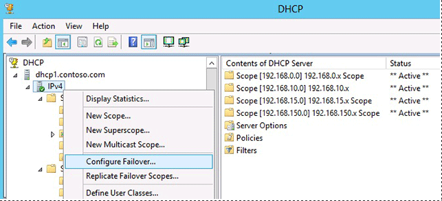

# Deploy DHCP Failover
The following topics provide information you can use to deploy DHCP failover:  
  
-   [DHCP Failover Requirements](../Topic/DHCP-Failover-Requirements.md)  
  
-   [DHCP Failover Architecture](../Topic/DHCP-Failover-Architecture.md)  
  
-   [Checklist: Deploy DHCP Failover](../Topic/Checklist--Deploy-DHCP-Failover.md)  
  
-   [Configure DHCP Failover using the Command Line](../Topic/Configure-DHCP-Failover-using-the-Command-Line.md)  
  
-   [Configure DHCP Failover using the DHCP Console](../Topic/Configure-DHCP-Failover-using-the-DHCP-Console.md)  
  
-   [Replicate DHCP Failover Using the Command Line](../Topic/Replicate-DHCP-Failover-Using-the-Command-Line.md)  
  
-   [Replicate DHCP Failover Using the DHCP Console](../Topic/Replicate-DHCP-Failover-Using-the-DHCP-Console.md)  
  
-   [Migrate to DHCP Failover](../Topic/Migrate-to-DHCP-Failover.md)  
  
A brief overview of how to configure DHCP failover using the DHCP console or Windows PowerShell is also provided in this topic.  
  
## Overview: Configure DHCP failover using the DHCP console  
To configure DHCP failover using the DHCP console, right\-click a DHCP scope or right\-click **IPv4** and then click **Configure Failover**.  
  
  
  
The **Configure Failover** wizard guides you through configuring DHCP failover on the selected scope.  
  
## Overview: Configure DHCP failover using Windows PowerShell  
To configure DHCP failover using the command line, use the **Add\-DhcpServerv4Failover** Windows PowerShell cmdlet to create a new DHCP failover relationship and add a DHCP scope, or use the **Add\-DhcpServerv4FailoverScope** cmdlet to add a new scope to an existing failover relationship. An example of the **Add\-DhcpServerv4Failover** cmdlet is provided below.  
  
```  
Add-DhcpServerv4Failover –ComputerName dhcp1.contoso.com –PartnerServer dhcp2.contoso.com –Name dhcp1-dhcp2 –ScopeID 10.10.10.0 –LoadBalancePercent 70 –SharedSecret sEcReT -Force  
```  
  
For information more information about configuring DHCP failover with Windows PowerShell, see [DHCP Server Cmdlets in Windows PowerShell](http://technet.microsoft.com/library/jj590751.aspx).  
  
## See also  
[What is DHCP Failover?](../Topic/What-is-DHCP-Failover-.md)  
  
[DHCP Failover Relationships](../Topic/DHCP-Failover-Relationships.md)  
  
[DHCP Failover Modes](../Topic/DHCP-Failover-Modes.md)  
  
[DHCP Failover Communications](../Topic/DHCP-Failover-Communications.md)  
  
[DHCP Failover Settings](../Topic/DHCP-Failover-Settings.md)  
  
[DHCP Failover Examples](../Topic/DHCP-Failover-Examples.md)  
  
[DHCP Failover Events and Performance](../Topic/DHCP-Failover-Events-and-Performance.md)  
  
