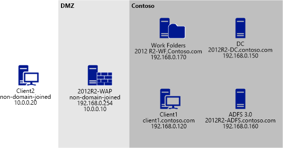

# Deploy Work Folders with AD FS and Web Application Proxy using Windows PowerShell
This topic describes how to use a set of provided [!INCLUDE[wps_2](../Token/wps_2_md.md)] scripts to deploy Work Folders with [!INCLUDE[firstref_adfs2](../Token/firstref_adfs2_md.md)] and Web Application Proxy. For an overview of the deployment process, see [Deploy Work Folders with AD FS and Web Application Proxy: Overview](../Topic/Deploy-Work-Folders-with-AD-FS-and-Web-Application-Proxy--Overview.md).  
  
[Download the scripts](http://blogs.technet.com/cfs-file.ashx/__key/communityserver-blogs-components-weblogfiles/00-00-00-47-85-metablogapi/wf_5F00_adfs_5F00_wap_5F00_3.zip)  
  
The Storage Team Blog on TechNet provides these scripts, which automate the process of setting up Work Folders, [!INCLUDE[nextref_adfs2](../Token/nextref_adfs2_md.md)], and Web Application Proxy for a test environment. The scripts make it possible to set up and deploy the entire environment in less than 30 minutes, or less than 15 minutes if you already have virtual or physical machines set up \(joined to the domain, the network set up, and so on\). Of course, the time required can vary by a few minutes depending on the hardware that you are using.  
  
The scripts are designed to run from a virtual machine \(VM\) host and use remote [!INCLUDE[wps_2](../Token/wps_2_md.md)] to configure all of the machines in the environment, so you don't need to log on to any of the machines remotely to set them up.  
  
## Script overview  
The test environment that the scripts create consists of [!INCLUDE[nextref_adfs2](../Token/nextref_adfs2_md.md)], Work Folders, Web Application Proxy, and two test clients \(one domain\-joined client and one non\-domain\-joined client\). The scripts do the following tasks:  
  
-   Configure the virtual switches on the host machine  
  
-   Create all VMs that are needed for the text example  
  
-   Join machines to the domain, where required  
  
-   Install and fully configure the respective server roles for [!INCLUDE[nextref_adfs2](../Token/nextref_adfs2_md.md)], Work Folders, and Web Application Proxy  
  
-   Create and install the self\-signed certificates on all appropriate machines  
  
There are three main scripts that you need to execute:  
  
-   setHostNetworkAdapters.ps1 – This script sets up the virtual switches on the host and configures the virtual network adapters as the default gateway for each network.  
  
-   provisionEnvironment.ps1 – This script creates the VMs that are needed for the environment from the downloaded ISOs. The script also finishes setting up the operating system on each machine, which includes setting the network addresses for each VM, and joining the VMs to the domain where appropriate by using an unattended XML file.  
  
-   setupEnvironment.ps1 – This script sets up and configures [!INCLUDE[nextref_adfs2](../Token/nextref_adfs2_md.md)], Work Folders, Web Application Proxy, and the two client machines.  
  
In the configuration, [!INCLUDE[nextref_adfs2](../Token/nextref_adfs2_md.md)] is set up with the relying party trust information that is needed to communicate with Work Folders. Web Application Proxy is set up to use the [!INCLUDE[nextref_adfs2](../Token/nextref_adfs2_md.md)] endpoints so that clients on the Internet or external network can use [!INCLUDE[nextref_adfs2](../Token/nextref_adfs2_md.md)]. Work Folders is set up with a default sync share that uses [!INCLUDE[nextref_adfs2](../Token/nextref_adfs2_md.md)] and can be accessed by users in the test environment.  
  
The setup process includes creating self\-signed certificates for [!INCLUDE[nextref_adfs2](../Token/nextref_adfs2_md.md)] and Work Folders. If you want to convert the test environment to a production environment, you can do so after you've received your certificates from the certificate authority \(CA\) of your choice.  
  
## Prerequisites  
The scripts were written with the assumption that you are starting from a newly created test environment and already have a domain controller \(DC\) set up. You must also have the following in place:  
  
-   An Active Directory forest that is running [!INCLUDE[winblue_server_2](../Token/winblue_server_2_md.md)] and is populated with users and groups. It is preferable that the forest has DNS enabled, but this is not required.  
  
-   The ISO for [!INCLUDE[winblue_server_2](../Token/winblue_server_2_md.md)] Datacenter \(download from the [TechNet Evaluation center](http://technet.microsoft.com/evalcenter/dn205286.aspx)\)  
  
-   The ISO for [!INCLUDE[winblue_client_2](../Token/winblue_client_2_md.md)] Enterprise \(download from the [TechNet Evaluation center](http://technet.microsoft.com/evalcenter/hh699156)\)  
  
> [!IMPORTANT]  
> In the scripts, the IP address of the DNS server is set to 192.168.0.150. If your DC has a different IP address, you must update the scripts accordingly.  
  
## Configure virtual switches  
Run the script setHostNetworkAdapters.ps1 to create the virtual switches on the host machine and to set the IP address, subnet, and DNS address.  
  
Each network adapter should be set up as the gateway address for its respective virtual network. This enables the host to access the VMs, and vice versa. This access is essential to run remote [!INCLUDE[wps_2](../Token/wps_2_md.md)] scripts from the host against the VMs on the network.  
  
The script has a function called **setNetworkAdapter** that sets up a virtual switch and configures its IP addresses, subnet, and DNS values.  
  
To call the function, you must pass in these values:  
  
-   The name of the switch to create  
  
-   The IP address to use as the gateway. The gateway IP address should be the first available address in the network, that is, *XXX.XXX.XXX*.1  
  
-   The octet for the subnet  
  
-   The IP address of the DNS server. This is optional, but should be configured on the VM network where the DC will reside.  
  
The script is currently configured to create switches for Contoso and Fabrikam:  
  
```powershell  
setNetworkAdapter "ID_AD_NETWORK-Contoso"  192.168.0.1 24 192.168.0.150  
setNetworkAdapter "ID_AD_NETWORK-FABRIKAM"  10.0.0.1 24    
```  
  
> [!NOTE]  
> If you already have a DC deployed, then you probably already have at least one virtual switch and network set up. If that is the case, check to ensure that the IP address on the network adapter that the host is using for the virtual network is configured as a gateway.  
  
## Provision the environment  
Run the script provisionEnvironment.ps1 to provision the environment.  
  
### provisionEnvironment.ps1 script overview  
The provisionEnvironment.ps1 script performs these tasks:  
  
-   Creates a base referencing for disks for the server and client VMs. The server base disk is loaded with [!INCLUDE[winblue_server_2](../Token/winblue_server_2_md.md)] Datacenter, and the client base disk is loaded with [!INCLUDE[winblue_client_2](../Token/winblue_client_2_md.md)] Enterprise.  
  
-   Configures the network adapter\(s\) on each VM  
  
-   Performs domain joins where appropriate  
  
-   Enables CredSSP on each VM  
  
> [!IMPORTANT]  
> In order for this script to work, you must run it from a [!INCLUDE[wps_2](../Token/wps_2_md.md)] window with admin privileges.  
  
The first time that you run the script, it takes about eight minutes to create each base differencing disk. On subsequent runs, you can reuse the previously created base VHD. After the provisioning is complete, you will have a set of differencing disks arranged as follows.  
  
**Server VHDs**  
  
Base.vhdx:  
  
-   WAP.vhdx  
  
-   ADFS.vhdx  
  
-   WorkFolders.vhdx  
  
**Client VHDs**  
  
Base vhdx:  
  
-   Domain\-joined [!INCLUDE[winblue_client_2](../Token/winblue_client_2_md.md)] client \(Contoso\)  
  
-   Non\-domain\-joined [!INCLUDE[winblue_client_2](../Token/winblue_client_2_md.md)] client \(Fabrikam\)  
  
If you want to recreate the environment, you can delete the differencing disks based off the base disk and reuse the existing base disk. The base disk is empty except for the operating system.  
  
The setup and configuration of the VMs is performed by an unattended XML file that is generated dynamically from the values in the configuration file and loaded onto each VM after the VM is created.  
  
The script enables CredSSP by creating and pushing the SetupComlete.cmd file into the directory Windows\\Setup\\Scripts. When the VM starts up, it executes the SetupComplete.cmd file.  
  
### Configure the provisionEnvironment.ps1 script  
The provisionEnvironment.ps1 script obtains the list of machines to build and the VM information from a CSV file called vms.txt.  
  
The contents of the CSV file are as follows:  
  
```  
machine,server,DJ,name,memory,network1,ip1,dns1,network2,ip2,dns2   
DC,Y,Y,2013R2-DC,1524,ID_AD_NETWORK-FABRIKAM,192.168.0.150/24,127.0.0.1,,,   
WAP,Y,N,2012R2-WAP,1524,ID_AD_NETWORK-Contoso,192.168.0.254/24,192.168.0.150,ID_AD_NETWORK-FABRIKAM,10.0.0.10/24,   
ADFS,Y,Y,2012R2-ADFS,1524,ID_AD_NETWORK-Contoso,192.168.0.160/24,192.168.0.150,,,   
WF,Y,Y,2012R2-WF,1524,ID_AD_NETWORK-Contoso,192.168.0.170/24,192.168.0.150,,,   
client1,N,Y,client1,1524,ID_AD_NETWORK-Contoso,192.168.0.120/24,192.168.0.150,,,   
client2,N,N,client2,1524,ID_AD_NETWORK-FABRIKAM,10.0.0.20/24,,,,   
```  
  
The definition of the CSV structure is shown in the following table.  
  
|||  
|-|-|  
|Field|Definition|  
|machine|The key value that identifies the row|  
|server|Is the machine a server, Y\=yes, N\=no|  
|DJ|Is the machine domain joined, Y\=yes, N\=no|  
|name|The name of the machine|  
|memory|The amount of memory, in MB|  
|network1|The name of the network to use for the first network adapter on the VM|  
|ip1|The IP address to use for the first network adapter on the VM|  
|dns1|The DNS address to use for the first network adapter on the VM|  
|network2|The name of the network to use for the second network adapter on the VM \(optional\)|  
|ip2|The IP address to use for the second network adapter on the VM \(optional\)|  
|dns2|The DNS address to use for the second network adapter on the VM \(optional\)|  
  
### provisionEnvironment.ps1 script variables  
The provisionEnvironment.ps1 script also contains variables that are used for:  
  
-   The location of the ISO files  
  
-   The location to store the base disks  
  
-   The location to store the VHDs that are created  
  
-   The domain name  
  
-   The domain administrator name and password  
  
-   The local administrator name and password for the non\-domain\-joined machines  
  
These variables appear as follows in the script file:  
  
```powershell  
$serverISOpath = "E:\isos\Windows_Server_2012_R2-Datacenter_Edition–§CEN-US-X64.ISO"  
$serverInstallImage = "Windows Server 2012 R2 SERVERDATACENTER"  
$clientInstallImage = "Windows 8.1 Enterprise"  
$clientISOpath = "E:\isos\Windows_8.1_Enterprise_EN-US_x64.ISO"  
$serverDiffDiskpath = "E:\vhdx\serverbase.vhdx"  
$clientDiffDiskpath = "E:\vhdx\clientbase.vhdx"  
$vmpath = "E:\vhdx"  
#VM variables  
$domain = "contoso.com"  
$domainpassword = "pass@word1"  
$domainadmin = "administrator"  
$localadminpassword = "pass@word1"  
$localadmin = "administrator"  
$contosogateway = "192.168.0.1"  
$fabrikamgateway = "10.0.0.1"   
```  
  
## Configure the environment  
Run the configureEnvironment.ps1 script to configure the environment.  
  
### configureEnvironment.ps1 script overview  
The configureEnvironment.ps1 script performs these tasks:  
  
-   Enables CredSSP on all domain\-joined servers  
  
-   Configures [!INCLUDE[nextref_adfs2](../Token/nextref_adfs2_md.md)], Work Folders, and Web Application Proxy. Work Folders is configured with a default sync share.  
  
-   Configures the two [!INCLUDE[winblue_client_2](../Token/winblue_client_2_md.md)] clients \(one that is domain joined and one that is non\-domain joined\)  
  
> [!IMPORTANT]  
> In order for this script to work, you must run it from a [!INCLUDE[wps_2](../Token/wps_2_md.md)] window with admin privileges.  
  
After you run the script, you will have an environment like the one in the following diagram.  
  
  
  
### Configure the configureEnvironment.ps1 script  
The CSV files that the configureEnvironment.ps1 script uses are as follows.  
  
#### Servers  
The configureEnvironment.ps1 script obtains the list of machines from which to build the servers from a CSV file called servers.txt.  
  
The contents of the CSV file:  
  
```  
server,name,ip,ip2   
WAP,2012R2-WAP.contoso.com,192.168.0.254,10.0.0.10   
ADFS,2012R2-ADFS.contoso.com,192.168.0.160   
WF,2012R2-WF.contoso.com,192.168.0.170   
AD,2013R2-DC.contoso.com,192.168.0.150   
```  
  
The definition of the CSV structure:  
  
|||  
|-|-|  
|Field|Definition|  
|server|The key value that identifies the row. Do not change.|  
|name|The fully qualified domain name \(FQDN\) of the machine|  
|Ip|The IP address of the first network adapter on the VM|  
|Ip2|The IP address of the second network adapter on the VM \(optional\)|  
  
#### Clients  
The configureEnvironment.ps1 script obtains the list of machines from which to build the clients from a CSV file called clients.txt.  
  
The contents of the CSV file:  
  
```  
client,name,ip   
domainjoined,client1,192.168.0.120   
nondomainjoined,client2,10.0.0.20   
```  
  
The definition of the CSV structure:  
  
|||  
|-|-|  
|Field|Definition|  
|server|The key value that identifies the row. Do not change.|  
|name|The BIOS name of the machine|  
|Ip|The IP address of the first network adapter on the VM|  
|Ip2|The IP address of the second network adapter on the VM \(optional\)|  
  
### configureEnvironment.ps1 script variables  
The configureEnvironment.ps1 script also contains variables that are used for:  
  
-   The [!INCLUDE[nextref_adfs2](../Token/nextref_adfs2_md.md)] display name  
  
-   The [!INCLUDE[nextref_adfs2](../Token/nextref_adfs2_md.md)] service name  
  
-   The subject name for the [!INCLUDE[nextref_adfs2](../Token/nextref_adfs2_md.md)] certificate  
  
-   The subject name for the Work Folders certificate  
  
-   The address to use for enterpriseregistration  
  
-   The name of the share to create on the Work Folders machine  
  
-   The path of the share to create on the Work Folders machine  
  
-   The name of the group to add to the Work Folders share  
  
-   The relying party trust name for Work Folders  
  
-   The domain name  
  
-   The password to use when exporting and importing certificates  
  
-   The user name and passwords for:  
  
    -   Web Application Proxy  
  
    -   The host machine  
  
    -   The Contoso administrator  
  
    -   The non\-domain\-joined client machine  
  
These variables appear as follows in the script file:  
  
```powershell  
$ADFSdisplayName = "Contoso Corporation"  
$ADFSService = "Contoso\ADFSService"  
$ADFSCertificateSubject = "blueadfs.contoso.com"  
$WFCertificateSubject = "workfolders.contoso.com"  
$EnterpriseRegistrationAddress ="enterpriseregistration.contoso.com"  
$WFShareName = "TestShare"  
$WFSharePath = "c:\TestShare"  
$WFShareGroup = "Contoso\Domain Users"  
$RelyingPartyTrustWFDisplayName = "WorkFolders"  
$domain = "contoso.com"  
$CertPassword = "pass@word1" | ConvertTo-SecureString -AsPlainText –Force  
$SecurePassword = "pass@word1" | ConvertTo-SecureString -AsPlainText –Force  
$credential = New-Object -TypeName System.Management.Automation.PSCredential -ArgumentList "contoso\administrator",$SecurePassword  
$WAPPassword = "pass@word1" | ConvertTo-SecureString -AsPlainText –Force  
$WAPcredential = New-Object -TypeName System.Management.Automation.PSCredential -ArgumentList "administrator",$WAPPassword  
$hostpassword = "pass@word1" | ConvertTo-SecureString -AsPlainText –Force  
$hostcredential = New-Object -TypeName System.Management.Automation.PSCredential -ArgumentList "hostserver\mbutler",$hostpassword  
$ndjpassword = "pass@word1" | ConvertTo-SecureString -AsPlainText –Force  
$ndjcredential = New-Object -TypeName System.Management.Automation.PSCredential -ArgumentList "administrator",$ndjpassword   
```  
  
### configureEnvironment.ps1 script functions  
The configureEnvironment.ps1 script contains these functions:  
  
-   **setupadfs**  
  
-   **setupWF**  
  
-   **setupWAP**  
  
-   **setupWorkstation**  
  
The functions set up AD FS, Work Folders, Web Application Proxy, and the clients, respectively. The functions are described in the following sections.  
  
#### <a name="SetUpADFSscript"></a>Set up AD FS  
The **setupadfs** function in the configureEnvironment.ps1 script performs these tasks:  
  
-   Creates the CNAME entries \(blueadfs.contoso.com and enterpriseregistration.contoso.com\) in the DC by using remote [!INCLUDE[wps_2](../Token/wps_2_md.md)]  
  
-   Installs AD FS by using remote [!INCLUDE[wps_2](../Token/wps_2_md.md)]  
  
-   Creates and installs a self\-signed subject alternative name \(SAN\) certificate for AD FS  
  
-   Creates the AD FS managed service account  
  
-   Installs the AD FS farm  
  
-   Sets up the AD FS relying party trust for Work Folders  
  
-   Grants the AD FS managed service account permissions to read the private key of the certificate  
  
-   Enables device registration  
  
-   Exports the created certificate to the host machine  
  
The SAN values for the AD FS certificate are read from the CSV file named adfssans.txt. The file must include the following SAN values:  
  
*<ADFS service name>.<domain>*  
  
**enterpriseregistration.***<domain>*  
  
The values in the provided CSV are:  
  
**blueadfs.contoso.com**  
  
**enterpriseregistration.contoso.com**  
  
**2012R2\-ADFS.contoso.com**  
  
#### Set up Work Folders  
The **setupWF** function in the configureEnvironment.ps1 script performs these tasks:  
  
-   Creates the CNAME entry \(workfolders.contoso.com\) in the DC by using remote [!INCLUDE[wps_2](../Token/wps_2_md.md)]  
  
-   Installs the AD FS certificate on the VM that is used for Work Folders  
  
-   Creates and installs a self\-signed SAN certificate for Work Folders  
  
-   Installs Work Folders  
  
-   Creates a sync share for the group that is defined in $WFShareGroup  
  
-   Sets the sync share policies to require encryption and password auto\-lock  
  
-   Enables SMB access on the sync share  
  
-   Binds the created certificate to port 443  
  
-   Sets up the AD FS URL for Work Folders  
  
-   Exports the created Work Folders certificate to the host machine  
  
The SAN values for the Work Folders certificate are read from the CSV file named wfsans.txt. The file must include the following SAN value:  
  
**workfolders.***<domain>*  
  
The values in the provided CSV are:  
  
**workfolders.contoso.com**  
  
**2012R2\-wf.contoso.com**  
  
#### Set up Web Application Proxy  
The **setupWAP** function in the configureEnvironment.ps1 script performs these tasks:  
  
-   Installs the AD FS and Work Folders certificates on the VM that is used for Web Application Proxy  
  
-   Installs the Web Application Proxy role, which is configured with the AD FS service name and AD FS certificate  
  
-   Adds a Web Application Proxy server for Work Folders by using the Work Folders certificate  
  
The values for the Web Application Proxy settings are obtained from the CSV file named webapps.txt. The contents of the CSV file are as follows:  
  
```  
App,ExternalURL,BackEndServerURL,ADFSRelyingPartyName,subject   
WorkFolders,https://workfolders.contoso.com,https://workfolders.contoso.com,WorkFolders,workfolders.contoso.com   
Enterprise Registration,https://enterpriseregistration.contoso.com/EnrollmentServer/,https://enterpriseregistration.contoso.com/EnrollmentServer/,pass-through,blueadfs.contoso.com   
```  
  
The definition of the CSV structure:  
  
|||  
|-|-|  
|Field|Definition|  
|App|The value to use for the web application name|  
|ExternalURL|The URL to use for the external address|  
|BackendURL|The URL to use for the internal address|  
|AD FSRelyingPartyName|The name of the AD FS relying party|  
|subject|The subject of the certificate to be used for the web application|  
  
#### Set up clients  
The **setupWorkstation** function in the configureEnvironment.ps1 script performs these tasks:  
  
-   Installs the AD FS and Work Folders certificates on the VM that is used for the workstation.  
  
-   Disables the check for revocation of server certificates. The check for revocation is required only when you are using self\-signed certificates for Workplace Join.  
  
If the workstation is not domain joined, the function also updates the hosts file on the workstation with these values:  
  
**workfolders.***<domain>*  
  
*<ADFS service>.<domain>*  
  
**enterpriseregistration.***<domain>*  
  
You should have the host file entries point to the IP address of the Web Application Proxy server.  
  
The provided script puts in these values:  
  
**10.0.0.10 workfolders.contoso.com**  
  
**10.0.0.10 blueadfs.contoso.com**  
  
**10.0.0.10 enterpriseregistration.contoso.com**  
  
## See Also  
[Deploy Work Folders with AD FS and Web Application Proxy: Overview](../Topic/Deploy-Work-Folders-with-AD-FS-and-Web-Application-Proxy--Overview.md)  
[Work Folders Overview](../Topic/Work-Folders-Overview.md)  
  
