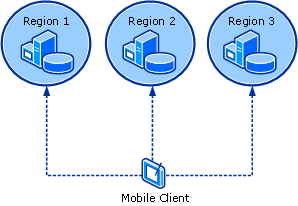

# Design the WSUS Server Layout
This topic describes simple [!INCLUDE[wsus_firstref_30SP2](../Token/wsus_firstref_30SP2_md.md)] 3.0 SP2 deployments that use a single WSUS server and complex scenarios that include a WSUS server hierarchy or a WSUS server on an isolated network segment.  
  
In this topic:  
  
-   [WSUS deployment that uses a single WSUS server](../Topic/Design-the-WSUS-Server-Layout.md#single)  
  
-   [WSUS deployment that uses multiple connected WSUS servers](../Topic/Design-the-WSUS-Server-Layout.md#multiple)  
  
-   [WSUS deployment for disconnected networks](../Topic/Design-the-WSUS-Server-Layout.md#disconnected)  
  
-   [WSUS deployment with Network Load Balancing clusters](../Topic/Design-the-WSUS-Server-Layout.md#nlb)  
  
-   [WSUS deployment with roaming client computers](../Topic/Design-the-WSUS-Server-Layout.md#roaming)  
  
## WSUS deployment that uses a single WSUS server  
The most basic WSUS deployment consists of a WSUS server that serves client computers on a private network, as shown in the following image:  
  
  
  
The WSUS server connects to Microsoft Update to download updates. This process is known as *synchronization*. During synchronization, WSUS determines whether any new updates are available since the last synchronization. The first time that a WSUS server synchronizes, all updates are available for download. The first synchronization can take an hour or longer to complete. Subsequent synchronizations take significantly less time.  
  
## WSUS deployment that uses multiple connected WSUS servers  
A WSUS deployment can consist of multiple connected servers. When you connect multiple WSUS servers, you create at least one *upstream* WSUS server and at least one *downstream* WSUS server. This configuration creates a *hierarchy* of WSUS servers, as shown in the following image:  
  
  
  
You can synchronize a WSUS server to another WSUS server instead of to Microsoft Update. The WSUS server that connects to Microsoft Update is known as the *root WSUS server*.  
  
> [!IMPORTANT]  
> The downstream server must always synchronize to an upstream server. If you attempt to synchronize an upstream server to a downstream server, you effectively create a closed loop. This configuration is not supported.  
  
A WSUS server hierarchy deployment offers the following benefits:  
  
-   You can download updates one time from the Internet and then distribute the updates to client computers by using downstream servers. This method saves bandwidth on the corporate Internet connection.  
  
-   You can download updates to a WSUS server that is physically closer to the client computers, for example, in branch offices.  
  
-   You can set up separate WSUS servers to serve client computers that use different languages of Microsoft products.  
  
-   You can scale WSUS for a large organization that has more client computers than one WSUS server can effectively manage.  
  
> [!NOTE]  
> We recommend that you do not create a WSUS server hierarchy that is more than three levels deep. Each level adds time to propagate updates throughout the connected servers. While there is no theoretical limit to a hierarchy, only deployments with a hierarchy of five levels deep have been tested by Microsoft Corporation.  
  
You can connect WSUS servers in *Autonomous mode* \(to achieve distributed administration\) or in *Replica mode* \(to achieve centralized administration\). You do not have to deploy a server hierarchy that uses only one mode: you can deploy a WSUS solution that uses both autonomous and replica WSUS servers.  
  
### Autonomous mode \(distributed administration\)  
Distributed management by using autonomous mode is the default installation option for WSUS. In autonomous mode, an upstream WSUS server shares updates with downstream servers during synchronization. Downstream WSUS servers are administered separately and they do not receive update approval status or computer group information from the upstream server. By using the distributed management model, each WSUS server administrator selects update languages, creates computer groups, assigns computers to groups, tests and approves updates, and makes sure that the correct updates are installed to the appropriate computer groups.  
  
The following image shows how you might deploy autonomous WSUS servers in a branch office environment:  
  
  
  
### Replica mode \(centralized administration\)  
In replica mode, an upstream WSUS server shares updates, approval status, and computer groups with downstream servers. Downstream replica servers inherit update approvals and are not administered separately from the upstream WSUS server.  
  
The following image shows how you might deploy replica WSUS servers in a branch office environment.  
  
  
  
If you set up several replica servers to connect to a single upstream WSUS server, do not schedule synchronization to run at the same time on each replica server. This practice will avoid sudden surges in bandwidth usage.  
  
## WSUS deployment for disconnected networks  
If the corporate network includes a network segment that is not connected to the Internet, you can deploy WSUS in the manner shown in the following drawing to support update management on that segment. In this case, you create a WSUS server that is connected to the Internet but is isolated from the intranet. After you download updates to the WSUS server, you can export the updates to removable media, hand\-carry the removable media to a WSUS server on the disconnected network segment, and import the updates to that server.  
  
  
  
This method of using WSUS is also appropriate for organizations that have high\-cost or low\-bandwidth links to the Internet. Downloading updates for all Microsoft products throughout an organization can be bandwidth intensive. This method enables organizations to download updates one time and then distribute updates locally by using inexpensive removable media. For more information about this scenario, see [Configure a Disconnected Network to Receive Updates](../Topic/Configure-a-Disconnected-Network-to-Receive-Updates.md).  
  
## WSUS deployment with Network Load Balancing clusters  
Network Load Balancing \(NLB\) can increase the reliability and performance of a network. You can set up multiple WSUS servers that share a single SQL Server failover cluster, as shown in the following image. For more information about how to deploy WSUS with NLB, see the [Configure WSUS for Network Load Balancing](../Topic/Configure-WSUS-for-Network-Load-Balancing.md) section of the WSUS Operations Guide.  
  
  
  
## WSUS deployment with roaming client computers  
If the network includes mobile users who log on to the network from different locations, you can configure WSUS to let roaming users update their client computers from the WSUS server that is closest to them geographically. In this configuration, shown in the following image, one WSUS server is deployed in each region, and each region is a DNS subnet. All client computers are directed to the same WSUS server name, which resolves in each subnet to the nearest physical WSUS server. For more information about how to configure DNS to support roaming client computers, see the [Configure WSUS for Roaming Client Computers](../Topic/Configure-WSUS-for-Roaming-Client-Computers.md) section of the WSUS Operations Guide.  
  
  
  
