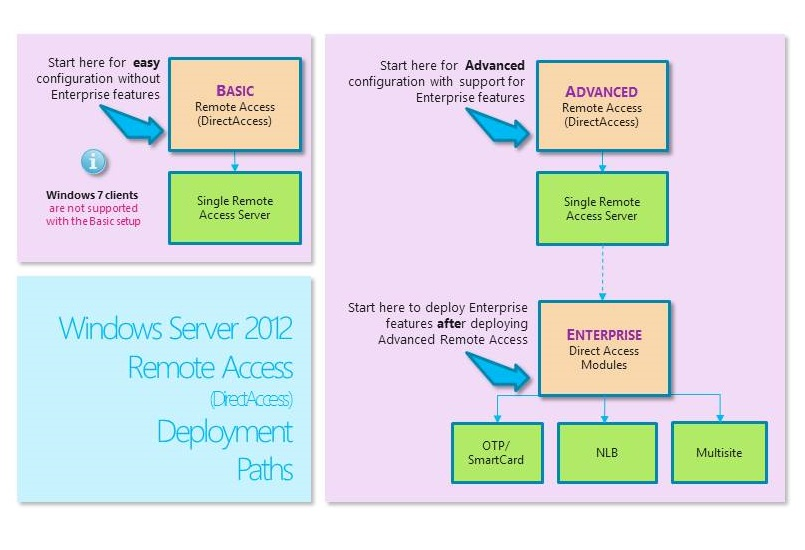

# DirectAccess Deployment Paths in Windows Server_1
This topic provides a listing of the documentation for the three main Remote Access deployment paths: **Basic**, **Advanced** and **Enterprise**. Also listed are the **Managing** and **Migrating** documents that are available for [!INCLUDE[win8_server_1](../Token/win8_server_1_md.md)] and [!INCLUDE[winblue_server_1](../Token/winblue_server_1_md.md)].  
  
  
  
You can use the section below to gain an understanding of the differences between DirectAccess Basic, Advanced, or Enterprise deployment paths, and you can use the documentation links to locate the deployment guide that is best suited to your goals.  
  
## Windows Server 2012 R2 and Windows Server 2012 DirectAccess Deployment Documentation Set  
Following is a listing of the documentation for the three main Remote Access deployment paths: **Basic**, **Advanced** and **Enterprise**. Also listed are the **Managing** and **Migrating** documents available for this release.  
  
### Deploy Basic DirectAccess  
With a basic DirectAccess deployment, DirectAccess is configured with default settings by using a wizard, without any need to configure infrastructure settings such as a certification authority \(CA\) or Active Directory security groups.  
  
-   [Deploy a Single DirectAccess Server Using the Getting Started Wizard](../Topic/Deploy-a-Single-DirectAccess-Server-Using-the-Getting-Started-Wizard.md). You can use this guide to deploy basic DirectAccess in a production environment.  
  
-   [Test Lab Guide: Demonstrate DirectAccess Simplified Setup in an IPv4\-only Test Environment in Windows Server 2012](http://www.microsoft.com/download/details.aspx?id=29029). You can use this guide to learn about basic DirectAccess in a test lab environment.  
  
### Deploy Advanced DirectAccess  
With an advanced DirectAccess deployment, you deploy a single DirectAccess server and configure network infrastructure servers to support DirectAccess.  
  
-   [Deploy a Single DirectAccess Server with Advanced Settings](../Topic/Deploy-a-Single-DirectAccess-Server-with-Advanced-Settings.md). You can use this guide to deploy DirectAccess with advanced settings in a production environment.  
  
-   [Test Lab Guide: Demonstrate DirectAccess Single Server Setup with Mixed IPv4 and IPv6 in Windows Server 2012](http://www.microsoft.com/download/details.aspx?id=29031). You can use this guide to learn about DirectAccess in a test lab environment.  
  
### Deploy DirectAccess in an Enterprise  
An Enterprise DirectAccess deployment allows you to use Enterprise networking features, such as a load\-balanced cluster, a multisite deployment, or two\-factor client authentication. The following guides provide information about deploying DirectAccess in an Enterprise environment.  
  
The following guides provide information about how to deploy a clustered DirectAccess solution for high availability.  
  
-   [Deploy Remote Access in a Cluster](../Topic/Deploy-Remote-Access-in-a-Cluster.md)  
  
-   [Test Lab Guide: Demonstrate DirectAccess in a Cluster with Windows NLB](../Topic/Test-Lab-Guide--Demonstrate-DirectAccess-in-a-Cluster-with-Windows-NLB.md)  
  
The following guides provide information about deploying DirectAccess when you have multiple sites.  
  
-   [Deploy Multiple Remote Access Servers in a Multisite Deployment](../Topic/Deploy-Multiple-Remote-Access-Servers-in-a-Multisite-Deployment.md)  
  
-   [Test Lab Guide: Demonstrate a DirectAccess Multisite Deployment](../Topic/Test-Lab-Guide--Demonstrate-a-DirectAccess-Multisite-Deployment.md)  
  
The following guides provide information about deploying DirectAccess with one time passwords \(OTPs\).  
  
-   [Deploy Remote Access with OTP Authentication_](../Topic/Deploy-Remote-Access-with-OTP-Authentication_.md)  
  
-   [Test Lab Guide: Demonstrate DirectAccess with OTP Authentication and RSA SecurID](../Topic/Test-Lab-Guide--Demonstrate-DirectAccess-with-OTP-Authentication-and-RSA-SecurID.md)  
  
The following guides provide information about capacity planning for high availability, deploying DirectAccess in a multi\-forest environment, and using DirectAccess offline domain join.  
  
-   [DirectAccess Capacity Planning_1](../Topic/DirectAccess-Capacity-Planning_1.md). This guide provides information about planning the correct capacity for your DirectAccess deployment.  
  
-   [Deploy Remote Access in a Multi-Forest Environment](../Topic/Deploy-Remote-Access-in-a-Multi-Forest-Environment.md)  
  
-   [DirectAccess Offline Domain Join_1](../Topic/DirectAccess-Offline-Domain-Join_1.md)  
  
### Manage DirectAccess  
The following guides provide information about managing DirectAccess.  
  
-   [Use Remote Access Monitoring and Accounting_1](../Topic/Use-Remote-Access-Monitoring-and-Accounting_1.md)  
  
-   [Manage DirectAccess Clients Remotely_1](../Topic/Manage-DirectAccess-Clients-Remotely_1.md)  
  
### Migrate DirectAccess  
The following guides provide information about migrating DirectAccess to [!INCLUDE[winblue_server_2](../Token/winblue_server_2_md.md)] or [!INCLUDE[win8_server_2](../Token/win8_server_2_md.md)].  
  
-   [Migrate Remote Access to Windows Server 2012](../Topic/Migrate-Remote-Access-to-Windows-Server-2012.md)  
  
-   [Migrate from Forefront UAG SP1 DirectAccess to Windows Server 2012](../Topic/Migrate-from-Forefront-UAG-SP1-DirectAccess-to-Windows-Server-2012.md)  
  
