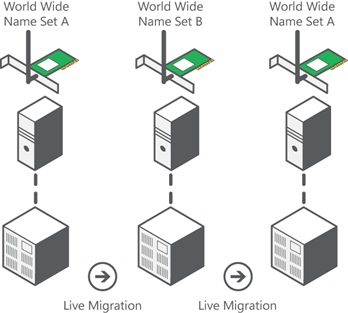

# Hyper-V Virtual Fibre Channel Overview
You need your virtualized workloads to connect easily and reliably to your existing storage arrays. Hyper\-V provides Fibre Channel ports within the guest operating system, which allows you to connect to Fibre Channel directly from within virtual machines. This feature protects your investments in Fibre Channel, enables you to virtualize workloads that use direct access to Fibre Channel storage, allows you to cluster guest operating systems over Fibre Channel, and provides an important new storage option for servers hosted in your virtualization infrastructure.  
  
## Key benefits  
With this Hyper\-V virtual Fibre Channel feature, you can connect to Fibre Channel storage from within a virtual machine. This allows you to use your existing Fibre Channel investments to support virtualized workloads. Support for Fibre Channel in Hyper\-V guests also includes support for many related features, such as virtual SANs, live migration, and MPIO.  
  
## Requirements  
The virtual Fibre Channel feature in Hyper\-V requires the following:  
  
-   One or more installations of [!INCLUDE[win8_server_2](../Token/win8_server_2_md.md)] with the Hyper\-V role installed. Hyper\-V requires a computer with processor support for hardware virtualization.  
  
-   A computer with one or more Fibre Channel host bus adapters \(HBAs\) that have an updated HBA driver that supports virtual Fibre Channel. Updated HBA drivers are included with the in\-box HBA drivers for some models. The HBA ports to be used with virtual Fibre Channel should be set up in a Fibre Channel topology that supports NPIV, a maximum transfer size of at least 0.5MB, and data transfers of at least 128 physical pages. To determine whether your hardware supports virtual Fibre Channel, contact your hardware vendor or OEM.  
  
-   An NPIV\-enabled SAN.  
  
-   Virtual machines configured to use a virtual Fibre Channel adapter, which must use Windows Server 2008, Windows Server 2008 R2, or [!INCLUDE[win8_server_2](../Token/win8_server_2_md.md)] as the guest operating system.  
  
-   Storage accessed through a virtual Fibre Channel supports devices that present logical units. Virtual Fibre Channel logical units cannot be used as boot media.  
  
## Technical overview  
Virtual Fibre Channel for Hyper\-V provides the guest operating system with unmediated access to a SAN by using a standard World Wide Name \(WWN\) associated with a virtual machine. Hyper\-V users can now use Fibre Channel SANs to virtualize workloads that require direct access to SAN logical unit numbers \(LUNs\). Fibre Channel SANs also allow you to operate in new scenarios, such as running the Failover Clustering feature inside the guest operating system of a virtual machine connected to shared Fibre Channel storage.  
  
Mid\-range and high\-end storage arrays are capable of advanced storage functionality that helps offload certain management tasks from the hosts to the SANs. Virtual Fibre Channel presents an alternate hardware\-based I\/O path to the Windows software virtual hard disk stack. This allows you to use the advanced functionality offered by your SANs directly from Hyper\-V virtual machines. For example, you can use Hyper\-V to offload storage functionality \(for example, taking a snapshot of a LUN\) on the SAN hardware by using a hardware Volume Shadow Copy Service \(VSS\) provider from within a Hyper\-V virtual machine.  
  
### NPIV support  
Virtual Fibre Channel for Hyper\-V guests uses the existing N\_Port ID Virtualization \(NPIV\) T11 standard to map multiple virtual N\_Port IDs to a single physical Fibre Channel N\_port. A new NPIV port is created on the host each time you start a virtual machine that is configured with a virtual HBA. When the virtual machine stops running on the host, the NPIV port is removed. Due to the use of NPIV, the HBA ports used for virtual Fibre Channel should be set up in a Fibre Channel topology that supports NPIV, and the SAN should support NPIV ports.  
  
### Virtual SAN support  
Hyper\-V allows you to define virtual SANs on the host to accommodate scenarios where a single Hyper\-V host is connected to different SANs through multiple Fibre Channel ports. A virtual SAN defines a named group of physical Fibre Channel ports that are connected to the same physical SAN. For example, assume that a Hyper\-V host is connected to two SANs—a production SAN and a test SAN. The host is connected to each SAN through two physical Fibre Channel ports. In this example, you might configure two virtual SANs—one named “Production SAN” that has the two physical Fibre Channel ports connected to the production SAN and one named “Test SAN” that has two physical Fibre Channel ports connected to the test SAN. You can use the same technique to name two separate paths to a single storage target.  
  
You can configure as many as four virtual Fibre Channel adapters on a virtual machine and associate each one with a virtual SAN. Each virtual Fibre Channel adapter connects with one WWN address or two WWN addresses to support live migration. You can set each WWN address automatically or manually.  
  
### Tape library support  
Virtual tape libraries configured with a virtual Fibre Channel adapter are only supported when using System Center Data Protection Manager 2012 R2 U3 or later with certified hardware. To determine if a tape library is supported by virtual Fibre Channel adapter, contact the tape library hardware vendor or run the DPM Tape Library Compatibility Test tool in a guest VM with the virtual tape library set as the target. For additional information about the DPM Tape Library Compatibility Test took, see [Verify tape library compatibility](https://technet.microsoft.com/library/jj733581.aspx).  
  
### Live migration  
To support live migration of virtual machines across Hyper\-V hosts while maintaining Fibre Channel connectivity, two WWNs are configured for each virtual Fibre Channel adapter, as shown in Figure 1: Set A and Set B. Hyper\-V automatically alternates between the Set A and Set B WWN addresses during a live migration. This ensures that all LUNs are available on the destination host before the migration and that no downtime occurs during the migration.  
  
  
  
**Figure 1  Alternating WWN addresses during a live migration**  
  
### MPIO functionality  
Hyper\-V in [!INCLUDE[win8_server_2](../Token/win8_server_2_md.md)] can use the multipath I\/O \(MPIO\) functionality to ensure continuous connectivity to Fibre Channel storage from within a virtual machine. You can use MPIO functionality with Fibre Channel in the following ways:  
  
-   Use MPIO for host access. Install multiple Fibre Channel ports on the host, and use MPIO to provide highly available connectivity to the LUNs accessible by the host.  
  
-   Virtualize workloads that use MPIO. Configure multiple virtual Fibre Channel adapters inside a virtual machine, and use a separate copy of MPIO within the guest operating system of the virtual machine to connect to the LUNs that the virtual machine can access. This configuration can coexist with a host MPIO setup.  
  
-   Use different device specific modules \(DSMs\) for the host or each virtual machine. This approach allows live migration of the virtual machine configuration, including the configuration of DSM and connectivity between hosts and compatibility with existing server configurations and DSMs.  
  
## See also  
[Implement Hyper-V Virtual Fibre Channel](../Topic/Implement-Hyper-V-Virtual-Fibre-Channel.md)  
  
