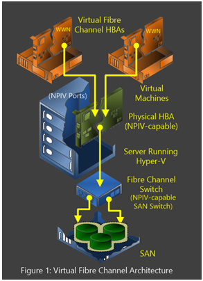

# Implement Hyper-V Virtual Fibre Channel
Until recently, some variants of physical servers have proven challenging to virtualize—specifically those that are dependent on virtual Fibre Channel storage. In Windows Server 2012 R2 and Windows Server 2012, this issue has been resolved. Hyper\-V provides virtual Fibre Channel ports within the guest operating system, which allows you to connect to virtual Fibre Channel directly from within virtual machines.  
  
The virtual Fibre Channel feature in Windows Server 2012 R2 and Windows Server 2012 makes it possible for you to virtualize workloads that previously depended on Fibre Channel storage. Your virtual machines can now directly access Fibre Channel storage as if your operating system was running on a physical server.  
  
Support for virtual Fibre Channel in Hyper\-V guests also includes support for many related features, such as virtual SANs \(vSAN\), live migration, quick migration, MPIO, Import and Export, Save and Restore, Pause and Resume, and guest initiated backups.  
  
For more information, refer to the [Hyper\-V Virtual Fibre Channel Overview](http://technet.microsoft.com/library/hh831413.aspx).  
  
To implement virtual Fibre Channel, complete the following steps.  
  
**In this document**  
  
-   [Prerequisites](#BKMK_Pre)  
  
-   [Step 1: Review considerations for live migration](#BKMK_Step1)  
  
-   [Step 2: Review considerations for MPIO connectivity to virtual Fibre Channel storage](#BKMK_Step2)  
  
-   [Step 3: Configure a virtual Fibre Channel adapter](#BKMK_Step3)  
  
-   [Terms and definitions](#BKMK_Terms)  
  
## Prerequisites  
The virtual Fibre Channel feature has the following prerequisites:  
  
-   A computer with one or more Fibre Channel host bus adapters \(HBAs\) or Fibre Channel over Ethernet \(FCoE\) converged network adapters. These devices must use updated drivers that support virtual Fibre Channel. The HBA ports should be set up in a Fibre Channel topology that supports N\_Port ID Virtualization \(NPIV\). To determine if your hardware supports virtual Fibre Channel, contact your hardware vendor or OEM.  
  
-   An NPIV\-enabled storage area network \(SAN\).  
  
-   In Windows Server 2012 R2 and Windows Server 2012, you can have up to four virtual ports per virtual machine. Depending on your configuration, your hardware may restrict the number of virtual ports per HBA and the logical unit numbers \(LUNs\) per port.  
  
-   Virtual machines that are configured to use a virtual Fibre Channel adapter must use Windows Server 2012 R2, Windows Server 2012, Windows Server 2008 R2, or Windows Server 2008 as the guest operating system. No other guest operating systems are currently supported for use with virtual Fibre Channel.  
  
-   Hardware can limit the number of virtual ports per physical host bus adapter. This restricts the number of virtual machines that can be associated with each physical host bus adapter that is installed on the server running Hyper\-V.  
  
-   Often NPIV is disabled by default on your host bus adapter, so refer to your manufacturer’s recommendations to enable this functionality on your host bus adapter.  
  
-   Storage that is accessed through a virtual Fibre Channel adapter supports devices that present logical unit numbers. Virtual Fibre Channel LUNs cannot be used as boot media. Fibre Channel tape devices are not supported.  
  
-   Always refer to the documentation that is provided by your storage vendor when working with storage hardware configurations. There may be additional vendor\-specific steps required.  
  
The basic virtual Fibre Channel architecture is shown in Figure 1.  
  
  
  
## Step 1: Review considerations for live migration  
Hyper\-V in Windows Server 2012 R2 and Windows Server 2012 supports live migration of virtual machines across computers running Hyper\-V, while maintaining Fibre Channel connectivity. Live migration is accomplished with failover clusters, and each virtual Fibre Channel adapter is configured with two World Wide Names \(WWNs\).  
  
As shown in Figure 2, Hyper\-V automatically changes between Set A and Set B WWN addresses during a live migration. Hyper\-V ensures that all LUNs are available on the destination computer, and then it performs the live migration.  
  
  
  
If you want to use live migration with virtual Fibre Channel, each server running Hyper\-V must have access to any virtual SANs that are being used by the virtual machine. In addition, the virtual SAN connectivity must have the same number of ports on the SAN to expose the LUNs.  
  
## Step 2: Review considerations for MPIO connectivity to virtual Fibre Channel storage  
MPIO is used for load balancing and failover scenarios. Aggregating multiple active links provides an increase in throughput, reduces latency, and increases availability. Hyper\-V in Windows Server 2012 R2 and Windows Server 2012 can use MPIO functionality to ensure continuous connectivity to Fibre Channel storage from within a virtual machine. As shown in Figure 3, MPIO routes network traffic through multiple network adapters.  
  
  
  
**MPIO on the virtual machine** It is possible to configure multiple \(up to four\) virtual Fibre Channel adapters inside a virtual machine. You can then use the SAN vendor’s recommended MPIO policy within the guest operating system of the virtual machine.  
  
**MPIO on the server running Hyper\-V** You can install multiple virtual Fibre Channel ports on the server running Hyper\-V, and then use MPIO to provide high availability to the LUNs that are accessible by the server.  
  
## Step 3: Configure a virtual Fibre Channel adapter  
The virtual Fibre Channel feature in Hyper\-V makes it possible for a virtual machine to connect directly to a SAN through a virtualized Fibre Channel adapter. Establishing connectivity to your SAN by using a virtual Fibre Channel adapter is a two\-step process. You create a virtual SAN, and then you add a virtual Fibre Channel adapter to your virtual machine and connect it to your vSAN.  
  
A vSAN groups physical HBA ports together. You can create a virtual Fibre Channel SAN by using the following procedure.  
  
#### To create a virtual SAN  
  
1.  On the Windows **Start** screen, click **Server Manager**.  
  
2.  Click **Tools**, and then click **Hyper\-V Manager**.  
  
3.  In the **Action** pane, click **Virtual SAN Manager**.  
  
4.  To create a new vSAN, click **Create**.  
  
5.  In the **Name** text box, type the name for your new vSAN.  
  
6.  In the **Notes** text box, type any notes that you deem important for the vSAN.  
  
7.  Ensure you select at least one available WWN for the vSan to be used by the virtual Fibre Channel adapter.  
  
8.  Click **OK** to create the vSAN. You will be returned to the **Hyper\-V Manager** screen.Step 2  
  
9. Click **Virtual SAN Manager** to see your new vSAN.  
  
> [!NOTE]  
> You can remove an existing vSAN by using the same basic procedure, but click **Remove** on the **Virtual SAN Manager** page.  
  
A virtual Fibre Channel adapter is required in each virtual machine that requires Fibre Channel connectivity to the vSAN. Prior to implementing the following procedure, the virtual machine must be shut down.  
  
#### To add a virtual Fibre Channel adapter and connect it to a vSAN  
  
1.  On the Windows **Start** screen, click **Server Manager**.  
  
2.  Click **Tools**, and then click **Hyper\-V Manager**.  
  
3.  On the **Hyper\-V Manager** screen, click the name of the desired virtual machine under **Virtual Machines**.  
  
4.  In the **Action** pane, click **Settings**.  
  
5.  Under **Add Hardware**, you will see a list of hardware options that you can add to your virtual machine. Click **Fibre Channel Adapter**, and then click **Add**.  
  
6.  On the **Settings** page, you must connect the virtual Fibre Channel adapter to a vSAN that you previously created. Click the **Virtual SAN** drop\-down list that shows **Not connected**, and then click the name of the required vSan.  
  
7.  Configure your WWNs \(Set A and Set B\) for your virtual Fibre Channel adapter. You can use the default automatically generated WWN or manually assign them. You need to configure both WWN sets to ensure a successful live migration of your virtual machines.  
  
    > [!NOTE]  
    > When your WWNs are assigned to the virtual Fibre Channel adapter, ensure that your LUNs and physical SAN are configured to recognize and work correctly with your virtual Fibre Channel adapter.  
  
8.  Click **OK**.  
  
A virtual Fibre Channel adapter is now added to your virtual machine and connected to a virtual SAN. You can now turn on the virtual machine and connect to your SAN storage.  
  
## Terms and definitions  
The following terms are commonly used when discussing virtual Fibre Channel:  
  
-   **MPIO** Multipath I\/O \(MPIO\) software is used to provide load balancing and fault tolerance for multiple virtual Fibre Channel connections in the same server running Hyper\-V. Native MPIO is available in Windows Server 2012 R2, Windows Server 2012, Windows Server 2008 R2, and Windows Server 2008.  
  
-   **NPIV** Virtual Fibre Channel for Hyper\-V guest operating systems uses the existing N\_Port ID Virtualization \(NPIV\) T11 standard to map multiple virtual N\_Port IDs to a single physical Fibre Channel N\_port. A new NPIV port is created on the server running Hyper\-V each time you start a virtual machine that is configured with a virtual HBA. When the virtual machine stops on the server running Hyper\-V, the NPIV port is removed.  
  
-   **Virtual SAN** A virtual SAN \(vSAN\) defines a named group of physical Fibre Channel ports that are connected to the same physical SAN.  
  
-   **World Wide Names** A World Wide Port Name \(WWPN\) is a unique number that is provided to a virtual Fibre Channel HBA, similar to a MAC address. This unique key is used to allow the storage fabric to recognize a specific HBA. A World Wide Node Name \(WWNN\) is assigned to a node \(an endpoint, a device\) in a virtual Fibre Channel fabric.  
  
## See also  
  
-   [Hyper\-V Virtual Fibre Channel Troubleshooting Guide](http://social.technet.microsoft.com/wiki/contents/articles/18698.hyper-v-virtual-fibre-channel-troubleshooting-guide.aspx)  
  
The following posters provide a visual reference for understanding key Hyper\-V technologies. They focus on Hyper\-V Replica, networking, virtual machine mobility \(live migration\), storage, failover clustering, and scalability.  
  
-   [Windows Server 2012 R2: Hyper\-V Component Architecture](http://www.microsoft.com/download/details.aspx?id=40732)  
  
-   [Windows Server 2012: Hyper\-V Component Architecture](http://www.microsoft.com/download/details.aspx?id=29189)  
  
