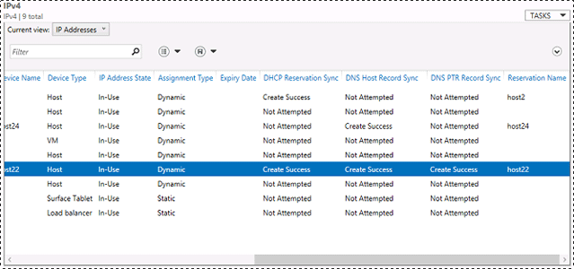
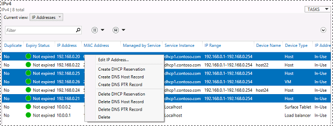
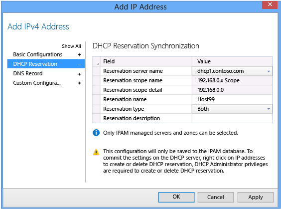
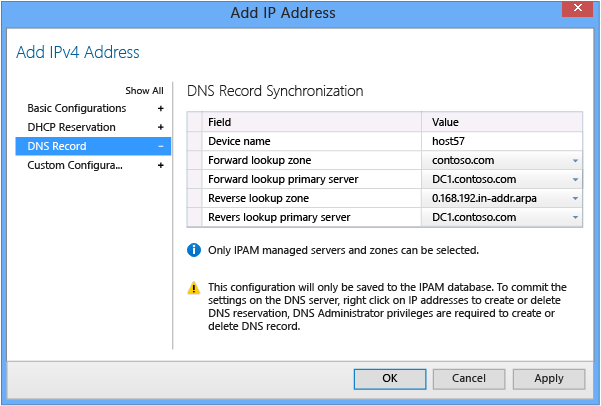
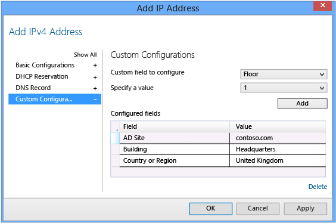

# Managing IP Address Space
This topic contains detailed information and procedures you can use to manage IP address space with IPAM. To review best practices for IP address space management, see [IP address management](../Topic/Best-Practices.md#ip_mgmt).  
  
See the following sections in this topic.  
  
-   [IP address space mapping](../Topic/Managing-IP-Address-Space.md#concepts)  
  
    -   [IP address blocks](../Topic/Managing-IP-Address-Space.md#blocks)  
  
    -   [IP address ranges](../Topic/Managing-IP-Address-Space.md#ranges)  
  
    -   [IP addresses](../Topic/Managing-IP-Address-Space.md#addresses)  
  
-   [IP address operations](../Topic/Managing-IP-Address-Space.md#management_tasks)  
  
    -   [Add or edit IP address space](../Topic/Managing-IP-Address-Space.md#add_or_edit_ranges)  
  
        -   [IPv4 blocks](../Topic/Managing-IP-Address-Space.md#IPv4_blocks)  
  
        -   [IPv6 blocks](../Topic/Managing-IP-Address-Space.md#IPv6_blocks)  
  
        -   [IPv4 ranges](../Topic/Managing-IP-Address-Space.md#IPv4_ranges)  
  
        -   [IPv6 ranges](../Topic/Managing-IP-Address-Space.md#IPv6_ranges)  
  
        -   [IPv4 addresses](../Topic/Managing-IP-Address-Space.md#IPv4_addresses_)  
  
        -   [IPv6 addresses](../Topic/Managing-IP-Address-Space.md#IPv6_addresses_)  
  
    -   [Import](../Topic/Managing-IP-Address-Space.md#import)  
  
    -   [Import and update](../Topic/Managing-IP-Address-Space.md#import_and_update)  
  
    -   [Export](../Topic/Managing-IP-Address-Space.md#export)  
  
    -   [Find and allocate available IP address](../Topic/Managing-IP-Address-Space.md#find_and_allocate_available)  
  
    -   [Reclaim IP addresses](../Topic/Managing-IP-Address-Space.md#reclaim)  
  
    -   [IP address expiry log settings](../Topic/Managing-IP-Address-Space.md#expiry_log)  
  
-   [IP address inventory](../Topic/Managing-IP-Address-Space.md#IP_inventory)  
  
    -   [Adding IP addresses to the inventory](../Topic/Managing-IP-Address-Space.md#adding_ip_addresses_to_the_inventory)  
  
        -   [Basic configurations](../Topic/Managing-IP-Address-Space.md#basic_config)  
  
        -   [Managing DHCP reservations](../Topic/Managing-IP-Address-Space.md#managing_dhcp_reservations)  
  
        -   [Managing DNS records](../Topic/Managing-IP-Address-Space.md#managing_dns_records)  
  
        -   [Custom configurations](../Topic/Managing-IP-Address-Space.md#custom_config)  
  
        -   [Importing DHCP lease data from the network](../Topic/Managing-IP-Address-Space.md#importing_ip_addresses_from_the_network)  
  
-   [IP address range groups](../Topic/Managing-IP-Address-Space.md#ip_range_groups)  
  
## <a name="concepts"></a>IP address space mapping  
In IPAM, IP address space is divided into blocks, ranges, and individual addresses. See the following figure.  
  
  
  
### <a name="blocks"></a>IP address blocks  
IP address blocks are large chunks of IP addresses that are used to organize address space at a high level.  
  
For example, you might use one IP address block for all private IP addresses in your organization, and another block for public IP addresses. Alternatively, you might assign smaller IP address blocks based on criteria such as location, purpose, or owner. You can think of IP address blocks as containers that hold IP address ranges. IP address blocks are not deployed and managed on the network like IP address ranges or individual IP addresses.  
  
### <a name="ranges"></a>IP address ranges  
IP address ranges are smaller chunks of IP addresses that typically correspond to a DHCP scope. IP address ranges are contained within, or “mapped to” IP address blocks. IP address ranges cannot map to multiple IP address blocks, and ranges that map to the same block cannot overlap.  
  
Mapping IP addresses to ranges and IP address ranges to blocks enables accurate, broad, and detailed visualization of IP address utilization statistics.  
  
### <a name="addresses"></a>IP addresses  
Just as IP address ranges map to an IP address block, individual IP addresses map to a single IP address range. When you map an IP address to a range, it enables actions to be taken on a range that affect all IP addresses in the range, such as adding, updating, or deleting IP address fields.  
  
## <a name="management_tasks"></a>IP address operations  
IP address ranges are automatically entered into the IPAM database when DHCP scopes are discovered on managed DHCP servers. IP address blocks and individual IP addresses are not automatically added to the IPAM database, and IP address ranges that are not DHCP scopes on managed Microsoft DHCP servers are not automatically discovered. IPAM provides several dialogs to allow you to enter and edit IP address data manually, and you can also import IP address data directly from a file. Data can also be exported from IPAM to a file.  
  
### <a name="add_or_edit_ranges"></a>Add or edit IP address space  
To add a new IP address block, range, or address, click **IPv4** or **IPv6** in the lower navigation pane, click **TASKS**, and then click **Add IP Address \[Range\/Block\]**.  
  
To edit existing address space, right\-click the unit of address space \(address, range, or block\) and then click **Edit IP Address \[Range\/Block\]**.  
  
If you choose **No** next to **Automatically assign address values** when creating a new address block or range, then you must manually provide the **Start IP address** and **End IP address**. This allows you to work with IP address space that does not always start and end on network boundaries.  
  
You cannot specify a **Managed by service** value of **MS DHCP** for IP address ranges that are manually added with the user interface. The **MS DHCP** value is reserved for DHCP scopes that are discovered on the network. Discovered DHCP scopes are added to IP address ranges automatically. Most values for these ranges are automatically populated based on discovery data, and cannot be modified.  
  
#### <a name="IPv4_blocks"></a>IPv4 blocks  
Type the network ID next to **Network ID** and choose a prefix length using the drop\-down list next to **Prefix length**. If the IP address space is private, you will not be able to provide RIR information. If the IP address space is public, RIR information is optional.  
  
  
  
#### <a name="IPv6_blocks"></a>IPv6 blocks  
Type the network ID under **Specify Network ID** and then slide the pointer to the desired prefix length, or type the prefix length next to the slider under **Specify Prefix length**. Optionally provide additional details in the fields provided.  
  
  
  
#### <a name="IPv4_ranges"></a>IPv4 ranges  
Type the network ID next to **Network ID** and choose a prefix length using the drop\-down list next to **Prefix length**. A value of **IPAM** is selected for **Managed by service** and a value of **Localhost** is selected for **Service instance** by default. You can choose other built\-in values for these fields, or you can add your own custom values. For information about how to add custom values, see [IP Address Inventory](../Topic/Using-the-IPAM-Client-Console.md#inventory).  
  
  
  
#### <a name="IPv6_ranges"></a>IPv6 ranges  
Type the network ID under **Specify Network ID** and then slide the pointer to the desired prefix length, or type the prefix length next to the slider under **Specify Prefix length**. Optionally provide additional details in the fields provided. A value of **IPAM** is selected for **Managed by service** and a value of **Localhost** is selected for **Service instance** by default. You can choose other built\-in values for these fields, or you can add your own custom values. For information about how to add custom values, see [IP Address Inventory](../Topic/Using-the-IPAM-Client-Console.md#inventory)  
  
  
  
#### <a name="IPv4_addresses_"></a>IPv4 addresses  
See [Adding IP addresses to the inventory](../Topic/Managing-IP-Address-Space.md#adding_ip_addresses_to_the_inventory).  
  
#### <a name="IPv6_addresses_"></a>IPv6 addresses  
See [Adding IP addresses to the inventory](../Topic/Managing-IP-Address-Space.md#adding_ip_addresses_to_the_inventory).  
  
### <a name="import"></a>Import  
When importing address space data from a file, required fields are the same as those that are required when adding data to IPAM with the user interface. You must include a list of valid field names on line 1 of the file, followed by one line per entry of corresponding data. Custom field names can be used, but these must be defined prior to import. Fields can be in any order, as long as you ensure that the data values are also in the same order. Data must be valid for the corresponding field type. Data and field names can be enclosed in quotes, are not case\-sensitive, and can include spaces. For example, the following data can be used to import two IP addresses into the IPAM database, assuming that dhcp1.contoso.com is a valid **Service instance** on the network:  
  
```  
IP address,managed by service,service instance,device type,ip address state,assignment type  
192.168.0.25,ms dhcp,dhcp1.contoso.com,host,in-use,static  
192.168.0.26,ms dhcp,dhcp1.contoso.com,host,in-use,static  
```  
  
For IP address ranges and blocks, the network ID and network prefix length are combined in a single field named **Network**. For example, the following data can be used to import an IP address block of 65.52.0.0\/14. This example includes optional spaces between the field names and data values:  
  
```  
Network, start IP address, end IP address, RIR  
65.52.0.0/14, 65.52.0.0, 65.52.255.255, ARIN  
```  
  
Because 65.52.0.0\/14 is public IP address space, the RIR field is required. Also note that blocks begin on a network ID and end on a broadcast address, unlike IP address ranges which start and end on usable IP addresses.  
  
If a required field is missing or contains incompatible data, an error report is automatically created in the current user’s **Documents** folder. For example, the following data will generate an error if a **Managed by service** value of **MS DHCP** is specified. This value is reserved for DHCP scopes on managed DHCP servers. To avoid this error, use a value of **IPAM** for **Managed by service**. This example includes optional quotes around the field names and data values:  
  
```  
“Network”, “Start IP address”, “End IP address”, “Managed by service”, “Service instance”, “Assignment Type”  
“192.168.100.0/24”, “192.168.100.1”, “192.168.100.254”, “IPAM”, “router”, “dynamic”  
```  
  
IP address import mandatory fields: IP address, managed by service, service instance, device type, IP address state, assignment type.  
  
IP address range import mandatory fields: Network, start IP address, end IP address, managed by service, service instance, assignment type  
  
IP address block import mandatory fields: Network, start IP address, end IP address, RIR  
  
You can also import data into IPAM using Windows PowerShell. See [Using Windows PowerShell with IPAM](../Topic/Using-Windows-PowerShell-with-IPAM.md) for more information.  
  
### <a name="import_and_update"></a>Import and update  
The import and update process is only available for IP address ranges. When importing IP address range data, you have the option to update all range data, including deletion of ranges that are no longer present. If you use this process, you do not need to manually delete or edit ranges that are no longer used or have changed. If you perform an import only \(not import and update\), then no ranges are deleted if they are not present in the data file. The import and update process is specific for a defined **Managed by service** and **Service instance** pair.  
  
For example, if you have a data file that contains 5 IP address ranges with a **Managed by service** value of **Non\-MS DHCP** and a **Service instance** value of **Switch**, and you currently have 7 IP address ranges in the IPAM database with values of **Non\-MS DHCP** and **Switch** for these two fields, then performing an import and update with the data file will result in the deletion of at least 2 IP address ranges. Depending on the data, ranges might also be replaced with different ranges. The old dataset is overwritten by the data contained in the file.  
  
  
  
### <a name="export"></a>Export  
IP address data that can be exported from IPAM includes IP addresses, IP address ranges, IP address blocks, IP address range groups, and IP address inventory. This data can include the results of custom data views and searches, or the entire unfiltered dataset. Data is exported to a text file in comma\-separated\-value \(.csv\) format.  
  
> [!TIP]  
> Other types of data can also be exported from IPAM that might be used in IP address space operations, such as IP address tracking data. See [IP Address Tracking](../Topic/IP-Address-Tracking.md) for more information.  
  
To export IP address data from IPAM, view the data that you wish to export, click **TASKS**, and then click **Export**. Type a file name, and then click **Save**.  
  
### <a name="find_and_allocate_available"></a>Find and allocate available IP address  
IPAM enables you to assign IP addresses based on availability. IPAM considers an IP address to be available if:  
  
1.  The IP address does not currently exist in the IPAM database.  
  
2.  The IP address is not reserved on the managed DHCP server providing the IP address range.  
  
3.  The IP address is not excluded on the managed DHCP server providing the IP address range.  
  
4.  The IP address does not respond to a ping request from the IPAM server.  
  
5.  A DNS PTR record is not found for the IP address.  
  
To find an available IP address, right\-click an IP address range and then click **Find and Allocate Available IP Address**.  
  
  
  
IPAM will search for an available address by starting with the first IP address that is not assigned in IPAM. If the address range being searched is a DHCP scope on a managed DHCP server, IPAM ignores all reserved or excluded IP addresses. When the ping request and DNS PTR query is complete, you can click **Find Next** to look for another available IP address. By default, the last IP address in the list is added to **Basic Configurations** with default settings. You can choose a different IP address from the list by clicking on it, or you can type an IP address manually next to **IP address**. If you type an IP address manually, it must be within a range provided by an available managed DHCP server in order to also create a DHCP reservation.  
  
Optionally, you can complete The **DHCP Reservation** and **DNS Record** sections. Adding information to these sections only affects the IPAM database, it does not configure DHCP or DNS servers. IPAM database information is displayed in the IP address view, along with the DNS and DHCP synchronization status.  
  
  
  
To add DHCP reservations to a DHCP server, you must complete the **Reservation server name**, **Reservation scope name**, and **Reservation name** fields in the **Edit IP Address** dialog box, or in the **Find and Allocate Available IP Address** dialog box. When this required information has been populated in the IPAM database, right\-click one or more IP addresses in IP address view and then click **Create DHCP Reservation**. For more information, see [Managing DHCP reservations](../Topic/Managing-IP-Address-Space.md#managing_dhcp_reservations).  
  
To add DNS host records or DNS PTR records to a DNS server, you must complete the **Device name** field. **Forward lookup zone** and **Forward lookup primary server** fields are required for DNS host records. **Reverse lookup zone** and **Reverse lookup primary server** fields are required for DNS PTR records. When this required information has been populated in the IPAM database, right\-click one or more IP addresses in IP address view and then click **Create DNS Host record** or **Create DNS PTR record**. For more information, see [Managing DNS records](../Topic/Managing-IP-Address-Space.md#managing_dns_records).  
  
### <a name="reclaim"></a>Reclaim IP addresses  
When you reclaim IP addresses in IPAM, they are deleted from the IPAM database. DHCP reservations and DNS records are not affected. If you also want to delete DHCP reservations and DNS records with the IPAM console, you must select one or more IP addresses using the IP addresses view, right\-click, and then click **Delete DHCP Reservation**, **Delete DNS Host Record**, or **Delete DNS PTR Record**.  
  
  
  
If you reclaim IP addresses or right\-click and delete them before removing any DHCP reservations or DNS records that exist, you must delete these reservations and DNS records manually using the DNS or DHCP consoles, or the command line.  
  
To reclaim IP addresses, right\-click one or more IP address ranges and then click **Reclaim IP Addresses**.  
  
  
  
  
  
Click a range at the top and then select IP addresses from the bottom to reclaim. You can reclaim IP addresses from multiple IP address ranges simultaneously.  
  
When you are finished selecting IP addresses, click **Reclaim**. A summary of IP addresses that were reclaimed is displayed.  
  
> [!IMPORTANT]  
> You cannot reclaim IP addresses that are not mapped to an IP address range. In order to map to a range, the IP address and the IP address range must have the same values for **Managed by Service** and **Service Instance**. You can review the status of IP address mapping to ranges by viewing the **IP Range** column in IP addresses view.  
  
### <a name="expiry_log"></a>IP address expiry log settings  
IP address expiry settings enable lifetime management for IP addresses on the network. To use expiry settings, an IP address must be configured with an expiry date. Expiry dates are optional.  
  
To configure expiry log settings, verify that you have selected a child node under **IP ADDRESS SPACE**, click **TASKS**, and then click **IP Address Expiry Log Settings**.  
  
  
  
The three available IP address expiry states are: **Not expired**, **Expiry Due**, and **Expired**. By default, the expiry state of an IP address will transition from **Not expired** to **Expiry Due** 10 days before the expiry date. To configure a different transition time, type the number of days under **Expiry Alert Threshold**. You can also configure the **Logging Frequency**, which determines when the IPAM operational event log will receive expiry alerts. By default, events are generated only when address state transitions occur. You can also choose to log expiry status messages periodically. If you choose this setting, events are generated once every 24 hours for IP addresses with an expiry status of **Expiry Due** or **Expired**.  
  
## <a name="IP_inventory"></a>IP address inventory  
You can view IP addresses in the IPAM database by clicking **IP Address Blocks** or by clicking **IP Address Inventory**. Using **IP Address Blocks**, you must choose **IP Addresses** next to **Current view**. **IPv4** addresses are displayed by default. Choose **IPv6** in the lower navigation pane to switch to the IPv6 addresses view. If you use **IP Address Inventory**, only IP addresses are displayed \(ranges and blocks are not shown\). You also must choose either IPv4 or IPv6 addresses in the lower navigation pane. The IP address blocks view organizes IP addresses based on whether they are mapped to a public or private IP address block. The IP address inventory view organizes IP addresses by device type, including custom IP address inventory groups. For more information about creating and using custom IP address inventory groups, see [IP Address Inventory](../Topic/Using-the-IPAM-Client-Console.md#inventory).  
  
### <a name="adding_ip_addresses_to_the_inventory"></a>Adding IP addresses to the inventory  
To add an IP address to the IPAM database using the IPAM client console, choose the **IP Address Blocks** or **IP Address Inventory** view, right\-click **IPv4** or **IPv6** in the lower navigation pane, and then click **Add IP Address**. Alternatively, you can click **IPv4** or **IPv6**, click **TASKS**, and then click **Add IP Address**.  
  
> [!TIP]  
> To specify the type of address to add \(IPv4 or IPv6\) you must use the lower navigation pane. By default, IPv4 is selected.  
  
For information about adding IP addresses with Windows PowerShell, see [Using Windows PowerShell with IPAM](../Topic/Using-Windows-PowerShell-with-IPAM.md).  
  
#### <a name="basic_config"></a>Basic configurations  
Default values are assigned for all mandatory fields, with the exception of **IP address**. If you also choose to create a DHCP reservation for this IP address in IPAM, then the **MAC address** field is also required.  
  
  
  
Basic configuration fields are identical for IPv4 and IPv6 addresses.  
  
#### <a name="managing_dhcp_reservations"></a>Managing DHCP reservations  
To create an IPv4 address reservation in IPAM, you must first ensure that a valid IP address and MAC address are entered under **Basic Configurations**. Choose a **Managed by service** value of **MS DHCP** and a **Service instance** value corresponding to a valid managed DHCP server \(ex: dhcp1.contoso.com\). When these fields have been configured, click **DHCP Reservation** and choose a value for **Reservation server name** from the drop\-down list. **Reservation scope name** and **Reservation scope detail** fields will be automatically populated. Enter required values for **Reservation name** and **Reservation type**. Reservation description is optional. Click **OK** to enter the DHCP reservation into the IPAM database, or click **Apply** to commit the current values and continue entering more information.  
  
  
  
> [!IMPORTANT]  
> Creating a DHCP reservation in the IPAM database does not automatically add this DHCP reservation to a managed DHCP server.  
  
###### To create DHCP reservations on a managed DHCP server  
  
1.  Select one or more IP addresses and verify that each has the correct information in all required DHCP reservation fields.  
  
2.  Right\-click the selected IP addresses, and then click **Create DHCP Reservation**.  
  
3.  Verify that **Create Success** is displayed under **DHCP Reservation Sync** in the display pane. Status is also displayed on the **Configuration Details** tab.  
  
> [!WARNING]  
> DHCP reservations created this way will replace an existing DHCP reservation, if it exists, for the same IP address.  
  
To create an IPv6 address reservation in IPAM, you must first ensure that a valid IP address and MAC address are entered under **Basic Configurations**. Choose a **Managed by service** value of **MS DHCP** and a **Service instance** value corresponding to a valid managed DHCP server \(ex: dhcp1.contoso.com\). When these fields have been configured, click **DHCP Reservation** and choose a value for **Reservation server name** from the drop\-down list. **Reservation scope name** and **Reservation scope detail** fields will be automatically populated. Enter required values for **DUID**, **IAID**, and **Reservation name**. Reservation description is optional. Click **OK** to enter the DHCP reservation into the IPAM database, or click **Apply** to commit the current values and continue entering more information.  
  
  
  
To complete creating the IPv6 DHCP reservation, add this reservation to the managed DHCP server using the same procedure as for IPv4 addresses.  
  
#### <a name="managing_dns_records"></a>Managing DNS records  
To create DNS records in the IPAM database, you must ensure that an IP address is entered into the **Basic Configurations** dialog. This is the only basic configuration field that is required to add DNS records. Note: you cannot create a DNS PTR record if the IP address that is entered does not correspond to a reverse lookup zone hosted on a managed DNS server. For example, you can create a host record for the IP address 192.168.30.2 in any of the forward lookup zones hosted on a managed DNS server. However, the reverse lookup zone 30.168.192.in\-addr.arpa must exist as a primary zone on a managed DNS server in order to create a PTR record for this IP address.  
  
  
  
DNS configuration fields and requirements are identical for IPv4 and IPv6 addresses.  
  
> [!IMPORTANT]  
> Creating a DNS record in the IPAM database does not automatically add this DNS record to a managed DNS server.  
  
###### To create DNS records on a managed DNS server  
  
1.  Select one or more IP addresses and verify that each has the correct information in all required DHCP record fields.  
  
2.  Right\-click the selected IP addresses, and then click **Create DNS Host Record** to create a forward lookup record.  
  
3.  Right\-click the selected IP addresses, and then click **Create DNS PTR Record** to create a reverse lookup record.  
  
4.  Verify that **Create Success** is displayed under **DNS Host Record Sync** or **DNS PTR Record Sync** in the display pane. Status is also displayed on the **Configuration Details** tab.  
  
#### <a name="custom_config"></a>Custom configurations  
Before you add custom configurations to IP addresses, ensure that you have configured custom fields. To configure custom fields, click **Manage** on the Server Manager menu bar, and then click **IPAM Settings**. In the IPAM Settings dialog box, click **Configure Custom Fields**. In the **Configure Custom Fields** dialog box, choose a field to configure below **Custom Field Name** and then enter values under **Custom Field Value**. For example, you can click **AD Site** and then provide a list of Active Directory sites in your organization. Several built\-in fields are available, and you can add custom field names by entering these manually under **Add custom fields below**.  
  
  
  
When you have completed entering custom fields and custom field values, you are ready to assign these field\/value pairs to IP addresses using the custom configurations dialog. To add custom fields and values, choose a field next to **Custom field to configure**, choose a value next to **Specify a value**, and then click **Add**. To remove a field\/value pair, click the row displaying the pair under **Configured fields** and then click **Delete**. Click **OK** when you are done.  
  
  
  
#### <a name="importing_ip_addresses_from_the_network"></a>Importing DHCP lease data from the network  
IPAM does not automatically add DHCP leases to the IPAM database as IP addresses. You can add these addresses using the IPAM client console, and you can automate importing of DHCP leases using Windows PowerShell. Use the following procedure to import DHCP leases.  
  
###### To import DHCP leases  
  
1.  Download IpamIntegration\_dhcp.ps1 from the Microsoft Script Center. There are separate scripts provided for [!INCLUDE[win8_server_2](../Token/win8_server_2_md.md)] and [!INCLUDE[winblue_server_2](../Token/winblue_server_2_md.md)]:  
  
    -   [Windows Server 2012 IPAM\/DHCP integration module](http://gallery.technet.microsoft.com/scriptcenter/Windows-Server-2012-f44cefce) \(http:\/\/gallery.technet.microsoft.com\/scriptcenter\/Windows\-Server\-2012\-f44cefce\).  
  
    -   [Windows Server 2012 R2 IPAM\/DHCP integration module](http://gallery.technet.microsoft.com/scriptcenter/Windows-Server-2012-R2-15d16e82)  
  
2.  Ensure that you have sufficient permissions to add IP addresses to the IPAM database. To enable this permission, you must be a member of the IPAM ASM Administrators group, or the IPAM Administrators group.  
  
3.  Launch an elevated Windows PowerShell console on a domain member computer.  
  
4.  Use the Set\-Executionpolicy cmdlet to temporarily allow running unsigned scripts:  
  
    ```  
    Set-ExecutionPolicy Bypass -Force  
    ```  
  
5.  Run the IPAM integration script to make Invoke\-IpamDhcpLease available in your Windows PowerShell session.  
  
    ```  
    .\IpamIntegration_dhcp.ps1  
    ```  
  
6.  Run Invoke\-IpamDhcpLease and verify no errors are displayed. Replace the IPAM and DHCP server names in the example below.  
  
    ```  
    Invoke-IpamDhcpLease –IpamServerName ipam1.contoso.com –DhcpServerFqdn dhcp1.contoso.com -Force  
    ```  
  
7.  Verify that DHCP leases and reservations were successfully imported as IP addresses in the IPAM database.  
  
8.  If desired, create a scheduled task to import DHCP data periodically.  
  
    > [!IMPORTANT]  
    > The computer used to create the periodic task must be available on the network for the scheduled task to run. For this reason, it is recommended to create this task on the IPAM server or a DHCP server.  
  
9. To create a scheduled task, run the Invoke\-IpamDhcpLease with the –Periodic parameter.  
  
    ```  
    Invoke-IpamDhcpLease –IpamServerName ipam1.contoso.com –DhcpServerFqdn dhcp1.contoso.com -Periodic -Force  
    ```  
  
10. You will be prompted to enter Windows PowerShell credentials. Type **network service** next to **User name**, and then click **OK**.  
  
11. By default, the task runs at the current time and again every six hours for one day. The default task name is **IpamDhcpIntegration**.  
  
12. Monitor the task for one day, to ensure that records are imported successfully at an appropriate time and interval.  
  
13. To modify the task to run indefinitely, or to change the time and interval, open Task Scheduler, click **Task Scheduler Library**, right\-click the **IpamDhcpIntegration** task, and then click **Properties**.  
  
14. Configure the task name on the **General** tab.  
  
15. Configure task intervals on the **Triggers** tab. For example, to configure the task to run indefinitely, double\-click the **Daily** trigger and then choose **Indefinitely** from the drop\-down list next to **for a duration of**.  
  
## <a name="ip_range_groups"></a>IP address range groups  
Use the **IP Address Range Groups** node to organize IP address ranges into logical groups. You can use built\-in logical groups and extend them by adding additional user\-defined fields, or you can create new logical groups and fields. A pre\-defined group called **Managed by Service** is available that organizes IP address ranges by this field and cannot be deleted.  
  
To add an IP address range group, you must provide a name and a grouping criterion. The name can be anything, as long as it is unique. The grouping criterion is defined by custom fields. To add an IP address range group, click the **IP Address Range Groups** node in the upper navigation tree and click **TASKS** or right\-click a node in the lower navigation tree, then click **Add IP Address Range Group**. Type a name for the group and then select grouping criterion from the list of fields at the bottom. An IP address range group must have at least one grouping criterion.  
  
  
  
To use new custom fields or values with an IP address range group, you must first configure the custom fields. To define or edit custom fields, click **Manage**, click **IPAM Settings**, and then click **Configure Custom Fields**. Add new custom fields at the bottom of the list under **Step 1**. If a field has multiple values, select **Yes** under **Multi\-Value** and then enter values under **Step 2**. Click **OK** when you are finished, and the new user\-defined fields will now be available for use when creating IP address range groups.  
  
To edit or delete a user\-defined IP address range group, right\-click the IP address range group in the lower navigation pane then then click **Edit IP Address Range Group**, or click **Delete**.  
  
> [!TIP]  
> To edit user\-defined fields that are assigned to IP addresses, IP address ranges, or servers in **Custom Configurations**, you must first remove these fields from the custom configurations to delete or modify them. To determine which servers or addresses are assigned custom fields, add the field as a display column in the display pane search view.  
  
## See also  
[Walkthrough: Demonstrate IPAM in Windows Server 2012](../Topic/Walkthrough--Demonstrate-IPAM-in-Windows-Server-2012.md)  
  
