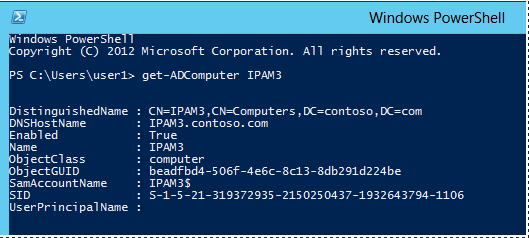

# Manually Configure DNS Access Settings
[Checklist: Deploy IPAM Server](../Topic/Checklist--Deploy-IPAM-Server.md) > [Install IPAM Server](../Topic/Install-IPAM-Server.md) > [Choose an IPAM Provisioning Method](../Topic/Choose-an-IPAM-Provisioning-Method.md) > [Configure Server Discovery](../Topic/Configure-Server-Discovery.md) > [Discover Servers on the Network](../Topic/Discover-Servers-on-the-Network.md) | [Manually Add a Server to Server Inventory](../Topic/Manually-Add-a-Server-to-Server-Inventory.md) > [Create IPAM Provisioning GPOs](../Topic/Create-IPAM-Provisioning-GPOs.md) | **Manually Configure DNS Access Settings**  
  
If you have chosen the manual provisioning method, you must configure access permissions and settings individually on managed servers. Two general methods for configuring these settings are available:  
  
-   **Manual application of IPAM GPOs**: With this method, IPAM GPOs are created but are not automatically applied to managed servers. Application of GPOs is done manually by adding managed servers to GPO security filtering. To use this method, first perform the steps in [Create IPAM Provisioning GPOs](../Topic/Create-IPAM-Provisioning-GPOs.md). When you have created these GPOS, configure security filtering by performing the steps in [Configuring IPAM GPO security filtering](../Topic/Create-IPAM-Provisioning-GPOs.md#security_filtering).  
  
-   **Manual configuration of individual settings**: GPOs are not used with this method. Instead, access settings on each managed server are configured manually by an administrator. Steps to configure these access settings are provided in this topic.  
  
For more information about choosing an IPAM provisioning method, see [Choosing a provisioning method](../Topic/Getting-Started-with-IPAM.md#choose_method).  
  
Membership in the **Domain Admins** group, or equivalent, is the minimum required to complete this procedure. [!INCLUDE[review_details](../Token/review_details_md.md)]  
  
## Manually configure managed DNS server access settings  
Use the following procedures to configure IPAM access settings on a managed DHCP server:  
  
-   [Configure Windows Firewall on a managed DNS server](../Topic/Manually-Configure-DNS-Access-Settings.md#WFAS)  
  
-   [Configure security groups on a managed DNS server](../Topic/Manually-Configure-DNS-Access-Settings.md#security_groups)  
  
-   [Enable event log monitoring on a managed DNS server](../Topic/Manually-Configure-DNS-Access-Settings.md#DACL)  
  
-   [Configure the DNS DACL on a managed DNS server](../Topic/Manually-Configure-DNS-Access-Settings.md#DACLL)  
  
A summary of required settings is provided in the table below.  
  
|Setting Type|Setting Name|Function|  
|----------------|----------------|------------|  
|Inbound firewall rule|DNS Service|Discover DNS servers|  
|Inbound firewall rule|Remote Service Management|Manage DNS servers|  
|Inbound firewall rule|Remote Event Log Management|Monitor DNS zones and services|  
|Security Group|Event Log Readers|Monitor DNS servers|  
|Event log access|Event log monitoring|Monitor DNS zones and services|  
|DNS administration|DNS DACL|Administer DNS zones and servers|  
  
After performing these procedures, refresh the server access status for the managed DNS server in the server inventory view on the IPAM server.  
  
## Configure Windows Firewall on a managed DNS server  
Use the following procedure to enable access by the IPAM server to inbound firewall ports on a managed DNS server. If the managed DNS server becomes unmanaged, delete these inbound firewall rules. All of the following procedures are performed on the managed DNS server.  
  
#### To configure Windows Firewall on a managed DNS server  
  
1.  On the Server Manager menu, click **Tools** and then click **Windows Firewall with Advanced Security**.  
  
2.  Right\-click **Inbound Rules**, and then click **New Rule**. The **New Inbound Rule Wizard** will launch.  
  
3.  In **Rule Type**, select **Predefined**, choose **DNS Service** from the list, and then click **Next**.  
  
4.  In **Predefined Rules**, under **Rules**, select the checkboxes next to the following rules:  
  
    -   **RPC \(TCP, Incoming\)**  
  
    -   **DNS \(UDP, Incoming\)**  
  
    -   **DNS \(TCP, Incoming\)**  
  
    -   **RPC Endpoint Mapper \(TCP, Incoming\)**  
  
5.  Click **Next**, choose **Allow the connection**, and then click **Finish**.  
  
6.  Right\-click **Inbound Rules**, and then click **New Rule**. The **New Inbound Rule Wizard** will launch.  
  
7.  In **Rule Type**, select **Predefined**, choose **Remote Service Management** from the list, and then click **Next**.  
  
8.  In **Predefined Rules**, under **Rules**, select the checkboxes next to the following rules:  
  
    -   **Remote Service Management \(RPC\-EPMAP\)**  
  
    -   **Remote Service Management \(NP\-In\)**  
  
    -   **Remote Service Management \(RPC\)**  
  
9. Click **Next**, choose **Allow the connection**, and then click **Finish**.  
  
10. Right\-click **Inbound Rules**, and then click **New Rule**. The **New Inbound Rule Wizard** will launch.  
  
11. In **Rule Type**, select **Predefined**, choose **Remote Event Log Management** from the list, and then click **Next**.  
  
12. In **Predefined Rules**, under **Rules**, select the checkboxes next to the following rules:  
  
    -   **Remote Event Log Management \(RPC\-EPMAP\)**  
  
    -   **Remote Event Log Management \(RPC\)**  
  
13. Click **Next**, choose **Allow the connection**, and then click **Finish**.  
  
14. Close the Windows Firewall with Advanced Security console.  
  
## Configure security groups on a managed DNS server  
To access configuration data and server event logs, the IPAM server must be a member of the domain IPAM Users Group \(IPAMUG\). The IPAM server must also be a member of the Event Log Readers security group.  
  
> [!WARNING]  
> If the DNS Server service is running on a domain controller, some procedures below are different than if the DNS server is a domain member computer that is not running on the same server with Active Directory Domain Services \(AD DS\). If procedures are unique to a type of DNS server, this is specified in the procedure title.  
  
#### To configure the IPAMUG security group  
  
1.  On a domain controller, click **Tools** on the Server Manager menu, and then click **Active Directory Users and Computers**.  
  
2.  In the Active Directory Users and Computers console tree, right\-click the **Users** container under the managed DHCP server’s domain, point to **New**, and then click **Group**.  
  
3.  In the **New Object – Group** dialog box, under **Group name**, type **IPAMUG**.  
  
4.  Under **Group scope**, select **Universal** and under **Group type** select **Security**, and then click **OK**.  
  
      
  
5.  Double\-click the IPAMUG group and then click the **Members** tab.  
  
6.  Click **Object Types**, select the **Computers** checkbox, and then click **OK**.  
  
7.  Under **Enter the object names to select**, type the name of the IPAM server and then click **OK**.  
  
8.  Verify that the correct IPAM server is displayed under **Name** and then click **OK**.  
  
#### To configure the Event Log Readers security group on a DC\/DNS server  
  
1.  On the managed DC\/DNS server, click **Tools** on the Server Manager menu and then click **Active Directory Users and Computers**.  
  
2.  In the navigation tree, click the **<domain>\\Builtin** container and then double\-click **Event Log Readers**.  
  
3.  On the **Members** tab, click **Add**.  
  
4.  Under **Enter the object names to select**, type **IPAMUG**, and then click **OK** twice.  
  
#### To configure the Event Log Readers security group on a standalone DNS server  
  
1.  On the managed DNS server, click **Tools** on the Server Manager menu and then click **Computer Management**.  
  
2.  In the Computer Management navigation tree, click **Local Users and Groups** and then click **Groups**.  
  
3.  In the list of groups, double\-click **Event Log Readers** and then click **Add**.  
  
4.  Under **Enter the object names to select**, type **IPAMUG** and then click **OK**.  
  
5.  Verify that **<domain>\\IPAMUG** is displayed under **Members** and then click **OK**.  
  
## Enable event log monitoring on a managed DNS server  
Event log monitoring is enabled through the **HKLM\\SYSTEM\\CurrentControlSet\\Services\\EventLog\\DNS Server** registry key.  
  
#### To enable event log monitoring on a managed DNS server  
  
1.  On the managed DNS server, type **regedit.exe** at an elevated command prompt, and then press ENTER.  
  
2.  In Registry Editor, navigate to the **HKLM\\SYSTEM\\CurrentControlSet\\Services\\EventLog\\DNS Server** registry key.  
  
3.  Double\-click **CustomSD** in the right\-hand pane and then under **Value data**, position the mouse cursor at the end of the string.  
  
      
  
4.  Open a Windows PowerShell prompt and type **Get\-ADComputer <IPAM server name>** and press ENTER.  Replace IPAM server name with the host name of your IPAM server.  
  
      
  
    > [!TIP]  
    > The get\-ADComputer cmdlet is not available unless the Active Directory module for Windows PowerShell is installed. This module is installed by default on a domain controller. If the DNS server is a standalone domain member server, you can install the Active Directory module with the Add Roles and Features Wizard by selecting a Role\-based or feature\-based installation and then selecting **Features\\Remote Server Administration Tools\\Role Administration Tools\\AD DS and AD LDS Tools\\Active Directory module for Windows PowerShell**. Alternatively, you can acquire the SID of the IPAM server on a different computer and copy it to the standalone DNS server.  
  
5.  In the command output, highlight the string next to **SID** and press ENTER. This will copy the string to the clipboard.  
  
6.  In Registry Editor, at the end of the CustomSD Value data string, type **\(A;;0x1;;;** then paste the SID from the clipboard, and then type a closed parens. For example, if the SID that was copied is S\-1\-5\-21\-319372935\-2150250437\-1932643794\-1106 \(as shown in the example above\), then the end of the Value data string is **\(A;;0x1;;; S\-1\-5\-21\-319372935\-2150250437\-1932643794\-1106\)**. Be careful not to replace the entire value data string. Only append the extra characters to the end of the string.  
  
7.  Click **OK** and then close Registry Editor.  
  
## Configure the DNS DACL on a managed DNS server  
The IPAM server must be added to the **DnsAdmins** security group. This enables the IPAM server to perform DNS administration functions. You can use DNS Manager to configure this security setting on a managed DNS server if it is also a domain controller.  
  
> [!IMPORTANT]  
> To enable DNS administration on a standalone domain member DNS server, it is required to add the computer account of the IPAM server to the local Administrators group on the DNS server. This procedure is provided below, but is not recommended due to security concerns.  
  
After performing these procedures, refresh the server access status for the managed DNS server in the server inventory view on the IPAM server.  
  
#### To enable DNS administration on a managed DC\/DNS server  
  
1.  On the managed DNS server, open an elevated command prompt, type **dnsmgmt.msc**, and press ENTER.  
  
2.  In DNS Manager, right\-click the name of the DNS server and then click **Properties**.  
  
3.  Click the **Security** tab, click **Add**, type **IPAMUG**, and then click **OK** twice.  
  
#### To enable DNS administration on a standalone DNS server  
  
1.  On a standalone DNS server, open an elevated command prompt, type **lusrmgr.msc**, and then press ENTER.  
  
2.  In the **Local Users and Groups** navigation tree, click **Groups** and then double\-click **Administrators** in the right\-hand pane.  
  
3.  In **Administrators Properties**, click **Add**.  
  
4.  Click **Object Types**, select the **Computers** checkbox, and then click **OK**.  
  
5.  Under **Enter the object names to select**, type the name of the IPAM server and then click **OK**.  
  
6.  Verify that the IPAM server is displayed under **Members**, and then click **OK**.  
  
## See Also  
[Manually Configure DHCP Access Settings](../Topic/Manually-Configure-DHCP-Access-Settings.md)  
[Manually Configure DC and NPS Access Settings](../Topic/Manually-Configure-DC-and-NPS-Access-Settings.md)  
  
