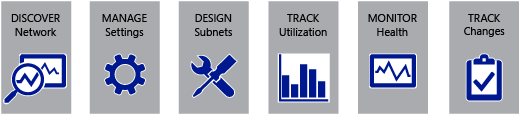

# Plan and Design IPAM
Microsoft introduced the IP Address Management \(IPAM\) feature in [!INCLUDE[win8_server_1](../Token/win8_server_1_md.md)] with improvements in [!INCLUDE[winblue_server_1](../Token/winblue_server_1_md.md)]. For information about new features of IPAM in [!INCLUDE[winblue_server_2](../Token/winblue_server_2_md.md)], see [What's New in IPAM in Windows Server 2012 R2](assetId:///48756719-0df9-4d5a-b6f5-fe2b3ae66953).  
  
IPAM provides a built\-in framework for discovering, monitoring, auditing, and managing IP address space and infrastructure servers on a corporate network.  
  
  
  
For detailed, step\-by\-step deployment guidance, see [Deploy IPAM](../Topic/Deploy-IPAM.md).  
  
For IPAM administration, troubleshooting, and best practices guidance, see [Manage IPAM_1](../Topic/Manage-IPAM_1.md).  
  
## In this guide  
This guide provides an overview of IPAM, including design and planning information. Topics in this guide apply to all versions of Windows Server that include IPAM. Differences that are present in specific operating system versions are noted where applicable. The following topics are available in this guide:  
  
-   [Getting Started with IPAM](../Topic/Getting-Started-with-IPAM.md): Provides a quick start for configuring and using IPAM.  
  
-   [IPAM Architecture](../Topic/IPAM-Architecture.md): Describes the primary components of IPAM and how they interact.  
  
-   [IPAM Deployment Planning](../Topic/IPAM-Deployment-Planning.md): Provides IPAM requirements, options and specifications.  
  
-   [IPAM Terminology](../Topic/IPAM-Terminology.md): Displays a list of new concepts and terms used in IPAM.  
  
A brief description of the benefits of IPAM is also provided below.  
  
## Benefits of IPAM  
Planning, integrating, troubleshooting, and managing the IP infrastructure devices, systems, users, and networks can be a daunting task in business today. The number and variety of network enabled devices is growing exponentially, and increased adoption of technologies such as IPv6, VoIP, and network virtualization makes the job of network administration more complex than ever. Administrators are commonly required to manage multiple data centers at central offices, branch offices, and other remote locations.  
  
IPAM provides a central and integrated experience for IP address management that replaces manual, work intensive tools such as spreadsheets and home\-grown scripts that can be cumbersome, unreliable and difficult to scale.  
  
Benefits and uses of IPAM include:  
  
### Server administration and management  
  
-   DHCP and DNS record creation and deletion  
  
-   Service and zone monitoring of DNS services  
  
-   Support for concurrent client sessions  
  
-   Remote administration support using [!INCLUDE[win8_server_2](../Token/win8_server_2_md.md)] and [!INCLUDE[win8_client_2](../Token/win8_client_2_md.md)]  
  
-   Support for backup, restore, and migration scenarios for IPAM server  
  
-   Multi\-entity management and monitoring of DHCP services and DHCP scopes  
  
-   Server and server group custom views and tagging  
  
-   Role based access control  
  
-   Agentless management of server roles  
  
For more information about using IPAM to administer DNS and DHCP servers, see [Multi-server Management](../Topic/Multi-server-Management.md).  
  
### Planning and organization of address space  
  
-   IPv4 and IPv6 address space allocation  
  
-   Static IP address inventory and lifetime management  
  
-   IPv4 and IPv6 address space custom views and tagging  
  
-   IP address space utilization statistics and trend monitoring  
  
-   Organizing and visualizing of data into user\-defined hierarchical logical groups  
  
-   Built\-in relational database support leveraging Windows Internal Database \(WID\)  
  
-   Graphical reporting with Windows PowerShell export support  
  
-   Extensive support for user\-defined and built\-in custom fields  
  
For more information about using IPAM to manage IP address space on your network, see [Managing IP Address Space](../Topic/Managing-IP-Address-Space.md).  
  
### Flexibility and automation  
  
-   Automatic server role discovery using Active Directory  
  
-   Automatic server configuration data collection and dynamic address space discovery  
  
-   Group Policy based automated deployment  
  
-   Detailed data collection tasks with configurable periodicity  
  
-   Flexible support for import and export of IP address space from spreadsheets and management tools  
  
-   Support for update of IP address space from systems such as System Center Virtual Machine Manager \(SCVMM\) and non\-Microsoft DHCP servers using Windows PowerShell  
  
For more information about server discovery and automated data collection with IPAM, see [IPAM Architecture](../Topic/IPAM-Architecture.md) and [Managing Server Inventory](../Topic/Managing-Server-Inventory.md).  
  
### Forensics  
  
-   IP address lease and logon event tracking  
  
-   Advanced search and filter support  
  
-   Configuration change event auditing for DHCP and IPAM services  
  
-   DHCP lease tracking by IP address, client ID, host name, and user name  
  
For more information about using IPAM to monitor configuration changes and track IP address on the network, see [Operational Event Tracking](../Topic/Operational-Event-Tracking.md) and [IP Address Tracking](../Topic/IP-Address-Tracking.md).  
  
### See also  
[Manage IPAM_1](../Topic/Manage-IPAM_1.md)  
  
[Deploy IPAM](../Topic/Deploy-IPAM.md)  
  
[Walkthrough: Demonstrate IPAM in Windows Server 2012](../Topic/Walkthrough--Demonstrate-IPAM-in-Windows-Server-2012.md)  
  
