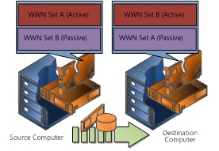

# Poster Companion Reference: Hyper-V Storage
This document is part of a companion reference discussing the [Windows Server 2012 Hyper\-V Component Architecture Poster](http://www.microsoft.com/download/details.aspx?id=29189).  
  
This document refers to the poster section titled “Hyper\-V Storage” and discusses new storage technologies and features in Windows Server® 2012, including virtual Fibre Channel for virtual machines, N\_Port ID Virtualization \(NPIV\) support, live migration, MPIO connectivity for Fibre Channel adapters, and the new VHDX format.  
  
-   [Virtual Fibre Channel for Virtual Machines](#Sec1)  
  
-   [Virtual Fibre Channel Adapters](#Sec2)  
  
-   [N\_Port ID Virtualization \(NPIV\) Support](#Sec3)  
  
-   [Live Migration Support for Fibre Channel Connectivity](#Sec4)  
  
-   [MPIO Connectivity to Fibre Channel Storage](#Sec5)  
  
-   [MPIO on the Virtual Machines](#Sec6)  
  
-   [MPIO on the Server Running Hyper\-V](#Sec7)  
  
-   [Device\-Specific Modules](#Sec8)  
  
-   [Hyper\-V Using Server Message Block \(SMB\)](#Sec9)  
  
-   [Understanding Virtual Hard Disk](#Sec10)  
  
-   [New Virtual Hard Disk Format](#Sec11)  
  
-   [Support for Virtual Hard Disks on Native 4KB Disks](#Sec12)  
  
-   [Windows Server Component Architecture Posters](#Sec13)  
  
To download the poster, see the [Windows Server 2012 Hyper\-V Component Architecture Poster](http://www.microsoft.com/download/details.aspx?id=29189) in the Microsoft® Download Center. This is a free resource.  
  
## 1. Virtual Fibre Channel for Virtual Machines  
Traditional datacenters have invested a great deal of resources in the provision of storage infrastructure. In Windows Server 2012, Microsoft makes it easy for you to ensure your virtualized workloads can connect into your existing storage infrastructure.  
  
Virtual Fibre Channel for Hyper\-V, a new feature of Windows Server 2012, provides Fibre Channel ports within the guest operating system, which provides a direct connection to Fibre Channel from within your virtual machines. This feature allows you to virtualize your workloads that require Fibre Channel storage—and also allows you to cluster guest operating systems in virtual machines using Fibre Channel.  
  
Some key features for using virtual Fibre Channel include:  
  
-   It allows you to leverage N\_Port ID Virtualization \(NPIV\).  
  
-   Provides unmitigated access to your storage area network \(SAN\).  
  
-   Provides hardware\-based I\/O path to the Windows software virtual hard disk stack.  
  
-   Provides support for your live migration operations.  
  
-   It allows you to have a single Hyper\-V host connected to different SANs with multiple Fibre Channel ports.  
  
-   You can have up to four virtual Fibre Channel adapters on a virtual machine.  
  
-   You can use Multipath I\/O \(MPIO\) to ensure high availability connections to your storage.  
  
## 2. Virtual Fibre Channel Adapters  
In the past, your virtual machines that were located on a server running Hyper\-V® never had the capacity to directly access the storage hardware. In Windows Server 2012, virtual Fibre Channel adapters provide port virtualization by exposing host bus adapter \(HBA\) ports in the guest operating system. This provides your virtual machine with direct and unfiltered access to a storage area network \(SAN\) by using a standard World Wide Name \(WWN\) that is associated with your virtual machine.  
  
Windows Server 2012 supports up to four virtual Fibre Channel adapters that can be assigned to each of your virtual machines.  
  
## 3. N\_Port ID Virtualization \(NPIV\) Support  
Consider a traditional non\-virtual environment with respect to Fibre Channel and storage. On your SAN, you would assign a storage LUN \(logical unit number\) to a server with an associated zone. The zone allows a particular server to access that LUN. This relationship is formalized by assigning the World Wide Name \(WWN\) of the SAN host bus adapter \(HBA\) to that LUN. Each HBA now has its own unique identifier or WWN and this allows secure access to that LUN.  
  
Consider a virtual environment. A zone is assigned to a WWN on your host bus adapter, but the problem is your physical Hyper\-V server may support multiple virtual machines. Each virtual machine shares access to the Hyper\-V server’s HBA and, as a result, has the same WWN identification to the LUN. This does not present a suitable solution, so a mechanism to identify the individual virtual machines to the SAN is required. The solution is known as N\_Port ID Virtualization \(NPIV\).  
  
The diagram below illustrates NPIV.  
  
  
  
In Windows Server 2012, virtual Fibre Channel for virtual machines utilizes NPIV technology. An NPIV port is created on the server running Hyper\-V and is associated with the virtual Fibre Channel adapter. The WWN assigned to the NPIV port allows all I\/O to be redirected to a specific virtual Fibre Channel adapter in a virtual machine. In essence, NPIV allows you to have a zone in your SAN that only one virtual machine can access, just like in the physical world.  
  
## 4. Live Migration Support for Fibre Channel Connectivity  
Hyper\-V in Windows Server 2012 now supports live migration of virtual machines across computers running Hyper\-V while maintaining Fibre Channel connectivity \(live migration with failover clusters\). This was not possible in previous releases of Windows Server 2008 and Windows Server 2008 R2.  
  
The live migration process that maintains Fibre Channel connectivity is illustrated in the diagram \(below\).  
  
  
  
Two World Wide Names \(WWNs\) are configured for each virtual Fibre Channel adapter in your virtual machine, Set A and Set B. Hyper\-V automatically changes between Set A and Set B WWN addresses during a live migration. Hyper\-V ensures that all logical unit numbers \(LUNs\) are available on the destination computer and then performs the live migration. No downtime occurs during the migration.  
  
## 5. MPIO Connectivity to Fibre Channel Storage  
As more and more data is consolidated on storage area networks \(SANs\), the potential loss of access to storage resources is unacceptable. To mitigate this risk, high availability solutions, like MPIO, have been developed and now extended to virtualized environments.  
  
Microsoft Multipath I\/O \(MPIO\) provides the logical facility for routing I\/O over redundant hardware paths connecting server to storage. These redundant hardware paths can be made up of components such as the cabling, host bus adapters \(HBAs\), switches, and storage controllers and possibly even mains power. MPIO manages these redundant connections so that I\/O requests can be rerouted in the event that a component along one path fails—for example, a hardware adapter.  
  
## 6. MPIO on the Virtual Machines  
Hyper\-V in Windows Server 2012 can use Multipath I\/O \(MPIO\) functionality to ensure continuous connectivity to Fibre Channel storage from within a virtual machine. You can use MPIO on virtual machines in co\-existence with MPIO on a server running Hyper\-V.  
  
## 7. MPIO on the Server Running Hyper\-V  
You can also install multiple Fibre Channel ports on the server running Hyper\-V and can use MPIO to provide highly available connectivity to the LUNs that are accessible by the server. This ensures you are able to cope with a storage component failure that would normally prevent your system from continuing its normal operations.  
  
## 8. Device\-Specific Modules  
Microsoft Multipath I\/O \(MPIO\) is a Microsoft\-provided framework that allows storage providers to develop multipath solutions that contain the hardware\-specific information needed to optimize connectivity with their storage arrays. These modules are called Device\-Specific Modules \(DSMs\).  
  
## 9. Hyper\-V Using Server Message Block \(SMB\)  
The Server Message Block \(SMB\) protocol is a network file sharing protocol, as implemented in the Windows operating system, and is known as the Microsoft SMB protocol. You may also hear it referred to as the Common Internet File System \(CIFS\).  
  
Historically, SMB file shares have been perceived as having unreliable connections and unreliable storage on file servers. However, in Windows Server 2012, this has all changed and SMB 3 is now a major functionality for inclusion in enterprise customer environments.  
  
In Windows Server 2012, Hyper\-V can store virtual machine files \(configuration files, virtual hard disk files, and snapshots\) on file servers by using SMB 3. This is supported for both non\-clustered and clustered servers running Hyper\-V where file storage is used as shared storage for the failover cluster.  
  
If you configure virtual machine storage on a central SMB share, you can also perform a live migration of this virtual machine even when you have not configured a cluster. During the live migration, the virtual machine is moved from one physical server to another while the storage remains on the central SMB share.  
  
Storage migration is also possible. If you want to update the physical storage available to your server running Hyper\-V, you can move virtual hard disks both on shared storage subsystems and on non\-shared storage as long as a Windows Server 2012 SMB 3 network shared folder is visible to both Hyper\-V hosts.  
  
SMB 3 allows you to use your file storage resources across virtualization environments. Storing Hyper\-V data on inexpensive, easy\-to\-manage file servers provides the benefits that you would expect from a storage area network \(SAN\)—continuous availability, high performance, and manageability.  
  
## 10. Understanding Virtual Hard Disk  
A VHD \(virtual hard disk\) is a file format used in Microsoft virtualization that represents a virtual hard disk drive. Virtual hard disks allow multiple operating systems to reside on a server running Hyper\-V. It allows your developers to test software on different operating systems without the cost or hassle of installing a second hard disk or creating a separate partition on a single hard disk.  
  
Just like a regular disk, a virtual hard disk can contain disk partitions and a file system, which in turn can contain files and folders. This is the exact same appearance and behavior of the hard disk of a virtual machine. You can configure virtual machines to use either a fixed\-sized virtual hard disk or a dynamically expanding virtual hard disk or to directly access a physical disk. The virtual hard disk file functions as a set of disk blocks and is stored as a regular file using the NTFS file system.  
  
A fixed\-size virtual hard disk is a file stored in an NTFS partition that uses the full amount of space specified when the virtual hard disk was created. However, you can always increase the size of a fixed\-size VHD by using Hyper\-V Manager or by running a Windows PowerShell™ script.  
  
Alternatively, a dynamically expanding virtual hard disk is a file stored on an NTFS partition that grows in size each time data is added. It provides an efficient use of available storage and is the most commonly used type of virtual hard disk. Keep in mind that you can always compact a dynamically expanding virtual hard disk, which reduces the size of the virtual hard disk \(represented by the .vhd file\) by removing unused space left behind when data is deleted from the virtual hard disk.  
  
A differencing virtual hard disk is a special type of virtual hard disk that stores changes to an associated parent virtual hard disk for the purpose of keeping the parent virtual hard disk intact. Changes continue to accumulate in the differencing virtual hard disk until it is merged to the parent disk. The parent virtual hard disk of a differencing virtual hard disk can either be a fixed\-size virtual hard disk, a dynamically expanding virtual hard disk, or a differencing virtual hard disk \(differencing chain\).  
  
You also have the option of using disk storage that is configured as a physical disk directly attached to a virtual machine. In addition, disk storage can be configured as a storage area network \(SAN\) logical unit number \(LUN\) attached to a virtual machine. You might also hear these disks referred to as *pass\-through* disks. From the management operating system perspective, the disk is in an offline state, which means direct read and write access to the disk is not available. These disks do not support dynamically expanding virtual hard disks, differencing virtual hard disks, or virtual machine snapshots.  
  
The main VHD types are illustrated below.  
  
  
  
## 11. New Virtual Hard Disk Format  
Customer environments are dynamic in nature and storage systems are always evolving. This is especially true for customers requiring increased reliance on virtualized enterprise workloads. To address this, Hyper\-V in Windows Server 2012 contains an update to the virtual hard disk format called VHDX. This new format is designed to allow enterprise environments the capacity to cater for current and future workloads.  
  
The new VHDX format delivers the following capabilities for virtualizing enterprise\-class storage and their associated workloads:  
  
-   Supports up to 64 terabytes \(TB\) of storage capacity.  
  
-   Logs updates to the VHDX metadata structures. This provides added resiliency to the VHDX file in the case of power outages.  
  
-   Supports larger block sizes for dynamic and differencing disks, which allows the disks to be tuned to the needs of virtualized workloads.  
  
-   Increases performance for applications and workloads, especially on physical disks that have a larger sector size than 512 bytes.  
  
-   Supports storing custom metadata. For example, you might want to record your operating system version or any patches you have applied.  
  
-   You can also configure and manage virtual hard disks on a computer running Hyper\-V using Windows PowerShell commands.  
  
-   Reliably protects against issues for dynamic and differencing disks during power failures.  
  
-   Provides efficiency \(called *trim*\) in representing data, which results in smaller files and lets the underlying physical storage device reclaim unused space. \(Trim requires pass\-through or SCSI disks and trim\-compatible hardware.\)  
  
To take advantage of the new version of the new VHDX format, you need the following:  
  
-   Windows Server 2012 or Windows 8.  
  
-   Server running Hyper\-V with the Hyper\-V server role.  
  
-   Trim\-capable hardware.  
  
## 12. Support for Virtual Hard Disks on Native 4KB Disks  
If you look at disk storage architecture today, you will find the format is to have 512 bytes per sector. In fact, this has been the case for many years. If you have a sector format where storage exceeds 512 to 520 bytes per sector, this is referred to as an advanced format. Changing the sector format to the new 4,096\-byte structure \(or 4\-KB disks\) uses the storage surface area more efficiently. This is true for larger files but less efficient for smaller files. However, you still gain powerful error correction technology \(or algorithms\) to maintain the integrity of your data at much higher storage densities.  
  
In Windows Server 2012, Hyper\-V introduces support for 4,096\-byte sectors \(4\-KB disk sectors\) in virtual disks. The 4\-KB disk sector format is a standard to which the industry will move toward over the next few years to support increasing storage requirements.  
  
Introducing a new disk sector format means that methods are required to maintain backward compatibility with older disk sector formats, especially since 512K sectors are so entrenched in existing hardware. One approach is to use a new standard known as 512\-byte emulation \(512e\). Hard drives configured with 4,096\-byte physical sectors with 512\-byte firmware are often referred to as 512 emulation drives.  
  
Hyper\-V in Windows Server 2012 also provides enhanced performance of the transitional 512\-byte emulation \(512e\) standard. Support for 4\-KB disk sectors and 512e helps ensure that your virtualization infrastructure keeps pace with industry innovations in storage.  
  
## 13. Windows Server Component Architecture Posters  
To download the Windows Server 2012 poster, see [Windows Server 2012 Hyper\-V Component Architecture](http://www.microsoft.com/download/details.aspx?id=29189) in the Microsoft Download Center. If you want to reference the previous component architecture posters that relate to Hyper\-V in Windows Server 2008 R2, please see the following posters.  
  
### Windows Server 2008 R2: Hyper\-V Component Architecture  
The [Windows Server 2008 R2: Hyper\-V Component Architecture](http://www.microsoft.com/download/details.aspx?id=3501) poster provides a visual reference for understanding key Hyper\-V technologies in Windows Server 2008 R2. It focuses on architecture, snapshots, live migration, virtual networking, storage, and import\/export.  
  
You can use this poster in conjunction with the previously published [Windows Server 2008 R2 Feature Components Poster](http://www.microsoft.com/download/details.aspx?displaylang=en&id=7002).  
  
  
  
### Windows Server 2008 R2 Hyper\-V Component Architecture \(with Service Pack 1\)  
This [Windows Server 2008 R2 Hyper\-V Component Architecture \(with Service Pack 1\)](http://www.microsoft.com/download/details.aspx?id=2688) poster provides a visual reference for understanding key Hyper\-V technologies in Windows Server 2008 R2 with Service Pack 1. It focuses on architecture, snapshots, live migration, virtual networking, storage, RemoteFX®, and Dynamic Memory.  
  
You can also use this poster in conjunction with the previously published [Windows Server 2008 R2 Feature Components Poster](http://www.microsoft.com/download/details.aspx?displaylang=en&id=7002).  
  
### Windows Server 2008 R2 Feature Components Poster  
The [Windows Server 2008 R2 Feature Components Poster](http://www.microsoft.com/download/details.aspx?id=7002) provides a visual reference for understanding key technologies in Windows Server 2008 R2. It focuses on Active Directory® Domain Services, Hyper\-V, Internet Information Services, Remote Desktop Services \(including Virtual Desktop Infrastructure \(VDI\)\), BranchCache®, and DirectAccess technologies. In addition, updates to core file services and server management are illustrated.  
  
You can use this poster in conjunction with the [Windows Server 2008](http://www.microsoft.com/download/details.aspx?id=17881) and Windows Server 2008 R2 component posters.  
  
  
  
### Remote Desktop Services Component Architecture Poster  
The [Remote Desktop Services Component Poster](http://www.microsoft.com/download/details.aspx?id=3262) provides a visual reference for understanding key Remote Desktop Services technologies in Windows Server 2008 R2. It explains the functions and roles of Remote Desktop Session Host, Remote Desktop Virtualization Host, Remote Desktop Connection Broker, Remote Desktop Web Access, Remote Desktop Gateway, Remote Desktop Licensing, and RemoteFX.  
  
You can use this poster in conjunction with the Windows Server 2008 and Windows Server 2008 R2 component posters.  
  
  
  
