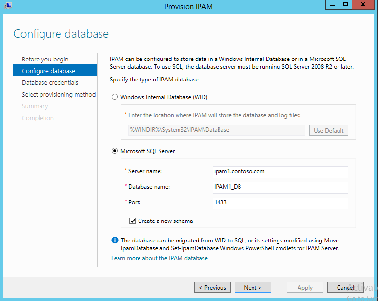

# Specify the IPAM Database
[Checklist: Deploy IPAM Server](../Topic/Checklist--Deploy-IPAM-Server.md) > [Install IPAM Server](../Topic/Install-IPAM-Server.md) > [Choose an IPAM Provisioning Method](../Topic/Choose-an-IPAM-Provisioning-Method.md) > [Configure the SQL Database for IPAM](../Topic/Configure-the-SQL-Database-for-IPAM.md) > **Specify the IPAM Database**  
  
> [!IMPORTANT]  
> External database support is introduced in [!INCLUDE[winblue_server_1](../Token/winblue_server_1_md.md)], enabling you to choose Windows Internal Database \(WID\) or a Microsoft SQL database. This option is not available in [!INCLUDE[win8_server_1](../Token/win8_server_1_md.md)]. Skip this procedure if your IPAM server is running [!INCLUDE[win8_server_2](../Token/win8_server_2_md.md)].  
  
The choice of a database is not permanent for the current installation of IPAM Server. You can migrate IPAM data from a WID database to a Microsoft SQL database using the [Move\-IpamDatabase](http://technet.microsoft.com/library/dn363327.aspx) cmdlet in Windows PowerShell. You can also use this cmdlet to migrate data from one Microsoft SQL database to another. You cannot migrate IPAM data from Microsoft SQL to WID.  
  
This procedure assumes that you have already connected to the IPAM server that you will provision using the IPAM client console. To connect to a different IPAM server, click **Connect to IPAM server** on the IPAM Overview page.  
  
If you have installed IPAM Server without IPAM Client, you must perform the procedures in [Checklist: Deploy IPAM Client](../Topic/Checklist--Deploy-IPAM-Client.md) before you can connect to the IPAM server and choose a database. IPAM Client is installed by default when you install IPAM Server, but these features can also be installed on separate computers.  
  
Membership in the **Administrators** group, or equivalent, is the minimum required to complete this procedure. [!INCLUDE[review_details](../Token/review_details_md.md)]  
  
## Specify the IPAM database  
Use the following procedure to configure the IPAM database.  
  
#### To specify the IPAM database  
  
1.  On the IPAM Overview page, click **Provision the IPAM server**. The **Provision IPAM** wizard will open.  
  
2.  Click **Next** and then on the **Configure database** page, choose either **Windows Internal Database \(WID\)** or **Microsoft SQL Server**.  
  
3.  If you choose WID, you can also specify a location where IPAM will store the database and log files. A default location is provided.  
  
4.  If you choose SQL, you must specify the following parameters:  
  
    -   **Server name**: Provide the fully qualified domain name for the SQL server, or its IP address.  
  
    -   **Database name**: Provide a name for the database. This can be any name that does not already exist on the SQL server.  
  
    -   **Port**: A default port number of 1433 is provided. This port can be changed if desired.  
  
    -   **Schema**: The option to create a new database schema is selected by default.  
  
    Microsoft SQL Server 2008 R2 and later is supported. If you choose Microsoft SQL Server, the database server must have a network connection to the IPAM server, or be collocated on the IPAM server. The information you provide on this page is validated upon completion of the wizard. See the following example.  
  
      
  
    > [!IMPORTANT]  
    > In the previous example, SQL and IPAM are collocated on the same server. Configuration of SQL credentials is different if the SQL server is collocated on the IPAM server compared to the configuration when SQL server is running on a different computer. For more information, see [Configure the SQL Database for IPAM](../Topic/Configure-the-SQL-Database-for-IPAM.md).  
  
5.  If you select the WID database type, no further database configuration is required. Click **Next** to [Choose an IPAM Provisioning Method](../Topic/Choose-an-IPAM-Provisioning-Method.md).  
  
6.  If you select the SQL database type, click **Next**, and then on the **Database credentials** page choose **IPAM server credentials** or **SQL credentials**. If you choose SQL credentials, you must also supply a valid user name and password.  
  
7.  Click **Next** to [Choose an IPAM Provisioning Method](../Topic/Choose-an-IPAM-Provisioning-Method.md).  
  
Credentials and connectivity to a SQL server is validated upon completion of the Provision IPAM wizard.  
  
## See Also  
[Configure Server Discovery](../Topic/Configure-Server-Discovery.md)  
  
