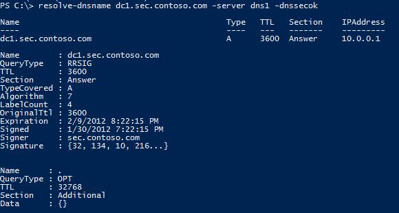
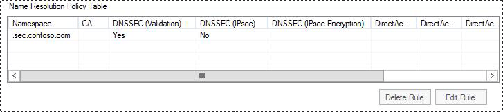
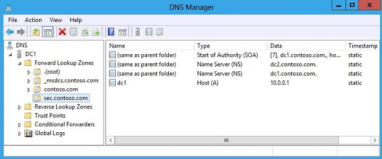

# Step-by-Step: Demonstrate DNSSEC in a Test Lab
Domain Name System Security Extensions \(DNSSEC\) is a suite of extensions that add security to the DNS protocol. With DNSSEC, non\-authoritative DNS servers are able to validate the responses they receive when they query other DNS servers. In addition, DNS client computers running [!INCLUDE[firstref_client_7](../Token/firstref_client_7_md.md)] or later can be configured to require this validation be performed.  
  
## In this guide  
This guide provides step\-by\-step instructions for deploying DNSSEC in a test lab using two server computers or, optionally, three server computers and one client computer. Software and hardware requirements are provided, as well as an overview of DNSSEC.  
  
> [!IMPORTANT]  
> The following instructions are for configuring a test lab using the minimum number of computers. Individual computers are needed to separate the services provided on the network and to clearly show the desired functionality. This configuration is neither designed to reflect best practices nor does it reflect a desired or recommended configuration for a production network. The configuration, including IP addresses and all other configuration parameters, is designed only to work on a separate test lab network.  
  
For information and detailed procedures to deploy DNSSEC in a production environment, see [DNSSEC in Windows Server 2012](../Topic/DNSSEC-in-Windows-Server-2012.md). **Note**: The concepts and procedures in this guide apply to both [!INCLUDE[win8_server_2](../Token/win8_server_2_md.md)] and [!INCLUDE[winblue_server_2](../Token/winblue_server_2_md.md)]. You can use either operating system in the test lab.  
  
## DNSSEC overview  
The DNS protocol is vulnerable to attack due to an inherent lack of authentication and integrity checking of data that is exchanged between DNS servers or provided to DNS clients. DNSSEC adds security to DNS responses by providing the ability for DNS servers to validate DNS responses. With DNSSEC, resource records are accompanied by digital signatures. These digital signatures are generated when DNSSEC is applied to a DNS zone using a process called zone signing. When a resolver issues a DNS query for resource record in a signed zone, a digital signature is returned with the response so that validation can be performed. If validation is successful, this proves that the data has not been modified or tampered with in any way.  
  
### DNS threats  
DNS spoofing is a type of attack that involves impersonation of DNS server responses in order to introduce false information. In a spoofing attack, a malicious user attempts to guess that a DNS client or server has sent a DNS query and is waiting for a DNS response. A successful spoofing attack will insert a fake DNS response into the DNS server’s cache, a process known as cache poisoning. A spoofed DNS server has no way of verifying that DNS data is authentic, and will reply from its cache using the fake information. An attacker can also set the time to live \(TTL\) on fake DNS data to a very long interval, causing the DNS server cache to remain poisoned for many hours or days. It is also possible to send a DNS spoofing attack directly to a DNS client; however these attacks are less persistent than cache poisoning attacks. Both of these types of attacks can be prevented with DNSSEC by requiring that DNS responses are validated as authentic. See the following figure.  
  
  
  
### How DNSSEC works  
DNSSEC uses digital signatures and cryptographic keys to validate that DNS responses are authentic. The following topics briefly discuss how these signatures are managed and validation is performed.  
  
#### Digital signatures  
Signatures generated with DNSSEC are contained within the DNS zone itself in the new resource records. These new resource records are called RRSIG \(resource record signature\) records. When a resolver issues a query for a name, the RRSIG record is returned in the response. A public cryptographic key called a DNSKEY is needed to verify the signature. The DNSKEY is retrieved by a DNS server during the validation process.  
  
#### Zone signing  
When you sign a zone with DNSSEC, you are individually signing all the records contained in the zone. This makes it possible to add, modify, or delete records in the zone without re\-signing the entire zone. It is only necessary to re\-sign the updated records.  
  
#### Authenticated denial of existence  
What if a DNS query is for a record that does not exist? If the DNS server responds that no record was found, this response also needs to be validated as authentic. However, since there is no resource record, then there is no RRSIG record. The answer to this problem is the Next Secure \(NSEC\) record. NSEC records create a chain of links between signed resource records. To create NSEC records, the zone is sorted and NSEC records are created such that each NSEC record has a pointer to the next NSEC record. The last NSEC record points back to the first record. When a query is submitted for a nonexistent record, the DNS server returns the NSEC record prior to where the nonexistent record would have been in the order. This allows for something called authenticated denial of existence.  
  
NSEC3 is a replacement or alternative to NSEC that has the additional benefit of preventing “zone walking” which is the process of repeating NSEC queries in order to retrieve all the names in a zone. A DNS server running [!INCLUDE[win8_server_1](../Token/win8_server_1_md.md)] supports both NSEC and NSEC3. A zone can be signed with either NSEC or NSEC3, but not both.  
  
#### Trust anchors  
A trust anchor is a preconfigured public key associated with a specific zone. A validating DNS server must be configured with one or more trust anchors in order to perform validation. If the DNS server is running on a domain controller, trust anchors are stored in the forest directory partition in Active Directory Domain Services \(AD DS\) and can be replicated to all domain controllers in the forest. On standalone DNS servers, trust anchors are stored in a file named **TrustAnchors.dns**. A DNS server running [!INCLUDE[win8_server_2](../Token/win8_server_2_md.md)] or [!INCLUDE[winblue_server_2](../Token/winblue_server_2_md.md)] also displays configured trust anchors in the DNS Manager console tree in the **Trust Points** container. You can also use Windows PowerShell or Dnscmd.exe to view trust anchors.  
  
#### DNSSEC key management  
DNSSEC key management strategy includes planning for key generation, key storage, key expiration, and key replacement. Together, key expiration and replacement in DNSSEC is called key rollover. In [!INCLUDE[win8_server_2](../Token/win8_server_2_md.md)] and [!INCLUDE[winblue_server_2](../Token/winblue_server_2_md.md)], key management is made easier with simple and flexible key generation, Active Directory storage and replication, an automated key rollover.  
  
#### DNSSEC\-aware clients  
In [!INCLUDE[win8_client_2](../Token/win8_client_2_md.md)], [!INCLUDE[win8_server_2](../Token/win8_server_2_md.md)], [!INCLUDE[winblue_client_2](../Token/winblue_client_2_md.md)], and [!INCLUDE[winblue_server_2](../Token/winblue_server_2_md.md)], the DNS Client service continues to be non\-validating and security\-aware, the same as computers running [!INCLUDE[nextref_client_7](../Token/nextref_client_7_md.md)] and [!INCLUDE[firstref_server_7](../Token/firstref_server_7_md.md)]. When the DNS client issues a query, it can indicate to the DNS server that it understands DNSSEC. However, the client is non\-validating. When issuing queries, the DNS client relies on the local DNS server to indicate that validation was successful. If the server fails to perform validation, or reports that validation was unsuccessful, the DNS Client service can be configured to return no results.  
  
#### NRPT  
The Name Resolution Policy Table \(NRPT\) is a table that contains rules you can configure to specify DNS settings or special behavior for names or namespaces. The NRPT can be configured using Group Policy or by using the Windows Registry.  
  
When performing DNS name resolution, the DNS Client service checks the NRPT before sending a DNS query. If a DNS query or response matches an entry in the NRPT, it is handled according to settings in the policy. Queries and responses that do not match an NRPT entry are processed normally. You can use the NRPT to require that the DNS Client service perform DNSSEC validation of DNS responses for the namespaces that you specify.  
  
## Scenario overview  
This test lab demonstrates new DNSSEC functionality in [!INCLUDE[win8_server_2](../Token/win8_server_2_md.md)]. Three server computers and one client computer are used. See the following figure.  
  
  
  
### Hardware and software requirements  
Two server computers are required to complete the test lab. Optionally, three server computers and one client computer can be used to complete additional steps in the test lab.  
  
> [!NOTE]  
> All references to [!INCLUDE[win8_server_2](../Token/win8_server_2_md.md)] and [!INCLUDE[win8_client_2](../Token/win8_client_2_md.md)] in this guide apply equally to [!INCLUDE[winblue_server_2](../Token/winblue_server_2_md.md)] and [!INCLUDE[winblue_client_2](../Token/winblue_client_2_md.md)]. For a summary of updates available to the DNS Server service in [!INCLUDE[winblue_server_2](../Token/winblue_server_2_md.md)], see [What's New in DNS Server in Windows Server 2012 R2](assetId:///e36880f8-70a1-41cd-8341-fb7a9d0c009c). These updates do not affect the procedures in this guide.  
  
The following are required components of the test lab:  
  
1.  The product disc or other installation media for [!INCLUDE[win8_server_2](../Token/win8_server_2_md.md)].  
  
2.  Two computers that meet the minimum hardware requirements for [!INCLUDE[win8_server_2](../Token/win8_server_2_md.md)].  
  
The following components are recommended but not required to complete the test lab:  
  
1.  The product disc or other installation media for [!INCLUDE[win8_client_2](../Token/win8_client_2_md.md)].  
  
2.  Two computers that meet the minimum hardware requirements for [!INCLUDE[win8_server_2](../Token/win8_server_2_md.md)] and [!INCLUDE[win8_client_2](../Token/win8_client_2_md.md)].  
  
### Steps for configuring the test lab  
The following procedures are used to configure computers for the demonstration portion of the test lab:  
  
-   [Configure DC1](../Topic/Step-by-Step--Demonstrate-DNSSEC-in-a-Test-Lab.md#config_dc1): DC1 is a domain controller and Active Directory\-integrated authoritative DNS server.  
  
-   [Configure DNS1](../Topic/Step-by-Step--Demonstrate-DNSSEC-in-a-Test-Lab.md#config_dns1): DNS1 is a non\-authoritative, caching DNS server.  
  
-   [Configure DC2](../Topic/Step-by-Step--Demonstrate-DNSSEC-in-a-Test-Lab.md#config_dc2): DC2 is a secondary domain controller and Active Directory\-integrated DNS server.  
  
-   [Configure Client1](../Topic/Step-by-Step--Demonstrate-DNSSEC-in-a-Test-Lab.md#config_client1): Group Policy settings for DNS are applied to Client1 and it is used to issue DNS client queries.  
  
## <a name="config_dc1"></a>Configure DC1  
DC1 is a computer running [!INCLUDE[win8_server_2](../Token/win8_server_2_md.md)], providing the following services:  
  
-   A domain controller for the contoso.com Active Directory domain.  
  
-   An authoritative DNS server for the contoso.com DNS zone.  
  
-   A DNSSEC Key Master for the contoso.com DNS zone.  
  
Initial configuration of DC1 consists of the following steps:  
  
-   [Install the operating system and configure TCP\/IP on DC1](../Topic/Step-by-Step--Demonstrate-DNSSEC-in-a-Test-Lab.md#dc1_1)  
  
-   [Install Active Directory and DNS on DC1](../Topic/Step-by-Step--Demonstrate-DNSSEC-in-a-Test-Lab.md#dc1_2)  
  
-   [Configure the sec.contoso.com DNS zone](../Topic/Step-by-Step--Demonstrate-DNSSEC-in-a-Test-Lab.md#dc1_4)  
  
-   [Enable Remote Desktop on DC1](../Topic/Step-by-Step--Demonstrate-DNSSEC-in-a-Test-Lab.md#dc1_rd)  
  
Additional tasks will be performed on DC1 during the demonstration portion of the test lab, including NRPT configuration, DNSSEC zone signing, distribution of trust anchors, and demonstration of DNSSEC key rollover.  
  
### <a name="dc1_1"></a>Install the operating system and configure TCP\/IP on DC1  
  
##### To install the operating system and configure TCP\/IP on DC1  
  
1.  Start your computer using the [!INCLUDE[win8_server_2](../Token/win8_server_2_md.md)] product disc or other digital media.  
  
2.  When prompted, enter a product key, accept license terms, configure clock, language, and regional settings, and provide a password for the local Administrator account.  
  
3.  Press **Ctrl\+Alt\+Delete** and sign\-in using the local Administrator account.  
  
4.  If you are prompted to enable Windows Error Reporting, click **Accept**.  
  
5.  Click **Start**, type **ncpa.cpl**, and then press **ENTER**. The **Network Connections** control panel will open.  
  
    > [!TIP]  
    > The previous step demonstrates new functionality in [!INCLUDE[win8_server_2](../Token/win8_server_2_md.md)] that enables you to search and run applications, settings, and files by clicking **Start** and then typing a search term. You can also open the **Network Connections** control panel by clicking next to **Wired Ethernet Connection** in Server Manager using the **Local Server** view. For more information, see [Common Management Tasks and Navigation](http://go.microsoft.com/fwlink/p/?LinkId=242147) in [!INCLUDE[win8_server_2](../Token/win8_server_2_md.md)] \(http:\/\/go.microsoft.com\/fwlink\/p\/?LinkId\=242147\).  
  
6.  In **Network Connections**, right\-click **Wired Ethernet Connection** and then click **Properties**.  
  
7.  Double\-click **Internet Protocol Version 4 \(TCP\/IPv4\)**.  
  
8.  On the **General** tab, choose **Use the following IP address**.  
  
9. Next to **IP address** type **10.0.0.1** and next to **Subnet mask** type **255.255.255.0**. It is not necessary to provide an entry next to **Default gateway**.  
  
10. Next to **Preferred DNS server**, type **10.0.0.1**.  
  
11. Click **OK** twice, and then close the **Network Connections** control panel.  
  
### <a name="dc1_2"></a>Install Active Directory and DNS on DC1  
DC1 will serve as the primary domain controller and DNS server for the contoso.com Active Directory domain.  
  
##### To configure DC1 as a domain controller and DNS server  
  
1.  The Server Manager Dashboard is displayed by default. In the navigation pane, click **Configure this local server**.  
  
2.  Under **PROPERTIES**, click the name next to **Computer name**. The **System Properties** dialog box will open.  
  
3.  On the **Computer Name** tab, click **Change** and then type **DC1** under **Computer name**.  
  
4.  Click **OK** twice, and then click **Close**.  
  
5.  When you are prompted to restart the computer, click **Restart Now**.  
  
6.  After restarting the computer, sign\-in using the local Administrator account.  
  
7.  In Server Manager, under **Configure this local server**, click **Add Roles and Features**.  
  
8.  In the **Add Roles and Features Wizard**, click **Next** three times, and then on the **Select server roles** page select the **Active Directory Domain Services** checkbox.  
  
9. When you are prompted to add required features, click **Add Features**.  
  
10. Click **Next** three times, and then click **Install**.  
  
11. Wait for the installation process to complete, verify on the **Installation progress** page that **Configuration required. Installation succeeded on DC1** is displayed, and then click **Close**.  
  
12. Click the Notification flag and then click **Promote this server to a domain controller**.  
  
      
  
13. In the **Active Directory Domain Services Configuration Wizard**, on the **Deployment Configuration** page, choose **Add a new forest** and then next to **Root domain name**, type **contoso.com**.  
  
14. Click **Next**, and then on the **Domain Controller Options** page, under **Type the Directory Services Restore Mode \(DSRM\) password**, type a password next to **Password** and **Confirm password**. Confirm that **Domain Name System \(DNS\) server** and **Global Catalog \(GC\)** are selected, and then click **Next**.  
  
15. Click **Next** five times and then click **Install**.  
  
16. The computer will restart automatically to complete the installation process.  
  
17. Sign in using the local Administrator account.  
  
18. Next, a domain administrator account must be created to use when performing procedures in the test lab.  
  
    > [!TIP]  
    > You can use the CONTOSO\\Administrator account in this test lab and skip creation of a domain administrator account if desired. This account has domain administrator privileges, and other privileges. However, it is a best practice to disable or rename this account. For more information, see [Active Directory Best Practices](http://go.microsoft.com/fwlink/p/?LinkID=243071)\(http:\/\/go.microsoft.com\/fwlink\/p\/?LinkID\=243071\).  
  
##### To create a domain administrator account  
  
1.  On the Server Manager menu bar, click **Tools**, and then click **Active Directory Users and Computers**.  
  
2.  In the **Active Directory Users and Computers** console tree, double\-click **contoso.com**, right\-click **Users**, point to **New**, and then click **User**.  
  
3.  In the **New Object – User** dialog box, type **user1** under **User logon name** and next to **Full name**, then click **Next**.  
  
4.  Next to **Password** and **Confirm password**, type a password for the user1 account.  
  
5.  Clear the checkbox next to **User must change password at next logon**, select the **Password never expires** checkbox, click **Next**, and then click **Finish**.  
  
6.  Double\-click **user1** and then click the **Member Of** tab.  
  
7.  Click **Add**, type **domain admins** under **Enter the object names to select**, click **OK** twice, and then close the **Active Directory Users and Computers** console.  
  
8.  Click **Start**, click **Administrator**, and then click **Sign out**.  
  
9. Sign in to the computer using the user1 credentials by clicking the left arrow next to **CONTOSO\\Administrator** and then clicking **Other user**.  
  
### <a name="dc1_4"></a>Configure the sec.contoso.com DNS zone  
Next, configure a new DNS zone: sec.contoso.com. This zone will be used to demonstrate DNSSEC zone signing.  
  
> [!WARNING]  
> The domain zone \(contoso.com\) can also be signed with DNSSEC. However, the test lab includes validation failure scenarios that add complexity if the domain zone is signed.  
  
##### To configure the sec.contoso.com DNS zone  
  
1.  On the Server Manager menu, click **Tools**, and then click **DNS**.  
  
2.  In the DNS Manager console tree, right\-click **Forward Lookup Zones** and then click **New Zone**.  
  
3.  In the **New Zone Wizard**, click **Next** three times, and then under **Zone name** type **sec.contoso.com**.  
  
4.  Click **Next** twice, and then click **Finish**.  
  
5.  Verify that the zone “**sec.contoso.com**” is displayed under **Forward Lookup Zones**.  
  
6.  Next, add one or more DNS resource records to the sec.contoso.com zone.  
  
7.  Leave the DNS Manager console open.  
  
##### To add DNS resource records to the sec.contoso.com zone  
  
1.  Right\-click **sec.contoso.com** and then click **New Host \(A or AAAA\)**.  
  
2.  In the **New Host** dialog box, type **dc1** under **Name**, type **10.0.0.1** under **IP address**, and then click **Add Host**. The IP address of dc1.contoso.com is used here to help demonstrate DNSSEC success and failure scenarios.  
  
3.  Confirm that **The host record dc1.sec.contoso.com was successfully added** is displayed, and then click **OK**.  
  
4.  Add additional resource records to the zone if desired, and then click **Done**.  
  
### <a name="dc1_rd"></a>Enable Remote Desktop on DC1  
DC1 will be used to demonstrate functionality of a network application in an environment with DNSSEC.  
  
##### To enable Remote Desktop on DC1  
  
1.  In the Server Manager navigation pane, click **Local Server**.  
  
2.  Click the word Disabled next to Remote Desktop.  
  
3.  In the System Properties dialog box, on the Remote tab, click Allow connections from computers running any version of Remote Desktop \(less secure\), and then click OK.  
  
## <a name="config_dns1"></a>Configure DNS1  
DNS1 is a computer running [!INCLUDE[win8_server_1](../Token/win8_server_1_md.md)], providing the following services:  
  
-   A non\-authoritative, recursive DNS server.  
  
-   A DNS client computer \(optional: If Client1 is not used\).  
  
Initial configuration of DNS1 consists of the following steps:  
  
-   [Install the operating system and configure TCP\/IP on DNS1](../Topic/Step-by-Step--Demonstrate-DNSSEC-in-a-Test-Lab.md#dns1_1)  
  
-   [Install and configure DNS on DNS1](../Topic/Step-by-Step--Demonstrate-DNSSEC-in-a-Test-Lab.md#dns1_2)  
  
-   [Optional: Install Network Monitor on DNS1](../Topic/Step-by-Step--Demonstrate-DNSSEC-in-a-Test-Lab.md#dns1_opt)  
  
During the demonstration portion of the test lab, DNS1 will be used to perform recursive DNS queries, host a trust anchor for the contoso.com domain, and provide DNSSEC validation for DNS client queries. Optionally \(if a separate DNS client computer is not used\), DNS1 will be used to issue DNS client queries.  
  
### <a name="dns1_1"></a>Install the operating system and configure TCP\/IP on DNS1  
  
> [!TIP]  
> The procedure below is identical to the steps used to install the operating system and configure TCP\/IP on DC1, with the exception that DNS1 is configured with an IP address of 10.0.0.2.  
  
##### To install the operating system and configure TCP\/IP on DNS1  
  
1.  Start your computer using the [!INCLUDE[win8_server_2](../Token/win8_server_2_md.md)] product disc or other digital media.  
  
2.  When prompted, enter a product key, accept license terms, configure clock, language, and regional settings, and provide a password for the local Administrator account.  
  
3.  Press **Ctrl\+Alt\+Delete** and sign\-in using the local Administrator account.  
  
4.  If you are prompted to enable Windows Error Reporting, click **Accept**.  
  
5.  In the Server Manager navigation pane, click **Local Server** and then click the IP address next to **Wired Ethernet Connection**. The **Network Connections** control panel will open.  
  
6.  In **Network Connections**, right\-click **Wired Ethernet Connection** and then click **Properties**.  
  
7.  Double\-click **Internet Protocol Version 4 \(TCP\/IPv4\)**.  
  
8.  On the **General** tab, choose **Use the following IP address**.  
  
9. Next to **IP address** type **10.0.0.2** and next to **Subnet mask** type **255.255.255.0**. It is not necessary to provide an entry next to **Default gateway**.  
  
10. Next to **Preferred DNS server**, type **10.0.0.1**.  
  
11. Click **OK** twice, and then close the **Network Connections** control panel.  
  
### <a name="dns1_2"></a>Install and configure DNS on DNS1  
DNS1 is a domain member server running the DNS Server role service. DNS1 is not a domain controller.  
  
##### To install and configure DNS on DNS1  
  
1.  In the Server Manager Dashboard navigation pane, click **Configure this local server**.  
  
2.  Under **PROPERTIES**, click the name next to **Computer name**. The **System Properties** dialog box will open.  
  
3.  On the **Computer Name** tab, click **Change** and then type **DNS1** under **Computer name**.  
  
4.  Under **Member of**, select **Domain**, type **contoso.com**, and then click **OK**.  
  
5.  When you are prompted to provide credentials to join the domain, enter the credentials for the user1 account that was created previously.  
  
6.  Confirm that computer name and domain changes were successful, click **OK**, and then click **Close**.  
  
7.  When you are prompted to restart the computer, click **Restart Now**.  
  
8.  After restarting the computer, sign\-in using the CONTOSO\\user1 account.  
  
9. In Server Manager, under **Configure this local server**, click **Add Roles and Features**.  
  
10. In the **Add Roles and Features Wizard**, click **Next** three times, and then on the **Select server roles** page select the **DNS Server** checkbox.  
  
11. When you are prompted to add required features, click **Add Features**.  
  
12. Click **Next** three times, and then click **Install**.  
  
13. Wait for the installation process to complete, verify on the **Installation progress** page that **Installation succeeded on DNS1.contoso.com** is displayed, and then click **Close**.  
  
14. On the Server Manager menu bar, click **Tools** and then click **DNS**.  
  
15. In the DNS Manager console tree, right\-click **DNS1** and then click **Properties**.  
  
16. Click the **Forwarders** tab, click **Edit**, type **10.0.0.1**, and then click **OK** twice.  
  
17. Leave the DNS Manager console open.  
  
### <a name="dns1_opt"></a>Optional: Install Network Monitor on DNS1  
Network Monitor will be used to view detailed information about DNS queries. Installation of Network Monitor is optional in the test lab. Results of network traffic analysis using Network Monitor are provided in the [Appendix: Network Monitor results](../Topic/Step-by-Step--Demonstrate-DNSSEC-in-a-Test-Lab.md#netmon) section.  
  
##### To install Network Monitor  
  
1.  Download the latest version of Network Monitor from the Microsoft Download Center: [Network Monitor 3.4](http://go.microsoft.com/fwlink/p/?LinkID=103158) \(http:\/\/go.microsoft.com\/fwlink\/p\/?LinkId\=103158\).  
  
2.  Double\-click the installation file, click **Yes** when prompted to continue, click **Next**, read and accept the license agreement, and then click **Next**.  
  
3.  Choose **Use Microsoft Update when I check for updates \(recommended\)** and then click **Next**.  
  
4.  Choose the **Complete** installation type, and then click **Install**.  
  
5.  Click **Yes** in the **User Account Control** dialog box.  
  
6.  Click **Finish** and click **Yes** in the **User Account Control** dialog box.  
  
## <a name="config_dc2"></a>Configure DC2  
DC2 is a computer running [!INCLUDE[win8_server_2](../Token/win8_server_2_md.md)], providing the following services:  
  
-   A secondary domain controller for the contoso.com Active Directory domain.  
  
-   An authoritative DNS server for the contoso.com DNS zone.  
  
> [!NOTE]  
> Installing and configuring DC2 is recommended but optional. DC2 is required to perform some, but not all, steps in the test lab. If you must limit the number of computers used in the test lab, skip the steps for installing and configuring DC2. DC2 is required for demonstration of Active Directory replication and transferring the Key Master role from DC1 to DC2.  
  
Initial configuration of DC2 consists of the following steps:  
  
-   [Install the operating system and configure TCP\/IP on DC2](../Topic/Step-by-Step--Demonstrate-DNSSEC-in-a-Test-Lab.md#dc2_1)  
  
-   [Install Active Directory and DNS on DC2](../Topic/Step-by-Step--Demonstrate-DNSSEC-in-a-Test-Lab.md#dc2_2)  
  
During the demonstration portion of the test lab, DC2 will be used to demonstrate Active Directory replication of a DNSSEC signed zone, and how to transfer the Key Master role on DC1 to another authoritative DNS server.  
  
### <a name="dc2_1"></a>Install the operating system and configure TCP\/IP on DC2  
  
> [!TIP]  
> The procedure below is identical to the steps used to install the operating system and configure TCP\/IP on DC1, with the exception that DC2 is configured with an IP address of 10.0.0.3.  
  
##### To install the operating system and configure TCP\/IP on DC2  
  
1.  Start your computer using the [!INCLUDE[win8_server_2](../Token/win8_server_2_md.md)] product disc or other digital media.  
  
2.  When prompted, enter a product key, accept license terms, configure clock, language, and regional settings, and provide a password for the local Administrator account.  
  
3.  Press **Ctrl\+Alt\+Delete** and sign\-in using the local Administrator account.  
  
4.  If you are prompted to enable Windows Error Reporting, click **Accept**.  
  
5.  In the Server Manager navigation pane, click **Local Server** and then click the IP address next to **Wired Ethernet Connection**. The **Network Connections** control panel will open.  
  
6.  In **Network Connections**, right\-click **Wired Ethernet Connection** and then click **Properties**.  
  
7.  Double\-click **Internet Protocol Version 4 \(TCP\/IPv4\)**.  
  
8.  On the **General** tab, choose **Use the following IP address**.  
  
9. Next to **IP address** type **10.0.0.3** and next to **Subnet mask** type **255.255.255.0**. It is not necessary to provide an entry next to **Default gateway**.  
  
10. Next to **Preferred DNS server**, type **10.0.0.1**.  
  
11. Click **OK** twice, and then close the **Network Connections** control panel.  
  
### <a name="dc2_2"></a>Install Active Directory and DNS on DC2  
The steps to install Active Directory and DNS on DC2 are nearly the same as those for DC1. All steps are provided below for completeness.  
  
##### To install Active Directory and DNS on DC2  
  
1.  The Server Manager Dashboard navigation pane, click **Configure this local server**.  
  
2.  Under **PROPERTIES**, click the name next to **Computer name**. The **System Properties** dialog box will open.  
  
3.  On the **Computer Name** tab, click **Change** and then type **DC2** under **Computer name**.  
  
4.  Under **Member of**, select **Domain**, type **contoso.com**, and then click **OK**.  
  
5.  When you are prompted to provide credentials to join the domain, enter the credentials for the user1 account.  
  
6.  Confirm that computer name and domain changes were successful, click **OK**, and then click **Close**.  
  
7.  When you are prompted to restart the computer, click **Restart Now**.  
  
8.  After restarting the computer, sign\-in using the CONTOSO\\user1 account.  
  
9. In Server Manager, under **Configure this local server**, click **Add Roles and Features**.  
  
10. In the **Add Roles and Features Wizard**, click **Next** three times, and then on the **Select server roles** page select the **Active Directory Domain Services** checkbox.  
  
11. When you are prompted to add required features, click **Add Features**.  
  
12. Click **Next** three times, and then click **Install**.  
  
13. Wait for the installation process to complete, verify on the **Installation progress** page that **Configuration required. Installation succeeded on DC2.contoso.com** is displayed, and then click **Close**.  
  
14. In Server Manager, click the Notification flag and then click **Promote this server to a domain controller**.  
  
15. In the **Active Directory Domain Services Configuration Wizard**, on the **Deployment Configuration** page, choose **Add a domain controller to an existing domain**, confirm that the name displayed next to Domain is **contoso.com**, supply credentials for the CONTOSO\\user1 account, and then click **Next**.  
  
16. On the **Domain Controller Options** page, select the **Domain Name System \(DNS\) server** and **Global Catalog \(GC\)** checkboxes, type the Directory Services Restore Mode \(DSRM\) password next to **Password** and **Confirm password**, click **Next** five times, and then click Install.  
  
17. Confirm that installation was successful. The computer will restart automatically.  
  
18. After the computer has restarted, sign in with the CONTOSO\\user1 credentials.  
  
## <a name="config_client1"></a>Configure Client1  
Client1 is a computer running [!INCLUDE[win8_client_1](../Token/win8_client_1_md.md)] that is acting as a DNS client. Configuration of Client1 consists of the following steps:  
  
-   [Install the operating system and configure TCP\/IP on Client1](../Topic/Step-by-Step--Demonstrate-DNSSEC-in-a-Test-Lab.md#client1_1)  
  
-   [Join Client1 to the contoso.com domain](../Topic/Step-by-Step--Demonstrate-DNSSEC-in-a-Test-Lab.md#client1_2)  
  
-   [Pin Windows PowerShell to the taskbar](../Topic/Step-by-Step--Demonstrate-DNSSEC-in-a-Test-Lab.md#client1_3)  
  
During the demonstration portion of the test lab, Client1 will receive NRPT settings from Group Policy and be used to perform DNS queries.  
  
### <a name="client1_1"></a>Install the operating system and configure TCP\/IP on Client1  
  
##### To install the operating system and configure TCP\/IP on Client1  
  
1.  Start your computer using the [!INCLUDE[win8_client_2](../Token/win8_client_2_md.md)] product disc or other digital media.  
  
2.  When prompted, enter a product key and accept license terms.  
  
3.  When prompted to enter a computer name, type **Client1** and click **Next**.  
  
4.  Click **Use express settings**.  
  
5.  On the **Sign in to your PC** page, click **Don’t want to sign in with a Microsoft account** and then click **Local account**.  
  
6.  Next to **User name**, type **user1**, enter a password and password hint, and then click **Finish**.  
  
7.  On the **Start** page, type **ncpa.cpl**, and then press **ENTER**. The **Network Connections** control panel will open.  
  
8.  In **Network Connections**, right\-click **Wired Ethernet Connection** and then click **Properties**.  
  
9. Double\-click **Internet Protocol Version 4 \(TCP\/IPv4\)**.  
  
10. On the **General** tab, choose **Use the following IP address**.  
  
11. Next to **IP address** type **10.0.0.4** and next to **Subnet mask** type **255.255.255.0**. It is not necessary to provide an entry next to **Default gateway**.  
  
12. Next to **Preferred DNS server**, type **10.0.0.2**.  
  
    > [!IMPORTANT]  
    > The DNS client computer should use a non\-authoritative DNS server for this test lab. The IP address used for **Preferred DNS server** should correspond to DNS1 \(10.0.0.2\), not a DNS server running on a domain controller \(DC1 or DC2\).  
  
13. Click **OK** twice, and then close the **Network Connections** control panel.  
  
### <a name="client1_2"></a>Join Client1 to the contoso.com domain  
In order for Client1 to receive domain Group Policy settings, it must be joined to the contoso.com domain.  
  
##### To join Client1 to the contoso.com domain  
  
1.  Click **Start**, type **sysdm.cpl** and then press ENTER.  
  
2.  In the **System Properties** dialog box, click **Change**.  
  
3.  Under **Member of**, choose **Domain**, type **contoso.com** and then click **OK**.  
  
4.  When you are prompted to enter an account with permission to join the domain, provide the credentials for the CONTOSO\\user1 account, and then click **OK**.  
  
5.  Confirm that **Welcome to the contoso.com domain** is displayed, click **OK** twice, and then click **Close**.  
  
6.  When you are prompted to restart the computer, click **Restart Now**.  
  
7.  After restarting the computer, press **Ctrl\+Alt\+Delete**, click the left arrow, click **Other user**, and sign in using credentials for the CONTOSO\\user1 account.  
  
### <a name="client1_3"></a>Pin Windows PowerShell to the taskbar  
The DNSSEC demonstration on Client1 makes use of Windows PowerShell to query DNS servers. To make Windows PowerShell more easily accessible, it will be pinned to the taskbar.  
  
##### To pin Windows PowerShell to the taskbar  
  
1.  On the **Start** page, type **powershell**, right\-click Windows PowerShell, and then click Pin to taskbar. Press the ESC key to return to the desktop.  
  
2.  Confirm that Windows PowerShell is pinned to the taskbar.  
  
## DNSSEC demonstration  
For the DNSSEC demonstration portion of the test lab, you can use DNS1 instead of Client1 to perform DNS client queries if the Client1 computer is not available. If the DC2 computer is not available, you must skip some of the procedures below.  
  
A demonstration of DNSSEC functionality on [!INCLUDE[win8_server_2](../Token/win8_server_2_md.md)] consists of the following procedures:  
  
1.  [Query an unsigned zone without DNSSEC validation required](../Topic/Step-by-Step--Demonstrate-DNSSEC-in-a-Test-Lab.md#demo_1).  
  
2.  [Sign a zone on DC1 and distribute a trust anchor to DNS1](../Topic/Step-by-Step--Demonstrate-DNSSEC-in-a-Test-Lab.md#demo_2)  
  
3.  [Query a signed zone without DNSSEC validation required](../Topic/Step-by-Step--Demonstrate-DNSSEC-in-a-Test-Lab.md#demo_3)  
  
4.  [Query a signed zone with DNSSEC validation required](../Topic/Step-by-Step--Demonstrate-DNSSEC-in-a-Test-Lab.md#demo_4).  
  
5.  [Unsign a zone and then re\-sign the zone with custom parameters](../Topic/Step-by-Step--Demonstrate-DNSSEC-in-a-Test-Lab.md#demo_5).  
  
6.  [Delete a trust anchor and demonstrate failed validation](../Topic/Step-by-Step--Demonstrate-DNSSEC-in-a-Test-Lab.md#demo_7).  
  
7.  [Demonstrate Active Directory replication of DNSSEC signed resource records](../Topic/Step-by-Step--Demonstrate-DNSSEC-in-a-Test-Lab.md#demo_8).  
  
8.  [Transfer the Key Master role for sec.contoso.com to DC2](../Topic/Step-by-Step--Demonstrate-DNSSEC-in-a-Test-Lab.md#demo_9)  
  
### <a name="demo_1"></a>Query an unsigned zone without DNSSEC validation required  
First, use the resolve\-dnsname cmdlet to query an unsigned zone when validation is not required.  
  
##### To query an unsigned zone without DNSSEC validation required  
  
1.  On Client1, click **Windows PowerShell** on the taskbar, type **cd\\** and press ENTER.  
  
2.  Start a Network Monitor capture if desired. Stop the capture after issuing the following command, and then save the capture using the name: **Capture1**.  
  
3.  Type the following command, and then press ENTER:  
  
    ```  
    resolve-dnsname dc1.sec.contoso.com –server dns1 –dnssecok  
    ```  
  
      
  
    > [!TIP]  
    > The **dnssecok** option in the command above tells the DNS server the client understands DNSSEC and the server can send these additional records. Since the zone is not yet signed, no signature \(RRSIG\) records are displayed in the response.  
  
4.  Leave the Windows PowerShell prompt open for the following procedures.  
  
##### To verify remote connections to dc1.sec.contoso.com  
  
1.  Type the following command and press ENTER:  
  
    ```  
    mstsc /v:dc1.sec.contoso.com  
    ```  
  
2.  Enter the password for the user1 account and click **OK**.  
  
3.  When you are prompted that there is a problem with security of the remote computer, click **Yes**.  
  
4.  Verify that you are able to successfully connect to dc1.sec.contoso.com, and then close the remote session.  
  
### <a name="demo_2"></a>Sign a zone on DC1 and distribute trust anchors  
Next, sign the sec.contoso.com zone and distribute a trust anchor for the zone. Trust anchor distribution is manual for DNS servers that are not running on domain controllers, such as DNS1. Automatic trust anchor distribution can be enabled for Active Directory\-integrated DNS servers such as DC2.  
  
##### To sign a zone on DC1  
  
1.  In the DNS Manager console tree on DC1, navigate to **Forward Lookup Zones > sec.contoso.com**.  
  
2.  Right\-click **sec.contoso.com**, point to **DNSSEC**, and then click **Sign the Zone**.  
  
      
  
3.  In the **Zone Signing Wizard**, click **Next**, and then choose **Use recommended settings to sign the zone**.  
  
      
  
4.  Click **Next** twice, confirm that **The zone has been successfully signed** is displayed, and then click **Finish**.  
  
5.  Refresh the DNS Manager console and verify that a new icon is displayed for the sec.contoso.com zone, indicating that it is currently signed with DNSSEC.  
  
6.  Click the sec.contoso.com zone and review the new resource records that are present, including DNSKEY, RRSIG and NSEC3 records.  
  
      
  
7.  Leave the DNS Manager console open.  
  
##### To distribute a trust anchor to DNS1  
  
1.  On DC1, click **Windows Explorer** on the taskbar.  
  
2.  Navigate to **C:\\Windows\\System32**, right\-click the **dns** folder, point to **Share with**, and then click **Advanced sharing**.  
  
3.  In the **dns Properties** dialog box, click **Advanced Sharing**, select the **Share this folder** checkbox, verify the **Share name** is **dns**, and then click **OK**.  
  
      
  
4.  Click **Close** and then close Windows Explorer.  
  
5.  On DNS1, in the DNS Manager console tree, navigate to the **Trust Points** folder.  
  
6.  Right\-click **Trust Points**, point to **Import**, and then click **DNSKEY**.  
  
7.  In the **Import DNSKEY** dialog box, type **\\\\dc1\\dns\\keyset\-sec.contoso.com** and then click **OK**.  
  
##### To verify trust anchors  
  
1.  In the console tree, navigate to **Trust Points > com > contsoso > sec** and verify that import was successful.  
  
    > [!TIP]  
    > Two DNSKEY trust points are displayed, one for the active key and one for the standby key.  
  
2.  On any computer, click **Windows PowerShell**, type the following command and then press ENTER:  
  
    ```  
    resolve-dnsname –name sec.contoso.com.trustanchors –type dnskey –server dns1  
    ```  
  
    Verify that two trust anchors are displayed.  
  
3.  On DNS1, right\-click **Windows PowerShell** and then click **Run as Administrator**.  
  
4.  Type the following command and then press ENTER:  
  
    ```  
    get-dnsservertrustanchor sec.contoso.com  
    ```  
  
    Verify that two trust anchors are displayed.  
  
##### Delete and re\-distribute trust anchors using Windows PowerShell  
  
1.  On DNS1, in the Administrator Windows PowerShell window, type the following command and press ENTER twice:  
  
    ```  
    remove-dnsservertrustanchor –name sec.contoso.com  
    ```  
  
2.  Type the following command and then press ENTER:  
  
    ```  
    get-dnsservertrustanchor sec.contoso.com  
    ```  
  
    Verify that “Failed to enumerate the trust anchors” is displayed.  
  
3.  Type the following command and then press ENTER twice:  
  
    ```  
    remove-dnsserverzone –name trustanchors  
    ```  
  
    > [!IMPORTANT]  
    > The **trustanchors** zone is deleted using the remove\-dnsserverzone cmdlet so that the add\-dnsserverprimaryzone cmdlet can be demonstrated. It is not typically required to remove and restore the **trustanchors** zone after deleting trust anchors.  
  
4.  Type the following command and then press ENTER:  
  
    ```  
    add-dnsserverprimaryzone –computername dns1 trustanchors –zonefile trustanchors.dns  
    ```  
  
5.  Type the following command and then press ENTER:  
  
    ```  
    get-dnsserverresourcerecord –zonename sec.contoso.com –rrtype dnskey –computername dc1 | %{ $_.recorddata | add-dnsservertrustanchor -name sec.contoso.com }  
    ```  
  
6.  Type the following command and then press ENTER:  
  
    ```  
    get-dnsservertrustanchor sec.contoso.com  
    ```  
  
    Verify that two trust anchors are again displayed.  
  
##### To distribute a trust anchor to DC2  
  
1.  On DC1, in the DNS Manager console tree, navigate to **Forward Lookup Zones > sec.contoso.com**.  
  
2.  Right click **sec.contoso.com**, point to **DNSSEC**, and then click **Properties**.  
  
3.  Click the **Trust Anchor** tab.  
  
4.  Select the **Enable the distribution of trust anchors for this zone** checkbox, and then click **OK**.  
  
5.  When you are prompted to confirm changes to the zone, click **Yes**.  
  
6.  When you are prompted that configuration was successful, click **OK**.  
  
7.  On DC2, refresh the view in DNS Manager and confirm that trust anchors for sec.contoso.com are present.  
  
    > [!IMPORTANT]  
    > You might need to wait a few minutes for replication to occur on DC2.  
  
### <a name="demo_3"></a>Query a signed zone without DNSSEC validation required  
Additional DNSSEC related information is displayed for signed resource records. Compare query results for dc1.contoso.com to query results for dc1.sec.contoso.com if desired.  
  
##### To query a signed zone without DNSSEC validation required  
  
1.  Start a Network Monitor capture if desired. Stop the capture after issuing the following command, and then save the capture using the name: **Capture2**.  
  
2.  On Client1, at the Windows PowerShell prompt, type the following command and then press ENTER:  
  
    ```  
    resolve-dnsname dc1.sec.contoso.com –server dns1 –dnssecok  
    ```  
  
      
  
3.  To verify that DNSSEC validation is not currently required, type the following command and press ENTER:  
  
    ```  
    get-dnsclientnrptpolicy  
    ```  
  
4.  Confirm that no NRPT policy for the sec.contoso.com namespace is currently applied to the client computer.  
  
5.  Leave the Windows PowerShell prompt open.  
  
### <a name="demo_4"></a>Query a signed zone with DNSSEC validation required  
The Name Resolution Policy Table \(NRPT\) is used to require DNSSEC validation. The NRPT can be configured in local Group Policy for a single computer, or domain Group Policy for some or all computers in the domain. The following procedure uses domain Group Policy.  
  
##### To require DNSSEC validation be performed  
  
1.  On DC1, on the Server Manager menu bar, click **Tools**, and then click **Group Policy Management**.  
  
2.  In the Group Policy Management console tree, under **Domains > contoso.com > Group Policy Objects**, right\-click **Default Domain Policy**, and then click **Edit**.  
  
3.  In the Group Policy Management Editor console tree, navigate to **Computer Configuration > Policies > Windows Settings > Name Resolution Policy**.  
  
4.  In the details pane, under **Create Rules** and **To which part of the namespace does this rule apply**, choose **Suffix** from the drop\-down list and type **sec.contoso.com** next to **Suffix**.  
  
5.  On the **DNSSEC** tab, select the **Enable DNSSEC in this rule** checkbox and then under **Validation** select the **Require DNS clients to check that name and address data has been validated by the DNS server** checkbox.  
  
6.  In the bottom right corner, click **Create** and then verify that a rule for **sec.contoso.com** was added under **Name Resolution Policy Table**.  
  
      
  
7.  Click **Apply**, and then close the Group Policy Management Editor.  
  
8.  On DC1, type the following commands at the Windows PowerShell prompt, and then press ENTER:  
  
    ```  
    gpupdate /force  
    ```  
  
    ```  
    get-dnsclientnrptpolicy  
    ```  
  
9. Verify that computer and user policy updates were successful, and that the value of **DnsSecValidationRequired** is **True** for the **.sec.contoso.com** namespace.  
  
10. Repeat the Group Policy update \(gpupdate \/force\) and verify NRPT policy on client1.  
  
      
  
##### To query a signed zone with DNSSEC validation required  
  
1.  Start a Network Monitor capture if desired. Stop the capture after issuing the following command, and then save the capture using the name: **Capture3**.  
  
2.  On client1, at the Windows PowerShell prompt, type the following command and then press ENTER:  
  
    ```  
    resolve-dnsname dc1.sec.contoso.com –server dns1 –dnssecok  
    ```  
  
3.  Confirm that the same results are returned as previously before validation was required. Because a valid trust anchor is present on DNS1, the query is successful even if validation is required.  
  
### Query DNSSEC records in the sec.contoso.com zone  
Before unsigning and re\-signing the zone, issue some queries for DNSSEC records. These types of queries can be useful when troubleshooting DNSSEC.  
  
##### To query DNSSEC records in the sec.contoso.com zone  
  
1.  On client1, at the Windows PowerShell prompt, type the following command and then press ENTER:  
  
    ```  
    resolve-dnsname –name dc1.sec.contoso.com –type soa –server dns1 -dnssecok  
    ```  
  
2.  On client1, at the Windows PowerShell prompt, type the following command and then press ENTER:  
  
    ```  
    resolve-dnsname –name sec.contoso.com –type dnskey –server dns1 -dnssecok  
    ```  
  
> [!TIP]  
> To see the syntax for resolve\-dnsname, including all possible values for the **Type** parameter, type **get\-help resolve\-dnsname**.  
  
### <a name="demo_5"></a>Unsign the zone and then re\-sign the zone with custom parameters  
DNSSEC signing will be removed from the sec.contoso.com zone and then the zone will be re\-signed using custom DNSSEC parameters.  
  
##### To unsign the zone  
  
1.  On DC1, in the DNS Manager console tree, navigate to **Forward Lookup Zones > sec.contoso.com**.  
  
2.  Right\-click **sec.contoso.com**, point to **DNSSEC**, and then click **Unsign the Zone**.  
  
3.  In the Unsign zone wizard, click **Next**.  
  
4.  Verify that **The zone has been successfully unsigned** is displayed, and then click **Finish**.  
  
5.  Refresh the view in DNS Manager and verify that the **sec.contoso.com** zone no longer contains DNSSEC signed records, and the icon next to the zone indicates it is not currently signed.  
  
      
  
##### To re\-sign the zone with custom parameters  
  
1.  On DC1, right\-click **sec.contoso.com**, point to **DNSSEC**, and then click **Sign the Zone**.  
  
2.  In the **Zone Signing Wizard**, click **Next**.  
  
3.  **Customize zone signing parameters** is chosen by default. Click **Next**.  
  
4.  On the **Key Master** page, **The DNS server DC1 is the Key Master** is chosen by default, because zone signing is being performed on DC1.  
  
    If you have configured DC2 in this test lab, review options available when **Select another primary server as the Key Master** is chosen. Do not choose this option, but verify that dc2.contoso.com is also available as a possible Key Master for this zone. When you are alerted that all authoritative servers capable of DNSSEC online signing will be loaded, click **Yes**.  
  
      
  
5.  Ensure that DC1 is chosen as the Key Master and then click **Next** twice.  
  
6.  On the **Key Signing Key \(KSK\)**, page, click the existing KSK \(with key length of 2048\), and then click **Remove**.  
  
7.  To add a new KSK, click **Add**.  
  
8.  In the **New Key Signing Key \(KSK\)** dialog box, under **Key Properties**, click the drop\-down next to **Cryptographic algorithm** and select **RSA\/SHA\-512**.  
  
9. Under **Key Properties**, click the drop\-down next to **Key length \(Bits\)** and select **4096** and then click **OK**.  
  
      
  
10. Click **Next** until **You have successfully configured the following parameters to sign the zone** is displayed.  
  
11. Review the parameters you have chosen and then click **Next** to start the zone signing process.  
  
12. Confirm that **The zone has been successfully signed** is displayed, click **Finish**, and then refresh the view in DNS Manager to verify the zone is signed again.  
  
13. Refresh the view for the **Trust Points** folder and verify that new DNSKEY trust points are present that use the RSA\/SHA\-512 algorithm.  
  
14. At an Administrator Windows PowerShell prompt, type the following commands and press ENTER:  
  
    ```  
    Get-dnsservertrustanchor –name sec.contoso.com –computername dns1  
    ```  
  
    ```  
    Get-dnsservertrustanchor –name sec.contoso.com –computername dc1  
    ```  
  
    ```  
    Get-dnsservertrustanchor –name sec.contoso.com –computername dc2  
    ```  
  
    Note that DC1 and DC2 are using the new trust anchors, but DNS1 has the old trust anchors. You might need to wait a few minutes for automatic distribution of the new trust anchors to DC2.  
  
### <a name="demo_7"></a>Demonstrate failed validation  
Because the trust anchor that was distributed to DNS1 is no longer valid, DNSSEC validation will fail when resource records are queried in the sec.contoso.com zone.  
  
##### To demonstrate failed validation  
  
1.  On DNS1, view the currently installed **Trust Points** for sec.contoso.com and verify that the old trust anchor that uses the RSA\/SHA\-1 algorithm is present.  
  
2.  To flush the DNS server cache, right\-click **DNS1** and then click **Clear Cache**.  
  
      
  
3.  Start a Network Monitor capture if desired. Stop the capture after issuing the following command, and then save the capture using the name: **Capture4**.  
  
4.  On client1, type the following command at the Windows PowerShell prompt and then press ENTER:  
  
    ```  
    resolve-dnsname dc1.sec.contoso.com –server dns1 –dnssecok  
    ```  
  
      
  
    > [!IMPORTANT]  
    > Automatic updating of trust anchors on a non\-authoritative, validating DNS server \(per RFC 5011\) only occurs during key rollover. If you unsign and re\-sign the zone manually with new keys, you must also distribute a new trust anchor manually.  
    >   
    > If a validating DNS server has an incorrect trust anchor, DNS queries that require validation will indicate a server failure.  
    >   
    > When no trust anchor is present, queries will also appear to fail validation. Since no trust anchor is present, the server does not attempt to validate the response. In this scenario, an unsecure packet error is displayed:  
  
##### To demonstrate an unsecure response  
  
1.  On DNS1, at the Administrator Windows PowerShell prompt, type the following command and then press ENTER twice:  
  
    ```  
    remove-dnsservertrustanchor sec.contoso.com  
    ```  
  
2.  Start a Network Monitor capture if desired. Stop the capture after issuing the following command, and then save the capture using the name: **Capture5**.  
  
3.  Type the following command and press ENTER:  
  
    ```  
    resolve-dnsname –name dc1.sec.contoso.com –server dns1 -dnssecok  
    ```  
  
      
  
### Demonstrate Remote Desktop failure  
Because DNSSEC validation fails, you cannot connect to dc1.sec.contoso.com using Remote Desktop.  
  
##### To demonstrate Remote Desktop failure  
  
1.  On client1, type the following commands at the Windows PowerShell prompt, and then press ENTER:  
  
    ```  
    ipconfig /flushdns  
    ```  
  
    ```  
    mstsc /v:dc1.sec.contoso.com  
    ```  
  
2.  Verify that **Remote Desktop can’t find the computer “dc1.sec.contoso.com”** is displayed.  
  
### <a name="demo_8"></a>Demonstrate Active Directory replication of DNSSEC signed resource records  
When DNS servers are Active Directory\-integrated, trust anchors and signed resource records are updated automatically even if the zone is unsigned and re\-signed manually.  
  
##### To demonstrate Active Directory replication of DNSSEC signed resource records  
  
1.  On DC2, in DNS Manager, view the contents of the **Trust Points** folder. Refresh the view if necessary to view the current trust anchors.  
  
2.  Verify that the DNSKEY trust anchors for **sec.contoso.com** are automatically updated to use the **RSA\/SHA\-512** algorithm.  
  
3.  In the DNS Manager console tree, click **Global Logs > DNS Events** and review event ID 7653 which states that the DNS server has detected that zone signing parameters for the zone sec.contoso.com have been changed and the zone will be re\-signed. No event is displayed after zone signing is completed.  
  
4.  Click **Forward Lookup Zones > sec.contoso.com** in the console tree and verify that **Secure Entry Point** DNSKEY records are present that use the **RSA\/SHA\-512** algorithm.  
  
      
  
      
  
5.  On DC1, in DNS Manager, add a new host \(A\) record for dns1.sec.contoso.com with an IP address of 10.0.0.2.  
  
6.  Refresh the view in DNS Manager and verify that an RR Signature \(RRSIG\) record for dns1 is automatically created.  
  
7.  On DC2, refresh the view in DNS Manager and verify that the new signed record has replicated to this server.  
  
    > [!TIP]  
    > Adding or editing existing records in a zone does not trigger zone re\-signing. Only the new or updated resource records are signed with the updated start of authority \(SOA\) record for the zone.  
  
### <a name="demo_9"></a>Transfer the Key Master role for sec.contoso.com to DC2  
If might be necessary to transfer the Key Master role for a zone to another DNS server. The role transfer can be performed from any authoritative DNS server, and the current Key Master can be online or offline. In the following example, the current Key Master is online.  
  
##### To transfer the Key Master role for sec.contoso.com to DC2  
  
1.  On DC1 or DC2, in DNS Manager, right\-click the **sec.contoso.com** zone, point to **DNSSEC**, and then click **Properties**.  
  
2.  On the **Key Master** tab, select **Use the following DNS server as the Key Master**.  
  
3.  Click the drop\-down list and when you are alerted that all authoritative DNS servers will be loaded, click **Yes**.  
  
4.  Choose **dc2.contoso.com** from the list and then click **OK**.  
  
5.  When you are alerted that the Key Master setting will be changed, click **Yes**.  
  
6.  Verify that **Key Master for the zone sec.contoso.com is updated successfully** is displayed.  
  
7.  Verify that DNS event ID 7649 is displayed on the new Key Master and DNS event ID 7648 is displayed on the previous Key Master.  
  
## <a name="netmon"></a>Appendix: Network Monitor results  
The following sections provide information about the results of Network Monitor \(netmon\) captures during the DNSSEC demonstration portion of the test lab. Analysis of network traffic uses the **Network Conversations**, **Frame Summary**, and **Frame Details** views.  
  
### Packet capture results  
In all test lab captures, two IPv4 network conversations are displayed. The IPv4 network conversations include queries for **dns1.contoso.com** and **dc1.sec.contoso.com**. Queries for dc1.sec.contoso.com will also include **A** record queries and **AAAA** record queries. For the purposes of the test lab, you can ignore the IPv6 network conversation, and all queries for host records for dns1.contoso.com and AAAA queries for dc1.sec.contoso.com. The two IPv4 network conversations displayed are:  
  
1.  **10.0.0.4 – 10.0.0.2**:  A packet exchange between Client1 \(10.0.0.4\) and DNS1 \(10.0.0.2\). Locate the query for the host \(A\) record for dc1.sec.contoso.com. There are two phases under **Frame Summary**, one with a source of Client1 and one with a source of DNS1. Locate the packets with the source of DNS1 \(with destination \= Client1\).  
  
    Things to note in this network conversation are:  
  
    -   In **Frame Details**, under **Dns\\Flags**, the **AuthenticatedData** \(AD\) flag will be on \(“1”\) or off \(“0”\) depending on whether or not information that was returned was validated as authentic.  
  
    -   In **Frame Details**, under **Dns\\Flags\\ARecord**, RRSIG data is returned when the zone is signed as long as the value of **Rcode** under **Dns\\Flags** is **Success**.  
  
2.  **10.0.0.2 – 10.0.0.1**: A packet exchange between DNS1 \(10.0.0.2\) and DC1 \(10.0.0.1\).  
  
    Things to note are:  
  
    -   In **Frame Details**, under **Dns\\Flags\\ARecord**, DNS1 issues a query for sec.contoso.com of type **DNSKEY** when a trust anchor is present on DNS1.  
  
If you started, stopped, and saved a network conversation at each of the suggested points in the guide, you will have the following captures:  
  
|Capture file name|Zone signed|Validation required|AD bit|DNSKEY request|  
|---------------------|---------------|-----------------------|----------|------------------|  
|Capture1|No|No|0|No|  
|Capture2|Yes \(no TA\)|No|0|No|  
|Capture3|Yes \(valid TA\)|Yes|1|Yes|  
|Capture4|Yes \(invalid TA\)|Yes|0|Yes|  
|Capture5|Yes \(no TA\)|Yes|0|No|  
  
