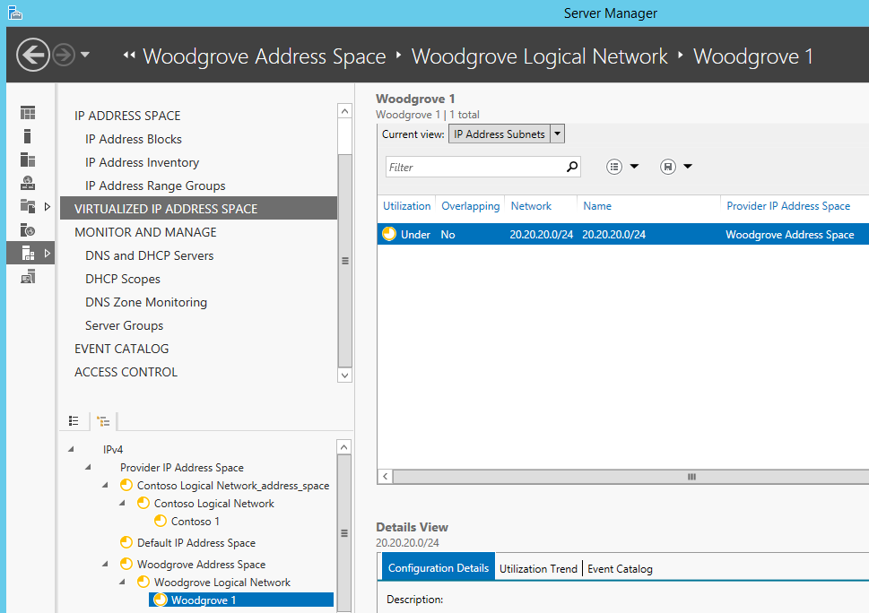

# Synchronize IPAM and VMM
[Deploy IPAM VMM Integration](../Topic/Deploy-IPAM-VMM-Integration.md) > [Configure IPAM VMM Integration](../Topic/Configure-IPAM-VMM-Integration.md) > **Synchronize IPAM and VMM**  
  
Using the IPAM network service with System Center Virtual Machine Manager \(VMM\), virtualized IP address space in IPAM is automatically updated when changes are made to logical networks in VMM. Logical networks are also added to VMM when you create them in IPAM. However, you must specify certain custom fields in IPAM so that the new logical networks can be correctly provisioned in VMM.  
  
For information about adding the IPAM network service to VMM, see [Configure IPAM VMM Integration](../Topic/Configure-IPAM-VMM-Integration.md). The IPAM network service must be configured before performing the procedures in this topic.  
  
Detailed, step by step instructions are provided below for adding a logical network to VMM and then viewing it in IPAM, and for adding a logical network to IPAM with attributes that are required for the logical network to be also added to VMM.  
  
> [!TIP]  
> IPAM can be used to add and manage logical networks on multiple instances of VMM by specifying unique values for the **Managed By** field in IPAM.  
  
See the following sections in this topic:  
  
-   [Add a logical network using VMM](../Topic/Synchronize-IPAM-and-VMM.md#vmm1)  
  
-   [Add a logical network using IPAM](../Topic/Synchronize-IPAM-and-VMM.md#ipam)  
  
Membership in the **Administrators** group, or equivalent, is the minimum required to complete the following procedures. [!INCLUDE[review_details](../Token/review_details_md.md)]  
  
## Add a logical network using VMM  
Use the following procedures to add a logical network using the VMM console and then view the logical network in IPAM.  
  
-   [To create a logical network in VMM](../Topic/Synchronize-IPAM-and-VMM.md#create)  
  
-   [To view VMM logical networks in IPAM](../Topic/Synchronize-IPAM-and-VMM.md#view)  
  
### To create a logical network in VMM  
  
1.  In the **Fabric** workspace, expand the **Networking** node and then click **Logical Networks**.  
  
2.  Right\-click **Logical Networks**, and click **Create Logical Network**.  
  
3.  In the **Create Logical Network Wizard**, next to **Name**, type a name for the logical network, for example **Contoso Logical Network**.  
  
4.  Click **Next**, and under **Network sites**, next to **Network site name**, type a site name, for example **Contoso 1**.  
  
5.  Click **Insert row**, type the network ID under **IP subnet**, for example, **10.10.10.0\/24**, select the **All Hosts** checkbox, click **Next**, and then click **Finish**.  
  
6.  Verify that the new logical network appears in VMM. See the following example.  
  
      
  
### To view VMM logical networks in IPAM  
  
1.  Refresh the IPAM console view, and verify that the new logical network is displayed under **Provider IP Address Space**. See the following example.  
  
      
  
> [!TIP]  
> You can also click **Create IP Pool** to add an IP address range to the logical network and also synchronize it with IPAM. Although an IP address range is required when synchronizing from IPAM to VMM, it is not a requirement to add logical networks from VMM to IPAM.  
  
## Add a logical network using IPAM  
Use the following procedures to add a logical network using the IPAM console and then view the logical network in VMM.  
  
-   [To create a logical network in IPAM](../Topic/Synchronize-IPAM-and-VMM.md#createipam)  
  
-   [To view IPAM logical networks in VMM](../Topic/Synchronize-IPAM-and-VMM.md#viewvmm)  
  
### To create a logical network in IPAM  
  
1.  In the IPAM console, click **VIRTUALIZED IP ADDRESS SPACE** in the upper navigation pane, right\-click **Provider IP Address Space** in the lower navigation pane, and then click **Add IP Address Space**.  
  
2.  In the **Add IP Address Space** dialog box, next to **Name**, type a name for the logical network address space, for example **Woodgrove Address Space**.  
  
3.  Next to **Type of IP address space**, choose **Provider IP Address Space**, and click **OK**.  
  
4.  On the Server Manager menu bar, click **Manage**, click **IPAM Settings**, and then click **Configure Custom Fields**.  
  
5.  Under **Step 1**, scroll through the list of **Custom Field Names** and then click on the built\-in name **VMM Logical Network**. Note: If you have already configured other logical networks, these names will be displayed under **Step 2**.  
  
6.  Under **Step 2**, click the blank line at the bottom of the list under **Custom Field Value**, and type the name for the new logical network, for example **Woodgrove Logical Network**. Note: If you are not able to type spaces in the name, try typing the name without spaces first, and then adding spaces afterward. This is a bug in some versions of IPAM. See the following example.  
  
      
  
7.  Click **OK** and click **OK** again when you are notified that custom field mapping is updated.  
  
8.  Click **Configure Custom Fields** again, and under **Step 1**, click the built\-in custom field of **Network Site**.  
  
9. Under **Step 2**, click the blank line at the bottom of the list under **Custom Field Value** and type the name for the new network site, for example **Woodgrove 1**, and then click **OK** twice.  
  
10. In the **IPAM Settings** dialog box, click **Configure Custom Field Associations**.  
  
11. Under **Custom field association list**, if **VMM Logical Network** is already associated to **Network Site**, click **VMM Logical Network** and then click **Edit**.  
  
12. If **VMM Logical Network** is not currently displayed under **Custom field association list**, click **New** and then choose **VMM Logical Network** under **Custom Field 1** and choose **Network Site** under **Custom Field 2**. Select the appropriate associations for each field, and then click **Add Association**.  
  
13. The following example displays how to edit the VMM Logical Network\/Network Site association to add a new association for Woodgrove after an association for Contoso is already configured. To edit the custom field association, click **Update Association**.  
  
      
  
14. Click **OK**, and then click **Close**.  
  
15. In the IPAM console lower navigation pane, right\-click the name of the new address space, for example: **Woodgrove Address Space**, and click **Edit IP Address Space**.  
  
16. Click **Custom Configurations**, next to **Custom field**, choose **VMM Logical Network**, next to **Value** choose the logical network value that you created, for example **Woodgrove Logical Network**, and click **Add**.  
  
17. Next to **Custom field**, choose **Network Site**, next to **Value** choose the network site value that you created, for example **Woodgrove 1**, click **Add** and then click **OK**. See the following example  
  
      
  
18. In the lower navigation pane, right\-click the provider IP address space, for example, **Woodgrove Address Space**, and click **Add IP Address Subnet**.  
  
19. Next to **Name**, type a name for the subnet, for example **20.20.20.0\/24**.  
  
20. Next to **Network ID**, type the network ID for the subnet, for example **20.20.20.0**.  
  
21. Next to **Prefix length**, type the number of bits in the subnet mask, for example 24.  
  
22. Under **IP Address Subnet Virtualization Properties**, choose **Provider** and select the appropriate address space next to **Provider IP address space**, for example **Woodgrove Address Space**.  
  
23. Next to **Logical Network** and **Network site**, choose the logical network and network site values you specified, for example **Woodgrove Logical Network** and **Woodgrove 1**.  
  
24. Under **Custom Configurations**, next to **Custom field**, choose **Managed by Service** and next to **Value** choose **VMM**, then click **Add**.  
  
25. Next to **Custom field**, choose **Service Instance** and next to **Value** choose the FQDN of the server running VMM, for example **scvmm1.contoso.com**, click **Add** and then click **OK**.  
  
26. Verify that the subnet is displayed in the IPAM console display pane under the correct provider address space, VMM logical network, and network site. See the following example.  
  
      
  
27. In the lower navigation pane, right\-click the network site, for example **Woodgrove 1**, and then click **Add IP Address Range**.  
  
28. Next to Network ID, type the network ID, for example 20.20.20.0.  
  
29. Next to Prefix length, type the network prefix length, for example 24.  
  
30. Next to Managed by service, select VMM.  
  
31. Next to Service instance, select the FQDN of the server running VMM, for example scvmm1.contoso.com.  
  
32. Next to Use IP address range for, choose Provider.  
  
33. Next to Provider IP address space, choose the appropriate address space, for example Woodgrove Address Space.  
  
34. Click OK and verify that the IP address range was added by choosing IP Address Ranges next to Current view in the I{PAM console display pane.  
  
### To view IPAM logical networks in VMM  
  
1.  In the **Fabric** workspace, expand the **Networking** node and then click **Network Service**.  
  
2.  Under **Network Services**, right\-click the IPAM network service and then click **Refresh**.  
  
3.  Verify that the logical network is created and displayed in VMM. See the following example.  
  
      
  
## See also  
[Install IPAM Server](../Topic/Install-IPAM-Server.md)  
  
