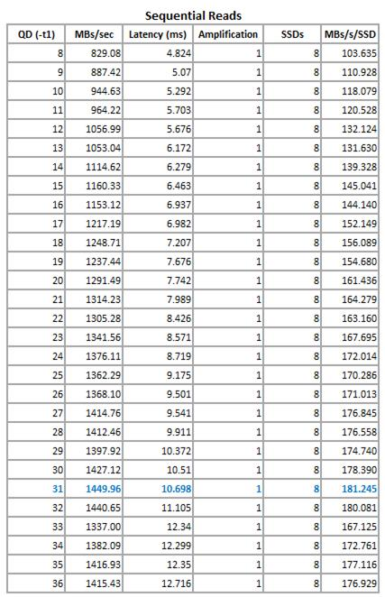

# Test Storage Spaces Performance Using Synthetic Workloads in Windows Server
How do you know what level of performance to expect from your tiered storage spaces in Windows Server, and how can you tell whether the storage tiers are delivering the needed performance after you deploy your workloads? This topic describes how to run a series of performance tests against synthetic workloads, using DiskSpd.exe, to get a performance baseline for a newly created storage space, and how to monitor and tune performance during phased workload migration to make sure that the storage tiers are providing the performance that the workloads require. Procedures include the monitoring and test setup, testing, and performance tests conducted on random small I\/Os and sequential large I\/Os.  
  
> [!NOTE]  
> -   Sample performance data and recommendations are presented as an example. Performance results will differ for each storage solution.  
> -   Tests are designed for a tiered storage space on a clustered file server that is configured as a scale\-out file server \(SOFS\) in [!INCLUDE[winblue_server_2](../Token/winblue_server_2_md.md)].  
  
## In this topic  
  
-   [Overview of the performance tests](#BKMK_TestOverview)  
  
-   [Before you run a DiskSpd test](#BKMK_BeforeYouRunDiskSpd)  
  
-   [Step 1: Prepare a virtual machine to use for testing](#BKMK_PrepareTestVM)  
  
-   [Step 2: Prepare monitoring tools](#BKMK_PrepareMonitoringTools)  
  
-   [Step 3: Run DiskSpd trial runs, and tune DiskSpd parameters](#BKMK_DiskSpdTestRuns)  
  
-   [Step 4: Test random small I\/O performance using DiskSpd](#BKMK_RandomIOTests)  
  
-   [Step 5: Test sequential large I\/O performance using DiskSpd](#BKMK_SequentialIOTests)  
  
-   [Step 6: Begin phased migrations of workloads to the new storage space](#BKMK_BeginPhasedMigrations)  
  
-   [Additional resources](#BKMK_AdditionalResources_SpacePreTests)  
  
## <a name="BKMK_TestOverview"></a>Overview of the performance tests  
When you test the performance of a newly created tiered storage space, your goal should be to baseline ideal storage tiers performance by testing the performance of the SSD tier only. For optimal performance, the SSD tier should be large enough to accommodate the entire working set \(all active data\) of workloads that use the space. That ensures that your faster SSDs will process all or most I\/O, with minimal I\/O performed on the slower but less expensive hard disk drives \(HDDs\), which are intended for storing "cold," inactive data.  
  
Storage Tiers Optimization, which is performed at 1:00 a.m. nightly by default, attempts to maintain that balance by moving the active \(“hot”\) data to the SSD tier and moving inactive \("cool"\) data off the SSD tier to less expensive hard disk drives based on I\/O activity since the last tiers optimization. If you’re not familiar with this process, see [Monitor Storage Tiers Performance in Windows Server 2012 R2](../Topic/Monitor-Storage-Tiers-Performance-in-Windows-Server-2012-R2.md) for an overview. You can also pin critical files to the SSD tier to ensure that all processing is performed on the SSDs.  
  
In the real world, you’re not likely to maintain the entire working set on your SSD tier, but you can get close. By finding out how fast the storage space can perform when all I\/O is processed by the SSD tier, you can get a baseline against which to gauge performance as you migrate workloads to the space. During a phased migration, the Storage Tier Optimization Report can provide diagnostics for determining the SSD tier capacity and Storage Tiers Optimization frequency needed to meet performance requirements of the workloads.  
  
> [!NOTE]  
> There's really no way to accurately predict performance of both the SSD tier and the HDD tier working together by using a synthetic workload. For that, you will need to use the Storage Tier Optimization Report and monitor performance counters for Storage Spaces, including those for the Storage Tiers object and the Storage Write Cache object, to characterize daily activity of the deployed workloads as they become stable and predictable.  
  
### <a name="BKMK_TestDesign"></a>The test design  
  
-   The DiskSpd.exe command\-line tool is used to test the performance of a synthetic workload in a new storage space. DiskSpd provides flexible options for emulating performance behavior of synthetic random or sequential workloads. It can be used to test the performance of physical disks, partitions, or files in a storage subsystem. For more information, see the [DiskSpd download page](https://gallery.technet.microsoft.com/DiskSpd-a-robust-storage-6cd2f223) at http:\/\/aka.ms\/diskspd. Additional DiskSpd documentation, in both .docx and .pdf formats, is downloaded with the DiskSpd tool. \(Be sure to use DiskSpd version 2.0.15 or later to get improved multithread testing of sequential I\/O processing. It's a good idea always to install the latest release before you run DiskSpd tests.\)  
  
-   Procedures are provided to test performance of random small I\/O Read and Writes characteristic of Online Transaction Processing \(OLTP\) workloads. We’ll also explain how to run additional DiskSpd tests to test performance of sequential large I\/O Reads and Writes typical of reporting and Online Analytical Processing \(OLAP\) workloads.  
  
    > [!NOTE]  
    > -   For design decisions specific to random small I\/O processing, see [Random small I\/O test design](#BKMK_RandomTestDesign). For design decisions specific to sequential large I\/O processing, see [Sequential large I\/O test design](#BKMK_SequentialTestDesign).  
    > -   DiskSpd parameters in the test procedures are based on general behavior characteristics of these types of workloads. The more you know about the workloads you plan to migrate—the performance characteristics of established workloads in their current environment, the capabilities and limitations of the apps—the better you can tailor the DiskSpd tests to your own requirements. To view comprehensive information on all DiskSpd parameters, use the `DiskSpd.exe /?` command or the DiskSpd documentation downloaded with the tool.  
  
-   To provide enough data to fully exercise the underlying SSDs, DiskSpd will create a 64 GB data file, the size of an average virtual machine. To ensure that file\-level contention does not impose unnecessary performance limits, we include a test that varies the number of data files \([Pre\-Test 2](#BKMK_Pre-Test_FileSize)\), with guidance for adapting the number of data files, file size, and threads per file to take full advantage of your system’s capabilities.  
  
-   To exercise all layers of the storage stack during testing, the tests are run on a virtual machine deployed to the storage space.  
  
-   We test the performance of the SSD tier only, to find out the high end of potential performance of a tiered storage space. To ensure that all I\/O from the tests is processed on the SSD tier, the VHDX file for the test machine is pinned to the SSD tier, and Storage Tiers Optimization is run to move the entire file to the SSD drives.  
  
-   To get accurate performance data for the SSD drives, each run of the DiskSpd command includes a 5\-minute warmup time followed by 10 minutes of data collection. If you shorten the warmup time, you might be observing SSD drive initialization, before the drives reach a steady state. And, of course, the longer the sampling period, the greater the reliability of your results will be and the less variability if you repeat a test.  
  
> [!NOTE]  
> To give you a point of comparison when you test SSD tier performance, if possible, run the same DiskSpd tests against one of the SSDs to test the performance capabilities of an SSD drive. That will tell you the top performance that the physical disks are capable of for the same synthetic workload, without the overhead introduced by each additional layer of the storage stack. You can do this before you create the storage pool, you can remove a disk from the pool for testing, or you can test an extra SSD of the same model.  
  
### <a name="BKMK_TestEnvironment"></a>The test environment  
Our tests are run on a clustered file server configured as a scale\-out file server \(SOFS\), with the configuration described in the following table. You will see references to these configurations in the procedures.  
  
### Table 1: Example storage space configuration used in tests  
  
|Configuration|Example deployment|  
|-----------------|----------------------|  
|Clustered file server|**Clustered file server:** FSCluster<br /><br />**Cluster nodes:** FS01, FS02<br /><br />**Owner node for the storage space:** FS02|  
|Storage pool|**Storage Pool:** Pool1|  
|Storage space|**Storage space:** TenantDisk1<br /><br />**Resiliency:** 2\-Way Mirror<br /><br />**Storage tiers:**<br /><br />-   **SSD tier:** TenantDisk1\_HDDTier \(backed by 8 SDD disks\)<br />-   **HDD tier:** TenantDisk1\_SSDTier \(backed by 16 hard disk drives\)|  
|CSV|**SOFS volume:** C:\\ClusterStorage\\Volume3<br /><br />**CSV share for the virtual disk:** \\\\SOFS.contoso.com\\TenantDisk1\\|  
|Test VM|**Virtual machine:** STORE\-TEST1<br /><br />**VM location:**<br /><br />-   **UNC path:** \\\\SOFS.contoso.com\\TenantDisk1\\STORE\-TEST1\\Virtual Hard Disks\\STORE\-TEST1.vhdx<br />-   **Local path \(on FS02\):** C:\\ClusterStorage\\Volume3\\Shares\\TenantDisk1\\STORE\-TEST1\\Virtual Hard Disks\\STORE\-TEST1.vhdx|  
  
### Prerequisites  
Before you prepare for the DiskSpd tests, we assume that you already have a new storage space that you want to test, and that you have completed the following tasks:  
  
-   **Deploy your storage system, and validate hardware performance**—For design guidance for deploying a scalable storage unit that uses Storage Spaces on a Hyper\-V\-based clustered file server, see [Provide cost\-effective storage for Hyper\-V workloads by using Windows Server: planning and design guide](assetId:///3314f967-8a2c-48c6-bfc7-3137cc30a075).  
  
-   **Add a storage pool on the clustered file server, and create the storage space**—For these tests, the pool must contain SSDs, and the storage space must contain tiers. Two methods are available for creating a storage pool and storage space on a clustered file server:  
  
    -   [Create a clustered storage space in Failover Cluster Manager](https://technet.microsoft.com/library/jj822937.aspx). In the process, you will create a storage pool that contains the physical SSD and HDD drives, then create a cluster storage space \(virtual disk\), and create a volume for the virtual disk.  
  
    -   [Create a storage pool and add a storage space through File and Storage Services](https://technet.microsoft.com/library/jj822937.aspx#BKMK_Step3), and then [add the space to the cluster when you create a new cluster in Failover Cluster Manager](https://technet.microsoft.com/library/jj822937.aspx#BKMK_Step4).  
  
    > [!NOTE]  
    > With either method, to create a *tiered* storage space, select **Create storage tiers on this virtual disk** on the **Virtual Disk Name** page. On the **Size** page, you will specify how much capacity to allocate to each tier individually.  
  
-   **Add the storage space \(virtual disk\) to a cluster shared volume \(CSV\) on the scale\-out file server \(SOFS\)**—The CSV creates a unified namespace \(under C:\\ClusteredStorage\) that enables highly available workloads to transparently fail over to another cluster node if a server fails or is taken offline. For example, for the storage space TenantDisk1 in the Pool1 storage pool, you might create the share C:\\ClusteredStorage\\Pool1\\TenantDisk1. [How to add the virtual disk for the storage space to a CSV volume](https://technet.microsoft.com/library/jj822937.aspx#BKMK_Step6). \(In Failover Cluster Manager, a virtual disk is referred to as a "cluster disk."\)  
  
## <a name="BKMK_BeforeYouRunDiskSpd"></a>Before you run a DiskSpd test  
Before you run performance tests, using DiskSpd or any other tool, you should verify the health of the storage space and storage pool, and you should make sure that resource usage from other sources on the file server, storage spaces, or test machine will not skew the performance data. You should also schedule the tests, and let other people whose work might be affected know when to expect it.  
  
Here's a list of things to check:  
  
-   Schedule the tests, and notify users who might be affected—If you're running the tests in a production environment, and workloads are already deployed on the file server, schedule the tests during a period of low resource usage, and notify anyone who might experience reduced performance during testing of the test schedule and duration.  
  
-   On the file server:  
  
    -   [Verify SSD tier capacity](#BKMK_VerifySSDCapacity)—Make sure there’s enough available capacity on the SSD tier to store the test files.  
  
        If you're testing a large space with storage for lots of virtual machines, this won’t be a concern. However, if you're just clicking through the tests to get familiar with the process, an SSD capacity limitation might catch you off\-guard. You'll run the tests against 64 GB of data. The tests will generate multiple copies of the data based on the resiliency setting for the storage space. In a two\-way mirror space, two data copies are maintained, so a 64 GB test file will consume 128 GB on the SSD tier; 3\-way mirror resiliency requires 64 GB x 3.  
  
        If your SSD tier capacity is limited, be sure to delete old test files to make room for the new ones if you change the name, location, or number of test files during testing.  
  
    -   Verify that the test VM is pinned to the SSD tier—For the current tests of SSD tier performance, you also need to verify that the test virtual machine is pinned to the SSD tier and the entire VHDX file has been moved to the SSDs. [How to pin the VHDX file to the SSD tier](#BKMK_PinVHDX)  
  
    -   [Verify the health of the storage pool and the storage space](#BKMK_VerifyStorageSpaceHealth)—You can do this in File and Storage Services \(in Server Manager\) or use [!INCLUDE[wps_2](../Token/wps_2_md.md)] cmdlets.  
  
    -   [Make sure scheduled tasks won't run during the test](#BKMK_CheckScheduledTasks)—In Task Scheduler \(in Server Manager\), check the status and next scheduled run for the **Storage Tiers Optimization** and **Data Integrity Scan** tasks. Then check for other active tasks before you start a DiskSpd test.  
  
    -   Work around scheduled backups—Check your backup app to make sure no backups are scheduled for the test period.  
  
-   Check resource usage—Use Resource Manager \(in Server Manager\) on the file server and on the test VM to make sure no running processes are placing an unusual load on the CPU, network connections, or storage.  
  
-   Optionally prepare Performance Monitor \(in Server Manager\) to collect additional data during the tests:  
  
    -   To monitor performance in Performance Monitor during the DiskSpd test, add the performance counters to the monitoring display. [Configure the Performance Monitor display](https://technet.microsoft.com/library/cc722300.aspx)  
  
    -   To collect additional performance data during a DiskSpd test, start the data collector set in Performance Monitor immediately before you run the test. Then don't forget to stop data collection after the DiskSpd test completes. [Create a data collector set in Performance Monitor](https://technet.microsoft.com/library/cc749337.aspx)  
  
> [!NOTE]  
> This series of DiskSpd tests are designed to get a baseline for potential performance of a storage space in a new storage pool, before you deploy workloads to any spaces in the pool. If you're testing under other conditions, you should make additional checks. For example, shut down any other virtual machines deployed to the storage space. If the pool contains other storage spaces, run the DiskSpd tests when usage is low for workloads deployed to those spaces. And it's a good idea to run Storage Tiers Optimization before you start testing to ensure that active \("hot"\) data has been moved to the SSD tier.  
  
### Procedures  
This section provides procedures for less familiar tasks in the checklist.  
  
#### <a name="BKMK_VerifySSDCapacity"></a>Verify SSD tier capacity  
To run the DiskSpd tests, you need enough available capacity on the SSD tier to store all copies that are generated of the 64 GB test file. For example, with two\-way mirror resiliency, two copies are stored.  
  
###### To find out the capacity of the SSD tier  
  
-   **To find out the capacity of the SSD tier in Server Manager, File and Storage Services:** Open the properties of the virtual disk \(for example, Space01\), and verify SSD capacity on the **General** tab.  
  
      
  
-   **To find out the capacity of the SSD tier using [!INCLUDE[wps_2](../Token/wps_2_md.md)]:** Run the following commands:  
  
    ```powershell  
    Get-StorageTier -VirtualDisk (Get-VirtualDisk -FriendlyName <storagespacename>) | Format-Table -Property FriendlyName,MediaType,Size -AutoSize  
    ```  
  
    Sample output:  
  
**PS C:\\Users\\Administrator.CONTOSO> Get\-StorageTier \-VirtualDisk \(Get\-VirtualDisk \-FriendlyName TenantDisk1\) | Format\-Table \-Property FriendlyName,MediaType,Size \-AutoSizeFriendlyName                  MediaType                Size\-\-\-\-\-\-\-\-\-\-\-\-                  \-\-\-\-\-\-\-\-\-                \-\-\-\-TenantDisk1\_SSDTier           SSD              133143986176TenantDisk1\_HDDTier           HDD             1391569403904**  
  
If you're short of SSD capacity for the test, you can [expand the SSD tier capacity on the storage space](https://technet.microsoft.com/library/dn789160.aspx#BKMK_WatchSSDCapacity).  
  
#### <a name="BKMK_VerifyStorageSpaceHealth"></a>Verify the health of the storage pool and storage space  
[Do this in Windows PowerShell](#BKMK_PowerShell_VerifyStorageHealth)  
  
###### To verify the health of storage pools and storage spaces in Server Manager  
  
1.  On the file server, open **Server Manager** > **File and Storage Services**.  
  
2.  To verify the health of the storage pool, go to **Volumes** > **Storage Pools**, and check the status of the pool that contains the storage space \(Pool1 in the test environment\).  
  
3.  To verify the health of the storage space:  
  
    1.  Click the storage pool to select it.  
  
    2.  Under **VIRTUAL DISKS**, open the properties of the storage space \(virtual disk\) that you will test \(for example, TenantDisk1\).  
  
    3.  On the **Health** tab, verify the health status and operational status of the space.  
  
##### <a name="BKMK_PowerShell_VerifyStorageHealth"></a>To verify the health of storage pools and storage spaces in Windows PowerShell  
  
-   To find out storage pool health, run this command:  
  
    ```powershell  
    Get-StoragePool –FriendlyName <StoragePoolFriendlyName>  
    ```  
  
-   To find out storage space health, run this command:  
  
    ```powershell  
    Get-VirtualDisk –FriendlyName <StorageSpaceFriendlyName>  
    ```  
  
#### <a name="BKMK_CheckScheduledTasks"></a>Make sure scheduled tasks won't run during the test  
To get the task status and the next run time, you can either use Task Scheduler in Server Manager or Windows PowerShell.  
  
Two scheduled tasks are particularly important: **Storage Tiers Optimization**, which by default runs daily at 1:00 a.m., and **Data Integrity Scan**, which by default runs once monthly and also is initiated by system restarts.  
  
[Do this in Windows PowerShell](#BKMK_CommandLine_CheckTasks)  
  
###### To find out the status of Storage Tiers Optimization and other tasks in Task Scheduler  
  
1.  In **Server Manager**, open **Task Scheduler** \(on the **Tools** menu\).  
  
2.  In the Task Scheduler console tree, expand **Task Scheduler Library** > **Microsoft** > **Windows**.  
  
3.  Check the status and schedule for both tasks:  
  
    1.  Expand **Storage Tiers Management**. Then, in the task list \(shown below\), make sure the status of **Storage Tiers Optimization** is **Ready**, the last run completed successfully, and the next run time gives you time to complete your DiskSpd tests.  
  
          
  
    2.  Do the same for the **Data Integrity Scan** task in the task group by the same name.  
  
4.  To check other running tasks, on the **Tasks** pane, click **View running tasks**.  
  
##### <a name="BKMK_CommandLine_CheckTasks"></a>To find out the status and run times for scheduled tasks in Windows PowerShell  
  
1.  Open Windows PowerShell as an administrator.  
  
2.  If needed, open a Windows PowerShell session on the file server by running the following command. Substitute any node of your clustered file server for FS02.  
  
    ```powershell  
    Enter-PSSession -ComputerName FS02  
    ```  
  
3.  To find out the status of all scheduled tasks that are either running or queued to run, run this script:  
  
    ```powershell  
    Get-ScheduledTask |   
    Where-Object {$_.State -EQ "Running" -OR $_.State -eq "Queued"}  
    ```  
  
    Sample output:  
  
**PS C:\\WINDOWS\\system32> Get\-ScheduledTask | Where\-Object {$\_.State \-EQ "Running" \-OR $\_.State \-eq "Queued"}TaskPath                                       TaskName                          State     \-\-\-\-\-\-\-\-                                       \-\-\-\-\-\-\-\-                          \-\-\-\-\-  \\Microsoft\\Windows\\SpacePort\\                  SpaceAgentTask                    Running\\Microsoft\\Windows\\TextServicesFramework\\      MsCtfMonitor                      Running   \\Microsoft\\Windows\\Wininet\\                    CacheTask                         Running**  
  
4.  To find out the next scheduled run for all scheduled tasks that have not been disabled, run the following script:  
  
    ```  
    Get-ScheduledTask |   
    Where-Object -Property State -NE disabled |  
    Get-ScheduledTaskInfo |  
    Sort-Object -Property LastRunTime,NextRunTime |  
    Format-Table -Property TaskName,NextRunTime,LastRunTime,LastTaskResult,NumberOfMissedRuns –AutoSize  
    ```  
  
    On a clustered file server, this command returns a long list of tasks. Check the next run time for the **Storage Tiers Optimization** and **Data Integrity Scan** tasks and any other long\-running tasks that might affect the performance tests.  
  
## <a name="BKMK_PrepareTestVM"></a>Step 1: Prepare a virtual machine to use for testing  
In order to engage all layers of the storage stack during testing, you will run the tests on a virtual machine deployed to the storage space. To test performance of the SSD tier only, you will pin the virtual hard disk for the virtual machine to the SSD tier, and perform Storage Tiers Optimization to move the entire file to the SSD drives. Then you'll install DiskSpd on the virtual machine.  
  
-   [Deploy a virtual machine to the storage space](#BKMK_DeployTestVM)  
  
-   [Pin and move the virtual hard disk to the SSD tier](#BKMK_PinVHDX)  
  
-   [Install the DiskSpd tool on the virtual machine](#BKMK_InstallDiskSpd)  
  
### <a name="BKMK_DeployTestVM"></a>Deploy a virtual machine to the storage space  
Your next step is to deploy a new virtual machine to the storage space to use for testing. There are few requirements for the test VM, but we’ll offer these recommendations.  
  
-   **Operating system**—We're using a virtual machine with the [!INCLUDE[winblue_server_2](../Token/winblue_server_2_md.md)] operating system. If you install a different operating system, just make sure you use the version of DiskSpd that supports the chosen operating system during testing. For more information, see [Install DiskSpd on the virtual machine](#BKMK_InstallDiskSpd), later in this topic.  
  
-   **Multiple CPUs**—Configure multiple CPUs to allow more concurrent threads during testing \(we're using a VM with 8 CPUs\). This also enables you to check for CPU bottlenecks during testing.  
  
-   **Fixed disk format for the VHDX file**—To eliminate the overhead created by a dynamic virtual hard disk during testing, use a VM with a fixed virtual hard disk for testing.  
  
-   **VHDX file location \(requirement\)**—Locate the virtual hard disk file on the CSV share that you created for the storage space—for example, \\\\SOFS.contoso.com\\TenantDisk1\\. If you need to create the share, see the procedure for adding a cluster disk to a CSV in [Deploy Clustered Storage Spaces](https://technet.microsoft.com/library/jj822937.aspx).  
  
### <a name="BKMK_PinVHDX"></a>Pin and move the virtual hard disk to the SSD tier  
Next, you will pin \(assign\) the VHDX file for the test machine to the SSD tier, and then run Storage Tiers Optimization to move the file to the SSD drives.  
  
On a stand\-alone file server, you can pin a file, move it, and then verify the move simply by running three [!INCLUDE[wps_2](../Token/wps_2_md.md)] commands:  
  
```powershell  
Set-FileStorageTier -FilePath <filepath> -DesiredStorageTierFriendlyName <tierfriendlyname>  
Get-ScheduledTask -TaskName "Storage Tiers Optimization" | Start-ScheduledTask  
Get-FileStorageTier -VolumeDriveLetter <driveletter>  
```  
  
On a scale\-out file server, you can use the SMBStorageTier1.ps1 script to identify the owner node for the storage space and the local path to the file that you want to pin. You only need to provide the UNC path for the VHDX file and the media type of the desired storage tier \(in this case, **SSD**\). The script will pin the file and then perform Storage Tiers Optimization to move the file to the SSD drives. You can also use the script to find out the placement status of pinned files.  
  
> [!NOTE]  
> For more information about the script, see the blog entry [SMBStorageTier.ps1: A simple way to pin files to tiers in Scale\-Out File Servers](http://blogs.technet.com/b/josebda/archive/2014/10/18/smbstoragetier-ps1-a-simple-way-to-pin-files-to-tiers-in-scale-out-file-servers.aspx).  
  
##### To pin the VHDX file to the SSD tier on a scale\-out file server  
  
1.  [Download the SmbStorageTier.ps1 script](https://gallery.technet.microsoft.com/scriptcenter/SmbStorageTierps1-A-simple-934c0f22) to the file server. You can run the script from any node of a scale\-out file server. However, since we’ll need to perform other tasks from the owner node for the storage space \(in our case, FS02\), we downloaded the script to the root directory of the owner node.  
  
2.  On the file server, open [!INCLUDE[wps_2](../Token/wps_2_md.md)] as an administrator.  
  
3.  To pin the file to the SSD tier by using the SMBStorageTier.ps1 script, run the following command, substituting the UNC path to the virtual hard disk for your test VM for the path provided here:  
  
    ```powershell  
    .\SMBStorageTier.ps1 –PinFile "\\SOFS1.contoso.com\TenantDisk1\STORE-TEST1\Virtual Hard Disks\STORE-TEST1.vhdx" –MediaType ssd  
    ```  
  
    Based on the UNC path, the script identifies the local path and storage space \(virtual disk\). It then uses the media type to get the storage tier friendly name. After pinning \(assigning\) the file to the SSD tier, the script runs Storage Tiers Optimization to move the file to the SSD drives that back the tier.  
  
    Sample output:  
  
**PS C:\\> .\\SMBStorageTier.ps1 –PinFile "\\\\SOFS1.contoso.com\\TenantDisk1\\STORE\-TEST1\\Virtual Hard Disks\\STORE\-TEST1.vhdx" –MediaType ssdInput parametersFile to pin: \\\\SOFS1.CONTOSO.COM\\TENANTDISK1\\STORE\-TEST1\\VIRTUAL HARD DISKS\\STORE\-TEST1.VHDXMedia type: SSDCalculated parametersLocal file path: C:\\ClusterStorage\\Volume3\\SHARES\\TENANTDISK1\\STORE\-TEST1\\VIRTUAL HARD DISKS\\STORE\-TEST1.VHDXNode owning the volume: FS02Tier Name: TenantDisk1\_SSDTierExecuting command:Set\-FileStorageTier \-CimSession FS01 \-FilePath C:\\ClusterStorage\\Volume3\\SHARES\\TENANTDISK1\\STORE\-TEST1\\VIRTUAL HARD DISKS\\STORE\-TEST1.VHDX –DesiredStorageTierFriendlyName TenantDisk1\_SSDTier**  
  
4.  To verify that the entire file has moved to the SSD drives, use the SMBStorageTier script again, substituting the share path for your virtual disk:  
  
    ```powershell  
    .\SMBStorageTier.ps1 -ReportShare "\\SOFS1.contoso.com\TenantDisk1\"  
    ```  
  
    A **PlacementStatus** of **Completely on tier** indicates that all data has moved to the SSD drives.  
  
    Sample output:  
  
**PS C:\\> .\\SMBStorageTier.ps1 \-ReportShare "\\\\SOFS1.contoso.com\\TenantDisk1\\"Input parameterShare Name: \\\\SOFS1.CONTOSO.COM\\TENANTDISK1\\Calculated parametersVolume behind the share: \\\\?\\Volume{4abeee8b\-b42a\-465e\-9e41\-d3a38b691642}\\Node owning the volume: FS02Executing command:Get\-FileStorageTier –CimSession FS01 –VolumePath \\\\?\\Volume{4abeee8b\-b42a\-465e\-9e41\-d3a38b691642}\\ | Select \*PlacementStatus              : Completely on tierState                        : OKDesiredStorageTierName       : TenantDisk1\_SSDTierFilePath                     : C:\\ClusterStorage\\Volume3\\Shares\\TenantDisk1\\STORE\-TEST1\\Virtual Hard Disks\\STORE\-TEST1.vhdxFileSize                     : 12117344256FileSizeOnDesiredStorageTier : 12117344256PSComputerName               : FS01CimClass                     : ROOT\/Microsoft\/Windows\/Storage:MSFT\_FileStorageTierCimInstanceProperties        : {DesiredStorageTierName, FilePath, FileSize, FileSizeOnDesiredStorageTier...}CimSystemProperties          : Microsoft.Management.Infrastructure.CimSystemProperties**  
  
### <a name="BKMK_InstallDiskSpd"></a>Install DiskSpd on the virtual machine  
Next, [install the DiskSpd.exe tool](https://gallery.technet.microsoft.com/DiskSpd-a-robust-storage-6cd2f223) \(at http:\/\/aka.ms\/diskspd\) on the virtual machine that you will use for the test. You’ll download a ZIP file that contains separate folders for three versions of DiskSpd: amd64fre \(for 64\-bit systems\), x86fre \(for 32\-bit systems\) and armfre \(for ARM systems\). To run a test on a server running [!INCLUDE[winblue_server_2](../Token/winblue_server_2_md.md)], you only need to download the amd64fre folder. For our tests, we downloaded all three DiskSpd versions to the C:\\DiskSpd\\ folder on the STORE\-TEST1 test machine.  
  
For detailed information about using DiskSpd, see the DiskSpd documentation, which is downloaded in both .docx and .pdf formats with the tool.  
  
> [!IMPORTANT]  
> DiskSpd is an open\-source tool that is being continuously improved by the DiskSpd community. DiskSpd users should check the [DiskSpd download page](https://gallery.technet.microsoft.com/DiskSpd-a-robust-storage-6cd2f223) regularly for the latest version of the tool.  
  
## <a name="BKMK_PrepareMonitoringTools"></a>Step 2: Prepare monitoring tools  
  
-   **Install the November 2014 update rollup for Windows Server 2012 R2**—To get performance counters for storage tiers \(Tiers object\) and the write\-back cache \(WriteCache object\) for your storage spaces, [install the November 2014 rollup for Windows Server 2012 R2 \(KB 3000850\)](http://support.microsoft.com/kb/3000850/).  
  
-   **Update the Storage Tiers Optimization task to save a report**—This is a useful report that gives you visibility into the performance of both the SSD tier and the HDD tier, providing information that you can use to tune the configuration after you start migrating workloads to the storage space. By default, the task does not save a report during its nightly run. See [Save a report when Storage Tiers Optimization runs](https://technet.microsoft.com/library/dn789160.aspx#BKMK_HOW_SaveReport) for instructions for updating the task to save a report.  
  
-   **Prepare Performance Monitor for monitoring and data collection \(optional\)**—DiskSpd will return a summary of the key performance counters that you need to evaluate optimal queue depth for your storage space. However, to evaluate storage performance at greater depth during testing, we recommend that you use Performance Monitor along with DiskSpd:  
  
    -   Add performance counters to watch during the DiskSpd tests to the Performance Monitor display. [Configure the Performance Monitor display](https://technet.microsoft.com/library/cc722300.aspx)  
  
    -   Add a data collector set to collect additional data from other layers of the storage stack during testing. [Create data collector sets in Performance Monitor](https://technet.microsoft.com/library/cc749337.aspx)  
  
## <a name="BKMK_DiskSpdTestRuns"></a>Step 3: Run DiskSpd trial runs, and tune DiskSpd parameters  
Before you begin the tests on random small I\/O processing, we recommend a little pre\-testing to get familiar with the tool and make any adjustments to DiskSpd parameters that are needed for your storage space:  
  
-   [Pre\-Test 1](#BKMK_Pre-Test_Standalone): Run a stand\-alone DiskSpd command to get familiar with the tool.  
  
-   [Pre\-Test 2](#BKMK_Pre-Test_FileSize): Run some simple tests to determine how many data files to test to get optimal performance on your storage system.  
  
### <a name="BKMK_Pre-Test_Standalone"></a>Pre\-Test 1: Run a stand\-alone DiskSpd command  
Before you start the scripted tests, we recommend that you run a single DiskSpd command to get familiar with the DiskSpd parameters and the output that is available. The DiskSpd settings that we are using in this test emulate a typical OLTP workload, with some good guesses about optimal queue depth that will be tested later in the random small I\/O performance tests. The procedure provides end\-to\-end instructions, including some optional steps \(such as adding Performance Monitor to the routine\) and understood requirements \(such as administrator rights on the test machine\), that we'll leave to you in future tests.  
  
##### To run a DiskSpd test  
  
1.  If you haven’t already installed DiskSpd on the test virtual machine, [install DiskSpd now](#BKMK_InstallDiskSpd).  
  
2.  Before you begin the DiskSpd test, verify storage health and resource usage on the file server and test machine. For details, see [Before you run a DiskSpd test](#BKMK_BeforeYouRunDiskSpd).  
  
3.  If you plan to collect performance data in Performance Monitor during the DiskSpd test \(for example, the virtual disk and SMB server share on the file server\), start the data collector set. \(In Performance Monitor, go to **Performance** > **Data Collector Sets** > **User Defined**. Right\-click your data collector set, and then click **Start**.\)  
  
4.  Connect to the virtual machine you'll use for the DiskSpd test with an account that has administrator rights on the computer.  
  
5.  Open [!INCLUDE[wps_2](../Token/wps_2_md.md)] as an administrator.  
  
    > [!NOTE]  
    > By running DiskSpd from an elevated Windows PowerShell session, you can ensure fast file creation, which is important when working with very large test files. Without administrator rights, DiskSpd uses a slower method to create test files.  
  
6.  Run DiskSpd with the following parameters to test random small I\/O with a ratio of 30 percent Writes to 70 percent Reads, which emulates the behavior of an OLTP workload. Table 2 describes each parameter. If you’re not using a virtual machine with a 64\-bit edition of Windows Server, use the path to the appropriate DiskSpd .exe file. [Which DiskSpd edition should I use?](#BKMK_InstallDiskSpd)  
  
    ```  
    c:\diskspd\amd64fre\diskspd.exe -r -w30 -d600 -W300 -b8K -t8 –o15 -h -L -Z1M -c64G C:\test1.dat  
    ```  
  
    ### Table 2: DiskSpd parameters for the pre\-test  
  
    |DiskSpd parameter|Description|  
    |---------------------|---------------|  
    |`-r –w30`|Tests random I\/O \(`-r`\), with a ratio of 30 percent Writes \(`-w30`\) to 70 percent Reads to emulate typical OLTP workload behavior.|  
    |`-d 600 –W300`|Sets a test \(data collection\) duration of 10 minutes \(`-d600`\) after a 5\-minute warmup period \(`-W300`\). For tests run against SSDs, the warmup period is needed to get internal device management to a near\-steady state before data collection begins. This is important for both Write and Read tests.|  
    |`-b8k`|Sets a block size of 8 KB \(`-b8k`\), a page size representative of both Microsoft SQL Server and Hyper\-V virtual machines.|  
    |`-t8 –o12`|Creates 8 threads per file \(`-t8`\), with 12 outstanding I\/O operations per thread \(`-o12`\).|  
    |`-h`|Disables software caching and hardware write caching—equivalent to opening a file with the FILE\_FLAG\_NO\_BUFFERING and FILE\_FLAG\_WRITE\_THROUGH flags.|  
    |`-L`|Captures latency data.|  
    |`-Z1M`|Supports 1 MB random write source buffers \(`-Z`\), to provide a generally uncompressible stream of data to the SSDs. This is important for controlling the behavior of certain classes of flash and SSD devices.|  
    |`-c64G C:\testfile.dat`|Creates the specified 64 GB data file \(`-c64G`\) in the root directory of the local computer \(in this case, on the test VM\). Because the VHDX file is pinned to the SSD tier, all I\/O processing of test data will be performed on the SSD tier.|  
  
    > [!NOTE]  
    > -   DiskSpd parameters are case\-sensitive. Be sure to type capital and lowercase letters as they are shown. In particular, you'll use the lowercase `–w` parameter to specify the percentage of Writes to perform during the random small I\/O tests and the uppercase `–W` parameter to specify a warmup period.  
    > -   If you copy DiskSpd commands from a word processor such as Microsoft Word, the hyphens can cause the commands to fail. For best results, type all hyphens in [!INCLUDE[wps_2](../Token/wps_2_md.md)] if you're using text from a Word file.  
    > -   For a complete description of all DiskSpd parameters, use the `DiskSpd.exe /?` command. Or see the documentation that was downloaded with DiskSpd.  
  
7.  If you’re collecting data in Performance Monitor, after the test completes, stop data collection. \(In Performance Monitor, go to **Performance** > **Data Collector Sets** > **User Defined**. Right\-click your data collector set, and then click **Stop**.\)  
  
8.  Take a look at your DiskSpd results, which will be similar to the sample output below:  
  
    -   Beneath the parameters summary, you will see total CPU usage and a break\-out by CPU core that enables you to check for pooling on any one CPU core.  
  
    -   Summary tables return performance data overall \(**Total I\/Os**\) and then break out Read and Write performance separately. For the random small I\/O tests, you'll be most interested in how far you can push throughput while maintaining acceptable latencies. For the sequential large I\/O tests the amount of data per second \(in MBs per second\) is of more interest.  
  
    The sample DiskSpd output below indicates throughput in the range of 7200\-7300 I\/Os per second \(IOPs\) across threads, averaging 16.34 MBs\/sec, with average latencies of about 1.650 milliseconds. In the random small I\/O tests, we will work with total queue depth and the balance of threads to outstanding I\/Os per thread to see whether we can improve on that.  
  
    Sample DiskSpd output:  
  
**PS C:\\Windows\\system32> c:\\diskspdamd64fre\\diskspd.exe \-r \-w30 \-d600 \-W300 \-b8K \-t8 \-o12 \-h \-L \-Z1M \-c64G C:\\test1.datCommand Line: C:\\diskspd\\amd64fre\\diskspd.exe \-r \-w30 \-d600 \-W300 \-b8K \-t8 \-o12 \-h \-L \-Z1M \-c64G C:\\test1.datInput parameters:timespan:   1\-\-\-\-\-\-\-\-\-\-\-\-\-duration: 600swarm up time: 300scool down time: 0smeasuring latencyrandom seed: 0path: 'C:\\test1.dat'think time: 0msburst size: 0software and hardware cache disabledwrite buffer size: 1048576performing mix test \(write\/read ratio: 30\/100\)block size: 8192using random I\/O \(alignment: 8192\)number of outstanding I\/O operations: 12stride size: 8192thread stride size: 0threads per file: 8using I\/O Completion PortsIO priority: normalResults for timespan 1:\*\*\*\*\*\*\*\*\*\*\*\*\*\*\*\*\*\*\*\*\*\*\*\*\*\*\*\*\*\*\*\*\*\*\*\*\*\*\*\*\*\*\*\*\*\*\*\*\*\*\*\*\*\*\*\*\*\*\*\*\*\*\*\*\*\*\*\*\*\*\*\*\*\*\*\*\*\*\*actual test time:600.01sthread count:8proc count:8CPU |  Usage |  User  |  Kernel |  Idle\-\-\-\-\-\-\-\-\-\-\-\-\-\-\-\-\-\-\-\-\-\-\-\-\-\-\-\-\-\-\-\-\-\-\-\-\-\-\-\-\-\-\-   0|  12.83%|   2.13%|   10.70%|  87.17%   1|  38.38%|   2.28%|   36.10%|  61.62%   2|  12.02%|   2.19%|    9.83%|  87.98%   3|  13.55%|   2.33%|   11.22%|  86.45%   4|  11.38%|   1.83%|    9.54%|  88.62%   5|  13.10%|   2.06%|   11.04%|  86.90%   6|  11.14%|   1.71%|    9.43%|  88.86%   7|  12.25%|   1.77%|   10.48%|  87.75%\-\-\-\-\-\-\-\-\-\-\-\-\-\-\-\-\-\-\-\-\-\-\-\-\-\-\-\-\-\-\-\-\-\-\-\-\-\-\-\-\-\-\-avg.|  15.58%|   2.04%|   13.54%|  84.42%Total IOthread |       bytes     |     I\/Os     |     MB\/s   |  I\/O per s |  AvgLat  | LatStdDev |  file\-\-\-\-\-\-\-\-\-\-\-\-\-\-\-\-\-\-\-\-\-\-\-\-\-\-\-\-\-\-\-\-\-\-\-\-\-\-\-\-\-\-\-\-\-\-\-\-\-\-\-\-\-\-\-\-\-\-\-\-\-\-\-\-\-\-\-\-\-\-\-\-\-\-\-\-\-\-\-\-\-\-\-\-\-\-\-\-\-\-\-\-\-\-\-\-\-\-\-\-\-     0 |     35713957888 |      4359614 |      56.77 |    7265.96 |    1.650 |     2.951 | C:\\test1.dat \(64GB\)     1 |     35778543616 |      4367498 |      56.87 |    7279.10 |    1.647 |     2.949 | C:\\test1.dat \(64GB\)     2 |     35472384000 |      4330125 |      56.38 |    7216.81 |    1.661 |     2.966 | C:\\test1.dat \(64GB\)     3 |     35967295488 |      4390539 |      57.17 |    7317.50 |    1.638 |     2.936 | C:\\test1.dat \(64GB\)     4 |     35404267520 |      4321810 |      56.27 |    7202.95 |    1.665 |     2.963 | C:\\test1.dat \(64GB\)     5 |     35891306496 |      4381263 |      57.05 |    7302.04 |    1.642 |     2.943 | C:\\test1.dat \(64GB\)     6 |     35448053760 |      4327155 |      56.34 |    7211.86 |    1.663 |     2.947 | C:\\test1.dat \(64GB\)     7 |     35758817280 |      4365090 |      56.84 |    7275.09 |    1.648 |     2.948 | C:\\test1.dat \(64GB\)\-\-\-\-\-\-\-\-\-\-\-\-\-\-\-\-\-\-\-\-\-\-\-\-\-\-\-\-\-\-\-\-\-\-\-\-\-\-\-\-\-\-\-\-\-\-\-\-\-\-\-\-\-\-\-\-\-\-\-\-\-\-\-\-\-\-\-\-\-\-\-\-\-\-\-\-\-\-\-\-\-\-\-\-\-\-\-\-\-\-\-\-\-\-\-\-\-\-\-\-\-total:      285434626048 |     34843094 |     453.68 |   58071.31 |    1.652 |     2.950Read IOthread |       bytes     |     I\/Os     |     MB\/s   |  I\/O per s |  AvgLat  | LatStdDev |  file\-\-\-\-\-\-\-\-\-\-\-\-\-\-\-\-\-\-\-\-\-\-\-\-\-\-\-\-\-\-\-\-\-\-\-\-\-\-\-\-\-\-\-\-\-\-\-\-\-\-\-\-\-\-\-\-\-\-\-\-\-\-\-\-\-\-\-\-\-\-\-\-\-\-\-\-\-\-\-\-\-\-\-\-\-\-\-\-\-\-\-\-\-\-\-\-\-\-\-\-\-     0 |     24994963456 |      3051143 |      39.73 |    5085.19 |    1.625 |     1.722 | C:\\test1.dat \(64GB\)     1 |     25041838080 |      3056865 |      39.80 |    5094.73 |    1.622 |     1.731 | C:\\test1.dat \(64GB\)     2 |     24831451136 |      3031183 |      39.47 |    5051.93 |    1.637 |     1.763 | C:\\test1.dat \(64GB\)     3 |     25160327168 |      3071329 |      39.99 |    5118.84 |    1.614 |     1.705 | C:\\test1.dat \(64GB\)     4 |     24773042176 |      3024053 |      39.38 |    5040.04 |    1.640 |     1.731 | C:\\test1.dat \(64GB\)     5 |     25104850944 |      3064557 |      39.90 |    5107.55 |    1.619 |     1.715 | C:\\test1.dat \(64GB\)     6 |     24804925440 |      3027945 |      39.43 |    5046.53 |    1.639 |     1.725 | C:\\test1.dat \(64GB\)     7 |     25015230464 |      3053617 |      39.76 |    5089.32 |    1.625 |     1.724 | C:\\test1.dat \(64GB\)\-\-\-\-\-\-\-\-\-\-\-\-\-\-\-\-\-\-\-\-\-\-\-\-\-\-\-\-\-\-\-\-\-\-\-\-\-\-\-\-\-\-\-\-\-\-\-\-\-\-\-\-\-\-\-\-\-\-\-\-\-\-\-\-\-\-\-\-\-\-\-\-\-\-\-\-\-\-\-\-\-\-\-\-\-\-\-\-\-\-\-\-\-\-\-\-\-\-\-\-\-total:      199726628864 |     24380692 |     317.45 |   40634.12 |    1.628 |     1.727Write IOthread |       bytes     |     I\/Os     |     MB\/s   |  I\/O per s |  AvgLat  | LatStdDev |  file\-\-\-\-\-\-\-\-\-\-\-\-\-\-\-\-\-\-\-\-\-\-\-\-\-\-\-\-\-\-\-\-\-\-\-\-\-\-\-\-\-\-\-\-\-\-\-\-\-\-\-\-\-\-\-\-\-\-\-\-\-\-\-\-\-\-\-\-\-\-\-\-\-\-\-\-\-\-\-\-\-\-\-\-\-\-\-\-\-\-\-\-\-\-\-\-\-\-\-\-\-     0 |     10718994432 |      1308471 |      17.04 |    2180.77 |    1.708 |     4.701 | C:\\test1.dat \(64GB\)     1 |     10736705536 |      1310633 |      17.07 |    2184.37 |    1.703 |     4.688 | C:\\test1.dat \(64GB\)     2 |     10640932864 |      1298942 |      16.91 |    2164.88 |    1.718 |     4.697 | C:\\test1.dat \(64GB\)     3 |     10806968320 |      1319210 |      17.18 |    2198.66 |    1.695 |     4.683 | C:\\test1.dat \(64GB\)     4 |     10631225344 |      1297757 |      16.90 |    2162.91 |    1.722 |     4.717 | C:\\test1.dat \(64GB\)     5 |     10786455552 |      1316706 |      17.14 |    2194.49 |    1.695 |     4.687 | C:\\test1.dat \(64GB\)     6 |     10643128320 |      1299210 |      16.92 |    2165.33 |    1.717 |     4.688 | C:\\test1.dat \(64GB\)     7 |     10743586816 |      1311473 |      17.08 |    2185.77 |    1.702 |     4.690 | C:\\test1.dat \(64GB\)\-\-\-\-\-\-\-\-\-\-\-\-\-\-\-\-\-\-\-\-\-\-\-\-\-\-\-\-\-\-\-\-\-\-\-\-\-\-\-\-\-\-\-\-\-\-\-\-\-\-\-\-\-\-\-\-\-\-\-\-\-\-\-\-\-\-\-\-\-\-\-\-\-\-\-\-\-\-\-\-\-\-\-\-\-\-\-\-\-\-\-\-\-\-\-\-\-\-\-\-\-total:       85707997184 |     10462402 |     136.23 |   17437.18 |    1.707 |     4.694  %\-ile |  Read \(ms\) | Write \(ms\) | Total \(ms\)\-\-\-\-\-\-\-\-\-\-\-\-\-\-\-\-\-\-\-\-\-\-\-\-\-\-\-\-\-\-\-\-\-\-\-\-\-\-\-\-\-\-\-\-\-\-    min |      0.349 |      0.267 |      0.267   25th |      1.039 |      0.770 |      0.929   50th |      1.299 |      0.940 |      1.176   75th |      1.808 |      1.165 |      1.615   90th |      2.696 |      1.626 |      2.573   95th |      3.180 |      4.016 |      3.210   99th |      4.902 |     17.530 |     10.1833\-nines |     19.211 |     63.971 |     55.0124\-nines |     68.341 |     87.370 |     71.3905\-nines |     98.630 |    124.742 |    110.8026\-nines |    211.353 |    211.344 |    211.3537\-nines |    212.957 |    212.467 |    212.9528\-nines |    213.605 |    212.576 |    213.605    max |    213.605 |    212.576 |    213.605**  
  
### <a name="BKMK_Pre-Test_FileSize"></a>Pre\-Test 2: Vary the number of data files  
If the underlying storage for your space has high bandwidth, testing more files can increase concurrency and improve performance. To test for this, run the same DiskSpd test that you ran earlier against a single 64 GB test file against two 32 GB test files and against four 16 GB test files. Test the same volume of data in each test, and adjust threads per file to maintain the same queue depth.  
  
To test for this, run the same DiskSpd test that you ran earlier against a single 64 GB test file, but this time run tests against two 32 GB test files and against four 16 GB test files. Test the same volume of data, and adjust threads per file to maintain the same queue depth. Then adapt the remaining DiskSpd tests to use the number of files that provided the greatest throughput.  
  
-   **Test 2 files**—At an elevated [!INCLUDE[wps_2](../Token/wps_2_md.md)] command prompt, run the following command to create two 32 GB test files \(test1.dat and test2.dat\), each half the size of the original test file, with half the number of threads per file \(`-t4`\), to maintain the same queue depth for the storage space:  
  
    ```  
    c:\diskspd\amd64fre\diskspd.exe -r -w30 -d600 –W300 -b8K –t4 –o12 -h –L –Z1M –c32G C:\test1.dat C:\test2.dat  
    ```  
  
-   **Test 4 files**—Run the following command to create four 16 GB test files, with two threads per file \(`-t2`\), maintaining the same queue depth for the space:  
  
    ```  
    c:\diskspd\amd64fre\diskspd.exe -r -w30 -d600 –W300 -b8K –t2 –o12 -h –L –Z1M –c16G C:\test1.dat C:\test2.dat C:\test3.dat C:\test4.dat  
    ```  
  
## <a name="BKMK_RandomIOTests"></a>Step 4: Test random small I\/O performance using DiskSpd  
This sequence of DiskSpd tests is designed to help you estimate optimal performance that your tiered storage space can achieve for Online Transaction Processing \(OLTP\) workloads. Since optimal performance is achieved when the entire working set is processed by the SSD tier, performance of the SSD tier only is tested.  
  
In this section:  
  
-   [Random small I\/O test design](#BKMK_RandomTestDesign)  
  
-   [Calculating optimal queue depth for random small I\/O workloads](#BKMK_CalculatingOptimalQueueDepth)  
  
-   [Expected test duration](#BKMK_ExpectedRandomTestDuration)  
  
-   [Random small I\/O Test 1: Vary outstanding I\/Os per thread](#BKMK_RandomTest1)  
  
-   [Random small I\/O Test 2: Vary threads per file while maintaining your target queue depth](#BKMK_RandomTest2)  
  
### <a name="BKMK_RandomTestDesign"></a>Random small I\/O test design  
To emulate the behavior of OLTP workloads, the DiskSpd tests use the following options in the tests of random small I\/Os. For design choices not specific to random small I\/O processing, see [The test design](#BKMK_TestDesign), earlier in this topic.  
  
-   An 8 KB block size—the page size that SQL Server uses for its data files.  
  
-   A ratio of 30 percent Writes to 70 percent Reads, which is representative of OLTP workload behavior.  
  
### <a name="BKMK_CalculatingOptimalQueueDepth"></a>Calculating optimal queue depth for random small I\/O workloads  
When we report results from the random small I\/O performance tests, we will run some calculations on the raw performance data to arrive at optimal queue depths for the storage space.  
  
For random small I\/O workloads, your goals are to identify the optimal queue depth \(total outstanding threads\) for your storage space and find the balance of threads per file and outstanding I\/Os per thread that provides the greatest throughput, with acceptable latency for workloads in the space.  
  
#### The performance trade\-off  
To optimize throughput \(measured in I\/Os per second, or IOPs\) on any system, you need at least a small queue of outstanding I\/Os. You can think about this in terms of a ticket master managing people boarding a train. If there’s no boarding queue, there’s no waiting \(no *latency*\)—happy passengers, but the boarding rate \(that is, *throughput*\) is lower than you would get if you had a steady stream of passengers waving their tickets. A long line can increase the boarding rate, but at the expense of potentially unhappy passengers.  
  
The key to working out optimal performance of a storage space is to identify the point at which throughput is maximized while maintaining acceptable latency for the workloads in the space. And it turns out that in a tiered storage space the most important measurement is average queue depth for each SSD that is backing the SSD tier.  
  
#### Goal  
In a tiered storage space, performance tests on random small I\/O suggest that for best performance you should aim for a total queue depth of about 16 per SSD drive. That’s about the point at which you can expect throughput to plateau while latency starts to rise rapidly.  
  
#### Calculations  
During testing, instead of evaluating raw performance data, we will run calculations using *threads per file* \(`-t` values\) and *outstanding I\/Os per thread* \(`-o` values\) to evaluate optimal queue depth for the storage space.  
  
These are the key calculations:  
  
*queue depth\/SSD* \= *outstanding I\/Os per space* \* *amplification factor* \/ *\# of SSDs*  
  
-   *outstanding I\/Os per space* \= *\# of test files* \* *threads\/file* \* *outstanding I\/Os per thread*  
  
-   *amplification factor* \= \(*% Reads* \* 1\) \+ \(*% Writes* \* *copies per space*\)  
  
The *amplification factor* is the average number of I\/Os performed per Read or Write transaction. Reads involve a single transfer. For each Write operation, the number of I\/Os that occur depends on how many data copies Storage Spaces maintains, and that's determined by the resiliency setting for the storage space. For example, a space with two\-way mirror resiliency maintains 2 copies of each file.  
  
#### Testing the capabilities of your storage space  
  
-   You can calculate the amplification factor for your storage space before testing begins. In the random small I\/O tests, we're testing a ratio of 70 percent Reads to 30 percent Writes \(`-w30`\) in a storage space with 2\-way mirror resiliency \(2 data copies maintained\). That gives us an amplification factor of 1.3: \(0.7 \* 1\) \+ \(0.3 \* 2\) \= 1.3. You'll need to adjust *copies per space* based on the resiliency setting for your storage space.  
  
-   [Random small I\/O Test 1](#BKMK_RandomTest1) will provide the data to work out *outstanding I\/Os per space* by varying outstanding I\/Os per thread while maintaining a constant number of threads per file.  
  
-   In [Random small I\/O Test 2](#BKMK_RandomTest2), we will maintain that optimal queue depth \(*outstanding I\/Os per space*\) while varying both threads per file and outstanding I\/Os per thread to find out the balance that yields the best performance.  
  
### <a name="BKMK_ExpectedRandomTestDuration"></a>Expected test duration  
The DiskSpd tests of random small I\/O will take 6 hours or longer:  
  
-   Each DiskSpd run takes about 15 minutes: 5 minutes of warmup time followed by 10 minutes of data collection.  
  
-   The scripted tests involve multiple DiskSpd runs, bracketing I\/Os per thread and threads per file to identify the optimal queue depth and the optimal balance of threads and outstanding I\/Os per thread for the storage space. Our tests involved a total of 24 DiskSpd commands \(12 per test\). If the initial array does not hit peak performance for your storage space, you might need to test additional values.  
  
> [!NOTE]  
> If your storage pool contains other storage spaces, run the test when usage is low on so that workloads using the other storage spaces do not compete with your testing, and so that the performance of the SMB file share that contains the VHDX file is minimally affected by network congestion from other kinds of traffic.  
  
### <a name="BKMK_RandomTest1"></a>Random small I\/O Test 1: Vary outstanding I\/Os per thread  
The goal of the first test of random small I\/Os is to get the performance data that we need to calculate the optimal queue depth per SSD drive on the storage system. To perform that calculation, we need an estimate of optimal queue depth for the storage space. To get a number, we will vary outstanding I\/Os per thread while maintaining the 8 threads per file that we used in the DiskSpd pre\-test.  
  
> [!NOTE]  
> -   If the tests that you performed in [Pre\-Test 2](#BKMK_Pre-Test_FileSize) showed that the single test file is a contention point \(creating a bottleneck\) on your storage system, be sure to adjust the number and size of the test files and the number of threads per file in all remaining tests.  
> -   If you are testing a space with limited SSD tier capacity, and you change the name or number of test files during testing, you might need to delete previous test files before you start a new test. If SSD capacity is exhausted, DiskSpd will return an End of File error for the data file.  
> -   To collect additional performance data in Performance Monitor during a DiskSpd test, remember to start the data collector set before you start DiskSpd, and then stop data collection after the test completes.  
  
##### To vary outstanding I\/Os per thread for random small I\/O using DiskSpd  
  
1.  Sign in on the virtual machine that you are using for testing using administrator credentials.  
  
2.  Open [!INCLUDE[wps_2](../Token/wps_2_md.md)] as an administrator, and run the following script, adjusting the parameters for a different number of test files if needed. \(For details, see [Pre\-Test 2](#BKMK_Pre-Test_FileSize).\) We're starting with a test of `-o1` through `-o12` \(1\-12 outstanding I\/Os per thread\), with the same 8 threads per file \(`-t8`\) that we used in the DiskSpd test run.  
  
    ```  
    1..12 | ForEach-Object {    
       $param = "-o$_"  
       $result = c:\diskspd\amd64fre\diskspd.exe -r -w30 -d600 –W300 -b8K –t8 $param -h –Z1M –c64G –L C:\test1.dat  
      foreach ($line in $result) {if ($line -like "total:*") { $total=$line; break } }  
       foreach ($line in $result) {if ($line -like "avg.*") { $avg=$line; break } }  
       $mbps = $total.Split("|")[2].Trim()   
       $iops = $total.Split("|")[3].Trim()  
       $latency = $total.Split("|")[4].Trim()  
       $cpu = $avg.Split("|")[1].Trim()     
       "Param $param, $iops iops, $mbps MB/sec, $latency ms, $cpu CPU"  
    }  
    ```  
  
    The script will return a summary table that looks something like this:  
  
**PS C:\\Windows\\system32> C:\\Users\\administrator\\DiskSpd\_RANDOM\_Threads.ps1Param \-o1, 14411.29 iops, 112.59 MB\/sec, 0.553 ms, 3.95% CPUParam \-o2, 24383.58 iops, 190.50 MB\/sec, 0.655 ms, 6.82% CPUParam \-o3, 30649.46 iops, 239.45 MB\/sec, 0.782 ms, 8.17% CPUParam \-o4, 33871.47 iops, 264.62 MB\/sec, 0.943 ms, 9.08% CPUParam \-o5, 35914.00 iops, 280.58 MB\/sec, 1.112 ms, 9.70% CPUParam \-o6, 39095.32 iops, 305.43 MB\/sec, 1.226 ms, 10.28% CPUParam \-o7, 42291.43 iops, 330.40 MB\/sec, 1.323 ms, 11.29% CPUParam \-o8, 45465.08 iops, 355.20 MB\/sec, 1.406 ms, 12.06% CPUParam \-o9, 48306.02 iops, 377.39 MB\/sec, 1.489 ms, 12.76% CPUParam \-o10, 50851.79 iops, 397.28 MB\/sec, 1.572 ms, 13.51% CPUParam \-o11, 53141.62 iops, 415.17 MB\/sec, 1.655 ms, 14.04% CPUParam \-o12, 55232.28 iops, 431.50 MB\/sec, 1.737 ms, 14.76% CPU**  
  
3.  To analyze performance trends, we imported the results into the Microsoft Excel spreadsheet shown below, plugged in some additional values \(**Files**, **Threads\/file**, **Write %**, **Amplification**, **SSDs**\), and ran some calculations:  
  
    -   **Total QD** \= **Threads\/file** x **QD\/thread**  
  
    -   **QD\/SSD** \= **Total QD** \/ **SSDs**  
  
    -   **IOPs\/SSD** \= **IOPs** \/ **SSDs**  
  
      
  
4.  We then created a line graph that compares IOPs\/SSD with average latency \(shown below\). Optimal outstanding I\/Os per thread will be at or before the point at which increases in latency \(in red\) equal, and then begin to outpace, throughput gains \(in blue\).  
  
      
  
    As the graph shows:  
  
    -   At the top of the range that we tested \(the `–t8 –o12` combination, which yielded 16 outstanding I\/Os per SSD\), IOPs appear to be continuing to rise steadily as the total queue depth increases. Throughput doesn’t seem to be plateauing yet.  
  
    -   Latencies also are increasing steadily, but the latencies are still within an acceptable range.  
  
    -   At 16 outstanding I\/Os per SSD, the IOPs are still low—only 9 KB per SSD.  
  
5.  To find the point at which increases in latency begin to outpace throughput gains, we ran a second test on 13\-24 outstanding I\/Os per thread. The combined results \(1\-24 outstanding I\/Os per thread\), in the following graph, show that the throughput gains start to diminish at about 17 outstanding I\/Os per thread while latencies keep rising steadily.  
  
      
  
#### Calculating optimal queue depth per SSD for your storage space  
The optimal outstanding I\/Os per thread is a judgment call, based on performance capabilities of the storage space and the performance requirements of applications that run in the space:  
  
-   The maximum beneficial outstanding I\/Os per thread for the storage space ultimately depends on acceptable latency for the applications that use the storage space. The better you understand the application design and performance characteristics, the more accurately you can adjust DiskSpd parameters to synthesize the behavior of those workloads.  
  
-   Optimal outstanding I\/Os per thread will be at *or before* the point at which latency increases equal, and then begin to outpace, throughput gains. In our test, that point is at a queue depth of 17 per threads \(shown below\). Typically, the final few small throughput gains before that threshold is reached can become more expensive \(in increased latency\) than is justified. For our tests, we identified the optimal trade\-off at 16 outstanding I\/Os per thread.  
  
Returning to our earlier calculations \(in [Calculating optimal queue depth  for random small I\/O workloads](#BKMK_CalculatingOptimalQueueDepth)\), for the current tests, with 16 outstanding threads for the storage space, an amplification factor of 1.3, and 8 SSDs backing SSD tier, total queue depth per SSD drive comes to 15.6, which is right at the target queue depth of 16 per SSD drive.  
  
The calculations work out this way:  
  
-   *outstanding I\/Os per file*—Testing a single data file, with 8 threads per file \(`-t8`\) and 12 outstanding I\/Os per thread \(`-o12`\), results in 96 outstanding I\/Os for the space \(1 \* 8 \* 12\).  
  
-   *amplification factor*—Testing 70 percent Reads to 30 percent Writes \(`-w30`\)—a fairly typical pattern for an OLTP workload—in a storage space with 2\-way mirror resiliency \(2 data copies maintained\), we get an amplification factor of 1.3—or, \(0.7 \* 1\) \+ \(0.3 \* 2\) \= 1.3  
  
-   *total queue depth*—By multiplying outstanding I\/Os for the space by the amplification factor, we get a total queue depth of 124.8 for the space, or, with 8 SSD drives backing the SSD tier, a total queue depth per SSD of 15.6:  
  
    *queue depth for the space* \= 96 \* 1.3 \= 124.8  
  
    *queue depth\/SSD* \= 96 \* 1.3 \/ 8 \= 15.6  
  
For the final test of random small I\/O, we did a little rounding and used a target queue depth for the storage space of 120.  
  
### <a name="BKMK_RandomTest2"></a>Random small I\/O Test 2: Vary threads per file while maintaining your target queue depth  
In the previous test, we determined that a target queue depth of 120 for the space \(`-t` x `-o`\) yielded optimal performance for our synthetic random small I\/O workload. The final piece of the puzzle is to find out the combination of threads per file \(`-t`\) and outstanding I\/Os per thread \(`-o`\) that yields optimal performance. To find that out, we can vary both variables while maintaining the optimal total queue depth for the storage space \(which we determined to be 120\).  
  
##### Identify –t and –o combinations to test  
  
-   Using the optimal total queue depth for the storage space that you calculated from the results of [Random small I\/O Test 1](#BKMK_RandomTest1), identify the threads per file \(`-t`\) and outstanding I\/Os per thread \(`-o`\) combinations that will yield the optimal total queue depth for your storage space.  
  
    To find out which `–t` and `–o` combinations to test, divide total queue depth for the space \(in our case, 120\) by each `–t` value in the desired range, and then discard all `–o` values that are not a whole number. The range of thread counts that you test is your choice. We didn’t expect any benefit from testing 40, 60, and 120 threads per file, so we excluded those values and tested the following combinations.  
  
    ### Table 3: DiskSpd \-t and \-o combinations tested in Random small I\/O Test 2  
  
    |Total queue depth\/space|Threads per file|Outstanding I\/Os per thread|  
    |----------------------------|--------------------|--------------------------------|  
    |120|1|120|  
    |120|2|60|  
    |120|3|40|  
    |120|4|30|  
    |120|6|20|  
    |120|8|15|  
    |120|10|12|  
    |120|12|10|  
    |120|15|8|  
    |120|20|6|  
    |120|24|5|  
  
    > [!NOTE]  
    > If you’re running tests on multiple data files, be sure to adjust the threads per file as you did in the previous test:  
    >   
    > *total queue depth\/space* \= *\# of files* x *\# of threads per file* x *outstanding I\/Os per thread*  
  
##### To vary \-t and \-o combinations at optimal queue depth for random small I\/O  
  
1.  Before you start the test, check for processes and activity on the file server and the test VM that might skew the performance results. For details, see [Before you run a DiskSpd test](#BKMK_BeforeYouRunDiskSpd).  
  
2.  Sign in on the test VM under an account that has administrator rights on the computer.  
  
3.  Open [!INCLUDE[wps_2](../Token/wps_2_md.md)] as an administrator.  
  
4.  Run DiskSpd commands that vary threads per file \(`-t`\) and outstanding I\/Os per thread \(`-o`\) values to get the target queue depth per SSD drive for your storage space. We tested the following combinations:  
  
    ```  
    c:\diskspd\amd64fre\diskspd.exe -b8K -r -t1 -o120 -w30 -d600 -W300 -L -h -Z1M -c4g c:\testfile.dat  
    c:\diskspd\amd64fre\diskspd.exe -b8K -r -t2 -o60 -w30 -d600 -W300 -L -h -Z1M -c4g c:\testfile.dat  
    c:\diskspd\amd64fre\diskspd.exe -b8K -r -t3 -o40 -w30 -d600 -W300 -L -h -Z1M -c64g c:\testfile.dat  
    c:\diskspd\amd64fre\diskspd.exe -b8K -r -t4 -o30 -w30 -d600 -W300 -L -h -Z1M -c64g c:\testfile.dat  
    c:\diskspd\amd64fre\diskspd.exe -b8K -r -t5 -o24 -w30 -d600 -W300 -L -h -Z1M -c64g c:\testfile.dat  
    c:\diskspd\amd64fre\diskspd.exe -b8K -r -t6 -o20 -w30 -d600 -W300 -L -h -Z1M -c64g c:\testfile.dat  
    c:\diskspd\amd64fre\diskspd.exe -b8K -r -t8 -o15 -w30 -d600 -W300 -L -h -Z1M -c64g c:\testfile.dat  
    c:\diskspd\amd64fre\diskspd.exe -b8K -r -t10 -o12 -w30 -d600 -W300 -L -h -Z1M -c64g c:\testfile.dat  
    c:\diskspd\amd64fre\diskspd.exe -b8K -r -t12 -o10 -w30 -d600 -W300 -L -h -Z1M -c64g c:\testfile.dat  
    c:\diskspd\amd64fre\diskspd.exe -b8K -r -t15 -o8 -w30 -d600 -W300 -L -h -Z1M -c64g c:\testfile.dat  
    c:\diskspd\amd64fre\diskspd.exe -b8K -r -t20 -o6 -w30 -d600 -W300 -L -h -Z1M -c64g c:\testfile.dat  
    c:\diskspd\amd64fre\diskspd.exe -b8K -r -t24 -o5 -w30 -d600 -W300 -L -h -Z1M -c64g c:\testfile.dat  
    ```  
  
    > [!TIP]  
    > To get a summary of the DiskSpd results for this series of commands, you can use **Set\-Content** to pipe the DiskSpd results to a TXT file, and then use a script to retrieve a results summary. For instructions, see the [To get a results summary for stand\-alone DiskSpd commands](#BKMK_DiskSpdResultsSummary) procedure, which follows this one.  
  
    In the DiskSpd results, under **Total IOs**, you're interested in total IOPs \(**IO per sec**\) and average latency \(**AvgLat**\). You will run some calculations on these results to see which `-t` and `-o` combination yielded the greatest throughput, measured in IOPs per SSD drive. The following table summarizes our test results.  
  
    ### Table 4: Summary of DiskSpd results: Random small I\/O Test 2  
  
    |\-t|\-o|IOPs|Average latency \(ms\)|  
    |-------|-------|--------|--------------------------|  
    |1|120|57499.10|2.086|  
    |2|60|62619.14|1.915|  
    |3|40|57425.16|2.088|  
    |4|30|56856.40|2.109|  
    |5|24|56824.50|2.110|  
    |6|20|56443.44|2.125|  
    |8|15|56361.09|2.128|  
    |10|12|56655.43|2.116|  
    |12|10|56377.46|2.127|  
    |15|8|56506.57|2.122|  
    |20|6|56724.16|2.114|  
    |24|5|55949.57|2.143|  
  
5.  A few calculations in Microsoft Excel yielded the following results, suggesting that optimal performance on random I\/O workloads in our storage space will occur with 2 threads and 60 outstanding I\/Os per thread.  
  
      
  
Use the following procedure to get a results summary for a stand\-alone DiskSpd command. For more information about working with data exported by DiskSpd, see the DiskSpd documentation, which is downloaded in both .docx and .pdf formats with the tool.  
  
#### <a name="BKMK_DiskSpdResultsSummary"></a>To get a results summary for stand\-alone DiskSpd commands  
  
1.  Use **Set\-Content** with the DiskSpd command to pipe DiskSpd results to a TXT file. For example, the following command saves the results for `–t2` to a file named results\-t2.txt in the current folder \(in our case C:\\Windows\\System32\\\):  
  
    ```  
    c:\diskspd\amd64fre\diskspd.exe -b8K -r -t2 -o60 -w30 -d600 -W300 -L -h -Z1M -c4g c:\testfile.dat | Set-Content result-t2.txt  
    ```  
  
2.  You can then use the following script to retrieve a results summary:  
  
    ```  
    Function Parse($FileName) {  
       $result = Get-Content $FileName  
       foreach ($line in $result) {if ($line -like "total:*") { $total=$line; break } }  
       foreach ($line in $result) {if ($line -like "avg.*") { $avg=$line; break } }  
       $mbps = $total.Split("|")[2].Trim()   
       $iops = $total.Split("|")[3].Trim()  
       $latency = $total.Split("|")[4].Trim()  
       $cpu = $avg.Split("|")[1].Trim()     
       "Param $param, $iops iops, $mbps MB/sec, $latency ms, $cpu CPU"  
    }  
    ```  
  
## <a name="BKMK_SequentialIOTests"></a>Step 5: Test sequential large I\/O performance using DiskSpd  
For completeness, you should also test the performance of the storage space with sequential large I\/O workloads such as reporting and Online Analytical Processing \(OLAP\). We'll describe the DiskSpd tests to run, and provide sample scripts, results, and data analysis, but let you work out your test procedures.  
  
### <a name="BKMK_SequentialTestDesign"></a>Sequential large I\/O test design  
To emulate the behavior of reporting and OLAP workloads, the DiskSpd tests use the following options in the tests of sequential large I\/Os. \(For design choices not specific to sequential large I\/O processing, see [The test design](#BKMK_TestDesign), earlier in this topic.\)  
  
-   To emulate the behavior of workloads characterized by sequential large I\/Os, such as reporting and Online Analytical Processing \(OLAP\) workloads, test a 512 KB block size \(`-b512K`\). That's the common I\/O size when SQL Server loads a batch of 64 data pages for a table scan by using the read\-ahead technique.  
  
-   For sequential large I\/Os, limit your testing to a single thread per file \(`-t1`\). Testing multiple sequential threads currently is problematic in DiskSpd. Single\-thread tests can provide valuable information for understanding the optimal queue depth for sequential I\/O processing.  
  
    > [!NOTE]  
    > During multithread testing of sequential large I\/Os with DiskSpd, the threads start out sequential but have a tendency to drift apart into a non\-sequential pattern as far as underlying media are concerned. If you do want to try testing multiple threads, separate the threads by setting a large initial offset with the `–T` parameter. For more information, run `DiskSpd.exe /?`. See the [DiskSpd download page](https://gallery.technet.microsoft.com/DiskSpd-a-robust-storage-6cd2f223) for additional DiskSpd resources.  
  
-   You will test sequential Reads and sequential Writes separately to better emulate behavior of sequential large I\/O workloads, which typically involve either Reads or Writes predominantly. When you analyze the test results, the sequential Reads test will have an amplification factor of 1, and the sequential Writes test will have an amplification factor equal to the number of data copies maintained for the storage space \(for the two\-way mirror space we've been testing, that's 2\).  
  
-   For sequential large I\/O processing, the volume of data processed per second \(MBs per second\) is a more important performance indicator than the number of I\/Os processed \(IOPs\). You're still looking for the point at which additional outstanding I\/Os don't produce significantly greater throughput. Latencies are arguably less important for sequential workloads than for random small I\/O, but it's ultimately up to you to set your own latency requirements.  
  
-   Unlike with random small I\/O processing, we don't have the performance data to recommend an optimal total queue depth per SSD drive for a storage space \(for random small I\/O processing, earlier testing suggests targeting a total queue depth of 16 per SSD drive\). You can use these tests to help determine optimal queue depth per SSD for sequential large I\/O processing on your storage system.  
  
### Sequential large I\/O Test 1: Reads  
For sequential Reads, we used the following script to test `-o8` through `-o32`, with a single thread, to find the queue depth at which MBs\/sec started to plateau.  
  
#### Sample script: Sequential large I\/O Reads  
  
```  
8..36 | ForEach-Object {      
   $param = "-o$_"  
   $result = c:\diskspd\amd64fre\diskspd.exe -w0 -d600 -W300 -b512K -t1 $param -h -L -Z1M -c64G C:\test1.dat  
   foreach ($line in $result) {if ($line -like "total:*") { $total=$line; break } }  
   foreach ($line in $result) {if ($line -like "avg.*") { $avg=$line; break } }  
   $mbps = $total.Split("|")[2].Trim()   
   $iops = $total.Split("|")[3].Trim()  
   $latency = $total.Split("|")[4].Trim()  
   $cpu = $avg.Split("|")[1].Trim()     
   "Param $param, $iops iops, $mbps MB/sec, $latency ms, $cpu CPU"  
}  
```  
  
#### Sample results: Sequential large I\/O Reads  
**PS C:\\Windows\\system32> C:\\Users\\administrator\\DiskSpd\_SEQ\_Reads.ps1Param –o8, 1658.15 iops, 829.08 MB\/sec, 4.824 ms, 1.48% CPUParam –o9, 1774.83 iops, 887.42 MB\/sec, 5.070 ms, 1.28% CPUParam –o10, 1889.27 iops, 944.63 MB\/sec, 5.292 ms, 1.35% CPUParam –o11, 1928.44 iops, 964.22 MB\/sec, 5.703 ms, 1.41% CPUParam –o12, 2113.98 iops, 1056.99 MB\/sec, 5.676 ms, 1.44% CPUParam –o13, 2106.08 iops, 1053.04 MB\/sec, 6.172 ms, 1.42% CPUParam –o14, 2229.25 iops, 1114.62 MB\/sec, 6.279 ms, 1.45% CPUParam –o15, 2320.65 iops, 1160.33 MB\/sec, 6.463 ms, 1.57% CPUParam –o16, 2306.24 iops, 1153.12 MB\/sec, 6.937 ms, 1.55% CPUParam –o17, 2434.39 iops, 1217.19 MB\/sec, 6.982 ms, 1.61% CPUParam –o18, 2497.41 iops, 1248.71 MB\/sec, 7.207 ms, 1.64% CPUParam –o19, 2474.89 iops, 1237.44 MB\/sec, 7.676 ms, 1.65% CPUParam –o20, 2582.99 iops, 1291.49 MB\/sec, 7.742 ms, 1.67% CPUParam –o21, 2628.46 iops, 1314.23 MB\/sec, 7.989 ms, 1.69% CPU Param –o22, 2610.55 iops, 1305.28 MB\/sec, 8.426 ms, 1.81% CPU Param –o23, 2683.13 iops, 1341.56 MB\/sec, 8.571 ms, 1.78% CPUParam –o24, 2752.21 iops, 1376.11 MB\/sec, 8.719 ms, 1.83% CPU Param –o25, 2724.59 iops, 1362.29 MB\/sec, 9.175 ms, 1.82% CPU Param –o26, 2736.20 iops, 1368.10 MB\/sec, 9.501 ms, 1.83% CPUParam –o27, 2829.51 iops, 1414.76 MB\/sec, 9.541 ms, 1.93% CPUParam –o28, 2824.93 iops, 1412.46 MB\/sec, 9.911 ms, 1.92% CPUParam –o29, 2795.85 iops, 1397.92 MB\/sec, 10.372 ms, 1.99% CPUParam –o30, 2854.24 iops, 1427.12 MB\/sec, 10.510 ms, 1.95% CPU**Param –o31, 2899.93 iops, 1449.96 MB\/sec, 10.689 ms, 2.05% CPU**Param –o32, 2881.30 iops, 1440.65 MB\/sec, 11.105 ms, 2.00% CPU  Param \-o33, 2674.00 iops, 1337.00 MB\/sec, 12.340 ms, 1.91% CPUParam \-o34, 2764.18 iops, 1382.09 MB\/sec, 12.299 ms, 1.99% CPUParam \-o35, 2833.87 iops, 1416.93 MB\/sec, 12.350 ms, 2.06% CPUParam \-o36, 2830.87 iops, 1415.43 MB\/sec, 12.716 ms, 2.12% CPU**   
#### Calculations: Sequential large I\/O Reads  
We set up a few calculations in Microsoft Excel to find out MBs per second per SSD drive for each queue depth. For our storage space, we found that MBs\/sec started to plateau at a queue depth of 31 \(`-t1 –o31`\).  
  
> [!NOTE]  
> For this demo, instead of conducting additional tests, we decided to discard the `–o32` result, which yielded slightly higher MBs\/sec than `–o31`, because we got significantly different MBs\/sec for `–o32` in a second test than in our first test. In your own testing, you should keep an eye out for values outside the normal curve. If test results contain inconsistencies, repeat the test until you are certain you have reliable, reproducible results.  
  
  
  
### Sequential large I\/O Test 2: Writes  
For sequential large I\/O Writes, we tested `–o4` through `–o48`, with the following results.  
  
#### Sample script: Sequential large I\/O Writes  
  
```  
4..32 | ForEach-Object {      
   $param = "-o$_"  
   $result = c:\diskspd\amd64fre\diskspd.exe -w100 -d600 -W300 -b512K -t1 $param -h -L -Z1M -c64G C:\test1.dat  
   foreach ($line in $result) {if ($line -like "total:*") { $total=$line; break } }  
   foreach ($line in $result) {if ($line -like "avg.*") { $avg=$line; break } }  
   $mbps = $total.Split("|")[2].Trim()   
   $iops = $total.Split("|")[3].Trim()  
   $latency = $total.Split("|")[4].Trim()  
   $cpu = $avg.Split("|")[1].Trim()     
   "Param $param, $iops iops, $mbps MB/sec, $latency ms, $cpu CPU"  
}  
```  
  
#### Sample results: Sequential large I\/O Writes  
**PS C:\\Windows\\system32> C:\\Users\\administrator\\DiskSpd\_SEQ\_Writes.ps1Param \-o4, 585.67 iops, 292.83 MB\/sec, 6.829 ms, 0.62% CPUParam \-o5, 599.26 iops, 299.63 MB\/sec, 8.342 ms, 0.62% CPUParam \-o6, 617.39 iops, 308.69 MB\/sec, 9.717 ms, 0.64% CPUParam \-o7, 628.42 iops, 314.21 MB\/sec, 11.138 ms, 0.66% CPUParam \-o8, 637.70 iops, 318.85 MB\/sec, 12.544 ms, 0.67% CPUParam \-o9, 643.75 iops, 321.87 MB\/sec, 13.979 ms, 0.65% CPUParam \-o10, 669.53 iops, 334.76 MB\/sec, 14.935 ms, 0.66% CPUParam \-o11, 687.87 iops, 343.94 MB\/sec, 15.990 ms, 0.69% CPUParam \-o12, 698.11 iops, 349.06 MB\/sec, 17.189 ms, 0.69% CPUParam \-o13, 699.35 iops, 349.67 MB\/sec, 18.587 ms, 0.68% CPUParam \-o14, 716.98 iops, 358.49 MB\/sec, 19.525 ms, 0.69% CPUParam \-o15, 724.66 iops, 362.33 MB\/sec, 20.698 ms, 0.69% CPUParam \-o16, 729.19 iops, 364.59 MB\/sec, 21.941 ms, 0.68% CPUParam \-o17, 732.30 iops, 366.15 MB\/sec, 23.214 ms, 0.69% CPUParam \-o18, 730.66 iops, 365.33 MB\/sec, 24.635 ms, 0.73% CPUParam \-o19, 743.80 iops, 371.90 MB\/sec, 25.543 ms, 0.73% CPUParam \-o20, 745.01 iops, 372.50 MB\/sec, 26.843 ms, 0.73% CPUParam \-o21, 747.48 iops, 373.74 MB\/sec, 28.092 ms, 0.74% CPUParam \-o22, 752.75 iops, 376.38 MB\/sec, 29.224 ms, 0.72% CPUParam \-o23, 741.97 iops, 370.99 MB\/sec, 31.002 ms, 0.75% CPUParam \-o24, 753.35 iops, 376.67 MB\/sec, 31.856 ms, 0.71% CPUParam \-o25, 745.58 iops, 372.79 MB\/sec, 33.528 ms, 0.71% CPUParam \-o26, 756.51 iops, 378.26 MB\/sec, 34.367 ms, 0.72% CPUParam \-o27, 756.88 iops, 378.44 MB\/sec, 35.673 ms, 0.72% CPUParam \-o28, 761.66 iops, 380.83 MB\/sec, 36.760 ms, 0.72% CPUParam \-o29, 757.79 iops, 378.90 MB\/sec, 38.268 ms, 0.70% CPUParam \-o30, 753.34 iops, 376.67 MB\/sec, 39.822 ms, 0.70% CPUParam \-o31, 752.15 iops, 376.08 MB\/sec, 41.214 ms, 0.69% CPUParam \-o32, 764.18 iops, 382.09 MB\/sec, 41.874 ms, 0.70% CPU**  
#### Calculations: Sequential large I\/O Writes  
Based on the same calculations in Microsoft Excel, we found that, for sequential Writes, MBs\/sec started to plateau at a queue depth of 15.  
  
  
  
### Findings  
For both Reads and Writes, we chose an optimal queue depth at approximately the point where additional outstanding I\/Os didn’t produce significant additional throughput, which suggests an optimal queue depth per SSD of 3.75 for our storage space. We were less concerned about latency increases for sequential workloads. In your own testing, you must decide how much latency is acceptable for your applications. Because sequential Reads were tested separately from sequential Writes, the Read amplification factor is 1, and the Write amplification factor is 2.  
  
### Table 5: Performance results summary: Sequential large I\/O  
  
|Operation|Optimal QD|MBs\/sec|Latency \(ms\)|Amplification|SSDs|MBs\/s\/SSD|Optimal QD\/SSD|  
|-------------|--------------|------------|------------------|-----------------|--------|---------------|-------------------|  
|Read|30|1449.96|10.698|1|8|181.245|3.875|  
|Write|15|362.33|20.698|2|8|90.583|3.750|  
  
## <a name="BKMK_BeginPhasedMigrations"></a>Step 6: Begin phased migrations of workloads to the new storage space  
After you test the performance that the SSD tier of your storage space is capable of for both random small I\/O workloads and sequential large I\/O workloads, it's time to start migrating workloads to the storage space, and monitoring their performance as the workloads become established and predictable.  
  
Perform phased migrations. Migrate a few workloads. Then use the Storage Tier Optimization Report in combination with Performance Monitor to evaluate workload performance in the storage space over the first few days. You might find that you need to pin key files to the SSD tier, run Storage Tiers Optimization more frequently for some workloads, or occasionally either re\-balance workloads among your storage spaces or extend an SSD tier to accommodate a larger or more volatile working set.  
  
For information about tuning storage tiers, see [Monitor Storage Tiers Performance in Windows Server 2012 R2](../Topic/Monitor-Storage-Tiers-Performance-in-Windows-Server-2012-R2.md).  
  
## <a name="BKMK_AdditionalResources_SpacePreTests"></a>Additional resources  
  
|Content Type|References|  
|----------------|--------------|  
|Designing for performance|-   [Provide cost\-effective storage for Hyper\-V workloads by using Windows Server: planning and design guide](https://technet.microsoft.com/library/dn554250.aspx)<br />-   [Storage Spaces \- Designing for Performance](http://social.technet.microsoft.com/wiki/contents/articles/15200.storage-spaces-designing-for-performance.aspx)<br />-   [Achieving Over 1\-Million IOPS from Hyper\-V VMs in a Scale\-Out File Server Cluster Using Windows Server 2012 R2](http://www.microsoft.com/download/details.aspx?id=42960)|  
|Tools and scripts|-   [November 2014 update rollup for Windows Server 2012 R2](http://support.microsoft.com/kb/3000850/) \(Includes performance counters for Tiers and WriteCache objects.\)<br />-   [DiskSpd.exe download page](https://gallery.technet.microsoft.com/DiskSpd-a-robust-storage-6cd2f223)<br />-   [DiskSpd source code and documentation](https://github.com/microsoft/diskspd)<br />-   [DiskSpd, PowerShell and storage performance: measuring IOPs, throughput and latency for both local disks and SMB file shares](http://blogs.technet.com/b/josebda/archive/2014/10/13/diskspd-powershell-and-storage-performance-measuring-iops-throughput-and-latency-for-both-local-disks-and-smb-file-shares.aspx)<br />-   [SmbStorageTier.ps1: A simple way to pin files to tiers in Scale\-Out File Servers](http://blogs.technet.com/b/josebda/archive/2014/10/18/smbstoragetier-ps1-a-simple-way-to-pin-files-to-tiers-in-scale-out-file-servers.aspx)|  
|Community resources|-   [The File Services and Storage TechNet Forum](http://social.technet.microsoft.com/forums/winserverfiles/threads/)|  
|Storage Spaces technology|-   [Storage Spaces Overview](../Topic/Storage-Spaces-Overview.md)<br />-   [What's New in Storage Spaces in Windows Server](assetId:///5de72fb5-e1e3-43a7-a176-d17cdf4d312e)<br />-   [Monitor Storage Tiers Performance in Windows Server 2012 R2](../Topic/Monitor-Storage-Tiers-Performance-in-Windows-Server-2012-R2.md)|  
  
