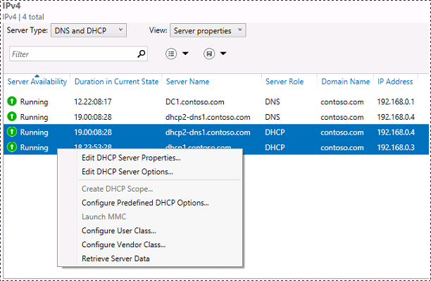
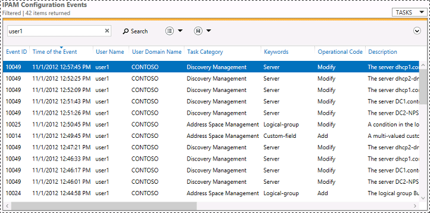

# Using the IPAM Client Console
The IPAM client console contains the following controls, lists and menus. Follow the links below for more information about how to use each element of the console.  
  
1.  [Upper navigation pane](../Topic/Using-the-IPAM-Client-Console.md#upper_nav)  
  
2.  [Lower navigation pane](../Topic/Using-the-IPAM-Client-Console.md#lower_nav)  
  
3.  [Lower navigation list view](../Topic/Using-the-IPAM-Client-Console.md#low_nav_list)  
  
4.  [Lower navigation tree view](../Topic/Using-the-IPAM-Client-Console.md#low_nav_tree)  
  
5.  [Display pane search view](../Topic/Using-the-IPAM-Client-Console.md#disp_pane_search)  
  
6.  [Display pane details view](../Topic/Using-the-IPAM-Client-Console.md#disp_pane_details)  
  
7.  [Display pane refresh](../Topic/Using-the-IPAM-Client-Console.md#refresh)  
  
8.  [Notifications area](../Topic/Using-the-IPAM-Client-Console.md#notify)  
  
9. [Server Manager menu bar](../Topic/Using-the-IPAM-Client-Console.md#SM_menu)  
  
10. [Tasks menu](../Topic/Using-the-IPAM-Client-Console.md#tasks)  
  
  
  
## Upper navigation pane  
In [!INCLUDE[win8_server_2](../Token/win8_server_2_md.md)], the IPAM upper navigation pane has five parent nodes. These nodes are also present in [!INCLUDE[winblue_server_2](../Token/winblue_server_2_md.md)], and an additional two nodes are added that are designated below with \(2012 R2\).  
  
1.  [OVERVIEW](../Topic/Using-the-IPAM-Client-Console.md#overview)  
  
2.  [SERVER INVENTORY](../Topic/Using-the-IPAM-Client-Console.md#server_inventory)  
  
3.  [IP ADDRESS SPACE](../Topic/Using-the-IPAM-Client-Console.md#ip_address_space)  
  
4.  [VIRTUALIZED IP ADDRESS SPACE](../Topic/Using-the-IPAM-Client-Console.md#VASM) \(2012 R2\)  
  
5.  [MONITOR AND MANAGE](../Topic/Using-the-IPAM-Client-Console.md#monitor_and_manage)  
  
6.  [EVENT CATALOG](../Topic/Using-the-IPAM-Client-Console.md#event_catalog)  
  
7.  [ACCESS CONTROL](../Topic/Using-the-IPAM-Client-Console.md#access_control) \(2012 R2\)  
  
Some nodes also contain child nodes that are discussed in this topic.  
  
### OVERVIEW  
Use the overview node to quickly view a configuration summary for the IPAM server, perform essential management tasks, and view IPAM knowledge articles.  
  
When you click the **OVERVIEW** node in the upper navigation pane, the following four tiles are available in the display pane:  
  
1.  The **IPAM SERVER TASKS** tile has three buttons:  
  
    -   The **QUICK START** button provides links to perform administrative tasks required to begin using IPAM. You can also use these links after IPAM is deployed to update IPAM settings, connect to other IPAM servers, and run IPAM data collection tasks.  
  
    -   The **ACTIONS** button provides quick links to multiple management actions \(shown below\).  
  
    -   The **LEARN MORE** button provides links to several IPAM help topics.  
  
2.  The **MANAGED NETWORK** tile displays the current IPAM server name and a list of the domains managed by this IPAM server.  
  
3.  The **CONFIGURATION SUMMARY** tile provides details about the managed server access provisioning method that was chosen, IPAM scheduled data collection tasks, IPAM local security groups, and IPAM communication settings.  
  
4.  The **SCHEDULED TASKS** tile displays the name, status, next run time, and last run time for each of the IPAM scheduled data collection tasks.  
  
  
  
  
  
  
  
### SERVER INVENTORY  
Use the server inventory node to add or remove managed servers, and to update their manageability status.  
  
When you click the **SERVER INVENTORY** node in the upper navigation pane, two tiles are available in the display pane:  
  
1.  The upper display pane search view tile provides the server inventory for servers with IPv4 connections to the IPAM server. Using the lower navigation pane, you can also choose to list only managed or unmanaged servers, or servers with an IPv4 or IPv6 connection. Using the lower navigation pane, you can also further specify only servers with addresses in a specified range.  
  
    > [!NOTE]  
    > Servers must have a valid static or dynamic IPv6 address to be displayed in the server inventory. Computers with only a link\-local IPv6 address are not displayed.  
  
2.  The lower display pane details view provides configuration information for servers that are selected in the display pane search view tile. The lower details view is blank if you choose more than one server in the upper search view.  
  
  
  
  
  
### IP ADDRESS SPACE  
Use the IP address space node and child nodes to configure, view, monitor and manage IP address space on your network.  
  
**IP ADDRESS SPACE** contains the following child nodes:  
  
-   **IP Address Blocks**  
  
-   **IP Address Inventory**  
  
-   **IP Address Range Groups**  
  
When you click the **IP ADDRESS SPACE** node in the upper navigation pane, a summary of IPAM’s address space management \(ASM\) feature is provided with information about each of the three child nodes. The functionality of these child nodes is also summarized below.  
  
#### Context\-sensitive menus  
Several management actions are available in each of the **IP ADDRESS SPACE** child nodes when you right\-click one or more items in the list. The actions that are available depend on the type of view that is selected \(IP Address Blocks, IP Address Ranges, IP Addresses\), whether multiple items are selected, and whether or not the IP address space is managed by a Microsoft DHCP server.  
  
> [!NOTE]  
> IPAM in [!INCLUDE[winblue_server_2](../Token/winblue_server_2_md.md)] adds a fourth view in addition to IP Address Blocks, IP Address Ranges, and IP Addresses you can also choose IP Address Subnets.  
  
  
  
The following context\-sensitive actions are available in the **IP ADDRESS SPACE** child nodes:  
  
|Current view|Action|Multiple items|MS DHCP|Non\-MS DHCP|  
|----------------|----------|------------------|-----------|----------------|  
|IP Address Blocks|Edit IP Address Block||N\/A|N\/A|  
||Add IP Address Block||N\/A|N\/A|  
||Delete||N\/A|N\/A|  
|IP Address Ranges|Edit IP Address Range||||  
||Import and Update IP Addresses||||  
||Find and Allocate Available IP Address||||  
||Map to IP Address Block||||  
||Reclaim IP Addresses||||  
||Retrieve Address Space Data||||  
||Delete||||  
|IP Addresses|Edit IP Address||||  
||Create DHCP Reservation||||  
||Create DNS Host Record||||  
||Create DNS PTR Record||||  
||Delete DHCP Reservation||||  
||Delete DNS Host Record||||  
||Delete DNS PTR Record||||  
||Delete||||  
  
#### VIRTUALIZED IP ADDRESS SPACE  
Use the virtualized IP address space node to manage virtual IP addresses that are used with system center virtual machine manager.  
  
When you click the **VIRTUALIZED IP ADDRESS SPACE** node in the upper navigation pane, an IP address space view is displayed that is similar to the **IP Address Blocks** view under **IP ADDRESS SPACE**.  
  
Detailed information about using virtualized address space with IPAM will be available soon in this guide. Also see: [How to Add an IPAM Server in VMM in System Center 2012 R2](http://technet.microsoft.com/library/dn249418.aspx).  
  
#### IP Address Blocks  
Use the IP address blocks node to search and display IP address blocks, IP address ranges, and individual IP addresses on the network.  
  
> [!IMPORTANT]  
> When you click the **IP Address Blocks** node in the upper navigation pane, the address space that is displayed is based on queries to the IPAM database. IP addresses, ranges, and blocks in the IPAM database can be different from IP address space on the network if the IPAM database has not been recently synchronized with the network. IP address space data is synchronized automatically by scheduled tasks if IP addresses are provided by Microsoft DHCP servers, and these tasks can be run on\-demand. IP addresses on the network that are not provided by Microsoft DHCP servers must be updated manually, or automated through the use of custom scripts. Windows PowerShell for IPAM provides cmdlets that can be used to update IP address space data in the IPAM database. For more information about IPAM automation with Windows PowerShell, see [Using Windows PowerShell with IPAM](../Topic/Using-Windows-PowerShell-with-IPAM.md).  
  
The following actions will add an IP address range to the IPAM database:  
  
1.  An active DHCP scope is discovered on the network.  
  
2.  An administrator adds an IP address range manually using the **Add or Edit IPv4 Address Range** or the **Add or Edit IPv6 Address Range** dialog box.  
  
3.  An administrator imports an IP address range manually from a comma delimited file using the IPAM console.  
  
4.  An administrator imports an IP address range manually from a comma delimited file using Windows PowerShell.  
  
5.  A regularly scheduled task runs a Windows PowerShell script that imports and updates IP address ranges automatically from DHCP and DNS servers on the network.  
  
The information that is provided in the display pane search view depends on the node that is selected in the lower navigation tree and also the type of view that is selected next to **Current view**. You can choose the following views from the drop\-down list: **IP Address Ranges**, **IP Addresses**, and **IP Address Blocks**.  
  
These views can be further customized by choosing the type of IPv4 or IPv6 address space to display using the lower navigation pane. IPv4 address space is automatically assigned as public or private based on RFC 1918, “Address Allocation for Private Internets.”  
  
> [!NOTE]  
> An IP address range or individual IP address is considered **Unmapped** if there is no parent IP address block or IP address range found in the IPAM database, respectively. IP address ranges are automatically mapped to parent IP address blocks unless there is a conflict with an existing IP address range. Individual IP addresses are automatically mapped to parent IP address ranges if they have the same values for **Managed by service** and **Service instance**. For more information about organizing IP address space in IPAM, see [Managing IP Address Space](../Topic/Managing-IP-Address-Space.md).  
  
#### IP Address Inventory  
Use the IP address inventory view to display individual IP addresses on the network organized by device type.  
  
> [!NOTE]  
> Active DHCP address leases and static IP address assignments on the network are not automatically displayed in the IP address inventory due to network and server load constraints. This information can be added to the IPAM database manually or automatically. For information about how to enter this information into the IPAM database, see [Managing IP Address Space](../Topic/Managing-IP-Address-Space.md).  
  
When you click the **IP Address Inventory** node in the upper navigation pane, the IP addresses displayed are the same as those displayed using the **IP Address Blocks** node when you choose **IP Addresses** next to **Current view**. However, different choices are available in the lower navigation pane. Instead of the public, private, and unmapped address space choices available in the IP address blocks view, the IP address inventory view organizes IP addresses by device type. To choose a specific device type, click the name of the device under IPv4 or IPv6 in the lower navigation pane.  
  
  
  
You can also add custom devices by clicking **Manage**, clicking **IPAM Settings**, and then clicking **Configure Custom Fields**. Several built\-in device types are available \(these cannot be deleted\). You can add new device types by clicking **Device Type** in the list of custom fields and then typing a name for the new device type under **Custom Field Value**. To delete a custom device type, click the device name and then click **Delete value**.  
  
  
  
#### IP Address Range Groups  
Use the IP address range groups view to display IP addresses ranges, IP addresses, and IP address range groups on the network organized into groups. By default, address space is organized by the **Managed by Service** field. However, you can choose to organize address space in other ways. For example, to organize IP address ranges by region, click **TASKS**, click **Add IP Address Range Group**, Type **Region** for the name of the address range group, and then choose to group items by the **Region** field. The Region field must also be defined under **Custom Configurations** for the IP address ranges you wish to display. If the **Region** field is not yet defined, you must configure it by editing the IP address range in the IP address blocks view.  
  
  
  
When you select **IP Address Range Groups** from the drop\-down list next to **Current view**, information is displayed for each defined **Group Name** according to the selection you have made in the lower navigation pane. For example, if you choose **MS DHCP** under **Managed by Service** in the lower navigation pane, then all the service instances \(host names\) will be displayed for Microsoft DHCP servers on the network.  
  
When you select **IP Address Ranges** from the drop\-down list next to **Current view**, information is displayed for each IP address range according to the selection you have made in the lower navigation pane. Information displayed includes the network address of the range, starting and ending IP addresses, managed by service, service instance, assignment type, and utilization data.  
  
The display pane details view also provides information about each IP address range that is selected in the display pane search view. Information that is displayed under **Details View** includes **Configuration Details**, **Utilization Trend**, and **Event Catalog**.  
  
When you select **IP Addresses** from the drop\-down list next to **Current view**, information is displayed for individual IP addresses on the network according to the selection you have made in the lower navigation pane. Information displayed includes the expiry status, IP address, MAC address, managed by service, service instance, parent IP address range, device name and type, address state \(inactive, in use, or reserved\), assignment type, and whether or not DHCP and DNS synchronization has been attempted for the IP address. Synchronization information can be particularly important when attempting to reconcile the IPAM database with configuration data on the network.  
  
The display pane details view also provides information about each IP address range that is selected in the display pane search view. Information that is displayed under **Details View** includes **Configuration Details** and **Event Catalog**  
  
### MONITOR AND MANAGE  
Use the monitor and manage node and child nodes to configure, view, monitor and manage IP infrastructure servers on your network.  
  
**MONITOR AND MANAGE** contains the following child nodes:  
  
-   [DNS and DHCP Servers](../Topic/Using-the-IPAM-Client-Console.md#dns_dhcp)  
  
-   [DHCP Scopes](../Topic/Using-the-IPAM-Client-Console.md#dhcp_scopes)  
  
-   [DNS Zone Monitoring](../Topic/Using-the-IPAM-Client-Console.md#dns_zone_monitoring)  
  
-   [Server Groups](../Topic/Using-the-IPAM-Client-Console.md#server_groups)  
  
When you click the **MONITOR AND MANAGE** node in the upper navigation pane, a summary of IPAM’s multi\-server management \(MSM\) feature is provided with information about the four child nodes \(DNS and DHCP Servers, DHCP Scopes, DNS Zone Monitoring, Server Groups\). The functionality of these child nodes is also summarized below.  
  
#### DNS and DHCP Servers  
Use the DNS and DHCP servers node to search and display information about DNS and DHCP services on the network.  
  
When you click the **DNS and DHCP Servers** node in the upper navigation pane, the information that is provided in the display pane search view depends on the node that is selected in the lower navigation tree, and also the type of view that is selected next to **Server Type** and **View**. You can choose the following views from these drop\-down lists:  
  
-   Choosing a server type of **DNS and DHCP** provides a view of **Server properties**.  
  
-   Choosing a server type of **DHCP** provides a view of **Server properties** or **Scope properties**.  
  
-   Choosing a server type of **DNS** provides a view of **Server properties**.  
  
The server properties view provides information about the state of service availability, duration in the current state, and configuration details such as server name, role, domain, and IP address.  
  
  
  
> [!TIP]  
> The information displayed in the **DNS and DHCP Servers** view when you choose **DHCP** next to **Server type** and **Scope properties** next to **View** is the same as the information displayed by default in the [DHCP Scopes](../Topic/Using-the-IPAM-Client-Console.md#dhcp_scopes) view.  
  
Different management actions are available depending on the view that is selected. In a **Server Properties** view, the following options are available for the available choices of **Server Type**. Some options are also available when multiple servers are selected, allowing you to retrieve data and configure settings identically on all selected servers:  
  
|Server type|Configuration options|  
|---------------|-------------------------|  
|DNS and DHCP|Configuration options depend on the type of server or servers selected. If a server is running both DNS and DHCP, it is displayed twice in the list: once for the DNS server role and once for the DHCP server role. If multiple server roles \(DNS and DHCP servers\) are selected, then **Retrieve Server Data** is the only available option. If all selected servers are the same type \(DHCP or DNS\), then the available options are the same as those available if you choose **DHCP** or **DNS** for the value of **Server type**.|  
|DHCP|-   **Edit DHCP Server Properties**: Configure a single server or multiple servers. -   **Edit DHCP Server Options**: Configure a single server or multiple servers. -   **Create DHCP Scope**: Configure a single server. -   **Configure Predefined DHCP Options**: Configure a single server or multiple servers. -   **Launch MMC**: Configure a single server. -   **Configure User Class**: Configure a single server or multiple servers. -   **Configure Vendor Class**: Configure a single server or multiple servers. -   **Retrieve Server Data**: Retrieve data from a single server or multiple servers.|  
|DNS|-   **Launch MMC**: Configure a single server. -   **Retrieve Server Data**: Retrieve data from a single server or multiple servers.|  
  
  
  
> [!TIP]  
> You cannot use the **Create DHCP Scope** configuration option on multiple DHCP servers. To duplicate a DHCP scope, create the scope on at least one DHCP server and then use the **Duplicate DHCP Scope** configuration option available in the **DHCP Scopes** view.  
  
For more information about configuration options for DNS and DHCP servers using the IPAM console, see [Multi-server Management](../Topic/Multi-server-Management.md).  
  
#### DHCP Scopes  
Use the DHCP scopes node to search and display information about IPv4 and IPv6 DHCP scopes on the network. DHCP scopes can be active or inactive.  
  
When you click the **DHCP Scopes** node in the upper navigation pane, the DHCP scopes displayed in the display pane search view depend on the node that is selected in the lower navigation tree. By default, IPv4 is selected.  
  
The **DHCP Scopes** view provides information about the utilization and status of DHCP scopes and summarizes configuration information. The **Details View** provides a summary of scope properties, scope options, and scope configuration events \(shown below\).  
  
  
  
Configuration options that are available for DHCP scopes include:  
  
-   **Edit DHCP Scope**: Configure a single scope or multiple scopes.  
  
-   **Duplicate DHCP Scope**: Duplicate a single scope.  
  
-   **Activate DHCP Scope**: Activate a single scope or multiple scopes.  
  
-   **Deactivate DHCP Scope**: Deactivate a single scope or multiple scopes.  
  
-   **Delete**: Delete a single scope or multiple scopes from the DHCP server.  
  
For more information about configuring DHCP scopes using the IPAM console, see [Multi-server Management](../Topic/Multi-server-Management.md).  
  
#### DNS Zone Monitoring  
Use the DNS zone monitoring node to search and display information about DNS zones hosted by managed DNS servers on the network.  
  
When you click the **DNS Zone Monitoring** node in the upper navigation pane, DNS zones hosted on managed, authoritative DNS servers are displayed. The zones that are displayed depend on the node that is selected in the lower navigation tree. By default, **Forward Lookup** zones are selected.  
  
  
  
Information is provided about the health of forward DNS zones. IPv4 and IPv6 reverse DNS zones are displayed, but health information is not provided. The **Zone Status** \(health\) of a zone is considered OK if all DNS servers that host the zone respond to a DNS name server query for the zone \(ex: **nslookup –q\=ns contoso.com dc1.contoso.com**\). The **Details View** provides a summary of zone properties and authoritative servers for the zone that is selected.  
  
#### Server Groups  
Use the server groups node to search and display information about DNS and DHCP servers that you have assigned to unique, logical groups. You can create multiple logical groups, and use this functionality to organize DNS and DHCP servers by characteristics such as location, hardware specifications, operating system version, and administrative control. If a managed server is not a DHCP server or a DNS server, it is not displayed.  
  
If you have not yet created custom server groups, the view of DNS and DHCP servers that is displayed when you click the **Server Groups** node in the upper navigation pane is the same as that shown when you click **DNS and DHCP Servers**. To customize this view, you must add server groups. To add a server group, right\-click **IPv4** or **IPv6** in the lower navigation pane, and then click **Add Server Group**.  
  
  
  
> [!IMPORTANT]  
> This procedure is not the same as clicking **Manage** on the Server Manager menu and then clicking **Create Server Group**.  
  
Server groups can contain multiple levels of nested grouping. To specify custom grouping values, use the Configure Custom Fields dialog box. After configuring custom fields and adding server groups, use the **SERVER INVENTORY** view to edit managed servers and specify custom configurations for each server. You can add custom configurations to multiple servers simultaneously by selecting multiple servers in the server inventory. When you have added server groups and custom configurations, you can use the lower navigation pane to view servers that belong to specific groups.  
  
  
  
To edit or delete existing server groups, right\-click the name of the server group and then click **Edit Server Group** or **Delete**.  
  
### EVENT CATALOG  
**EVENT CATALOG** contains the following child nodes in the lower navigation pane:  
  
-   [IPAM Configuration Events](../Topic/Using-the-IPAM-Client-Console.md#IPAM_config-events)  
  
-   [DHCP Configuration Events](../Topic/Using-the-IPAM-Client-Console.md#DHCP_config-events)  
  
-   [IP Address Tracking](../Topic/Using-the-IPAM-Client-Console.md#IP_address-tracking)  
  
Use the event catalog node to view IPAM and DHCP configuration events, and to search and display DHCP lease events and user logon events on managed servers.  
  
When you click the **EVENT CATALOG** node in the upper navigation pane, IPAM configuration events are displayed by default. Use the lower navigation pane to change the display to DHCP configuration events or IP address tracking.  
  
To update the list of events, click **TASKS** and then click **Retrieve Event Catalog Data**, which will run the IPAM audit task. To delete events from IPAM and Event Viewer, click **TASKS** and then click **Purge Event Catalog Data**. You will be prompted to choose the date and type of events to purge from the event catalog.  
  
  
  
#### IPAM Configuration Events  
When you click **IPAM Configuration Events** in the lower navigation pane, a list of configuration events is displayed in the \(upper\) display pane search view. These events are the same events as displayed in Event Viewer on the IPAM server under **Applications and Services Logs>Microsoft>Windows>IPAM>ConfigurationChange**. You can also filter these events by the user name of the user that made the configuration change on the IPAM server.  
  
  
  
Clicking a specific event in this list will display detailed information in the \(lower\) display pane **Details View** \(not shown here\).  
  
#### DHCP Configuration Events  
When you click **DHCP Configuration Events** in the lower navigation pane, a list of configuration events is displayed in the \(upper\) display pane search view. These events are the same events as displayed in Event Viewer on the IPAM server under **Applications and Services Logs>Microsoft>Windows>DHCP\-Server>Microsoft\-Windows\-DHCP Server Events\/Operational**. You can also filter these events by the user name of the user that made the configuration change on the IPAM server.  
  
  
  
Clicking a specific event in this list will display detailed information in the \(lower\) display pane **Details View** \(not shown here\).  
  
#### IP Address Tracking  
When you click **IP Address Tracking** in the lower navigation pane, a summary of IPAM’s IP address tracking feature is provided with information about the four types of address tracking that are available \(**By IP Address**, **By Client ID**, **By Host Name**, **By User Name**\). You also have the option of saving queries for later reuse. Wildcards and pattern\-matching syntax is not supported. Some example queries are shown below.  
  
##### By IP Address  
To display DHCP lease events by IP address, type an IP address in the search box and enter a date range to search. You can also choose to include or exclude correlated logon events found on domain controllers and NPS servers.  
  
  
  
##### By Client ID  
To display DHCP lease events by client ID, type a MAC address in the search box and enter a date range to search. You can also choose to include or exclude correlated logon events found on domain controllers and NPS servers.  
  
  
  
##### By Host Name  
To display DHCP lease events by host name, type a host name in the search box and enter a date range to search. You can also choose to include or exclude correlated logon events found on domain controllers and NPS servers.  
  
  
  
##### By User Name  
To display DHCP lease events by user name, type user name in the search box and enter a date range to search. When searching by user name, you must include correlated logon events found on domain controllers and NPS servers.  
  
  
  
### ACCESS CONTROL  
Use the access control node to configure detailed rights management for IPAM users and administrators.  
  
When you click the **ACCESS CONTROL** node in the upper navigation pane you can configure three types of access settings in the lower navigation pane. These settings are described below.  
  
Role based access control is comprised of roles, access scopes, and access policies:  
  
-   **Roles**: A role is a collection of IPAM operations. You can associate a role with a user or group in Windows using an access policy. Several built\-in roles are provided, but you can also create customized roles to meet your business requirements.  
  
-   **Access scopes**: An access scope determines the objects that a user has access to. You can use access scopes to define administrative domains in IPAM. For example, you might create access scopes based on geographical location. By default, IPAM includes an access scope of Global. All other access scopes are subsets of the Global access scope. Users or groups that are assigned to the Global access scope have access to all objects in IPAM that are permitted by their assigned role.  
  
-   **Access policies**: An access policy combines a role with an access scope to assign permission to a user or group. For example, you might define an access policy for user1 with a role of IP Block Admin and an access scope of Global\\Asia. Therefore, user1 will have permission to edit and delete IP address blocks that are associated to the Asia access scope. This user will not have permission to edit or delete any other IP address blocks in IPAM.  
  
For more information and steps to configure access settings, see [Access Control](../Topic/Access-Control.md).  
  
## Lower navigation pane  
Several examples for uses of the lower navigation pane have been provided in this topic when describing uses of the upper navigation pane. The lower navigation pane is used to group and narrow the selection of items that are displayed in the \(upper\) display pane search view when you click a node in the upper navigation pane.  
  
Depending on the node that is selected in the upper navigation pane, different grouping choices are available in the lower navigation pane. For example, if you choose **IP Address Inventory** in the upper navigation pane, the lower navigation pane will display **IPv4** and **IPv6** parent nodes with child nodes classified by device type. If you choose **IP Address Range Groups** in the upper navigation pane, the lower navigation pane will display **IPv4** and **IPv6** parent nodes, with child nodes corresponding to range groups that you have created. IPv4 and IPv6 are the typical parent classifications for items in the lower navigation pane, with exceptions of **DNS Zone Monitoring** and **EVENT CATALOG**, which have the unique parent nodes described previously.  
  
The lower navigation pane has two types of available views, the list view and the tree view.  
  
### Lower navigation list view  
List view in the lower navigation pane allows you to separate child nodes into unique columns. You can search these columns and display only specified items. You can search any part of the name.  
  
  
  
### Lower navigation tree view  
Tree view in the lower navigation pane allows you to expand or collapse all child nodes as needed. You cannot perform searches when using the tree view.  
  
  
  
## Display pane search view  
The display pane search view provides a list of items found in the IPAM database that match the specific nodes that are selected in the upper and lower navigation panes, and \(if applicable\) the current selection next to **Current view**. To sort items in the list by a specific column header, left\-click the column header. Click the column header again to reverse the sorting order.  
  
> [!TIP]  
> You can customize the columns that are displayed by adding or removing column headers, and by changing the order of columns. You can also choose to group items in the list by specific fields.  
>   
> To add or remove a column header, right\-click and existing column header and select the headers you wish to display. To change the order of column headers, click and hold an existing header and then move it to the desired location, either before or after another header. To group items in the list, right\-click an existing column header, point to Group by, and then select a grouping category. You can only choose one grouping category at a time. To remove item grouping, de\-select the existing grouping category by clicking it again.  
  
The display pane search view provides the capability to filter results based on a query. You can also save queries for later use.  
  
## Display pane details view  
The display pane details view provides detailed information applicable to the current selection in the display pane search view. Depending on the item that is selected, information might be presented using multiple tabs. For example, when viewing IP address blocks and ranges, the **Details View** displays **Configuration Details**, **Utilization Trend**, and **Event Catalog** tabs. When viewing DHCP server properties, the **Details View** displays **Server Properties**, **Options**, and **Event Catalog** tabs.  
  
## Display pane refresh  
Server Manager provides a control to refresh information that is displayed in specific console view. Data in the IPAM client console might need to be refreshed after a configuration change on the IPAM server or on a managed server, or when data collection tasks have recently completed running. Clicking the display pane refresh icon ensures that the information that is displayed is current.  
  
## Notifications area  
Server Manager provides a notification control that displays the status of important tasks. For example, if you click Manage and then click Retrieve All Server Data, the status of multiple IPAM data collection tasks will be displayed in the notifications area.  
  
  
  
Click the notification area and then click **Task Details** to see a recent history of tasks and errors.  
  
## Server Manager menu bar  
When viewing the IPAM console, **Manage** on the Server Manager menu bar contains selections that are used for general Server Manager tasks as well as selections that are used with IPAM. Items that are specific to IPAM you can choose by clicking **Manage** include:  
  
-   Connect to an IPAM Server  
  
-   IPAM Settings  
  
-   Start Server Discovery  
  
-   Retrieve All Server Data  
  
For more information about these management tasks, see [IPAM Architecture](../Topic/IPAM-Architecture.md), [Managing Server Inventory](../Topic/Managing-Server-Inventory.md), and [Managing IP Address Space](../Topic/Managing-IP-Address-Space.md).  
  
## TASKS menu  
The selections that are displayed on the TASKS menu are context\-specific and depend on the node that is selected in the upper navigation pane. The following actions are available for specified nodes in the navigation pane:  
  
1.  **SERVER INVENTORY**: For more information, see [Managing Server Inventory](../Topic/Managing-Server-Inventory.md).  
  
    -   Add Server  
  
    -   Retrieve All Server Data  
  
    -   Export  
  
2.  **IP ADDRESS SPACE** child nodes: For more information, see [Managing IP Address Space](../Topic/Managing-IP-Address-Space.md).  
  
    -   Add IP Address Block  
  
    -   Add IP Address Range  
  
    -   Add IP Address  
  
    -   Import IP Address Blocks  
  
    -   Import IP Address Ranges  
  
    -   Import IP Addresses  
  
    -   Import and Update IP Address Ranges  
  
    -   IP Address Expiry Log Settings  
  
    -   Retrieve Address Space Data  
  
    -   Export  
  
3.  **MONITOR AND MANAGE** child nodes:  For more information, see [Multi-server Management](../Topic/Multi-server-Management.md).  
  
    -   Retrieve Server Data  
  
    -   Export  
  
4.  **EVENT CATALOG**: For more information, see [IP Address Tracking](../Topic/IP-Address-Tracking.md) and [Operational Event Tracking](../Topic/Operational-Event-Tracking.md).  
  
    -   Purge Event Catalog Data  
  
    -   Retrieve Event Catalog Data  
  
    -   Export  
  
## See also  
[IP Address Tracking](../Topic/IP-Address-Tracking.md)  
  
[Using Windows PowerShell with IPAM](../Topic/Using-Windows-PowerShell-with-IPAM.md)  
  
