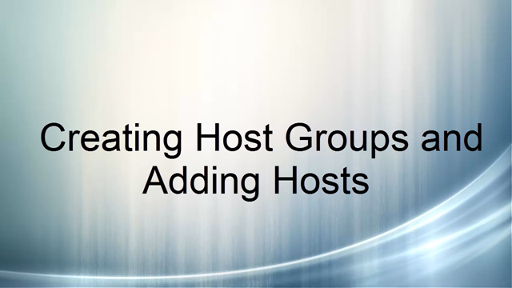

# Virtual Machine Manager Network Object Fundamentals
[!INCLUDE[vmmblue_1](../Token/vmmblue_1_md.md)] \(VMM\) is an essential tool used to deploy Microsoft private and public clouds. But before you begin building clouds, it is important to understand the fundamental networking objects in VMM. These networking objects form the network infrastructure of your cloud, including the virtual networks that you or your tenants create.  
  
If you’re new to VMM, all the new terms and concepts can be a little confusing at first. This topic covers just the basics that you need to understand before you move on to more complex topics, such as advanced VMM features and functions, and planning and designing private and public clouds.  
  
The following VMM networking objects are used to build the basic networking infrastructure of Microsoft’s Software Defined Networking \(SDN\) used in private and public clouds:  
  
-   [Hosts and host groups](../Topic/Virtual-Machine-Manager-Network-Object-Fundamentals.md#hosts)  
  
    Hyper\-V hosts that VMM manages organized into groups based on location or purpose.  
  
-   [Logical networks](../Topic/Virtual-Machine-Manager-Network-Object-Fundamentals.md#LogicalNetworks)  
  
    Networks that represent your physical networks.  
  
-   [Network sites](../Topic/Virtual-Machine-Manager-Network-Object-Fundamentals.md#NetworkSites)  
  
    Logical groupings of hosts, IP Subnets and\/or VLANs.  
  
-   [IP address pools \(logical networks\)](../Topic/Virtual-Machine-Manager-Network-Object-Fundamentals.md#IPPoolsLogical)  
  
    A static pool of IP addresses used for the associated network sites’ IP subnet\/VLAN pairs.  
  
-   [VM networks](../Topic/Virtual-Machine-Manager-Network-Object-Fundamentals.md#VMNetworks)  
  
    A network that virtual machines and hosts connect to.  
  
-   [IP address pools \(VM Networks\)](../Topic/Virtual-Machine-Manager-Network-Object-Fundamentals.md#IPPoolsVM)  
  
    A static pool of IP addresses for the VM network.  
  
-   [Logical Switch](../Topic/Virtual-Machine-Manager-Network-Object-Fundamentals.md#LogicalSwitch)  
  
    A template used to create virtual switches consistently across many hosts.  
  
-   [Uplink port profiles](../Topic/Virtual-Machine-Manager-Network-Object-Fundamentals.md#UPP)  
  
    Defines the network sites associated with the switch.  
  
-   [Virtual network adapter port profiles](../Topic/Virtual-Machine-Manager-Network-Object-Fundamentals.md#VNetPP)  
  
    Define the virtual network adapter properties for the virtual network adapters available with the logical switch.  
  
-   [Port classifications](../Topic/Virtual-Machine-Manager-Network-Object-Fundamentals.md#PortClass)  
  
    A label to abstract the adapter port profile settings.  
  
-   [Gateways](../Topic/Virtual-Machine-Manager-Network-Object-Fundamentals.md#Gateways)  
  
    Used to connect a Hyper\-V Network Virtualization \(HNV\) VM network to an external network.  
  
For more information about Microsoft SDN, see [Software Defined Networking](assetId:///b04cd305-197a-473c-b528-8397a0a458f3).  
  
Next, let’s cover each of these in some detail.  
  
## Hosts and host groups  
To manage Hyper\-V hosts with VMM, you add them to Host groups, or the default group, **All Hosts**. When you add a Hyper\-V host to VMM, a host agent is installed on the Hyper\-V host, which allows you to manage the host via VMM.  
  
You can use host groups to organize your Hyper\-V hosts with similar characteristics or properties, such as location or capabilities. Other network objects \(such as network sites\) are then subsequently associated with host groups. So when you plan your host groups, you need to consider the network sites and logical networks that you associate with them.  
  
Watch the following video to see how to create host groups and add Hyper\-V hosts in VMM.  
  
  
  
For more information about host groups, see [Creating Host Groups in VMM](https://technet.microsoft.com/library/gg610645.aspx).  
  
## Logical networks  
A logical network represents how a set of hosts are connected or will be connected to the physical network in VMM.   A logical network consists of one or more network sites.  
  
Logical Networks are used to define network traffic that is dedicated for a particular workload or purpose.  Some examples of this are:  
  
-   Host management traffic  
  
-   Live migration traffic  
  
-   Cluster communication traffic  
  
-   Storage traffic  
  
    -   Typically for converged networks where storage traffic travels over Ethernet, such as iSCSI, RDMA, FCoE, or Infiniband  
  
-   Tenant virtual machine traffic  
  
    -   The IP addresses for this type of logical network represent the Provider Addresses \(PA\) in a network virtualization scenario. For more information about network virtualization and related terminology, see [Hyper\-V Network Virtualization technical details](assetId:///405a1b66-c9ba-49fa-9200-cd1364e92ab1).  
  
> [!NOTE]  
> If you are familiar with VMware terminology, a **logical network** is similar to VMware’s **transport network**.  
  
For an illustration of a logical network and its relationship to related network objects, see [Configuring Logical Networking in VMM Illustrated Overview](https://technet.microsoft.com/library/dn186235.aspx).  
  
### Network sites  
Network sites are logical groupings of hosts, IP Subnets and\/or VLANs.  Network Sites are how you tell VMM what IP Subnet and\/or VLAN a given set of hosts \(and ultimately the hosts’ network adapters\) are connected to the physical network so that they can communicate with one another. A network site in a logical network represents a specific set of network configurations; it doesn't have to represent an actual physical location. For example, you could define a logical network \(and associated network sites\) that represent a particular purpose, such as Production, Development, or Test. Each of these logical networks may consist of one or multiple network sites.  
  
When you configure a network site in VMM, you configure the host groups that are associated with the network site, and the VLAN\/IP subnet pairs that are associated with it.  
  
> [!IMPORTANT]  
> The subnets and corresponding IP address pools that you configure in VMM are physical IP addresses which must be routable on the physical network. Also, if you configure VLANs in VMM, they must correspond to the VLANs on your physical network.  
  
## IP address pools \(logical networks\)  
An IP address pool for a logical network defines a static pool of IP addresses used for the associated network sites’ IP subnet\/VLAN pairs. These addresses can then be allocated by VMM to NICs or VNICs that are connected to it.  A Logical network should have a static IP address pool for each IP Subnet that you want use VMM to allocate static addresses.  VMM supports both IPv4 and IPv6 static address pools.  
  
When you configure an IP address pool for a logical network, you configure the associated network site, the IP address range, and optionally gateway, DNS, WINS, and inactive addresses.  
  
For more information about logical network IP address pools, see [How to Create IP Address Pools for Logical Networks in VMM](https://technet.microsoft.com/library/gg610590.aspx).  
  
Watch the following video to see how to create logical networks, network sites, and logical network IP address pools in VMM.  
  
  
  
## VM networks  
A VM Network is a network that virtual machines and hosts connect to and can be used to isolate tenant virtual networks from each other.  A virtual network interface \(vNIC\) in VMM can only attach to a VM network. This means that for all virtual machines that you create via VMM, a self\-service portal, or Windows Azure Pack \(WAP\), you must have a VM network that they can attach to.  
  
> [!NOTE]  
> For more information about virtual networks and network virtualization, see [Hyper\-V Network Virtualization Overview](assetId:///bf1dba9d-1960-4dd2-a5e2-99466a02044b)  
  
If you want to connect a virtual machine directly to a logical network with no isolation, you can configure a VM network for **No isolation** and connect the virtual machine’s vNIC to that VM network.  
  
> [!NOTE]  
> If you are familiar with VMware terminology, a **VM network** is similar to VMware’s **logical network**.  
  
### IP address pools \(VM Networks\)  
VM network IP address pools define a static pool of IP addresses for the VM network.  Addresses in a static IP address pool are then allocated to virtual machines by VMM.  If you don’t have a DCHP server to allocate IP addresses to your virtual machines, then you need to create one or more static IP address pools for each VM Network you create.  In the case of Hyper\-V Network Virtualization \(HNV\) VM networks, you must create static IP address pools for each VM network, even if you do have DHCP on your network.  
  
For more information about VM networks, see [Configuring VM Networks in VMM Illustrated Overview](https://technet.microsoft.com/library/jj983727.aspx).  
  
Watch the following video to see how to create VM networks and VM network IP address pools in VMM.  
  
  
  
## Logical Switch  
A logical switch is not a new switch type; it’s just a template used to create virtual switches consistently across many hosts. When the logical switch is configured on a host, a new virtual switch is created on the host based on the settings in the logical switch.  A logical switch requires at least one Uplink Port Profile \(UPP\), which you attach to a physical NIC on each host you want to connect to the switch.  A logical switch can be applied to a host or Host Cluster.  If a host is subsequently added to the cluster it will automatically have the logical switch added.  Only one logical switch may be added to a given physical NIC on a host.  
  
### Uplink port profiles  
Uplink port profiles are used in logical switch configurations to define the network sites associated with the switch. A logical switch must have at least one Uplink Port Profile but may contain more than one.  
  
### Virtual network adapter port profiles  
Virtual network adapter port profiles are used to define the virtual network adapter properties \(offload settings, security settings, bandwidth settings\) for the virtual network adapters available with the logical switch.  
  
### Port classifications  
A port classification is simply a label to abstract the adapter port profile settings. It can map to various network adapter port profiles. For example, a port classification may be called “High bandwidth” and associated with network adapter port profiles configured with a minimum bandwidth setting.  Port Classifications can be associated with VM Templates \(VM templates help you create new virtual machines\), and are useful when you want to allow tenants using a self\-service portal such as Windows Azure Pack to choose a port profile that will best match their workload.  
  
Watch the following video to see how to create logical switches, uplink port profiles, virtual network adapter port profiles, and port classifications in VMM.  
  
  
  
## Connect hosts and deploy virtual machines  
After you define all the required network objects, you can then connect your hosts to the network using the host property dialog in VMM.  
  
  
  
The Virtual Switch page on the Property dialog is used to identify the logical switch definition to use, and to configure virtual adapters on the switch. When a logical switch is configured, a virtual switch is created on the host, the physical adapter on the host is bound to the Hyper\-V Extensible Virtual Switch, and the existing protocols and services are bound to the virtual network adapter. From the physical host perspective, this is the same as if a virtual switch was deployed using the Hyper\-V Manager on the host.  
  
Watch the following video to see how to connect hosts using a logical switch and see the resultant virtual switch and virtual adapter\(s\) on the host.  
  
  
  
After you connect the infrastructure, you can deploy virtual machines and connect them to VM networks. If everything is working correctly, you will have virtual machines connected to isolated VM networks.  
  
Watch the following video to see how to deploy virtual machines connected to isolated VM networks.  
  
  
  
After you create and deploy your virtual machines, you can verify that they have the expected IP addresses from the respective VM Network IP address pools.  
  
Watch the following video to see how you can verify your virtual machine IP connectivity.  
  
  
  
## Gateways  
If you’re using Hyper\-V network virtualization \(HNV\) isolation for your VM Networks, your virtual machines can only talk to other virtual machines on that VM network.  If this is what you want, then you’re all set\!  But what if you want those virtual machines to communicate with hosts and virtual machines on other networks or connect to the Internet?  This is where gateways become useful.  
  
A gateway is used to connect an HNV VM network to an external network. For example, a gateway can connect a tenant’s HNV VM network to their on\-premise network, or to the Internet, or forwarded to a network in the service provider datacenter.  
  
You can configure VMM gateways from third\-party vendors, or you can use Microsoft’s [Windows Server Gateway](https://technet.microsoft.com/library/dn313101.aspx) which is included with Windows Sever.  
  
In a production environment, gateways should be highly available. The recommended way to deploy a highly available Windows Server Gateway is to use a service template. In VMM, a service is a set of virtual machines that are configured and deployed together and are managed as a single entity. A service template defines the configuration of the service. For more information about adding a Windows Server Gateway, see [How to Add a Windows Server Gateway in VMM in System Center 2012 R2](https://technet.microsoft.com/library/dn249417.aspx).  
  
To see how a highly available Windows Server Gateway can be deployed in a production environment, see [Deploy highly scalable tenant network infrastructure for hosting providers](https://technet.microsoft.com/library/dn282658.aspx). For a test environment, you can deploy a gateway that is not highly available. For instructions to setup a test lab that includes a Windows Server Gateway, see [Test Lab Guide: Windows Server 2012 R2 Hyper\-V Network Virtualization with System Center 2012 R2 VMM](https://www.microsoft.com/download/details.aspx?id=39284).  
  
See the following video for a presentation about gateway configuration and deployment: [Deploying Hyper\-V Network Virtualization](http://channel9.msdn.com/events/Ignite/2015/BRK3492).  
  
## See Also  
[Build Your Own Cloud: What You Need to Know](../Topic/Build-Your-Own-Cloud--What-You-Need-to-Know.md)  
[Preparing the Fabric in VMM](https://technet.microsoft.com/en-us/library/gg610604.aspx)  
  
