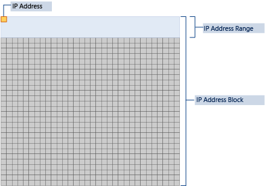
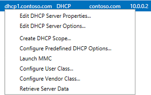
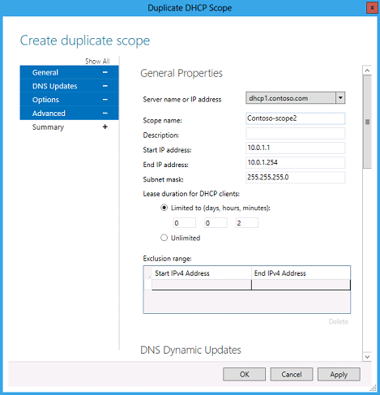
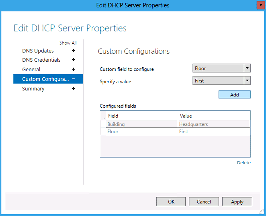

# Walkthrough: Demonstrate IPAM in Windows Server 2012
IP Address Management \(IPAM\) in [!INCLUDE[win8_server_1](../Token/win8_server_1_md.md)] is a framework for discovering, monitoring, managing and auditing IP address space on a corporate network. IPAM provides the following features:  
  
-   Automatic IP address infrastructure discovery  
  
-   Highly customizable IP address space display, reporting, and management  
  
-   Configuration change auditing for DHCP and IPAM services  
  
-   Monitoring and management of DHCP and DNS services  
  
-   IP address lease tracking  
  
## In this guide  
This guide provides step\-by\-step instructions for deploying IPAM in a test lab using three server computers and one client computer. Software and hardware requirements are provided, as well as an overview of IPAM.  
  
> [!IMPORTANT]  
> The following instructions are for configuring a test lab using the minimum number of computers. Individual computers are needed to separate the services provided on the network and to clearly show the desired functionality. This configuration is neither designed to reflect best practices nor does it reflect a desired or recommended configuration for a production network. The configuration, including IP addresses and all other configuration parameters, is designed only to work on a separate test lab network.  
  
Guide contents:  
  
-   [IPAM overview](../Topic/Walkthrough--Demonstrate-IPAM-in-Windows-Server-2012.md#IPAM_overview)  
  
    -   [IPAM discovery](../Topic/Walkthrough--Demonstrate-IPAM-in-Windows-Server-2012.md#IPAM_discovery)  
  
    -   [IP address space management](../Topic/Walkthrough--Demonstrate-IPAM-in-Windows-Server-2012.md#ASM)  
  
    -   [Multi\-server management and monitoring](../Topic/Walkthrough--Demonstrate-IPAM-in-Windows-Server-2012.md#MSM)  
  
    -   [Operational auditing and IP address tracking](../Topic/Walkthrough--Demonstrate-IPAM-in-Windows-Server-2012.md#Audit)  
  
-   [IPAM architecture](../Topic/Walkthrough--Demonstrate-IPAM-in-Windows-Server-2012.md#architecture)  
  
    -   [IPAM security groups](../Topic/Walkthrough--Demonstrate-IPAM-in-Windows-Server-2012.md#security_groups)  
  
    -   [IPAM tasks](../Topic/Walkthrough--Demonstrate-IPAM-in-Windows-Server-2012.md#tasks)  
  
    -   [Privacy](../Topic/Walkthrough--Demonstrate-IPAM-in-Windows-Server-2012.md#privacy)  
  
    -   [IPAM requirements](../Topic/Walkthrough--Demonstrate-IPAM-in-Windows-Server-2012.md#requirements)  
  
-   [Scenario overview](../Topic/Walkthrough--Demonstrate-IPAM-in-Windows-Server-2012.md#scenario_overview)  
  
    -   [Hardware and software requirements](../Topic/Walkthrough--Demonstrate-IPAM-in-Windows-Server-2012.md#hardware)  
  
-   [Configuring the test lab](../Topic/Walkthrough--Demonstrate-IPAM-in-Windows-Server-2012.md#the_test_lab)  
  
    -   [Configure DC1](../Topic/Walkthrough--Demonstrate-IPAM-in-Windows-Server-2012.md#config_dc1)  
  
    -   [Configure DHCP1](../Topic/Walkthrough--Demonstrate-IPAM-in-Windows-Server-2012.md#config_dhcp1)  
  
    -   [Configure Client1](../Topic/Walkthrough--Demonstrate-IPAM-in-Windows-Server-2012.md#config_client1)  
  
    -   [Configure IPAM1](../Topic/Walkthrough--Demonstrate-IPAM-in-Windows-Server-2012.md#config_ipam1)  
  
-   [IPAM demonstration](../Topic/Walkthrough--Demonstrate-IPAM-in-Windows-Server-2012.md#demo)  
  
    -   [Address space management](../Topic/Walkthrough--Demonstrate-IPAM-in-Windows-Server-2012.md#demo_1)  
  
    -   [Infrastructure monitoring and management](../Topic/Walkthrough--Demonstrate-IPAM-in-Windows-Server-2012.md#demo_2)  
  
    -   [Review audit logs and events](../Topic/Walkthrough--Demonstrate-IPAM-in-Windows-Server-2012.md#demo_3a)  
  
## <a name="IPAM_overview"></a>IPAM overview  
The IPAM feature consists of four primary modules. The following sections provide a brief description of these modules.  
  
### <a name="IPAM_discovery"></a>IPAM discovery  
IPAM discovery requires access to Active Directory in order to discover network infrastructure servers. This discovery is necessary to enable IPAM services. Discovery allows administrators to enumerate servers running [!INCLUDE[firstref_longhorn](../Token/firstref_longhorn_md.md)] or later with the DNS Server, DHCP Server and AD DS role services installed. Administrators can also manually add or delete servers to define a custom scope of administrative control. The scope of discovery can be modified in real\-time by selecting or removing domains and specific server roles.  
  
### <a name="ASM"></a>IP address space management  
The IPAM address space management \(ASM\) feature provides the ability to efficiently view, monitor, and manage IP address space on the network. ASM supports IPv4 public and private addresses, and IP addresses can be dynamically issued on the network or provided as static IP addresses. Sorting can be based on custom fields, such as region, Regional Internet Registries \(RIR\), device type, or customer name. A network administrator can track IP address utilization and threshold\-crossing status, or display utilization trends. IPAM ASM tools address the IP address space management problem in a growing distributed environment by ensuring better planning, accountability, and control. IPAM also enables an administrator to detect overlapping IP address ranges defined on different DHCP servers, find free IP addresses within a range, create DHCP reservations, and create DNS records.  
  
### <a name="MSM"></a>Multi\-server management and monitoring  
IPAM enables administrators to monitor and manage multiple DHCP servers and monitor multiple DNS servers spread across various regions from a centralized console. Administrative tasks are frequently repetitive across multiple servers. The ability to execute these tasks uniformly across servers reduces both the effort involved as well as the probability of error. The multi\-server management \(MSM\) feature enables an administrator to easily edit and configure key properties of multiple DHCP servers and scopes across the organization. IPAM also facilitates monitoring and tracking of DHCP service status and utilization of DHCP scopes. IPAM also enables tagging of servers with built\-in and user\-defined custom field values and to visualize these servers and group them into logical groups and sub\-groups. IPAM helps to monitor the health of a DNS zone on multiple DNS servers by displaying the aggregated status of a zone across all authoritative DNS servers. IPAM also tracks the service status of the DNS and DHCP servers on the network.  
  
### <a name="Audit"></a>Operational auditing and IP address tracking  
Auditing tools enable tracking potential configuration problems on IP infrastructure servers. IPAM provides the ability to view consolidated configuration changes on managed DHCP servers and the IPAM server. Details are tracked such as server name, user name, and the date and time a configuration change was made. IP address lease tracking is available to aid forensics investigations by collecting lease logs from DHCP, DC and NPS servers. IPAM enables history tracking for IP address leases and user logins. This enables tracking of IP address activity correlated with MAC addresses, user names, host names and other parameters.  
  
## <a name="architecture"></a>IPAM architecture  
An IPAM server is a domain member computer. You cannot install IPAM on an Active Directory domain controller.  
  
There are three general methods to deploy IPAM servers:  
  
1.  **Distributed:** An IPAM server is deployed at every site in the enterprise.  
  
2.  **Centralized:** One IPAM server is deployed in the enterprise.  
  
    **Hybrid:** A central IPAM server deployed with dedicated IPAM servers at each site.  
  
There is no communication or database sharing between different IPAM servers in the enterprise. If multiple IPAM servers are deployed, you can customize the scope of discovery for each IPAM server, or filter the list of managed servers. A single IPAM server might manage a specific domain or location, perhaps with a second IPAM server configured as a backup.  
  
IPAM will periodically attempt to locate network policy servers, domain controllers, DNS servers, and DHCP servers on the network that are within the scope of discovery that you specify. You must choose whether these servers are managed by IPAM or unmanaged. In this way, you can select different groups of servers that are managed or not managed by IPAM. To be managed by IPAM, server security settings and firewall ports must be configured to allow the IPAM server access to perform required monitoring and configuration functions. You can choose to configure these settings manually, or automatically using Group Policy Objects \(GPOs\). If you choose the automatic method, then settings are applied when a server is marked as managed and settings are removed when it is marked as unmanaged. The IPAM server will communicate with managed servers using an RPC or WMI interface. IPAM monitors domain controllers and NPS servers for IP address tracking purposes. In addition to monitoring functions, several DHCP server and scope properties can be configured from using IPAM. Zone status monitoring and a limited set of configuration functions are also available for DNS servers.  
  
### <a name="security_groups"></a>IPAM security groups  
The following local IPAM security groups are created when you install IPAM.  
  
-   **IPAM Users**: Members of this group can view all information in server discovery, IP address space, and server management. They can view IPAM and DHCP server operational events, but cannot view IP address tracking information.  
  
-   **IPAM MSM Administrators**: IPAM multi\-server management \(MSM\) administrators have IPAM Users privileges and can perform IPAM common management tasks and server management tasks.  
  
-   **IPAM ASM Administrators**: IPAM address space management \(ASM\) administrators have IPAM Users privileges and can perform IPAM common management tasks and IP address space tasks.  
  
-   **IPAM IP Audit Administrators**: Members of this group have IPAM Users privileges and can perform IPAM common management tasks and can view IP address tracking information.  
  
-   **IPAM Administrators**: IPAM Administrators have the privileges to view all IPAM data and perform all IPAM tasks.  
  
### <a name="tasks"></a>IPAM tasks  
IPAM launches the following tasks upon installation with the specified periodicity. These tasks can be viewed in Task Scheduler by navigating to **Microsoft > Windows > IPAM**.  
  
|Task Name|Description|Default Frequency|Duration|  
|-------------|---------------|---------------------|------------|  
|AddressExpiry|Tracks IP address expiry state and logs notifications.|1 day|Indefinite|  
|AddressUtilization|Collects IP address space usage data from DHCP servers to display current and historical utilization.|2 hours|Indefinite|  
|Audit|Collects DHCP and IPAM server operational events. Also collects events from domain controllers, NPS, and DHCP servers for IP address tracking.|1 day|Indefinite|  
|ServerAvailability|Collects service status information from DHCP and DNS servers.|15 minutes|Indefinite|  
|ServerConfiguration|Collects configuration information from DHCP and DNS servers for display in IP address space and server management functions.|6 hours|Indefinite|  
|ServerDiscovery|Automatically discovers the domain controllers, DHCP servers, and DNS servers in the domains you select.|1 day|Indefinite|  
|ServiceMonitoring|Collects DNS zone status events from DNS servers.|30 minutes|Indefinite|  
  
### <a name="privacy"></a>Privacy  
The IP address audit functionality in IPAM audit provides tracking of IP address, hostname and Client Identifier \(MAC address in IPv4, DUID in IPv6\) information of computers and devices on a network in addition to user login information. The IPAM server collects audit logs and events from DHCP servers, domain controllers and network policy servers, and stores the IP address, hostname, client identifier and user name of a network user in the IPAM database on the computer running the IPAM Server feature. An IPAM audit administrator or IPAM administrator can search logs based on IP address, client identifier, hostname, or user name.  
  
#### <a name="information"></a>Information collected, processed, or transmitted  
IP addresses, client identifiers, and host names are collected from audit logs on DHCP servers that are managed by IPAM.  
  
-   User names and IP addresses are collected from events on domain controllers.  
  
-   User names and client identifiers are collected from events on network policy servers.  
  
-   No information is sent to Microsoft.  
  
#### <a name="audit_control"></a>Audit control  
IPAM is not enabled by default and must be installed as a server feature. When the IPAM Server feature is installed, IP address audit functionality is automatically enabled.  
  
To disable IP address audit, start Task Scheduler on the IPAM server, navigate to Microsoft\\Windows\\IPAM and disable the audit task.  
  
### <a name="requirements"></a>IPAM requirements  
The scope of IPAM server discovery is limited to a single Active Directory forest. The forest may be comprised of a mix of trusted and untrusted domains. IPAM requires membership in an Active Directory domain, and is reliant on a prerequisite functional network infrastructure environment in order to integrate with existing DHCP, DNS, domain controller, and network policy server installations across the forest.  
  
IPAM has the following specifications:  
  
-   IPAM supports only Microsoft DHCP, DNS, domain controllers, and network policy servers running [!INCLUDE[firstref_longhorn](../Token/firstref_longhorn_md.md)] and above.  
  
-   IPAM supports only domain joined servers in a single Active Directory forest.  
  
-   A single IPAM server can support up to 150 DHCP servers and 500 DNS servers.  
  
-   A single IPAM server can support up to 6000 DHCP scopes and 150 DNS zones.  
  
-   IPAM stores 3 years of forensics data \(IP address leases, host MAC addresses, user login and logoff information\) for 100,000 users in a Windows Internal Database. There is no database purge policy provided, and the administrator must purge the data manually as needed.  
  
-   IPAM does not support management and configuration of non\-Microsoft network elements \(such as WINS, DHCP relays, or proxies\).  
  
-   IPAM supports only Windows Internal Database. No external database is supported.  
  
-   IP address utilization trends are provided only for IPv4.  
  
-   IP address reclaiming support is provided only for IPv4.  
  
-   No special processing is done for IPv6 stateless address auto configuration private extensions.  
  
-   No special processing for virtualization technology or virtual machine migration.  
  
-   IPAM does not check for IP address consistency with routers and switches.  
  
-   IPAM does not support auditing of IPv6 address \(stateless address auto configuration\) on an unmanaged machine to track the user.  
  
## <a name="scenario_overview"></a>Scenario overview  
This test lab demonstrates IPAM functionality in [!INCLUDE[win8_server_2](../Token/win8_server_2_md.md)]. Three server computers and one client computer are used. See the following figure.  
  
  
  
### <a name="hardware"></a>Hardware and software requirements  
Three server computers and one client computer are required to complete the test lab.  
  
> [!NOTE]  
> You can install DHCP on the same server with AD DS and DNS if desired and adjust procedures in the test lab accordingly. DHCP and DNS roles are separated in the test lab to demonstrate discovery and management of multiple servers providing different services on the network. The IPAM feature must be installed on a separate, domain member computer. A client computer is required to demonstrate IP address audit functionality.  
  
The following are required components of the test lab:  
  
1.  The product disc or other installation media for [!INCLUDE[win8_server_2](../Token/win8_server_2_md.md)].  
  
2.  Three computers that meet the minimum hardware requirements for [!INCLUDE[win8_server_2](../Token/win8_server_2_md.md)].  
  
3.  The product disc or other installation media for [!INCLUDE[win8_client_1](../Token/win8_client_1_md.md)].  
  
4.  One computer that meets the minimum hardware requirements for [!INCLUDE[win8_client_2](../Token/win8_client_2_md.md)].  
  
## <a name="the_test_lab"></a>Configuring the test lab  
The following procedures provide instructions to install the operating system, configure TCP\/IP, and add required role services and features on computers in the test lab.  
  
1.  [Configure DC1](../Topic/Walkthrough--Demonstrate-IPAM-in-Windows-Server-2012.md#config_dc1)  
  
2.  [Configure DHCP1](../Topic/Walkthrough--Demonstrate-IPAM-in-Windows-Server-2012.md#config_dhcp1)  
  
3.  [Configure Client1](../Topic/Walkthrough--Demonstrate-IPAM-in-Windows-Server-2012.md#config_client1)  
  
4.  [Configure IPAM1](../Topic/Walkthrough--Demonstrate-IPAM-in-Windows-Server-2012.md#config_ipam1)  
  
### <a name="config_dc1"></a>Configure DC1  
DC1 is a computer running [!INCLUDE[win8_server_2](../Token/win8_server_2_md.md)], providing the following services:  
  
-   A domain controller for the contoso.com Active Directory domain.  
  
-   An authoritative DNS server for the contoso.com DNS zone.  
  
Initial configuration of DC1 consists of the following steps:  
  
-   [Install the operating system and configure TCP\/IP on DC1](../Topic/Walkthrough--Demonstrate-IPAM-in-Windows-Server-2012.md#dc1_1)  
  
-   [Install Active Directory and DNS on DC1](../Topic/Walkthrough--Demonstrate-IPAM-in-Windows-Server-2012.md#dc1_2)  
  
-   [Create a domain administrator account](../Topic/Walkthrough--Demonstrate-IPAM-in-Windows-Server-2012.md#dc1_3)  
  
Additional tasks will be performed on DC1 during the demonstration portion of the test lab.  
  
#### <a name="dc1_1"></a>Install the operating system and configure TCP\/IP on DC1  
  
###### To install the operating system and configure TCP\/IP on DC1  
  
1.  Start your computer using the [!INCLUDE[win8_server_2](../Token/win8_server_2_md.md)] product disc or other digital media.  
  
2.  When prompted, enter a product key, accept license terms, configure clock, language, and regional settings, and provide a password for the local Administrator account.  
  
3.  Press **Ctrl\+Alt\+Delete** and sign\-in using the local Administrator account.  
  
4.  If you are prompted to enable Windows Error Reporting, click **Accept**.  
  
5.  Click **Start**, type **ncpa.cpl**, and then press ENTER. The **Network Connections** control panel will open.  
  
    > [!TIP]  
    > The previous step demonstrates new functionality in [!INCLUDE[win8_server_2](../Token/win8_server_2_md.md)] that enables you to search and run applications, settings, and files by clicking **Start** and then typing a search term. You can also open the **Network Connections** control panel by clicking next to **Wired Ethernet Connection** in Server Manager using the **Local Server** view. For more information, see [Common Management Tasks and Navigation](http://go.microsoft.com/fwlink/p/?LinkId=242147) in [!INCLUDE[win8_server_2](../Token/win8_server_2_md.md)] \(http:\/\/go.microsoft.com\/fwlink\/p\/?LinkId\=242147\).  
  
6.  In **Network Connections**, right\-click **Wired Ethernet Connection** and then click **Properties**.  
  
7.  Double\-click **Internet Protocol Version 4 \(TCP\/IPv4\)**.  
  
8.  On the **General** tab, choose **Use the following IP address**.  
  
9. Next to **IP address** type **10.0.0.1** and next to **Subnet mask** type **255.255.255.0**. It is not necessary to provide an entry next to **Default gateway**.  
  
10. Next to **Preferred DNS server**, type **10.0.0.1**.  
  
11. Click **OK** twice, and then close the **Network Connections** control panel.  
  
#### <a name="dc1_2"></a>Install Active Directory and DNS on DC1  
DC1 will serve as the primary domain controller and DNS server for the contoso.com Active Directory domain.  
  
###### To configure DC1 as a domain controller and DNS server  
  
1.  In the Server Manager navigation pane, click **Configure this local server**.  
  
2.  Under **PROPERTIES**, click the name next to **Computer name**. The **System Properties** dialog box will open.  
  
3.  On the **Computer Name** tab, click **Change** and then type **DC1** under **Computer name**.  
  
4.  Click **OK** twice, and then click **Close**.  
  
5.  When you are prompted to restart the computer, click **Restart Now**.  
  
6.  After restarting the computer, sign\-in using the local Administrator account.  
  
7.  In Server Manager, under **Configure this local server**, click **Add Roles and Features**.  
  
8.  In the **Add Roles and Features Wizard**, click **Next** three times, and then on the **Select server roles** page select the **Active Directory Domain Services** checkbox.  
  
9. When you are prompted to add required features, click **Add Features**.  
  
10. Select the **DNS Server** checkbox.  
  
11. When you are prompted to add required features, click **Add Features**.  
  
12. Click **Next** four times, and then click **Install**.  
  
13. Wait for the installation process to complete, verify on the **Installation progress** page that **Configuration required. Installation succeeded on DC1** is displayed, and then click **Close**.  
  
14. Click the Notification flag and then click **Promote this server to a domain controller**. See the following example.  
  
      
  
    > [!NOTE]  
    > There is a link displayed on the **Installation progress** page of the **Add Roles and Features Wizard** to promote the server to a domain controller after installation of AD DS is complete. However, if you close the **Installation progress** page, additional configuration tasks can always be accessed by clicking the Notification flag.  
  
15. In the **Active Directory Domain Services Configuration Wizard**, on the **Deployment Configuration** page, choose **Add a new forest** and then next to **Root domain name**, type **contoso.com**.  
  
16. Click **Next**, and then on the **Domain Controller Options** page, under **Type the Directory Services Restore Mode \(DSRM\) password**, type a password next to **Password** and **Confirm password**. Confirm that **Domain Name System \(DNS\) server** and **Global Catalog \(GC\)** are selected, and then click **Next**.  
  
17. Click **Next** five times and then click **Install**.  
  
    > [!TIP]  
    > If **An error was detected in the DNS configuration** is displayed on the DNS Options page, you can ignore this message.  
  
18. The computer will restart automatically to complete the installation process.  
  
19. Sign in using the CONTOSO\\Administrator account.  
  
#### <a name="dc1_3"></a>Create a domain administrator account  
A user account that is a member of **Domain Admins** is required to complete the test lab.  
  
> [!TIP]  
> You can use the CONTOSO\\Administrator account in this test lab and skip creation of a domain administrator account if desired. This account has domain administrator privileges, and other privileges. However, it is a best practice to disable or rename this account. For more information, see [Active Directory Best Practices](http://go.microsoft.com/fwlink/p/?LinkID=243071)\(http:\/\/go.microsoft.com\/fwlink\/p\/?LinkID\=243071\).  
  
###### To create a domain administrator account  
  
1.  On the Server Manager menu bar, click **Tools**, and then click **Active Directory Users and Computers**.  
  
2.  In the **Active Directory Users and Computers** console tree, double\-click **contoso.com**, right\-click **Users**, point to **New**, and then click **User**.  
  
3.  In the **New Object – User** dialog box, type **user1** under **User logon name** and next to **Full name**, then click **Next**.  
  
4.  Next to **Password** and **Confirm password**, type a password for the user1 account.  
  
5.  Clear the checkbox next to **User must change password at next logon**, select the **Password never expires** checkbox, click **Next**, and then click **Finish**.  
  
6.  Double\-click **user1** and then click the **Member Of** tab.  
  
7.  Click **Add**, type **domain admins** under **Enter the object names to select**, click **OK** twice, and then close the **Active Directory Users and Computers** console.  
  
8.  Click **Start**, click **Administrator**, and then click **Sign out**.  
  
9. Sign in to the computer using the user1 credentials by clicking the left arrow next to **CONTOSO\\Administrator** and then clicking **Other user**.  
  
### <a name="config_dhcp1"></a>Configure DHCP1  
DHCP2 is a computer running [!INCLUDE[win8_server_2](../Token/win8_server_2_md.md)], providing the following services:  
  
-   A DHCP server.  
  
Initial configuration of DHCP1 consists of the following steps:  
  
-   [Install the operating system and configure TCP\/IP on DHCP1](../Topic/Walkthrough--Demonstrate-IPAM-in-Windows-Server-2012.md#dhcp1_1)  
  
-   [Install and configure DHCP on DHCP1](../Topic/Walkthrough--Demonstrate-IPAM-in-Windows-Server-2012.md#dhcp1_2)  
  
#### <a name="dhcp1_1"></a>Install the operating system and configure TCP\/IP on DHCP1  
  
> [!TIP]  
> The procedure below is identical to the steps used to install the operating system and configure TCP\/IP on DC1, with the exception that DHCP1 is configured with an IP address of 10.0.0.2.  
  
###### To install the operating system and configure TCP\/IP on DHCP1  
  
1.  Start your computer using the [!INCLUDE[win8_server_2](../Token/win8_server_2_md.md)] product disc or other digital media.  
  
2.  When prompted, enter a product key, accept license terms, configure clock, language, and regional settings, and provide a password for the local Administrator account.  
  
3.  Press **Ctrl\+Alt\+Delete** and sign\-in using the local Administrator account.  
  
4.  If you are prompted to enable Windows Error Reporting, click **Accept**.  
  
5.  In the Server Manager navigation pane, click **Local Server** and then click the IP address next to **Wired Ethernet Connection**. The **Network Connections** control panel will open.  
  
6.  In **Network Connections**, right\-click **Wired Ethernet Connection** and then click **Properties**.  
  
7.  Double\-click **Internet Protocol Version 4 \(TCP\/IPv4\)**.  
  
8.  On the **General** tab, choose **Use the following IP address**.  
  
9. Next to **IP address** type **10.0.0.2** and next to **Subnet mask** type **255.255.255.0**. It is not necessary to provide an entry next to **Default gateway**.  
  
10. Next to **Preferred DNS server**, type **10.0.0.1**.  
  
11. Click **OK** twice, and then close the **Network Connections** control panel.  
  
#### <a name="dhcp1_2"></a>Install and configure DHCP on DHCP1  
DHCP1 is a domain member server running the DHCP Server role service.  
  
###### To install DHCP on DHCP1  
  
1.  In the Server Manager navigation pane, click **Local Server** and then click the name next to **Computer name**. The **System Properties** control panel will open.  
  
2.  On the **Computer Name** tab, click **Change** and then type **DHCP1** under **Computer name**.  
  
3.  Under **Member of**, select **Domain**, type **contoso.com**, and then click **OK**.  
  
4.  When you are prompted to provide credentials to join the domain, enter the credentials for the user1 account that was created previously and then click **OK**.  
  
5.  Confirm that computer name and domain changes were successful, click **OK** twice, and then click **Close**.  
  
6.  When you are prompted to restart the computer, click **Restart Now**.  
  
7.  After restarting the computer, sign\-in using the CONTOSO\\user1 account.  
  
8.  In Server Manager, under **Configure this local server**, click **Add Roles and Features**.  
  
9. In the **Add Roles and Features Wizard**, click **Next** three times, and then on the **Select server roles** page select the **DHCP Server** checkbox.  
  
10. When you are prompted to add required features, click **Add Features**.  
  
11. Click **Next** three times, and then click **Install**.  
  
12. Wait for the installation process to complete, verify on the **Installation progress** page that **Configuration required. Installation succeeded on DHCP1.contoso.com** is displayed, and then click **Close**.  
  
###### To configure DHCP on DHCP1  
  
1.  On the Server Manager menu, click the Notification flag and then click **Complete DHCP configuration**.  
  
2.  In the DHCP Post\-Install configuration wizard, click **Next** and then click **Commit**.  
  
3.  On the Server Manager menu bar, click **Tools** and then click **DHCP**. THE DHCP console opens.  
  
4.  In the DHCP console tree, navigate to **IPv4**. Right\-click **IPv4** and then click **New Scope**. The **New Scope Wizard** opens.  
  
5.  Click **Next** and then type a name for the new scope next to **Name** \(ex: Contoso\-scope1\).  
  
6.  Click **Next** and then in **IP Address Range**, type **10.0.0.1** next to **Start IP address**, type **10.0.0.254** next to **End IP address**, and type **24** next to **Length**. The value of Subnet mask will change automatically to **255.255.255.0**.  
  
7.  Click **Next**, and then in **Add Exclusions and Delay** type **10.0.0.1** under **Start IP address**, type **10.0.0.10** under **End IP address**, and then click **Add**. This allows the first ten IP addresses in the 10.0.0.0\/24 subnet to be used for static addressing of servers on the network.  
  
8.  Click **Next** and then in **Lease Duration** under **Limited to** enter **0 Days**, **0 Hours**, and **2 Minutes**. This very short lease duration will simplify generation of more DHCP leases to review for the IP address auditing demonstration.  
  
9. Click **Next** three times, and then in **Domain Name and DNS Servers**, verify that the **Parent domain** is **contoso.com** and **10.0.0.1** is listed as the only DNS server.  
  
10. Click **Next** twice, and then in **Activate Scope** select **Yes, I want to activate this scope now**.  
  
11. Click **Next**, and then click **Finish**.  
  
12. Refresh the view in the DHCP console and verify that DHCP1 is authorized and that the Contoso\-scope1 is active.  
  
    Note: To review scopes on the current server using Windows PowerShell, right\-click **Windows PowerShell**, click **Run as Administrator**, click **Yes** in the User Account Control alert that appears, and then type the following command at the Windows PowerShell prompt, and then press ENTER.  
  
    ```  
    get-dhcpserverv4scope  
    ```  
  
**PS C:\\Windows\\system32> get\-dhcpserverv4scopeScopeId         SubnetMask      Name           State    StartRange      EndRange        LeaseDuration\-\-\-\-\-\-\-         \-\-\-\-\-\-\-\-\-\-      \-\-\-\-           \-\-\-\-\-    \-\-\-\-\-\-\-\-\-\-      \-\-\-\-\-\-\-\-        \-\-\-\-\-\-\-\-\-\-\-\-\-10.0.0.0        255.255.255.0   Contoso\-scope1 Active   10.0.0.1        10.0.0.254      00:02:00**  
  
### <a name="config_client1"></a>Configure Client1  
Client1 is a computer running [!INCLUDE[win8_client_1](../Token/win8_client_1_md.md)] that is acting as a DHCP client. Configuration of Client1 consists of the following steps:  
  
-   [Install the operating system and configure TCP\/IP on Client1](../Topic/Walkthrough--Demonstrate-IPAM-in-Windows-Server-2012.md#client1_1)  
  
-   [Join Client1 to the contoso.com domain](../Topic/Walkthrough--Demonstrate-IPAM-in-Windows-Server-2012.md#client1_2)  
  
During the demonstration portion of the test lab, Client1 will receive DHCP leases from DHCP1.  
  
#### <a name="client1_1"></a>Install the operating system and configure TCP\/IP on Client1  
  
###### To install the operating system and configure TCP\/IP on Client1  
  
1.  Start your computer using the [!INCLUDE[win8_client_2](../Token/win8_client_2_md.md)] product disc or other digital media.  
  
2.  When prompted, enter a product key and accept license terms.  
  
3.  When prompted to enter a computer name, type **Client1** and click **Next**.  
  
4.  Click **Use express settings**.  
  
5.  On the **Sign in to your PC** page, click **Don’t want to sign in with a Microsoft account** and then click **Local account**.  
  
6.  Next to **User name**, type **user1**, enter a password and password hint, and then click **Finish**.  
  
#### <a name="client1_2"></a>Join Client1 to the contoso.com domain  
In order for Client1 to receive Group Policy settings, it must be joined to the contoso.com domain.  
  
###### To join Client1 to the contoso.com domain  
  
1.  Click **Start**, type **sysdm.cpl** and then press ENTER.  
  
2.  In the **System Properties** dialog box, click **Change**.  
  
3.  Under **Member of**, choose **Domain**, type **contoso.com** and then click **OK**.  
  
4.  When you are prompted to enter an account with permission to join the domain, provide the credentials for the user1 account, and then click **OK**.  
  
5.  Confirm that **Welcome to the contoso.com domain** is displayed, click **OK** twice, and then click **Close**.  
  
6.  When you are prompted to restart the computer, click **Restart Now**.  
  
7.  After restarting the computer, press **Ctrl\+Alt\+Delete**, click the left arrow, click **Other user**, and sign in using credentials for the CONTOSO\\user1 account.  
  
### <a name="config_ipam1"></a>Configure IPAM1  
IPAM1 is a computer running [!INCLUDE[win8_server_2](../Token/win8_server_2_md.md)], providing the following services:  
  
-   An IPAM server.  
  
Initial configuration of IPAM1 consists of the following steps:  
  
-   [Install the operating system and configure TCP\/IP on IPAM1](../Topic/Walkthrough--Demonstrate-IPAM-in-Windows-Server-2012.md#ipam1_1)  
  
-   [Install and configure IPAM on IPAM1](../Topic/Walkthrough--Demonstrate-IPAM-in-Windows-Server-2012.md#ipam1_2)  
  
#### <a name="ipam1_1"></a>Install the operating system and configure TCP\/IP on IPAM1  
  
> [!TIP]  
> The procedure below is identical to the steps used to install the operating system and configure TCP\/IP on DC1 and DHCP1, with the exception that IPAM1 is configured with an IP address of 10.0.0.3.  
  
###### To install the operating system and configure TCP\/IP on IPAM1  
  
1.  Start your computer using the [!INCLUDE[win8_server_2](../Token/win8_server_2_md.md)] product disc or other digital media.  
  
2.  When prompted, enter a product key, accept license terms, configure clock, language, and regional settings, and provide a password for the local Administrator account.  
  
3.  Press **Ctrl\+Alt\+Delete** and sign\-in using the local Administrator account.  
  
4.  If you are prompted to enable Windows Error Reporting, click **Accept**.  
  
5.  In the Server Manager navigation pane, click **Local Server** and then click the IP address next to **Wired Ethernet Connection**. The **Network Connections** control panel will open.  
  
6.  In **Network Connections**, right\-click **Wired Ethernet Connection** and then click **Properties**.  
  
7.  Double\-click **Internet Protocol Version 4 \(TCP\/IPv4\)**.  
  
8.  On the **General** tab, choose **Use the following IP address**.  
  
9. Next to **IP address** type **10.0.03** and next to **Subnet mask** type **255.255.255.0**. It is not necessary to provide an entry next to **Default gateway**.  
  
10. Next to **Preferred DNS server**, type **10.0.0.1**.  
  
11. Click **OK** twice, and then close the **Network Connections** control panel.  
  
#### <a name="ipam1_2"></a>Install and configure IPAM on IPAM1  
IPAM1 is a domain member server running the IPAM feature. The following procedure provides steps to install the IPAM feature using Server Manager. First, the computer will be renamed and joined to the contoso.com domain.  
  
###### To install IPAM on IPAM1  
  
1.  In the Server Manager navigation pane, click **Local Server** and then click the name next to **Computer name**. The **System Properties** control panel will open.  
  
2.  On the **Computer Name** tab, click **Change** and then type **IPAM1** under **Computer name**.  
  
3.  Under **Member of**, select **Domain**, type **contoso.com**, and then click **OK**.  
  
4.  When you are prompted to provide credentials to join the domain, enter the credentials for the user1 account that was created previously and then click **OK**.  
  
5.  Confirm that computer name and domain changes were successful, click **OK** twice, and then click **Close**.  
  
6.  When you are prompted to restart the computer, click **Restart Now**.  
  
7.  After restarting the computer, sign\-in using the CONTOSO\\user1 account.  
  
8.  In Server Manager, under **Configure this local server**, click **Add Roles and Features**.  
  
9. In the **Add Roles and Features Wizard**, click **Next** four times, and then on the **Select features** page select the **IP Address Management \(IPAM\) Server** checkbox.  
  
10. When you are prompted to add required features, click **Add Features**.  
  
11. Click **Next**, and then click **Install**.  
  
12. Wait for the installation process to complete, verify on the **Installation progress** page that **Installation succeeded on IPAM1.contoso.com** is displayed, and then click **Close**.  
  
###### To configure IPAM  
  
1.  In the Server Manager navigation pane, click **IPAM**. The IPAM Overview page is displayed. By default, the IPAM client is connected to the local server.  
  
2.  Click **provision the IPAM server**. The **Provision IPAM** wizard will launch.  
  
3.  Click **Next**. By default, the **Group Policy Based** provisioning method is chosen.  
  
4.  Next to **GPO name prefix**, type **IPAM1** and then click **Next**.  
  
5.  On the **Summary** page, confirm that the GPO names displayed are **IPAM1\_DHCP**, **IPAM1\_DNS**, and **IPAM1\_DC\_NPS**, and then click **Apply**.  
  
6.  Wait for provisioning to complete, and then on the **Completion** page verify that **IPAM provisioning completed successfully is displayed**.  
  
      
  
7.  Click **Close**, and then in the **Overview** pane, click **configure server discovery**.  
  
8.  In the **Configure Discovery Settings** dialog box, under **Select IPAM domains for discovery**, click **Add** next to **\(root domain\) contoso.com**.  
  
9. Verify that the contoso.com domain was added and the server roles selected include Domain controller, DHCP server, and DNS server.  
  
10. When you are prompted that the discovery scope has been updated, click OK.  
  
      
  
11. Click **start server discovery**, and then click **OK** when you are prompted that discovery has started.  
  
12. Click the Notification flag and then click **Task Details**.  
  
13. Wait for the **IPAM ServerDiscovery task** to display a status of **Complete** under **Stage**, and then close the **Task Details** dialog box.  
  
14. In  IPAM OVERVIEW, click **select or add servers to manage and verify IPAM access**. If no servers are displayed, click the **Refresh IPv4** icon located next to the Notification flag. The DHCP1 and DC1 servers will be displayed with a manageability status of **Unspecified** and an IPAM access status of **Blocked**.  
  
      
  
    Next, IPAM1 must be granted permission to manage DHCP1 and DC1 using Group Policy Objects \(GPOs\).  
  
15. On IPAM1, right\-click **Windows PowerShell** and then click **Run as Administrator**. Click **Yes** in the User Account Control alert that is displayed.  
  
16. Type the following command at the Windows PowerShell prompt, and then press ENTER.  
  
    ```  
    Invoke-IpamGpoProvisioning -Domain contoso.com -GpoPrefixName IPAM1 -DelegatedGpoUser user1 -IpamServerFqdn ipam1.contoso.com  
    ```  
  
17. When you are prompted to confirm the action, press ENTER.  
  
18. On the Server Manager menu, click **Tools** and then click **Group Policy Management**.  
  
19. In the Group Policy Management console tree, navigate to **contoso.com\\Group Policy Objects** and verify that three GPOs have been created named **IPAM1\_DC\_NPS**, **IPAM1\_DHCP**, and **IPAM1\_DNS**.  
  
      
  
20. Close the Group Policy Management console.  
  
21. In the IPAM > SERVER INVENTORY pane, right\-click **dhcp1** and then click **Edit Server**.  
  
22. In the **Add or Edit Server** dialog box, next to **Manageability status**, choose **Managed**, and then click **OK**.  
  
23. Right\-click **DC1**, click **Edit Server**, choose **Managed**, and then click **OK**.  
  
24. On DHCP1, click **Windows PowerShell**, type **gpupdate \/force**, and then press ENTER.  
  
25. On DC1, click **Windows PowerShell**, type **gpupdate \/force**, and then press ENTER.  
  
26. On IPAM1, click the Refresh IPv4 icon and verify that **UnBlocked** is displayed under **IPAM Access Status** for DHCP1 and DC1.  
  
      
  
    > [!TIP]  
    > You might need to wait a few minutes and refresh the IPAM console view for IPAM access status to be updated on managed servers after changing manageability status.  
  
27. In IPAM > OVERVIEW, click **retrieve data from managed servers**.  
  
28. Click the Notification flag and wait for all tasks to complete.  
  
## <a name="demo"></a>IPAM demonstration  
A demonstration of IPAM on [!INCLUDE[win8_server_2](../Token/win8_server_2_md.md)] includes the following procedures:  
  
1.  [Address space management](../Topic/Walkthrough--Demonstrate-IPAM-in-Windows-Server-2012.md#demo_1)  
  
    -   [Create, delete, import and export IP addresses](../Topic/Walkthrough--Demonstrate-IPAM-in-Windows-Server-2012.md#create)  
  
    -   [Find available IP addresses and create reservations](../Topic/Walkthrough--Demonstrate-IPAM-in-Windows-Server-2012.md#find)  
  
    -   [Create custom logical groups](../Topic/Walkthrough--Demonstrate-IPAM-in-Windows-Server-2012.md#logical)  
  
2.  [Infrastructure monitoring and management](../Topic/Walkthrough--Demonstrate-IPAM-in-Windows-Server-2012.md#demo_2)  
  
3.  [Review audit logs and events](../Topic/Walkthrough--Demonstrate-IPAM-in-Windows-Server-2012.md#demo_3a)  
  
### <a name="demo_1"></a>Address space management  
In IPAM, IP address blocks are large chunks of IP addresses that are used for organization of address space. IP address ranges are smaller chunks of IP addresses that typically correspond to a DHCP scope. IP address ranges are mapped to IP address blocks.  
  
  
  
IP addresses can be entered into IPAM manually, or by importing from a comma\-delimited file. Addresses can also be exported to a file in comma\-delimited format.  
  
#### <a name="create"></a>Create, delete, import and export IP addresses  
The following procedure demonstrates how IP address blocks, ranges, and addresses can be created, deleted, exported, and imported in IPAM.  
  
###### To create, delete, import, and export IP addresses  
  
1.  In the upper IPAM navigation pane, click **IP Address Blocks**.  
  
2.  In the lower navigation pane, right\-click **IPv4** and then click **Add IP Address Block**.  
  
      
  
    > [!NOTE]  
    > The IP address block you create is automatically added to public or private address space according to the start and end IP addresses you specify.  
  
3.  In the **Add or Edit IPv4 Address Block** dialog box, next to **Network ID**, type **10.0.0.0**.  
  
4.  Next to **Prefix Length**, choose **8**. This is the \/8 corresponding to the \/24 subnet that is being dynamically allocated by DHCP1.  
  
5.  Click **OK**, and then next to **Current View** choose **IP Address Blocks**.  
  
      
  
6.  On the **Configuration Details** tab, next to **Utilized Addresses**, note that one IP address is currently in use. This corresponds to the lease issued by DHCP1 for Client1.  
  
7.  Next to **Current view**, choose **IP Address Ranges**.  
  
8.  On the **Configuration Details** tab, review the information displayed. Details are provided for Contoso\-scope1 supplied by dhcp1.contoso.com.  
  
      
  
9. In the lower navigation pane, right\-click **IPv6** and then click **Add IP Address Block**.  
  
10. Under **Specify the Network ID**, type **21da:d3:0:2f3b::** and then move the slider next to **Specify Prefix length** to that the prefix is **64**, and then click **OK**.  
  
      
  
11. Choose **IP Address Blocks** next to **Current view** and confirm that the **21da:d3:0:2f3b::\/64** block was successfully added.  
  
12. Right\-click **IPv4** and add the following IP address blocks:  
  
    -   **192.168.0.0\/24**  
  
    -   **192.168.1.0\/24**  
  
13. Right\-click **IPv4** and add the **207.46.0.0\/16** address block. Since this is public address space, you must choose a regional Internet registry. Choose **ARIN**, and if desired, supply dates and a description for this block of public IP address space.  
  
      
  
14. Ensure that the **Current view** selected is **IP Address Blocks** and click the **Network** field to sort by highest to lowest network ID. Also try sorting by some other fields.  
  
15. In the lower navigation pane, under **IPv4**, click **Public Address Space** and verify that the **207.46.0.0\/16** IP address block is displayed.  
  
16. Right\-click **IPv4** and then click **Add IP Address Range**.  
  
17. Next to **Network ID**, type **192.168.0.0**, choose **25** next to **Prefix length**, and then click **OK**.  
  
      
  
18. Right\-click IPv4 and add the following IP address ranges:  
  
    -   **192.168.0.128\/25**  
  
    -   **192.168.1.0\/25**  
  
    -   **192.168.1.128\/25**  
  
19. Right\-click **IPv4**, and then click **Add IP Address**.  
  
20. In the **Add IP Address** dialog box, next to **IP address**, type **192.168.0.1**.  
  
21. Next to **MAC address**, type **112233445566** and then click **OK**.  
  
22. Next to **Current view**, choose **IP Addresses** and verify that the static IP address **192.168.0.1** was added, and that it is automatically assigned to the **192.168.0.1\-192.168.0.126** range.  
  
23. With the current view set to IP Addresses, click TASKS and then click Export.  
  
      
  
24. Choose a location where you want to save the file.  
  
25. In the **Save As** dialog box, type **ip\-addresses** next to **File name** and then click **Save**.  
  
26. Right\-click the **ip\-addresses.csv** file and then click **Edit**.  
  
27. Highlight the line containing the 192.168.0.1 IP address, right\-click the line, and then click **Copy**.  
  
      
  
28. Paste the contents of the copied line underneath the text four times, so that you create a total of six rows of text, with the first row containing the column headers.  
  
29. Change the IP address in all five lines from 192.168.0.1 to values ranging from 192.168.0.2 – 192.168.0.6 and then save the file.  
  
      
  
30. Right\-click **IPv4** and then click **Import IP Addresses**.  
  
31. Select the **ip\-addresses.csv** file and then click **Open**.  
  
32. In the **Import IP Addresses** dialog box, verify that **5 out of 5 records successfully imported** is displayed, and then click OK.  
  
33. Verify that five new IP addresses were added to the **192.168.0.1\-192.168.0.126** range.  
  
34. Right\-click the **192.168.0.6** IP address and then click **Delete**.  
  
35. Verify that the 192.168.0.6 IP address was removed from the list.  
  
#### <a name="find"></a>Find available IP addresses and create reservations  
A network administrator might wish to locate an available IP address and use it for static assignment to a network device. The following steps demonstrate how to use the **Find and Allocate Available IP Address** function in IPAM for this scenario.  
  
###### To find, reserve, and reclaim IP addresses  
  
1.  With the **Current view** set to **IP Address Ranges**, right\-click the 10.0.0.1\/24 range that is assigned by DHCP1 and then click **Find and Allocate Available IP Address**.  
  
2.  Because the first ten IP addresses are reserved in the Contoso\-scope1 DHCP scope, and Client1 has been allocated the first available IP address, the first available IP address will be 10.0.0.12.  
  
3.  Wait a few seconds for **Ping Reply Status** and **DNS Record Status** to resolve and display **No Reply** and **Not Found**, respectively.  
  
      
  
4.  Click **Basic Configurations**.  
  
5.  Next to **MAC address**, type **112233445566** and next to **Device type** choose **VOIP Gateway**.  
  
6.  Click **DHCP Reservation**.  
  
7.  Next to **Reservation server name**, choose **dhcp1.contosoc.com**. The **Reservation scope name** will automatically display **Contoso\-scope1**.  
  
8.  Next to **Reservation name**, type **voip\-gw**, and then next to **Reservation type**, choose **Both**.  
  
9. Click **DNS Record**.  
  
10. Next to **Device name**, type **voip\-gw**, next to **Forward lookup zone**, choose **contoso.com**, and then next to **Forward lookup primary server** choose **DC1.contoso.com**.  
  
11. If a reverse lookup zone has not been created yet, no in\-addr.arpa zone is available to select.  
  
12. Click **OK**, and then in the IPAM navigation pane under **IP ADDRESS SPACE**, click **IP Address Inventory**.  
  
13. In the lower navigation pane, click the arrow next to **IPv4** to expand IPv4 and then click **VOIP Gateway**.  
  
      
  
14. Verify that the **10.0.0.12** IP address is displayed.  
  
    > [!TIP]  
    > So far, changes have only been made to the IPAM database. The following steps will be used to create a DHCP reservation and DNS host record.  
  
15. Right\-click the 10.0.0.12 IP address and then click **Create DNS Host Record**.  
  
      
  
16. Right\-click the 10.0.0.12 IP address and then click **Create DHCP Reservation**.  
  
17. On the **Configuration Details** tab, verify that **Create Success** is displayed next to **DHCP reservation sync** and **DNS Host Record sync**.  
  
18. On DHCP1, in the DHCP console, verify that the reservation is present in the Contoso\-scope1 DHCP scope.  
  
      
  
19. On DC1, in DNS Manager, verify that the host record is present.  
  
      
  
20. On IPAM1, right\-click the 10.0.0.12 IP address and then click **Edit IP Address**.  
  
21. Under **Basic Configurations**, click **Select a date** next to **Assignment date** and enter today’s date.  
  
22. Click **Select a date** next to **Expiry date**, select a date one month from today, and then click **OK**.  
  
    > [!IMPORTANT]  
    > Expiry settings are alerts you can create for objects in the IPAM database. When a reserved IP address passes the expiry date, it is not removed from reservations on the DHCP server, but IPAM will provide events and alerts when the expiry date is close.  
  
23. Verify that **Valid** is displayed under **Expiry Status**.  
  
24. Click **TASKS** and then click **IP Address Expiry Log Settings**.  
  
25. Under **Expiry Alert Threshold**, type **31**.  
  
26. Under **Logging Frequency**, choose **Log all expiry status messages periodically** and then click OK.  
  
    > [!TIP]  
    > By default, expiry logging begins 10 days before the expiration date. When you choose to log alerts periodically, they will be logged each time the expiry task runs. The expiry task runs once each day by default, but can be configured to run more or less frequently.  
  
27. Refresh the IPAM console view and verify that **Expiry Due** is displayed under **Expiry Status**.  
  
28. Edit the IP address again and change the assignment date and expiry date to one week in the past. Verify that the address is now displayed as **Expired**.  
  
29. Right\-click the 10.0.0.12 address and then click **Delete DHCP Reservation**. This removes the DHCP reservation from the DHCP server.  
  
30. Right\-click the 10.0.0.12 address and then click **Delete DNS Host Record**. This removes the forward lookup record from the authoritative DNS server.  
  
31. Click **IP Address Blocks** in the IPAM navigation pane and change the current view to **IP Address Ranges**.  
  
32. Highlight all the available ranges by holding down the SHIFT key and clicking the top and bottom ranges.  
  
33. Right\-click the highlighted IP address ranges, and then click **Reclaim IP Addresses**.  
  
34. Under **Select IP addresses to be reclaimed**, select the checkbox next to the 10.0.0.12 address, click **Reclaim** and then click **Close**. This removes the IP address from the IPAM database.  
  
      
  
    > [!TIP]  
    > Reclaiming IP addresses allows you visualize expiry status and delete multiple IP addresses. You can also right\-click one or more IP addresses and click **Delete** to remove IP addresses from the IPAM database.  
  
#### <a name="logical"></a>Create custom logical groups  
The **IP Address Inventory** group is a built\-in group with IP addresses organized by device type. In addition, IPAM allows you to create custom logical groups. To create custom groups:  
  
###### To create custom logical groups  
  
1.  In the IPAM navigation pane, under **IP ADDRESS SPACE**, click **IP Address Range Groups**.  
  
2.  On the Server Manager menu, click **Manage** and then click **IPAM settings**.  
  
3.  In the **IPAM settings** dialog box, click **Configure custom fields**.  
  
4.  In the **Configure Custom Fields** dialog box, under **Add custom fields below**, scroll to the bottom of the list, type **Building** for the **Custom Field Name**, and then select **Yes** under **Multi\-Value**.  
  
5.  Press ENTER or TAB to commit the new custom field name. A blank line will open that can be used for additional custom fields.  
  
6.  Click **Building** and then under **Custom Field Value** type the following values. Press ENTER after you type each one:  
  
    1.  **Headquarters**  
  
    2.  **Operations**  
  
    3.  **Sales**  
  
    4.  **Data Center**  
  
      
  
7.  Repeat the previous step to add another custom field named **Floor** with the following two custom field values:  
  
    -   **First**  
  
    -   **Second**  
  
8.  Click **OK** twice, and then click **Close**.  
  
9. Click **IP Address Ranges**, right\-click the **192.168.0.0\/25** range, and then click **Edit IP Address Range**.  
  
10. Click **Custom Configurations**, and then next to **Custom field to configure**, choose **Building**.  
  
11. Next to Specify a value, choose **Headquarters** and then click **Add**.  
  
12. Choose **Floor** next to **Custom field to configure**, choose **First**, and then click **Add**.  
  
13. Edit the other three IP address ranges and add a unique building and a floor to each.  
  
    > [!TIP]  
    > You can also select multiple IP address ranges and add custom fields to all the ranges in one step.  
  
14. Refresh the IP Address Ranges view, right\-click the column header and then select **Building** and **Floor** two of the fields to display. The building and floor is now displayed with each IP address range in the list.  
  
15. Right\-click **IPv4** and then click **Add IP Address Range Group**.  
  
16. Under **Provide name of the address range group**, type **Building\/Floor**.  
  
17. Under **Custom Fields**, select **Building** and then select **Floor** so that items are grouped first by Building and then by Floor.  
  
18. Click OK, and then click the arrow next to IPv4.  
  
19. Verify that you can view IP address ranges by building and floor.  
  
      
  
### <a name="demo_2"></a>Infrastructure monitoring and management  
The following procedure demonstrates how DHCP and DNS servers can be monitored from the IPAM server.  
  
##### To monitor and manage DHCP and DNS servers  
  
1.  In the IPAM navigation pane, under **MONITOR AND MANAGE**, click **DNS and DHCP Servers**.  
  
2.  Next to **Server Type**, note that you can choose **DNS**, **DHCP**, or **DNS and DHCP**. The server availability, duration in current state, server name, server role, domain name, and IP address is displayed.  
  
3.  Click dhcp1.contoso.com, and then under **Details View** review the information provided on the **Server Properties**, **Options**, and **Event Catalog** tabs.  
  
4.  Right\-click the DHCP server and note that you can directly configure the DHCP server from the IPAM console.  
  
      
  
5.  Next to **Server Type** choose **DHCP** and then next to **View** choose **Scope properties**.  
  
6.  Right\-click the **Contoso\-scope1** DHCP scope and then click **Duplicate DHCP Scope**.  
  
7.  In the **Duplicate DHCP Scope** dialog box, change the **Scope name** to **Contoso\-scope2**.  
  
8.  Type the following values under **General Properties**:  
  
    -   **Start IP address**: **10.0.1.1**  
  
    -   **End IP address**: **10.0.1.254**  
  
    -   **Subnet mask**: **255.255.255.0**  
  
      
  
9. In the left pane, click **DNS Updates**, click **Options**, and click **Advanced**. Note that all the scope properties have already been configured identically to the Contoso\-scope1 DHCP scope. You can also edit these values if desired.  
  
10. Click **OK** and verify that a new DHCP scope is displayed in the list with the **Scope NameContoso\-scope2**.  
  
11. Refresh the DHCP console on DHCP1 and verify that the Contoso\-scope2 DHCP scope is configured and activated.  
  
12. On IPAM1, select both DHCP scopes using SHIFT, right\-click the scopes and then click **Edit DHCP Scope**.  
  
13. In the left pane, click Options.  
  
14. Next to **Configuration action**, choose **Add**, and next to **Option** choose **003 Router**.  
  
15. Under IP Address, click **0.0.0.0** and click **Delete**.  
  
16. Under **IP Address**, type **10.0.0.10**, press ENTER, and then click **Add to list**.  
  
17. Click **OK** and verify that a new 003 Router option has been added to both DHCP scopes. The next time that Client1 renews a DHCP lease it will receive this configuration option.  
  
    > [!TIP]  
    > You can use this method to bulk\-edit options on multiple DHCP scopes at once. In the previous example, the **Add** function was used. You can also choose **Overwrite**, **Find and replace**, or **Delete**.  
  
18. Next to **Server Type**, choose **DNS**.  
  
19. Under **Details View**, review the information provided on the **Server Properties**, **DNS Zones**, and **Event Catalog** tabs.  
  
20. Right\-click **DC1.contosol.com** and then click **Launch MMC**. Note that you can directly configure zones on DC1.  
  
21. In the IPAM navigation pane, click **DHCP Scopes** and review the information under **Details View** on the **Scope properties** and **Options** tabs.  
  
22. In the IPAM navigation pane, click **DNS Zone Monitoring** and review the information on the **Zone Properties** and **Authoritative Servers** tabs.  
  
23. In the IPAM navigation pane, click **Server Groups**.  
  
24. Right\-click **IPv4** and note that the same logical group functionality that is available for IP address ranges is also available for managed servers. Custom fields are available by editing server properties and selecting the Custom Configuration menu item. This provides a highly customizable managed server display.  
  
      
  
### <a name="demo_3a"></a>Review audit logs and events  
IPAM also allows you to track several types of events on DNS and DHCP servers, including both client and server data.  
  
##### To review audit logs and events  
  
1.  In the IPAM navigation menu, click **EVENT CATALOG**.  
  
2.  By default, **IPAM Configuration Events** is selected in the lower navigation pane. Review the events that are displayed.  
  
3.  Click **DHCP Configuration Events** in the lower navigation pane and review the DHCP events that are displayed.  
  
4.  Under **IP Address Tracking**, click **By Host Name**.  
  
5.  Type **Client1** in the search box, and then type dates in the two text boxes next to **and DHCP lease events between these dates** in the format of month\/day\/year. Enter a range of dates that includes today, and then click **Search**.  
  
      
  
6.  Click **TASKS** and then click **Export**.  
  
7.  In the **Save As** dialog box, type **client1\-events** next to **File name** and then click **Save**.  
  
8.  Open the client1\-events.csv file in notepad or Excel to view the list of events.  
  
## See also  
[IP Address Management &#40;IPAM&#41; Overview](../Topic/IP-Address-Management--IPAM--Overview.md)  
  
[What's New in IPAM in Windows Server 2012 R2](assetId:///48756719-0df9-4d5a-b6f5-fe2b3ae66953)  
  
[Walkthrough: Demonstrate IPAM in Windows Server 2012 R2](../Topic/Walkthrough--Demonstrate-IPAM-in-Windows-Server-2012-R2.md)  
  
