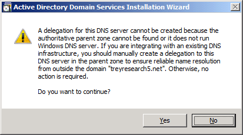

# What&#39;s New in AD DS Installation and Removal
  This topic explains new options for installing and removing Active Directory Domain Services \(AD DS\) in [!INCLUDE[nextref_longhorn](../Token/nextref_longhorn_md.md)]. It has also been updated to include appropriate references for [!INCLUDE[nextref_server_7](../Token/nextref_server_7_md.md)].  
  
 AD DS has new installation options in [!INCLUDE[nextref_longhorn](../Token/nextref_longhorn_md.md)]. There are no new installations options for AD DS in [!INCLUDE[nextref_server_7](../Token/nextref_server_7_md.md)], but there are new domain and forest functional levels that you can select during or after an AD DS installation.  
  
 In addition, the location for Adprep.exe is different in [!INCLUDE[nextref_longhorn](../Token/nextref_longhorn_md.md)] and [!INCLUDE[nextref_server_7](../Token/nextref_server_7_md.md)]. You must run Adprep.exe before you can add a domain controller that runs [!INCLUDE[nextref_longhorn](../Token/nextref_longhorn_md.md)] or [!INCLUDE[nextref_server_7](../Token/nextref_server_7_md.md)] to an existing Windows 2000 Server or Windows Server 2003 Active Directory environment. In [!INCLUDE[nextref_longhorn](../Token/nextref_longhorn_md.md)], Adprep.exe is located in the \/Sources\/adprep folder of the operating system installation disk. In [!INCLUDE[nextref_server_7](../Token/nextref_server_7_md.md)], Adprep.exe is located in the \/Support\/adprep folder.  
  
 [!INCLUDE[nextref_server_7](../Token/nextref_server_7_md.md)] includes a 32\-bit and 64\-bit version of Adprep.exe. The 64\-bit version runs by default. If you want to run one of the Adprep.exe commands on a 32\-bit computer, use the 32\-bit version of Adprep.exe \(Adprep32.exe\).  
  
-   The following new installation options are described in this topic:  
  
    -   [New options in the Active Directory Domain Services Installation Wizard](../Topic/What-s-New-in-AD-DS-Installation-and-Removal.md#BKMK_Dcpromo)  
  
    -   New unattended installation options  
  
    -   [RODC option](../Topic/What-s-New-in-AD-DS-Installation-and-Removal.md#BKMK_RODC)  
  
    -   [DNS option](../Topic/What-s-New-in-AD-DS-Installation-and-Removal.md#BKMK_DNS)  
  
    -   [Global catalog server option](../Topic/What-s-New-in-AD-DS-Installation-and-Removal.md#BKMK_GC)  
  
     New features are available at the [!INCLUDE[nextref_longhorn](../Token/nextref_longhorn_md.md)] and [!INCLUDE[nextref_server_7](../Token/nextref_server_7_md.md)] domain functional levels. For example, you can use fine\-grained password and account lockout policies at the [!INCLUDE[nextref_longhorn](../Token/nextref_longhorn_md.md)] domain functional level to apply different policy settings to different sets of users within a single domain. At the [!INCLUDE[nextref_server_7](../Token/nextref_server_7_md.md)] domain functional level, you can use authentication mechanism assurance to secure resources, including applications, so that only users who log on with a certificate\-based mechanism are granted access.  
  
     Another new feature in [!INCLUDE[nextref_server_7](../Token/nextref_server_7_md.md)] that pertains to functional levels is the ability to roll back a functional level within a limited set of circumstances. Normally, you cannot roll back or lower the domain functional level, but in [!INCLUDE[nextref_server_7](../Token/nextref_server_7_md.md)] there is one exception: when you raise the domain functional level to [!INCLUDE[nextref_server_7](../Token/nextref_server_7_md.md)] and if the forest functional level is [!INCLUDE[nextref_longhorn](../Token/nextref_longhorn_md.md)] or lower, you have the option of rolling the domain functional level back to Windows Server 2008.  
  
     In addition, after you set the forest functional level to a certain value in [!INCLUDE[nextref_server_7](../Token/nextref_server_7_md.md)], you cannot roll back or lower the forest functional level, with one exception: when you raise the forest functional level to [!INCLUDE[nextref_server_7](../Token/nextref_server_7_md.md)] and if Active Directory Recycle Bin is not enabled, you have the option of rolling the forest functional level back to [!INCLUDE[nextref_longhorn](../Token/nextref_longhorn_md.md)]. \(For more information about the Active Directory Recycle Bin, see [What's New in AD DS: Active Directory Recycle Bin](http://go.microsoft.com/fwlink/?LinkId=141392) \(http:\/\/go.microsoft.com\/fwlink\/?LinkId\=141392\). You can lower the forest functional level only from [!INCLUDE[nextref_server_7](../Token/nextref_server_7_md.md)] to [!INCLUDE[nextref_longhorn](../Token/nextref_longhorn_md.md)]. If the forest functional level is set to [!INCLUDE[nextref_server_7](../Token/nextref_server_7_md.md)], it cannot be rolled back, for example, to [!INCLUDE[server2003all](../Token/server2003all_md.md)].  
  
     For a complete list of new features that are available at the [!INCLUDE[nextref_longhorn](../Token/nextref_longhorn_md.md)] and [!INCLUDE[nextref_server_7](../Token/nextref_server_7_md.md)] domain functional levels, see [Appendix of Functional Level Features](../Topic/Appendix-of-Functional-Level-Features.md).  
  
-   New server operating system installation options include the following:  
  
    -   Full installation of [!INCLUDE[nextref_longhorn](../Token/nextref_longhorn_md.md)] or [!INCLUDE[nextref_server_7](../Token/nextref_server_7_md.md)]  
  
    -   Server Core installation of [!INCLUDE[nextref_longhorn](../Token/nextref_longhorn_md.md)] or [!INCLUDE[nextref_server_7](../Token/nextref_server_7_md.md)]  
  
-   [!INCLUDE[nextref_server_7](../Token/nextref_server_7_md.md)] includes Active Directory Administrative Center, which provides an enhanced Active Directory data management experience and a rich graphical user interface \(GUI\). Active Directory Administrative Center relies on Active Directory Web Services \(ADWS\), which requires TCP port 9389 to be open. If you use a Group Policy object \(GPO\) to configure your firewall, update the GPO to make sure that this port is open for ADWS.  
  
## New AD DS installation options  
 When you install AD DS, you have several new options, both in the Active Directory Domain Services Installation Wizard and when you perform an unattended installation at the command line.  
  
 The new AD DS installation options are as follows:  
  
-   You can specify the following domain controller options:  
  
    -   Domain Name System \(DNS\) server: In the Windows Server 2003 operating system, DNS server installation is offered, if it is necessary. In [!INCLUDE[nextref_longhorn](../Token/nextref_longhorn_md.md)] and [!INCLUDE[nextref_server_7](../Token/nextref_server_7_md.md)], DNS installation and configuration is automatic, if it is necessary. When you install DNS on the first domain controller in a new child domain in [!INCLUDE[nextref_longhorn](../Token/nextref_longhorn_md.md)], a delegation for the new domain is created automatically in DNS.  
  
    -   Global catalog server: In Windows Server 2003, installing a domain controller as a global catalog server is not an installation option in the Windows interface. In [!INCLUDE[nextref_longhorn](../Token/nextref_longhorn_md.md)]and [!INCLUDE[nextref_server_7](../Token/nextref_server_7_md.md)], you can select this option in the wizard.  
  
    -   Read\-only domain controller \(RODC\): This domain controller option is new in [!INCLUDE[nextref_longhorn](../Token/nextref_longhorn_md.md)]. The first domain controller in the forest or domain cannot be an RODC. The RODC must replicate from a writable domain controller that runs [!INCLUDE[nextref_longhorn](../Token/nextref_longhorn_md.md)] or [!INCLUDE[nextref_server_7](../Token/nextref_server_7_md.md)]. If a writable domain controller that runs [!INCLUDE[nextref_longhorn](../Token/nextref_longhorn_md.md)] or [!INCLUDE[nextref_server_7](../Token/nextref_server_7_md.md)] is in the domain, the option to install an RODC is available when you add another domain controller to the domain.  
  
-   You can specify the site of a new domain controller or use the site that corresponds to the IP address of the computer.  
  
###   New options in the Active Directory Domain Services Installation Wizard  
 You can use the Active Directory Domain Services Installation Wizard to add the AD DS server role interactively. You can access the Active Directory Domain Services Installation Wizard in new ways, as follows:  
  
-   You can use the Add Roles Wizard. You can access the Add Roles Wizard in the following ways:  
  
    -   You can click **Add Roles** in **Initial Configuration Tasks**, the application that appears when you first install the operating system.  
  
    -   You can click **Add Roles** in Server Manager, which is always available on the **Administrative Tools** menu and through an icon in the notification area.  
  
     The Add Roles Wizard installs the files that are required to install and configure AD DS on a server, but it does not start the actual AD DS installation. To start the AD DS installation, you must run Dcpromo.exe.  
  
-   As an alternative, you can:  
  
    -   Type **dcpromo** at a command prompt, and then press ENTER.  
  
    -   Click **Start**, type **dcpromo**, and then press ENTER.  
  
    -   Click **Start**, click **Run**, type **dcpromo**, and then click **OK**, as in previous versions of the Windows Server operating system.  
  
-   You can perform a staged installation of an RODC. In this case, different users run the wizard at different times. First, a member of the Domain Admins group creates an RODC account by using the Active Directory Users and Computers snap\-in in Microsoft Management Console \(MMC\). Either right\-click the **Domain Controllers** container or click the **Domain Controllers** container, click **Action**, and then click **Pre\-create Read\-only Domain Controller account** to start the wizard and create the account. When you create the RODC account, you can delegate the installation and administration of the RODC to a user or, preferably, to a security group.  
  
     On the server that will become the RODC, the delegated RODC administrator can then run **dcpromo \/UseExistingAccount:Attach** at a command prompt to start the wizard.  
  
 The Active Directory Domain Services Installation Wizard contains a new option on the **Welcome** page of the wizard to enable advanced mode as an alternative to running **dcpromo** with the **\/adv** switch \(**dcpromo \/adv**\). Advanced mode contains additional options that enable more advanced configurations and that provide experienced users with more control over the operation. The additional installation options in advanced mode include the following:  
  
-   Creating a new domain tree.  
  
-   Install from Media \(IFM\), in which you use backup media from an existing domain controller in the same domain or you create installation media by running the **ntdsutil ifm** command on a domain controller that runs [!INCLUDE[nextref_longhorn](../Token/nextref_longhorn_md.md)] or [!INCLUDE[nextref_server_7](../Token/nextref_server_7_md.md)]. You can then point to the installation media during the installation of AD DS to reduce network traffic that is associated with initial replication.  
  
-   Selecting the source domain controller for the installation. This enables you to control which domain controller is used to initially replicate domain data to the new domain controller.  
  
-   Modifying the NetBIOS name that the wizard generates by default.  
  
-   Defining the Password Replication Policy \(PRP\) for an RODC.  
  
 In addition to these changes, the Active Directory Domain Services Installation Wizard has new pages, which are described in the following table.  
  
|New wizard page|Description|  
|---------------------|-----------------|  
|**Additional Domain Controller Options**|Specifies that during the domain controller installation, the domain controller will also be configured to be a DNS server, global catalog server, or RODC. An RODC can also be a DNS server and a global catalog server.|  
|**Select a Domain**|Specifies the name of the domain where you are installing an additional domain controller.|  
|**Select a Site**|Specifies the site in which the domain controller should be installed.|  
|**Set Functional Levels**|Sets the domain and forest functional level during the installation of a new domain or forest.|  
|**Delegation of RODC Installation and Administration**|Specifies the name of the user or group who will install and administer the RODC in a branch office.|  
|**Password Replication Policy**|Specifies which account passwords to allow or deny from being cached on an RODC. This page appears only if the **Use advanced mode installation** check box is selected.|  
|**DNS delegation creation**|Provides a default option to create a DNS delegation based on the type of domain controller installation \(as specified on the **Choose a Deployment Configuration** page\) and the DNS environment.|  
  
 Other improvements reduce the chances for error during AD DS installation. For example, if you are installing an additional domain controller, you can select the domain name from a domain tree view rather than typing it.  
  
 The new Active Directory Domain Services Installation Wizard also includes the following improvements:  
  
-   By default, the wizard now uses the credentials of the user who is currently logged on if the user is logged on with a domain account. You can specify other credentials if they are needed.  
  
-   On the **Summary** page of the wizard, you can export the settings that you have selected to a corresponding answer file that you can use as a template for subsequent operations \(installations or uninstallations\). Any modifications that you make to the answer file are commented out. For example, if you specify a value for the Directory Services Restore Mode \(DSRM\) password in the wizard and then export the settings to an answer file, that DSRM password does not appear in the answer file. You must modify the answer file to include that value.  
  
-   You can now omit your administrator password from the answer file. Instead, type password\=\* in the answer file to ensure that the user is prompted for account credentials.  
  
-   You can now force the demotion of a domain controller that is started in DSRM.  
  
###   New unattended installation options  
 New options for running unattended installation of AD DS are available in [!INCLUDE[nextref_longhorn](../Token/nextref_longhorn_md.md)] and [!INCLUDE[nextref_server_7](../Token/nextref_server_7_md.md)]. Unlike unattended installation in Windows Server 2003, unattended installation now does not require a response to any user interface \(UI\) prompt, such as a prompt to restart the domain controller, which makes the process truly "unattended." You can also prepopulate the wizard by specifying some parameters on the command line, which reduces the amount of user interaction that is required with the wizard during an interactive installation \(the opposite of an unattended installation\).  
  
 During an unattended operation, a return code is used to indicate whether or not the operation was successful. For a list of all return codes, see [Unattended Installation Return Codes](../Topic/Unattended-Installation-Return-Codes.md).  
  
 For a complete list of parameters that you can specify as part of an unattended installation of AD DS, open an elevated command prompt, type one of the following commands depending on which operation you want help for, and then press ENTER:  
  
 `dcpromo /?[:{Promotion | CreateDCAccount | UseExistingAccount | Demotion}]`  
  
 Where:  
  
-   `Promotion` returns all parameters that you can specify as part of an installation of AD DS.  
  
-   `CreateDCAccount` returns all parameters that you can specify when you create an RODC account.  
  
-   `UseExistingAccount` returns all parameters that you can specify when you attach a server to an RODC account.  
  
-   `Demotion` returns all parameters that you can specify when you remove AD DS from a server.  
  
 For more information about **dcpromo** parameters, see Dcpromo [http:\/\/go.microsoft.com\/fwlink\/?LinkID\=101181](http://go.microsoft.com/fwlink/?LinkID=101181).  
  
###   RODC option  
 An RODC is a new type of domain controller that you can install on servers that are running [!INCLUDE[nextref_longhorn](../Token/nextref_longhorn_md.md)] or [!INCLUDE[nextref_server_7](../Token/nextref_server_7_md.md)]. An RODC hosts read\-only partitions of the AD DS database. You can use an RODC to deploy a domain controller easily in remote locations where the physical security requirements of a writable domain controller cannot be met.  
  
 For information about using an RODC, see the Read\-Only Domain Controller Planning and Deployment Guide [http:\/\/go.microsoft.com\/fwlink\/?LinkID\=135993](http://go.microsoft.com/fwlink/?LinkID=135993).  
  
###   DNS option  
 The option to install DNS server is available, depending on your installation selections and DNS conditions on the network. When you select the DNS server installation option or when DNS server is installed automatically, DNS creates a new delegation, or it updates existing delegations for the server automatically.  
  
> [!NOTE]  
>  Although DNS attempts to create a new delegation, the attempt can fail if the parent DNS zone cannot be updated. If the attempt to create the delegation fails but the parent DNS zone has existing delegations for the subdomain for at least three other DNS servers, the installation completes because the parent domain has a sufficient number of delegations for the subdomain.  
  
 The attempt to create a DNS delegation fails if the parent DNS zone does not exist or if the account that you are using to perform the AD DS installation does not have permissions to create the DNS delegation records in the parent DNS zone. For example, if you are creating a new forest for testing purposes and the parent DNS zone is a top\-level domain name, such as contoso.com, you do not have permissions to create a DNS delegation. In this situation, the attempt to automatically create the DNS delegation fails and the following dialog box appears:  
  
   
  
 You can click **Yes** and continue the installation of AD DS. To prevent the dialog box from appearing in this situation, you can specify the **\/CreateDNSDelegation:No** parameter when you run Dcpromo.exe.  
  
 DNS servers are automatically configured for DNS client settings, forwarders, and root hints, as necessary, based on the installation options that are selected.  
  
###   Global catalog server option  
 The global catalog server option is available for all installations, including RODCs. The first domain controller in the forest must be a global catalog server. The global catalog server option is selected by default when you are adding a new domain controller in an existing domain.  
  
 When you create an additional domain controller in a child domain, the wizard detects whether the infrastructure operations master role \(also known as flexible single master operations or FSMO\) is hosted on a global catalog server in that domain. The wizard prompts you to transfer the infrastructure master role to the domain controller that you are creating if the domain controller will not be a global catalog server. This helps prevent misplacement of the infrastructure master role.  
  
## New server operating system installation options  
 [!INCLUDE[nextref_longhorn](../Token/nextref_longhorn_md.md)] and [!INCLUDE[nextref_server_7](../Token/nextref_server_7_md.md)] provide a new, minimal server installation option, called a Server Core installation, in addition to the full installation. The following sections explain these installation options.  
  
### Full installation  
 For ease of management, you can install AD DS on a server that is running the full installation of [!INCLUDE[nextref_longhorn](../Token/nextref_longhorn_md.md)] or [!INCLUDE[nextref_server_7](../Token/nextref_server_7_md.md)]. A full installation of [!INCLUDE[nextref_longhorn](../Token/nextref_longhorn_md.md)] supports both interactive \(wizard\) and unattended domain controller installation.  
  
### Server Core installation  
 A Server Core installation of [!INCLUDE[nextref_longhorn](../Token/nextref_longhorn_md.md)] or [!INCLUDE[nextref_server_7](../Token/nextref_server_7_md.md)] provides a minimal environment for running specific server roles, which reduces servicing and management requirements and the attack surface for those server roles. In this sense, "minimal" refers to the low use of memory and disk space by the Server Core installation. In addition, a Server Core installation does not provide any graphical user interface \(GUI\).  
  
 To install AD DS on a Server Core installation, perform an unattended installation. A Server Core installation supports the following server roles:  
  
-   Active Directory Domain Services \(AD DS\)  
  
-   Active Directory Lightweight Directory Services \(AD LDS\)  
  
-   Dynamic Host Configuration Protocol \(DHCP\) Server  
  
-   DNS Server  
  
-   File Services  
  
-   Print Services  
  
-   Streaming Media Services  
  
-   Web Services \(without ASP.NET on a server running a Server Core installation of [!INCLUDE[nextref_longhorn](../Token/nextref_longhorn_md.md)] but with ASP.NET on a server running a Server Core installation of [!INCLUDE[nextref_server_7](../Token/nextref_server_7_md.md)]\)  
  
-   Hyper\-V™  
  
 For more information about Server Core installation, see Server Core Installation Option of Windows Server 2008 Step\-By\-Step Guide \([http:\/\/go.microsoft.com\/fwlink\/?LinkId\=87786](http://go.microsoft.com/fwlink/?LinkId=87786)\).  
  
  