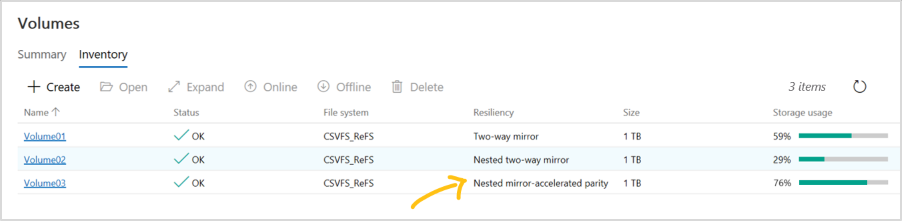

You can use familiar storage cmdlets in PowerShell to create volumes with nested resiliency, as described in the following section.

### Step 1: Create storage tier templates (Windows Server 2019 only)

Windows Server 2019 requires you to create new storage tier templates using the `New-StorageTier` cmdlet before creating volumes. You only need to do this once, and then every new volume you create can reference these templates.

> [!NOTE]
> If you're running Windows Server 2022, Azure Stack HCI, version 21H2, or Azure Stack HCI, version 20H2, you can skip this step.

Specify the `-MediaType` of your capacity drives and, optionally, the `-FriendlyName` of your choice. Don't modify other parameters.

For example, if your capacity drives are hard disk drives (HDD), launch PowerShell as Administrator and run the following cmdlets.

To create a NestedMirror tier:

```powershell
New-StorageTier -StoragePoolFriendlyName S2D* -FriendlyName NestedMirrorOnHDD -ResiliencySettingName Mirror -MediaType HDD -NumberOfDataCopies 4
```

To create a NestedParity tier:

```powershell
New-StorageTier -StoragePoolFriendlyName S2D* -FriendlyName NestedParityOnHDD -ResiliencySettingName Parity -MediaType HDD -NumberOfDataCopies 2 -PhysicalDiskRedundancy 1 -NumberOfGroups 1 -FaultDomainAwareness StorageScaleUnit -ColumnIsolation PhysicalDisk
```

If your capacity drives are solid-state drives (SSD), set the `-MediaType` to `SSD` instead and change the `-FriendlyName` to `*OnSSD`. Don't modify other parameters.

> [!TIP]
> Verify that `Get-StorageTier` created the tiers successfully.

### Step 2: Create nested volumes

Create new volumes using the `New-Volume` cmdlet.

- Nested two-way mirror

    To use nested two-way mirror, reference the `NestedMirror` tier template and specify the size. For example:

    ```PowerShell
    New-Volume -StoragePoolFriendlyName S2D* -FriendlyName Volume01 -StorageTierFriendlyNames NestedMirrorOnHDD -StorageTierSizes 500GB
    ```

    If your capacity drives are solid-state drives (SSD), change `-StorageTierFriendlyNames` to `*OnSSD`.

- Nested mirror-accelerated parity

    To use nested mirror-accelerated parity, reference both the `NestedMirror` and `NestedParity` tier templates and specify two sizes, one for each part of the volume (mirror first, parity second). For example, to create one 500-GB volume that's 20% nested two-way mirror and 80% nested parity, run:

    ```PowerShell
    New-Volume -StoragePoolFriendlyName S2D* -FriendlyName Volume02 -StorageTierFriendlyNames NestedMirrorOnHDD, NestedParityOnHDD -StorageTierSizes 100GB, 400GB
    ```

    If your capacity drives are solid-state drives (SSD), change `-StorageTierFriendlyNames` to `*OnSSD`.

### Step 3: Continue in Windows Admin Center

Volumes that use nested resiliency appear in [Windows Admin Center](/windows-server/manage/windows-admin-center/overview) with clear labeling, as in the following screenshot. Once they're created, you can manage and monitor them using Windows Admin Center just like any other volume in Storage Spaces Direct.



### Optional: Extend to cache drives

With its default settings, nested resiliency protects against the loss of multiple capacity drives at the same time, or one server and one capacity drive at the same time. To extend this protection to [cache drives](../WindowsServerDocs/storage/storage-spaces/cache.md), there's another consideration: because cache drives often provide read and write caching for multiple capacity drives, the only way to ensure you can tolerate the loss of a cache drive when the other server is down is to not cache writes, but that impacts performance.

To address this scenario, Storage Spaces Direct offers the option to automatically disable write caching when one server in a two-server cluster is down, and then re-enable write caching once the server is back up. To allow routine restarts without performance impact, write caching isn't disabled until the server has been down for 30 minutes. Once write caching is disabled, the contents of the write cache is written to capacity devices. After this, the server can tolerate a failed cache device in the online server, though reads from the cache might be delayed or fail if a cache device fails.

> [!NOTE]
> For an all cache (single media type) physical system, you don't need to consider automatic disabling of write caching when one server in a two-server cluster is down. You need to consider this only with the storage bus layer (SBL) cache, which is required only if you are using HDDs.

(Optional) To automatically disable write caching when one server in a two-server cluster is down, launch PowerShell as Administrator and run:

```PowerShell
Get-StorageSubSystem Cluster* | Set-StorageHealthSetting -Name "System.Storage.NestedResiliency.DisableWriteCacheOnNodeDown.Enabled" -Value "True"
```

Once set to **True**, the cache behavior is:

| Situation | Cache behavior | Can tolerate cache drive loss? |
|--|--|--|
| Both servers up | Cache reads and writes, full performance | Yes |
| Server down, first 30 minutes | Cache reads and writes, full performance | No (temporarily) |
| After first 30 minutes | Cache reads only, performance impacted | Yes (after the cache is written to capacity drives) |