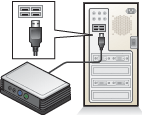

# Glossary
  
### administrative user  
A user who has access to [!INCLUDE[win8_server_multipoint_manager](../../../compute/remote-desktop-services/multipoint-1/includes/win8_server_multipoint_manager_md.md)] to manage the MultiPoint Services system. See also *standard user*. For more information about administrative users, see [Manage User Accounts](../../../compute/remote-desktop-services/multipoint-2/Manage-User-Accounts.md).  
  
### Administrator  
On Windows\-based computers, a user account that is a member of the computer’s local Administrators group or a member of a group that is a member of the local Administrators group, such as the Domain Admins group in a Windows *domain*. This is the first account that is created when you install an operating system on a new workstation, stand\-alone server or member server. By default, this account should have the highest level of administrative access to the local computer. A MultiPoint Services administrative user is also a Windows administrator on the computer.  
  
### client access license \(CAL\)  
A license that is required for a user to connect to a MultiPoint Services system. For more information, see [Remote Desktop Services Client Access Licenses (RDS CALs)](http://go.microsoft.com/fwlink/?LinkId=798211).  
  
### console mode  
A state of the MultiPoint Services system in which the administrative user performs system maintenance tasks. In this mode, there are no *stations*. Switching to this mode ends all MultiPoint Services user *sessions*. For more information about modes, see [Switch Between Modes](../../../compute/remote-desktop-services/multipoint-2/Switch-Between-Modes.md).  
  
### disconnect  
To close a desktop, but keep the *session* in system memory to be accessed for later use from any *station*. After selecting this action, the station will display a logon prompt for the next user. Unsaved changes are preserved. A user can reconnect to a previously disconnected desktop and continue exactly where they left off. For more information about desktops, see [Manage User Stations](../../../compute/remote-desktop-services/multipoint-2/Manage-User-Stations.md).  
  
### domain  
A collection of computers on a network that share a common database and security policy.  
  
### log off  
To end a *session* with an opportunity to save any unsaved work. For more information, see [Manage User Stations](../../../compute/remote-desktop-services/multipoint-2/Manage-User-Stations.md).  
  
### log on  
To enter a user name and password at a *station* to start a *session*. For more information, see [Manage User Stations](../../../compute/remote-desktop-services/multipoint-2/Manage-User-Stations.md).  
  
### multifunction hub  
An expansion hub that connects to the computer via a USB port, and enables the connection of a variety of non\-USB devices to the hub, including a video monitor. Multifunction hubs are produced by specific hardware manufacturers and may require the installation of a device\-specific driver.  
  
The following illustration shows an example of setting up a *station* with a multifunction hub:  
  
  
  
See also, *USB hubs*. For more information about how to work with hubs, see the [Manage Station Hardware](../../../compute/remote-desktop-services/multipoint-2/Manage-Station-Hardware.md) section.  
  
### MultiPoint Dashboard User  
A user account for individuals who will regularly access *stations*, and will manage the common daily tasks in [!INCLUDE[win8_server_multipoint_dashboard](../../../compute/remote-desktop-services/multipoint-1/includes/win8_server_multipoint_dashboard_md.md)].  
  
### MultiPoint Manager  
An application that is used by an *administrative user* to manage the MultiPoint Services system. This application can be started from the Start screen.  
  
### MultiPoint Services system  
A collection of hardware and software that consists of one computer that is running MultiPoint Services and at least one MultiPoint Services *station*.  
  
The following illustration shows one example layout of a MultiPoint Services system:  
  
  
  
This illustration shows four stations, but other numbers of stations are supported.  
  
### peripheral device  
A device such as a printer, keyboard, or mouse that is connected to a *station hub* or is connected directly to a computer that is running MultiPoint Services. For more information about USB peripheral devices, see the [Work with USB Devices](../../../compute/remote-desktop-services/multipoint-2/Work-with-USB-Devices.md) topic.  
  
### session  
A period of time in which the user interacts with the MultiPoint Services system. For more information, see the [Suspend and Leave User Session Active](../../../compute/remote-desktop-services/multipoint-2/Suspend-and-Leave-User-Session-Active.md) topic.  
  
### standard user  
A user who will regularly access [!INCLUDE[win8_server_multipoint_manager](../../../compute/remote-desktop-services/multipoint-1/includes/win8_server_multipoint_manager_md.md)] *stations*, but who will not manage stations. See also *administrative user*. For more information about users in [!INCLUDE[win8_server_multipoint_manager](../../../compute/remote-desktop-services/multipoint-1/includes/win8_server_multipoint_manager_md.md)], see [Manage User Accounts](../../../compute/remote-desktop-services/multipoint-2/Manage-User-Accounts.md).  
  
### station  
A hardware collection that consists of one monitor, one *station hub*, and other peripheral devices that are attached to that station hub. For more information about station hardware, see [Manage Station Hardware](../../../compute/remote-desktop-services/multipoint-2/Manage-Station-Hardware.md).  
  
### station hub  
A USB hub that connects peripheral devices to a computer in a MultiPoint Services system. A station hub is a required component of a station.  
  
### station mode  
A state of the MultiPoint Services system where there are multiple *stations* available for use by multiple concurrent users. For more information about modes, see [Switch Between Modes](../../../compute/remote-desktop-services/multipoint-2/Switch-Between-Modes.md).  
  
### suspend  
To close a desktop, but keep the *session* in system memory to be accessed for later use from any *station*. After selecting this action, the station will display a logon prompt for the next user. Unsaved changes are preserved. A user can reconnect to a previously disconnected desktop and continue exactly where they left off. For more information about desktops, see [Manage User Stations](../../../compute/remote-desktop-services/multipoint-2/Manage-User-Stations.md).  
  
### USB hubs  
A generic multiport USB expansion hub that complies with the universal serial bus \(USB\) 2.0 or later specifications. Such hubs typically have two, four, or more USB ports that allow for multiple USB devices to be connected to a single USB port on the computer. USB hubs are typically separate devices that may be externally powered or unpowered. Some other devices, such as some keyboards and video monitors, may also incorporate a USB hub into their design. When used as a *station hub* with MultiPoint Services, we recommend that you use a hub with four or more ports. If you plan to connect USB devices other than a keyboard and mouse to the hub, use an externally powered hub for best performance.  
  
The following illustration shows an example of setting up a *station* with a USB hub:  
  
  
  
See also, *multifunction hub*. For more information about USB hubs, see the [Manage Station Hardware](../../../compute/remote-desktop-services/multipoint-2/Manage-Station-Hardware.md) section.  
  
### workgroup  
A group of computers that are connected on a network and share resources, such as printers and files.  
  
## See Also  
[Managing Your MultiPoint Services System](../../../compute/remote-desktop-services/multipoint-2/Managing-Your-MultiPoint-Services-System.md)  
  
